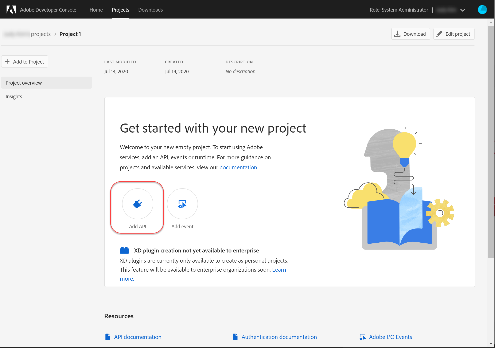
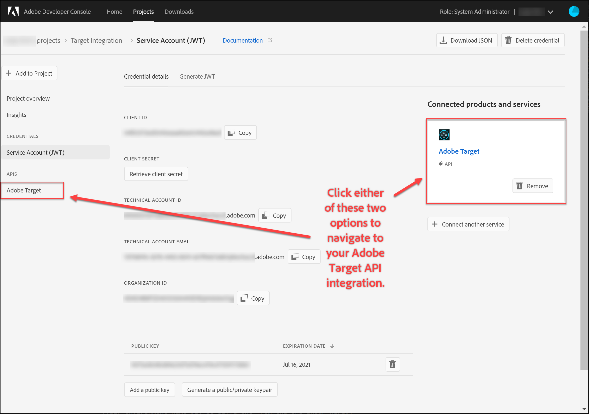
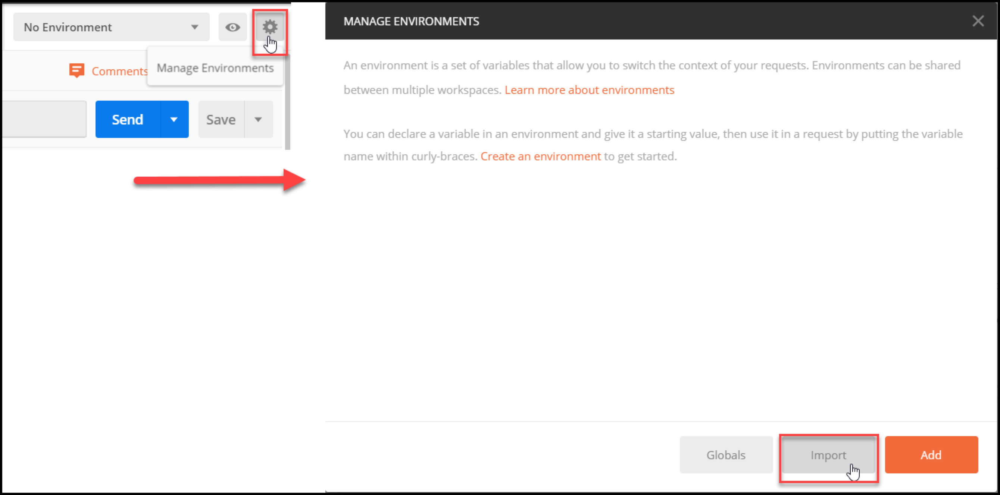
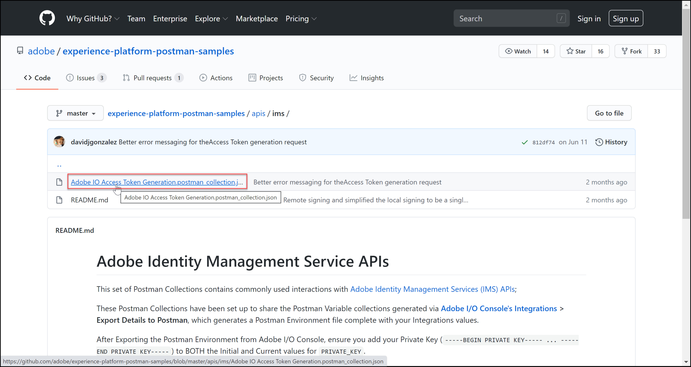
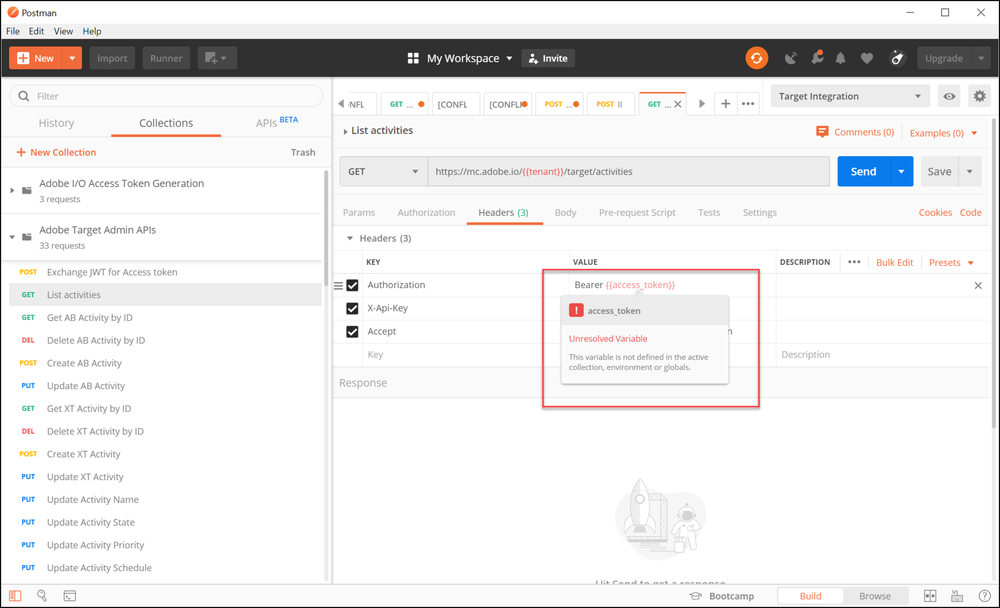
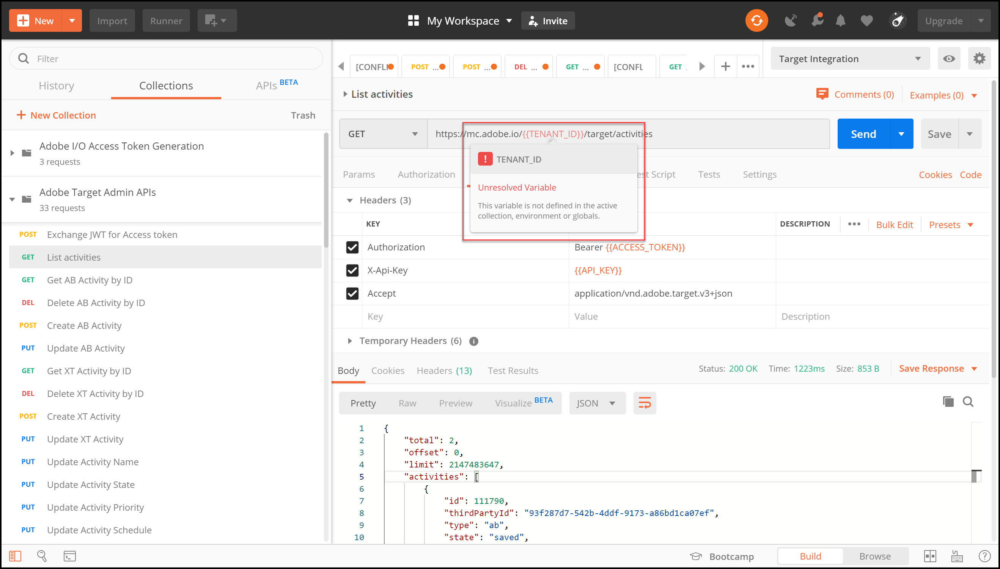
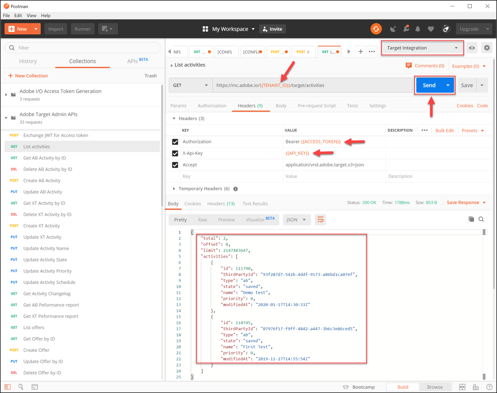

# [!DNL Adobe Target] APIの認証を設定

[!DNL Recommendations Admin] APIを含む[!DNL Adobe Target]管理APIは、認証によって保護され、承認済みのユーザーのみが[!DNL Adobe Target]へのアクセスに使用できるようになります。 [Adobe Developer Console](https://developer.adobe.com/console/home)を使用して、[!DNL Adobe Target]を含むすべての[!DNL Adobe Experience Cloud solutions]の認証を管理します。

>[!IMPORTANT]
>
>この記事で説明されているサービスアカウント （JWT）資格情報は、新しいOAuth サーバー間の資格情報のために非推奨になります。
>
>サービスアカウント（JWT）の資格情報は、2025年1月1日まで引き続き機能します。 新しいOAuth サーバー間資格情報を使用するには、2025年1月1日より前にアプリケーションまたは統合を移行する必要があります。
>
>統合を移行するための詳細と手順については、*Developer Console* ドキュメントの「[&#x200B; サービスアカウント（JWT）資格情報からOAuth サーバー間の資格情報](https://developer.adobe.com/developer-console/docs/guides/authentication/ServerToServerAuthentication/migration/){target=_blank}への移行」を参照してください。
>
>新しいOAuth資格情報を設定する方法については、*Developer Console* ドキュメントの[OAuth サーバー間の資格情報実装](https://developer.adobe.com/developer-console/docs/guides/authentication/ServerToServerAuthentication/implementation/){target=_blank}を参照してください。

[!DNL Adobe Target]個のAPIを正常に操作するために必要な従来のJWT認証トークンを生成するために必要な事前手順は次のとおりです。

1. [!DNL Adobe Developer Console]にプロジェクト （以前は統合）を作成します。
1. プロジェクトの詳細をPostmanに書き出します。
1. ベアラートークンを生成します。
1. ベアラートークンをテストします。

## 前提条件

| リソース | 詳細 |
| --- | --- |
| Postman | これらの手順を正常に実行するには、ご使用のオペレーティングシステムの[Postman アプリ &#x200B;](https://www.postman.com/downloads/)を入手してください。 Postman basicはアカウント作成機能を無料で利用できます。 [!DNL Adobe Target] APIを一般的に使用するために必須ではありませんが、PostmanではAPI ワークフローが簡単になり、[!DNL Adobe Target]にはAPIの実行と動作の学習に役立つPostman コレクションがいくつか用意されています。 このガイドの残りの部分では、Postmanに関する実務的な知識を前提としています。 詳しくは、[Postman ドキュメント &#x200B;](https://learning.getpostman.com/)を参照してください。 |
| 参照 | このガイドの残りの部分では、次のリソースについて理解していることを前提としています。<ul><li>[Adobe I/O Github](https://github.com/adobeio)</li><li>[Target管理者とプロファイル API ドキュメント &#x200B;](../administer/admin-api/admin-api-overview-new.md)</li><li>[Recommendations API ドキュメント &#x200B;](https://developer.adobe.com/target/administer/recommendations-api/)</li></ul> |

## Adobe I/O プロジェクトの作成

このセクションでは、[!DNL Adobe Developer Console]にアクセスし、[!DNL Adobe Target]のプロジェクトを作成します。 詳しくは、[&#x200B; プロジェクトに関するドキュメント &#x200B;](https://developer.adobe.com/developer-console/docs/guides/projects/)を参照してください。

<!--(1. Generate your private key and public certificate, per the [documentation on authentication](https://developer.adobe.com/developer-console/docs/guides/authentication/). // [//]: # (as described in **Step 1** of [How to set up Adobe IO: Authentication - Step by Step](https://helpx.adobe.com/marketing-cloud-core/kb/adobe-io-authentication-step-by-step.html). After completing Step 1, return to this guide and resume with Step 2, below. // The outcome of this step should be the creation of a `private.key` file and a `certificate_pub.crt` file. Return to this guide once you have generated these two files.)-->

1. [Adobe Admin Console](https://adminconsole.adobe.com/)で、[!DNL Adobe] ユーザーアカウントに[製品管理者](https://helpx.adobe.com/jp/enterprise/using/admin-roles.html)と[開発者](https://helpx.adobe.com/jp/enterprise/using/manage-developers.html) レベルの両方の[!DNL Target]へのアクセス権が付与されていることを確認します。

1. [Adobe Developer Console](https://developer.adobe.com/console/home)で、この統合を作成する[!UICONTROL Experience Cloud Organization]を選択します。 （1つの[!UICONTROL Experience Cloud Organization]にしかアクセスできない可能性があります）。

   

1. **[!UICONTROL Create new project]** をクリックします。

   

1. **[!UICONTROL Add API]**&#x200B;をクリックしてREST APIをプロジェクトに追加し、[!DNL Adobe]のサービスと製品にアクセスします。

   

1. 統合する[!DNL Adobe] サービスとして&#x200B;**[!DNL Adobe Target]**&#x200B;を選択します。 表示される「**[!UICONTROL Next]**」ボタンをクリックします。

   

1. 公開鍵と秘密鍵を、[!DNL Target]用に作成するサービスアカウント統合に関連付けるオプションを選択します。 この例では、**[!UICONTROL Option 1: Generate a key pair]**&#x200B;を選択し、**[!UICONTROL Generate keypair]**&#x200B;をクリックします。

   

1. 指示に従って、秘密鍵を含む自動的にダウンロードされた設定ファイル （`config`）に注意してください。 **[!UICONTROL Next]** をクリックします。

   

1. ファイルシステムで、前の手順で作成した圧縮設定ファイルである`config`の場所を確認します。 繰り返しますが、この`config` ファイルには、後で必要になる秘密鍵が含まれています。 ファイルシステム内の正確な場所は、ここに示されているものとは異なる場合があります。

   

1. Adobe Developer Consoleに戻り、Adobe Recommendationsを使用しているプロパティに対応する[製品プロファイル &#x200B;](https://helpx.adobe.com/jp/enterprise/using/manage-products-and-profiles.html)を選択します。 （プロパティを使用していない場合は、「デフォルトのWorkspace」オプションを選択します）。 **[!UICONTROL Save configured API]** をクリックします。

   

1. **[!UICONTROL Create Integration]** をクリックします。 APIが正常に設定されたことを示す一時的なメッセージが表示されます。
1. 最後の手順として、プロジェクトの名前を元の`Project 1`よりも意味のある名前に変更します。 これを行うには、ナビゲーションパスを表示としてプロジェクトに移動し、**[!UICONTROL Edit project]**&#x200B;をクリックして&#x200B;**[!UICONTROL Edit Project]** モーダルにアクセスし、プロジェクトの名前を変更します。

   

>[!NOTE]
>
>この例では、プロジェクトに「[!DNL Target] Integration」という名前を付けます。 [!DNL Adobe Target]以上のプロジェクトを使用する予定がある場合は、それに応じてプロジェクトに名前を付ける必要があります。 例えば、「Adobe API」または「Experience Cloud API」という名前を付けます。これは、Adobe Experience Cloudの他のソリューションで使用される場合があるからです。

## プロジェクト詳細の書き出し

[!DNL Target]へのアクセスに使用できるAdobe プロジェクトが完成したので、そのプロジェクトの詳細とAdobe API リクエストを必ず送信する必要があります。 これらの詳細は、複数の[!DNL Target] APIを含む複数のAdobe APIを操作するために必要です。 例えば、統合の詳細には、[!DNL Target]管理者APIで必要な認証と認証情報が含まれます。 したがって、PostmanでAPIを使用するには、これらの詳細をPostmanに取り込む必要があります。

Postmanでは、プロジェクトの詳細を指定する方法を数多く用意していますが、ここでは、いくつかの事前定義済みの機能とコレクションを活用します。 まず（この節では）、Postman環境に統合の詳細を書き出します。 次に（次のセクションで）、ベアラートークンを生成して、必要なAdobe リソースへのアクセス権を付与します。

>[!NOTE]
>
>[!DNL Target]を含む任意のExperience Cloud ソリューションに適用されるビデオ手順については、[Experience Platform APIでのPostmanの使用](https://experienceleague.adobe.com/docs/platform-learn/tutorials/platform-api-authentication.html?lang=ja)を参照してください。 次のセクションは、[!DNL Target] APIに関連しています：1. Experience Platform APIを作成してPostman 2に書き出します。 Postmanでアクセストークンを生成します。 これらの手順は以下にも示します。

1. まだ[Adobe Developer Console](https://developer.adobe.com/console/home)で、新しいプロジェクトの&#x200B;**[!UICONTROL Service Account (JWT)]**&#x200B;資格情報を表示するために移動します。 図に示すように、左側のナビゲーションまたは&#x200B;**[!UICONTROL Credentials]** セクションのいずれかを使用します。

   

   **[!UICONTROL Credential details]**&#x200B;では、**[!UICONTROL Public key(s)]**、**[!UICONTROL Client ID]**、およびサービスアカウントに関連するその他の情報を表示できます。

   

1. クリックして、**[!DNL Adobe Target]** APIに関する情報に移動します。 図に示すように、左側のナビゲーションまたは「**製品とサービスの接続**」セクションのいずれかを使用します。

   

1. **[!UICONTROL Download for Postman]** > **[!UICONTROL Service Account (JWT)]**&#x200B;をクリックして、Postman環境の認証情報をキャプチャするJSON ファイルを作成します。

   

   ファイルシステム内のJSON ファイルに注意してください。

   

1. Postmanで、歯車アイコンをクリックして環境を管理し、**[!UICONTROL Import]**&#x200B;をクリックしてJSON ファイル（環境）を読み込みます。

   

1. ファイルを選択し、**[!UICONTROL Open]**&#x200B;をクリックします。

   

1. Postman **Manage Environments** モーダルで、新しく読み込んだ環境の名前をクリックして調べます。 （環境名は、ここに示したものとは異なる場合があります。 必要に応じて名前を編集します。 必ずしも[!DNL Adobe] プロジェクトの名前と一致する必要はありません）。

   

1. メモ `CLIENT_SECRET`および`API_KEY` （他の変数と共に）には、Adobe Developer Consoleで定義されているように、統合から取得された値が事前入力されています。 （Postman `CLIENT_SECRET`変数は、Developer Consoleに表示されている`CLIENT SECRET` Adobe資格情報と一致する必要があり、Postmanの`API_KEY`も同様にDeveloper Consoleの`CLIENT ID`と一致する必要があります）。 対照的に、メモ `PRIVATE_KEY`、`JWT_TOKEN`、`ACCESS_TOKEN`は空白です。 `PRIVATE_KEY`値を指定することから始めましょう。

   

1. ファイルシステムから、`config` ファイルを開き、`private` キーファイルを開きます。

   

1. `private` キーファイルのコンテンツ全体を選択してコピーします。

   

1. Postmanで、秘密鍵の値を&#x200B;**[!UICONTROL INITIAL VALUE]**&#x200B;および&#x200B;**[!UICONTROL CURRENT VALUE]** フィールドに貼り付けます。

   

1. 「**[!UICONTROL Update]**」をクリックし、環境モーダルを閉じます。

## ベアラートークンの生成

このセクションでは、ベアラートークンを生成します。これは、[!DNL Adobe Target] APIを使用したインタラクションを認証するために必要です。 ベアラートークンを生成するには、[Adobe Identity Management サービス（IMS） &#x200B;](https://www.adobe.io/authentication/auth-methods.html#!AdobeDocs/adobeio-auth/master/AuthenticationOverview/AuthenticationGuide.md)に統合の詳細（前のセクションで確認）を送信する必要があります。 これを行う方法はいくつかありますが、このガイドでは、プロセスを直接的かつ簡単にする事前定義済みのIMS呼び出しを含むPostman コレクションを利用します。 コレクションをインポートしたら、必要なときにいつでも再利用して、[!DNL Adobe Target]だけでなく、他のAdobe APIでも新しいトークンを生成できます。

1. [Adobe Identity Management Service API サンプル呼び出し](https://github.com/adobe/experience-platform-postman-samples/tree/master/apis/ims)に移動します。

   

1. **[!UICONTROL Adobe I/O Access Token Generation Postman collection]**&#x200B;をクリックします。

   

1. このコレクションの生のJSONを取得するには、**[!UICONTROL Raw]**&#x200B;をクリックし、生成されたJSONをクリップボードにコピーします。 （または、生のJSON を.json ファイルとして保存することもできます）。

   

1. Postmanで、クリップボードから生のJSONを貼り付けて送信することで、コレクションを読み込みます。 （または、保存した.json ファイルをアップロードすることもできます）。 **[!UICONTROL Continue]** をクリックします。

   

1. Adobe I/O Access Token Generation Postman コレクションで&#x200B;**[!UICONTROL IMS: JWT Generate + Auth via User Token]** リクエストを選択し、環境が選択されていることを確認して、**[!UICONTROL Send]**&#x200B;をクリックしてトークンを生成します。

   

   >[!NOTE]
   >
   >このベアラートークンは24時間有効です。 新しいトークンを生成する必要があるときはいつでも、リクエストを再度送信します。

1. 「環境を管理」モーダルをもう一度開き、環境を選択します。

   

1. `ACCESS_TOKEN`と`JWT_TOKEN`の値が入力されました。

   

質問：JSON Web トークン（JWT）とベアラートークンを生成するには、Adobe I/O アクセストークン生成Postman コレクションを使用する必要がありますか？

回答：いいえ。 Adobe I/O アクセストークン生成Postman コレクションは、PostmanでJWTおよびベアラートアクセストークンをより簡単に生成できる利便性として利用できます。 または、Adobe Developer Console内の機能を使用して、ベアラートークンを手動で生成することもできます。

## ベアラートークンのテスト

この演習では、新しいベアラーアクセストークンを使用して、[!DNL Target] アカウントからアクティビティのリストを取得するAPI リクエストを送信します。 応答が成功した場合は、[!DNL Adobe] プロジェクトと認証がAPIを使用するために期待どおりに動作していることを示します。

1. [[!DNL Adobe Target] Admin APIs Postman Collection](https://developers.adobetarget.com/api/#admin-postman-collection)を読み込みます。 Postmanでコレクションを読み込むまで、すべてのプロンプトに従います。

   

1. コレクションを展開し、**[!UICONTROL List activities]** リクエストを書き留めます。

   

1. `{{access_token}}`などの変数は最初は解決されません。 この問題は、複数の方法で解決できます。例えば、`{{access_token}}`という新しいコレクション変数を定義できます。このガイドでは、以前に使用していたPostman環境を活用するように、API リクエストを変更します。 これにより、Adobe API全体で共通するすべての変数を、一貫性のある単一の統合として引き続き使用できます。

   

1. 「`{{access_token}}`」を「`{{ACCESS_TOKEN}}`」に置き換えるように入力します。

   

1. 「`{{api_key}}`」を「`{{API_KEY}}`」に置き換えるように入力します。

   

1. 「`{{tenant}}`」を「`{{TENANT_ID}}`」に置き換えるように入力します。 メモ `{{TENANT_ID}}`はまだ認識されていません。

   

1. 「環境を管理」モーダルを開き、環境を選択します。

   

1. 入力して、新しい`{{TENANT_ID}}`環境変数を追加します。 テナント IDの値をコピーして、新しい`TENANT_ID`環境変数の&#x200B;**[!UICONTROL INITIAL VALUE]**&#x200B;および&#x200B;**[!UICONTROL CURRENT VALUE]** フィールドに貼り付けます。

   

   >[!NOTE]
   >
   >テナント IDが[!DNL Target] `clientcode`と異なります。 テナント IDは、[!DNL Target]にログインしたときにURLに存在します。 テナント IDを取得するには、Adobe Experience Cloudにログインして[!DNL Target]を開き、Target カードをクリックします。 URL サブドメインに記載されているテナント ID値を使用します。 例えば、[!DNL Adobe Target]にログインしたURLが`<https://mycompany.experiencecloud.adobe.com/...>`の場合、テナント IDは「mycompany」になります。

1. 正しい環境を選択したことを確認した後、リクエストを送信します。 アクティビティのリストを含む応答が返されます。

   

Adobe認証を検証したら、それを使用して[!DNL Adobe Target] API （およびその他のAdobe API）と対話できます。 例えば、[Recommendations API](recs-api/overview.md)を使用してレコメンデーションを作成または管理したり、[Target Delivery API](/help/dev/implement/delivery-api/overview.md)を使用したりできます。
