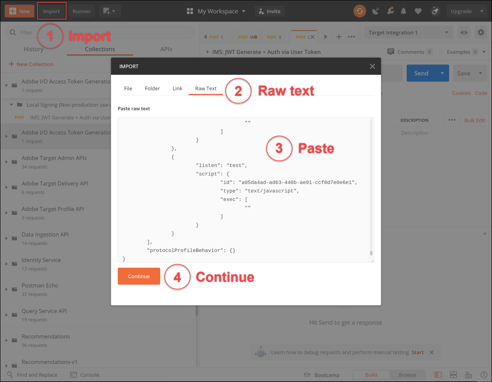

# 次の認証を設定： [!DNL Adobe Target] API

The [!DNL Adobe Target] 管理 API（以下を含む） [!DNL Recommendations Admin] API は認証によって保護され、許可されたユーザーのみがアクセスに使用できるようになります [!DNL Adobe Target]. 以下を使用します。 [Adobe Developer Console](https://developer.adobe.com/console/home) すべての [!DNL Adobe Experience Cloud solutions]を含む [!DNL Adobe Target].

>[!IMPORTANT]
>
>この記事で説明するサービスアカウント (JWT) 資格情報は、新しい OAuth サーバー間資格情報で廃止されます。
>
>サービスアカウント (JWT) 資格情報は、2025 年 1 月 1 日まで引き続き機能します。 2025 年 1 月 1 日より前に、新しい OAuth サーバー間資格情報を使用するには、アプリケーションまたは統合を移行する必要があります。
>
>統合を移行する手順と詳細については、 [サービスアカウント (JWT) 秘密鍵証明書から OAuth サーバー間秘密鍵証明書への移行](https://developer.adobe.com/developer-console/docs/guides/authentication/ServerToServerAuthentication/migration/){target=_blank} （内） *開発者コンソール* ドキュメント。
>
>新しい OAuth 資格情報を設定する方法については、 [OAuth サーバー間秘密鍵証明書の実装](https://developer.adobe.com/developer-console/docs/guides/authentication/ServerToServerAuthentication/implementation/){target=_blank} （内） *開発者コンソール* ドキュメント。

とのやり取りに必要なレガシー JWT 認証トークンを生成するために必要な事前の手順を次に示します。 [!DNL Adobe Target] API:

1. プロジェクト（旧称：統合）を [!DNL Adobe Developer Console].
1. プロジェクトの詳細をPostmanに書き出します。
1. bearer アクセストークンを生成します。
1. bearer アクセストークンをテストします。

## 前提条件

| リソース | 詳細 |
| --- | --- |
| Postman | これらの手順を正しく完了するには、 [Postmanアプリ](https://www.postman.com/downloads/) ご使用のオペレーティングシステム用。 Postman basic は、アカウントの作成に自由に対応しています。 を使用するために必須ではありませんが、 [!DNL Adobe Target] 一般に、Postmanは API ワークフローをより簡単にし、 [!DNL Adobe Target] には、API の実行や動作の仕組みを学ぶのに役立つ、いくつかのPostmanコレクションが用意されています。 このガイドの残りの部分は、Postmanの作業に関する知識を前提としています。 不明な点については、 [Postmanドキュメント](https://learning.getpostman.com/). |
| 参照 | このガイドの残りの部分では、次のリソースに関する知識が前提となります。<ul><li>[Adobe I/OGithub](https://github.com/adobeio)</li><li>[Target 管理およびプロファイル API のドキュメント](../administer/admin-api/admin-api-overview-new.md)</li><li>[Recommendations API ドキュメント](https://developer.adobe.com/target/administer/recommendations-api/)</li></ul> |

## Adobe I/Oプロジェクトの作成

この節では、 [!DNL Adobe Developer Console] を作成し、次のプロジェクトを作成します。 [!DNL Adobe Target]. 詳しくは、 [プロジェクトに関するドキュメント](https://developer.adobe.com/developer-console/docs/guides/projects/).

&lt;!---(1. 次に従って秘密鍵と公開証明書を生成する [認証に関するドキュメント](https://developer.adobe.com/developer-console/docs/guides/authentication/).// [//]: # （説明に従って） **手順 1** / [AdobeI/O の設定方法：認証 — ステップバイステップ](https://helpx.adobe.com/marketing-cloud-core/kb/adobe-io-authentication-step-by-step.html). 手順 1 を完了したら、このガイドに戻り、以下の手順 2 で再開します。//この手順の結果は、 `private.key` ファイルと `certificate_pub.crt` ファイル。 これら 2 つのファイルを生成したら、このガイドに戻ります。)—>

1. Adobe Analytics の [Adobe Admin Console](https://adminconsole.adobe.com/)を [!DNL Adobe] ユーザーアカウントには次の両方が許可されています： [製品管理者](https://helpx.adobe.com/enterprise/using/admin-roles.html) および [開発者](https://helpx.adobe.com/enterprise/using/manage-developers.html) ～へのアクセスをレベルで行う [!DNL Target].

1. Adobe Analytics の [Adobe Developer Console](https://developer.adobe.com/console/home)を選択し、 [!UICONTROL Experience Cloud組織] この統合を作成する対象となります。 (1 つの [!UICONTROL Experience Cloud組織].)

   

1. クリック **[!UICONTROL 新規プロジェクトを作成]**.

   

1. クリック **[!UICONTROL API を追加]** にアクセスするための REST API をプロジェクトに追加するには、以下を実行します。 [!DNL Adobe] サービスと製品。

   

1. 選択 **[!DNL Adobe Target]** として [!DNL Adobe] と統合するサービス。 次をクリック： **[!UICONTROL 次へ]** 」ボタンをクリックします。

   

1. 公開鍵と秘密鍵を、作成するサービスアカウント統合に関連付けるためのオプションを選択します [!DNL Target]. この例では、「 **[!UICONTROL オプション 1：キーペアを生成する]** をクリックします。 **[!UICONTROL 鍵のペアを生成]**.

   

1. 指示に従って、自動的にダウンロードされた設定ファイル (`config`) で始まります。この中には、秘密鍵が含まれています。 「**[!UICONTROL 次へ]**」をクリックします。

   

1. ファイルシステムで、 `config`：前の手順で作成した圧縮設定ファイルです。 これもまた、 `config` ファイルには秘密鍵が含まれています。秘密鍵は後で必要になります。 ファイルシステム内の正確な場所は、次に示す場所とは異なる場合があります。

   

1. Adobe Developerコンソールで、 [製品プロファイル](https://helpx.adobe.com/jp/enterprise/using/manage-products-and-profiles.html) Adobe Recommendationsを使用しているプロパティに対応している。 （プロパティを使用しない場合は、「デフォルトのワークスペース」オプションを選択します）。 クリック **[!UICONTROL 設定済み API を保存]**.

   

1. クリック **[!UICONTROL 統合を作成]**. API が正常に設定されたことを示す一時的なメッセージが表示されます。
1. 最後の手順として、プロジェクトの名前を、元の名前よりもわかりやすい名前に変更します。 `Project 1`. それには、表示されるナビゲーションパスを使用してプロジェクトに移動し、「 **[!UICONTROL プロジェクトを編集]** にアクセスするには **[!UICONTROL プロジェクトを編集]** モーダルを表示し、プロジェクト名を変更します。

   

>[!NOTE]
>
>この例では、プロジェクトに「[!DNL Target] 統合。」 単なる目的以上にプロジェクトを使用することを想定している場合 [!DNL Adobe Target]に値を指定しない場合は、それに応じて名前を付けることができます。 例えば、Adobe Experience Cloudの他のソリューションで使用できるので、「AdobeAPI」または「Experience CloudAPI」という名前を選択できます。

## プロジェクトの詳細を書き出し

これで、にアクセスするために使用できるAdobeプロジェクトが作成されました。 [!DNL Target]の場合は、必ずAdobeAPI リクエストと共に、そのプロジェクトの詳細を送信する必要があります。 これらの詳細は、複数のAdobeAPI（複数を含む）を操作するために必要です。 [!DNL Target] API 例えば、統合の詳細には、 [!DNL Target] 管理 API したがって、Postmanで API を使用するには、これらの詳細をPostmanに取り込む必要があります。

Postmanでプロジェクトの詳細を指定する方法は多数ありますが、この節では、事前に作成された機能やコレクションを利用します。 まず、（この節で）統合の詳細をPostman環境に書き出します。 次に（次の節で）、必要なリソースへのアクセス権を付与する bearer アクセストークンを生成します。

>[!NOTE]
>
>任意のExperience Cloudソリューションに適用できるビデオ手順の場合： [!DNL Target]を参照してください。 [Experience PlatformAPI でのPostmanの使用](https://experienceleague.adobe.com/docs/platform-learn/tutorials/platform-api-authentication.html). 以下のセクションは、 [!DNL Target] API:1. Experience PlatformAPI を作成し、Postman 2 に書き出します。 Postmanでのアクセストークンの生成 これらの手順も以下に示します。

1. Still in the [Adobe Developer Console](https://developer.adobe.com/console/home)、に移動して、新しいプロジェクトの **[!UICONTROL サービスアカウント (JWT)]** 認証情報。 左側のナビゲーションまたは **[!UICONTROL 資格情報]** 」セクションに表示されます。

   

   In **[!UICONTROL 資格情報の詳細]**&#x200B;を使用する場合は、 **[!UICONTROL 公開鍵]**, **[!UICONTROL クライアント ID]**、およびお客様のサービスアカウントに関連するその他の情報。

   

1. クリックして、 **[!DNL Adobe Target]** API. 左側のナビゲーションまたは **接続された製品およびサービス** 」セクションに表示されます。

   

1. クリック **[!UICONTROL Postman用のダウンロード]** > **[!UICONTROL サービスアカウント (JWT)]** :Postman環境の認証情報をキャプチャする JSON ファイルを作成します。

   

   ファイルシステムに JSON ファイルを書き留めます。

   

1. Postmanで、歯車アイコンをクリックして環境を管理し、 **[!UICONTROL インポート]** をクリックして、JSON ファイル（環境）を読み込みます。

   

1. ファイルを選択し、 **[!UICONTROL 開く]**.

   

1. Postman **環境の管理** モーダルを表示し、新しく読み込んだ環境の名前をクリックして、それを検査します。 ( 環境名は、ここに示す名前とは異なる場合があります。 必要に応じて名前を編集します。 必ずしもの名前と一致する必要はありません。 [!DNL Adobe] プロジェクト )

   

1. 注意 `CLIENT_SECRET` および `API_KEY` （他の変数と共に）、Adobe Developerコンソールで定義されたとおりに、統合から取得した値が事前入力されます。 (POSTMAN `CLIENT_SECRET` 変数は `CLIENT SECRET` 開発者コンソールに表示されるAdobe資格情報。 `API_KEY` Postmanも同様に一致する `CLIENT ID` （開発者コンソールの）。 これに対して、 `PRIVATE_KEY`, `JWT_TOKEN`、および `ACCESS_TOKEN` が空白の場合。 まず、 `PRIVATE_KEY` の値です。

   

1. ファイルシステムから、 `config` ファイルを開き、 `private` キーファイル。

   

1. コンテンツ全体を選択してコピー `private` キーファイル。

   

1. Postmanで、秘密鍵の値を **[!UICONTROL 初期値]** および **[!UICONTROL 現在の値]** フィールド。

   

1. クリック **[!UICONTROL 更新]**&#x200B;をクリックし、環境モーダルを閉じます。

## bearer アクセストークンの生成

この節では、とのインタラクションを認証するために必要な bearer アクセストークンを生成します。 [!DNL Adobe Target] API bearer アクセストークンを生成するには、（前の節で確立した）統合の詳細を [AdobeIdentity Managementサービス (IMS)](https://www.adobe.io/authentication/auth-methods.html#!AdobeDocs/adobeio-auth/master/AuthenticationOverview/AuthenticationGuide.md). これをおこなう方法はいくつかありますが、このガイドでは、プロセスを直接簡単にする、事前にビルドされた IMS 呼び出しを含むPostmanコレクションを利用します。 コレクションを読み込んだ後は、必要に応じて再利用し、次の目的でのみ使用せず、新しいトークンを生成できます。 [!DNL Adobe Target]を介して、他のAdobeAPI も同様に使用できます。

1. 次に移動： [AdobeIdentity Managementサービス API のサンプル呼び出し](https://github.com/adobe/experience-platform-postman-samples/tree/master/apis/ims).

   

1. 次をクリック： **[!UICONTROL Adobe I/Oアクセストークン生成Postmanコレクション]**.

   

1. このコレクションの生の JSON を取得するには、 **[!UICONTROL 生データ]**、結果の JSON をクリップボードにコピーします。 （または、生の JSONを.json ファイルとして保存できます）。

   

1. Postmanで、生の JSON を貼り付けてクリップボードから送信し、コレクションを読み込みます。 （または、保存した.json ファイルをアップロードすることもできます）。 「**[!UICONTROL 続行]**」をクリックします。

   

1. を選択します。 **[!UICONTROL IMS：ユーザートークンを介して JWT を生成+認証]** 「Adobe I/Oアクセストークン生成Postman 」コレクションでリクエストし、環境が選択されていることを確認して、「 」をクリックします。 **[!UICONTROL 送信]** をクリックしてトークンを生成します。

   

   >[!NOTE]
   >
   >この bearer アクセストークンは 24 時間有効です。 新しいトークンを生成する必要が生じたら、いつでもリクエストを再度送信します。

1. 環境の管理モーダルを再度開き、環境を選択します。

   

1. 次の点に注意してください。 `ACCESS_TOKEN` および `JWT_TOKEN` 値が入力されるようになりました。

   

質問：Adobe I/Oアクセストークン生成Postmanコレクションを使用して、JSON Web トークン (JWT) と bearer アクセストークンを生成する必要がありますか？

答え：いいえ。 Adobe I/Oアクセストークン生成のPostmanコレクションは、Postmanで JWT および bearer アクセストークンをより簡単に生成できる便利な方法として利用できます。 または、Adobe Developerコンソール内の機能を使用して、bearer アクセストークンを手動で生成することもできます。

## bearer アクセストークンのテスト

この演習では、お使いの [!DNL Target] アカウント。 成功した応答は、 [!DNL Adobe] プロジェクトと認証は、API を使用するために期待どおりに動作します。

1. 次をインポート： [[!DNL Adobe Target] 管理 API Postman Collection](https://developers.adobetarget.com/api/#admin-postman-collection). コレクションがPostmanに読み込まれるまで、すべてのプロンプトに従います。

   

1. コレクションを展開し、 **[!UICONTROL アクティビティのリスト]** リクエスト。

   

1. なお、 `{{access_token}}` は最初は未解決です。 これを解決するには、いくつか異なる方法があります。例えば、 `{{access_token}}` — ただし、このガイドでは、以前使用していたPostman環境を活用するために、代わりに API リクエストを変更します。 これにより、環境は、AdobeAPI 間で共通するすべての変数を単一の一貫した統合として引き続き機能します。

   

1. 置き換えるタイプ `{{access_token}}` 次を使用 `{{ACCESS_TOKEN}}`.

   

1. 置き換えるタイプ `{{api_key}}` 次を使用 `{{API_KEY}}`.

   

1. 置き換えるタイプ `{{tenant}}` 次を使用 `{{TENANT_ID}}`. 注意 `{{TENANT_ID}}` はまだ認識されていません。

   

1. 環境を管理モーダルを開き、環境を選択します。

   

1. 入力して新しい `{{TENANT_ID}}` 環境変数。 テナント ID の値を **[!UICONTROL 初期値]** および **[!UICONTROL 現在の値]** 新しい `TENANT_ID` 環境変数。

   

   >[!NOTE]
   >
   >テナント ID が [!DNL Target] `clientcode`. 次にログインすると、URL にテナント ID が存在します： [!DNL Target]. テナント ID を取得するには、 Adobe Experience Cloudにログインして、を開きます。 [!DNL Target]をクリックし、 Target カードをクリックします。 URL サブドメインで指定されているように、テナント ID の値を使用します。 例えば、 [!DNL Adobe Target] 次に該当 `<https://mycompany.experiencecloud.adobe.com/...>` テナント ID が「mycompany」になります。

1. 正しい環境を選択したことを確認した後、リクエストを送信します。 アクティビティのリストを含む応答を受け取ります。

   

これで、Adobe認証を確認したので、これを使用して [!DNL Adobe Target] API( および他のAdobeAPI) 例えば、次のことが可能です。 [Recommendations API の使用](recs-api/overview.md) レコメンデーションを作成または管理する場合は、レコメンデーションを [Target 配信 API](/help/dev/implement/delivery-api/overview.md).
