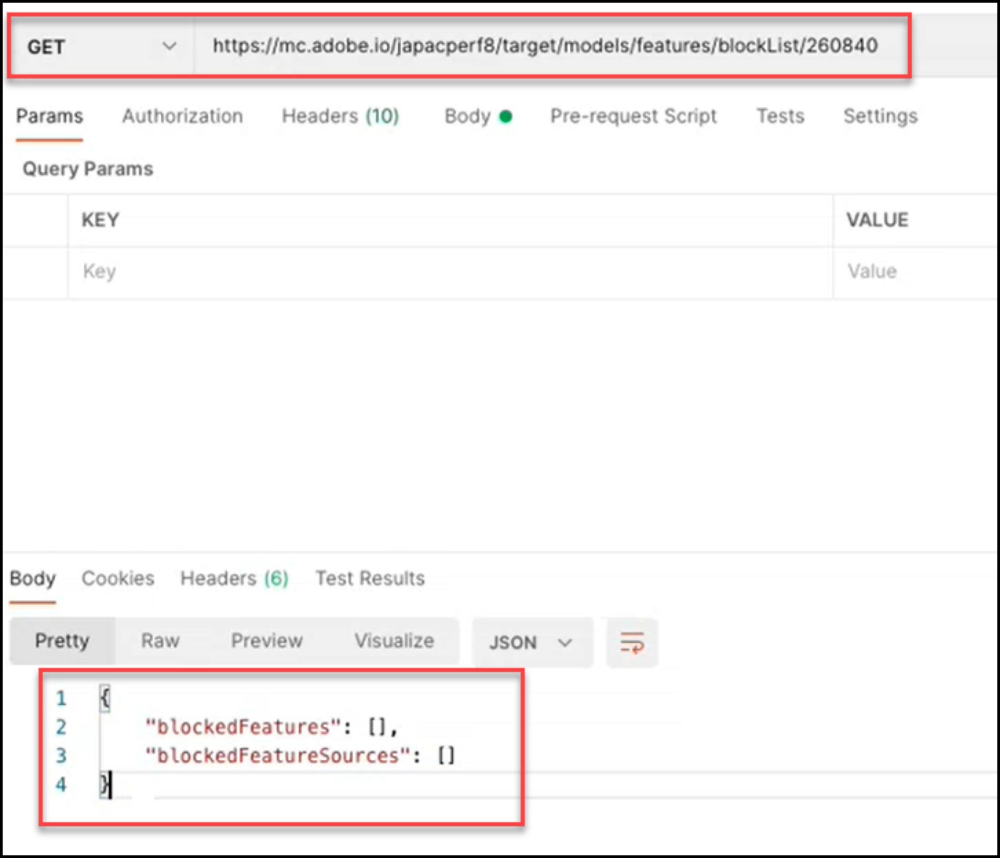

# Models API の概要

ブロックリストに加える Models API （Create API とも呼ばれる）を使用すると、[!UICONTROL Automated Personalization] （AP）と [!DNL Auto-Target] （AT）アクティビティの機械学習モデルで使用する機能のリストを表示および管理できます。 モデルが AP または AT アクティビティに使用する機能を除外する場合は、Models API を使用して、その機能を「ブロックリスト」に追加できます。

**[!UICONTROL blocklist]** は、[!DNL Adobe Target] によって機械学習モデルから除外される一連の機能を定義します。 機能について詳しくは、[ 機械学習アルゴリズムで使用されるデータ  [!DNL Target]  参照してください ](https://experienceleague.adobe.com/docs/target/using/activities/automated-personalization/ap-data.html?lang=ja)。

ブロックリストは、アクティビティ（アクティビティレベル）ごとに定義することも、[!DNL Target] アカウント内のすべてのアクティビティ（グローバルレベル）に対して定義することもできます。

<!-- To get started with the Models API in order to create and manage your blocklist, download the Postman Collection [here](https://git.corp.adobe.com/target/ml-configuration-management-service/tree/nextRelease/rest_api_library). Note this is an Adobe internal link. Need to publish this publicly if want to share with customers. -->

## モデル API の仕様

Models API の仕様を [ こちら ](../administer/models-api/models-api-overview.md) で確認します。

## 前提条件

Models API を使用する場合、&lbrace;Target Admin API[&#128279;](https://developer.adobe.com/console/home) を使用する場合と同様に、&lbrace;0[Adobe Developer Console](../administer/admin-api/admin-api-overview-new.md) を使用して認証を設定する必要があります。 詳しくは、[ 認証の設定方法 ](../before-administer/configure-authentication.md) を参照してください。

## Models API 使用ガイドライン

ブロックリストの管理方法

[**手順 1:**](#step1) アクティビティの機能のリストを表示する

[**手順 2:**](#step2) アクティビティのブロックリストを確認する

[**手順 3:**](#step3) アクティビティのブロックリストに機能を追加する*

[**手順 4:**](#step4) （オプション）ブロック解除

[**手順 5:**](#step5) （オプション）グローバルブロックリストの管理


## 手順 1：アクティビティの機能のリストの表示 {#step1}

機能をブロックリストに加えるする前に、そのアクティビティのモデルに現在含まれている機能のリストを表示します。

>[!BEGINTABS]

>[!TAB 要求]

```json {line-numbers="true"}
GET https://mc.adobe.io/<tenant>/target/models/features/<campaignId>
```

>[!TAB 応答]

```json {line-numbers="true"}
{
    "features": [
        {
            "externalName": "Visitor Profile - Total Visits to Activity",
            "internalName": "SES_PREVIOUS_VISIT_COUNT",
            "type": "CONTINUOUS"
        },
        {
            "externalName": "Visitor Profile - Total Visits",
            "internalName": "SES_TOTAL_SESSIONS",
            "type": "CONTINUOUS"
        },
        {
            "externalName": "Visitor Profile - Pages Seen Before Activity",
            "internalName": "SES_PREVIOUS_VISIT_COUNT",
            "type": "CONTINUOUS"
        },
        {
            "externalName": "Visitor Profile - Activity Lifetime Time on Site",
            "internalName": "SES_TOTAL_TIME",
            "type": "CONTINUOUS"
        }
    ],
    "reportParameters": {
        "clientCode": <tenant>,
        "campaignId": <campaignId>
    }
}
```

>[!ENDTABS]

<!-- JUDY: Update codeblock above once you have the complete Response. -->

ここに示す例では、アクティビティ ID が 260840 のアクティビティについて、モデルで使用されている機能のリストを確認しています。


>[!NOTE]
>
>アクティビティのアクティビティ ID を見つけるには、[!DNL Target] UI のアクティビティリストに移動します。 対象となるアクティビティをクリックします。 アクティビティ ID は、結果のアクティビティの概要ページの本文と、そのページの URL の末尾に表示されます。

**[!UICONTROL externalName]** は、機能のわかりやすい名前です。 [!DNL Target] によって作成され、この値は時間の経過と共に変化する可能性があります。 ユーザーは、[Personalization Insights レポート ](https://experienceleague.adobe.com/docs/target/using/reports/insights/personalization-insights-reports.html?lang=ja) でこれらの名前をわかりやすく表示できます。

**[!UICONTROL internalName]** は、機能の実際の識別子です。 [!DNL Target] によっても作成されますが、変更することはできません。 この値を参照して、ブロックリストに加えるする機能を特定する必要があります。

機能リストに値を入力するには（つまり、null 以外にするには）、アクティビティに注意してください。

1. ステータス = ライブであるか、以前にアクティブ化されている必要があります
1. モデルに実行するデータが含まれるように、キャンペーンアクティビティが存在するのに十分な時間、実行されている必要があります。

## 手順 2：アクティビティのブロックリストを確認する {#step2}

次に、ブロックリストを表示します。 つまり、現在このアクティビティのモデルに含まれないようにブロックされている機能（ある場合）を確認します。

>[!ERROR]
>
>リクエスト `/blockList/` は大文字と小文字が区別されることに注意してください。

>[!BEGINTABS]

>[!TAB 要求]

```json {line-numbers="true"}
GET https://mc.adobe.io/<tenant>/target/models/features/blockList/<campaignId>
```

>[!TAB 応答]

```json {line-numbers="true"}

```

>[!ENDTABS]

次に示す例では、アクティビティ ID が 260840 のアクティビティについて、ブロックされる機能のリストを確認しています。 結果は空です。つまり、このアクティビティには現在、ブロックリストに加える機能がありません。


>[!NOTE]
>
>機能を追加する前に、初めてブロックリスト全体を確認すると、このような空の結果が表示される場合があります。 ただし、ブロックリストブロックリストに加えるから機能を追加（およびその後で削除）すると、空の機能配列が返される結果が少し異なる場合があります。 読み続けて、[ 手順 4](#step4) でこれの例を確認します。

## 手順 3：アクティビティのブロックリストに機能を追加する {#step3}

ブロックリストに機能を追加するには、リクエストをGETからPUTに変更し、リクエストの本文を必要に応じて `blockedFeatureSources` または `blockedFeatures` を指定します。

* リクエストの本文には、`blockedFeatures` または `blockedFeatureSources` が必要です。 両方を含めることができます。
* `internalName` から識別された値を `blockedFeatures` に入力します。 [ 手順 1](#step1) を参照してください。
* 以下の表の値を `blockedFeatureSources` に入力します。

機能の元の場所 `blockedFeatureSources` 示されることに注意してください。 ブロックリストへの登録の目的では、機能のグループまたはカテゴリとして機能し、機能のセット全体を一度にブロックできます。 `blockedFeatureSources` の値は、機能の識別子の最初の文字（`blockedFeatures` または `internalName` の値）に一致するので、「機能プレフィックス」と見なすこともできます。

### `blockedFeatureSources` 値テーブル {#table}

| プレフィックス | 説明 |
| --- | --- |
| BOX | mbox パラメーター |
| URL | カスタム - URL パラメーター |
| 環境 | 環境 |
| セス | 訪問者プロファイル |
| 地域 | ジオ位置情報 |
| PRO | カスタム – プロファイル |
| セグメント | カスタム – レポートセグメント |
| AAM | カスタム - Experience Cloudセグメント |
| 暴徒 | モバイル |
| CRS | カスタム – 顧客属性 |
| UPA | カスタム - RT-CDP プロファイル属性 |
| IAC | 訪問者の関心領域 |  |

>[!BEGINTABS]

>[!TAB 要求]

```json {line-numbers="true"}
PUT https://mc.adobe.io/<tenant>/target/models/features/blockList/<campaignId>

{
    "blockedFeatureSources": ["AAM"],
    "blockedFeatures": ["SES_PREVIOUS_VISIT_COUNT", "SES_TOTAL_SESSIONS"]
}
```

>[!TAB 応答]

```json {line-numbers="true"}
{
    "blockedFeatures": [
            "SES_PREVIOUS_VISIT_COUNT",
            "SES_TOTAL_SESSIONS"
        ],
    "blockedFeatureSources": [
            "AAM"
        ]
}
```

>[!ENDTABS]

この例では、ユーザーは `SES_PREVIOUS_VISIT_COUNT` と `SES_TOTAL_SESSIONS` の 2 つの機能をブロックしています。これは、手順 1[&#128279;](#step1) で説明したように、アクティビティ ID が 260480 のアクティビティの機能の完全なリストをクエリすることで、以前に識別されました。 また、前述の [ 表 ](#table) で説明されているように、「AAM」のプレフィックスで機能をブロックすることで達成される、Experience Cloudセグメントからのすべての機能もブロックします。


機能をブロックリストに加えるした後で、[ 手順 2](#step2) （GET ブロックリストに加える）を再度実行して、更新されたブロックリストを検証することをお勧めします。 結果が期待どおりに表示されることを確認します（結果に、最新のPUTリクエストから追加された機能が含まれていることを確認します）。

## 手順 4:（任意）ブロック解除 {#step4}

すべてのブロックリストに加える集合体のブロックを解除するには、`blockedFeatureSources` または `blockedFeatures` の値を消去します。

>[!BEGINTABS]

>[!TAB 要求]

```json {line-numbers="true"}
PUT https://mc.adobe.io/<tenant>/target/models/features/blockList/<campaignId>

{
    "blockedFeatureSources": [],
    "blockedFeatures": []
}
```

>[!TAB 応答]

```json {line-numbers="true"}
{
    "blockedFeatures": [],
    "blockedFeatureSources": []
}
```

>[!ENDTABS]

次の例では、アクティビティ ID が 260840 のアクティビティについて、ブロックリストがクリアされています。 応答では、ブロックされた機能とそのソース（それぞれ `blockedFeatureSources` と `blockedFeatures`）の両方で空の配列が確認されることに注意してください。


いつものように、ブロックリストを修正した後で、もう一度 [ 手順 2](#step2) を実行することをお勧めします（リストを検証するためのGETブロックリストに加えるは、期待どおりに機能が含まれています）。 ここに示す例では、ユーザーは自分のブロックリストが空であることを確認しています。



質問：ブロックリストのすべてではなく、一部を削除するにはどうすればよいですか？

回答：マルチフィーチャーブロックリストに加えるからブロックリストに加えるされた機能のサブセットを個別に削除するには、[ リクエスト ](#step3) でブロックしたい機能の更新リストを送信するだけで、全ブロックリストブロックリストに加えるをクリアして必要な機能を追加し直すことはできなくなります。 つまり、更新した機能リストを送信し（[ 手順 3](#step3) を参照）、「削除」する機能は必ずブロックリストから除外します。

## 手順 5:（オプション）グローバルブロックリストの管理 {#step5}

上記の例はすべて、1 つのアクティビティのコンテキストに含まれていました。 各アクティビティにブロックリストを個別に指定する代わりに、特定のクライアント（テナント）にわたるすべてのアクティビティの機能をブロックすることもできます。 グローバルブロックリストを実行するには、`blockList/<campaignId>` の代わりに `/blockList/global` 呼び出しを使用します。

>[!BEGINTABS]

>[!TAB 要求]

```json {line-numbers="true"}
PUT https://mc.adobe.io/<tenant>/target/models/features/blockList/global

{
    "blockedFeatureSources": ["AAM", "PRO", "ENV"],
    "blockedFeatures": ["AAM_FEATURE_1", "AAM_FEATURE_2"]
}
```

>[!TAB 応答]

```json {line-numbers="true"}
{
    "blockedFeatures": [
        "AAM_FEATURE_1",
        "AAM_FEATURE_2"
    ],
    "blockedFeatureSources": [
        "AAM",
        "PRO",
        "ENV"
    ]
}
```

>[!ENDTABS]

上記のリクエストのサンプルでは、ユーザーが [!DNL Target] アカウント内のすべてのアクティビティで「AAM_FEATURE_1」と「AAM_FEATURE_2」という 2 つの機能をブロックしています。 つまり、アクティビティに関係なく、このアカウントの機械学習モデルには「AAM_FEATURE_1」と「AAM_FEATURE_2」は含まれません。 さらに、ユーザーは、プレフィックスが「AAM」、「PRO」または「ENV」のすべての機能をグローバルにブロックしています。

質問：上記のコードサンプルは冗長ではありませんか？

回答：はい。 「AAM」で始まる値を持つ機能をブロックし、ソースが「AAM」のすべての機能をブロックすることは冗長です。 最終的には、AAM（Experience Cloudセグメント）をソースとするすべての機能がブロックされます。 したがって、Experience Cloudセグメントからすべての機能をブロックすることを目的とする場合、上記の例では、「AAM」で始まる特定の機能を個別に指定する必要はありません。

最終手順：アクティビティレベルでもグローバルレベルでも、変更後にブロックリストを検証し、期待する値が含まれていることを確認することをお勧めします。 これを行うには、`PUT` を `GET` に変更します。

以下に示すサンプル応答では、2 つの個別の機能に加え、「AAM」、「PRO」および「ENV」から取得され [!DNL Target] すべての機能がブロックされています。


