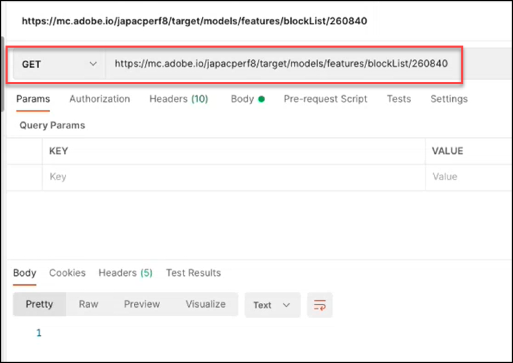

# モデル APIの概要

Models APIは、^ブロックリスト APIとも呼ばれ、[!UICONTROL Automated Personalization] （AP）および[!DNL Auto-Target] （AT）アクティビティのマシンラーニングモデルで使用される機能のリストを表示および管理できます。 APまたはAT アクティビティのモデルで使用されるフィーチャーを除外する場合は、Models APIを使用して、そのフィーチャーを「モデルブロックリスト」に追加できます。

**[!UICONTROL ブロックリスト]**&#x200B;は、[!DNL Adobe Target]によって機械学習モデルから除外される一連の機能を定義します。 機能について詳しくは、 [!DNL Target] 機械学習アルゴリズム ](https://experienceleague.adobe.com/docs/target/using/activities/automated-personalization/ap-data.html)によって使用される[ データを参照してください。

ブロックリストは、アクティビティ（アクティビティレベル）ごとに定義することも、[!DNL Target] アカウント内のすべてのアクティビティ（グローバルレベル）に定義することもできます。

<!-- To get started with the Models API in order to create and manage your blocklist, download the Postman Collection [here](https://git.corp.adobe.com/target/ml-configuration-management-service/tree/nextRelease/rest_api_library). Note this is an Adobe internal link. Need to publish this publicly if want to share with customers. -->

## モデル APIの仕様

モデル APIの仕様[ここ](../administer/models-api/models-api-overview.md)を表示します。

## 前提条件

モデル APIを使用するには、[Target Admin API](../administer/admin-api/admin-api-overview-new.md)と同様に、[Adobe Developer Console](https://developer.adobe.com/console/home)を使用して認証を設定する必要があります。 詳しくは、[認証の設定方法](../before-administer/configure-authentication.md)を参照してください。

## モデル APIの使用ガイドライン

の管理方法

[**手順1:**](#step1) アクティビティの機能のリストを表示

[**手順2:**](#step2) アクティビティのブロックリストに加えるを確認する

[**手順3:**](#step3) アクティビティのブロックリストに機能を追加する

[**ステップ 4:**](#step4) （オプション）ブロック解除

[**手順5:**](#step5) （オプション） グローバルなの管理を行う


## 手順1: アクティビティの機能のリストを表示する {#step1}

フィーチャーをブロックリストに加えるする前に、そのアクティビティのモデルに現在含まれているフィーチャーのリストを表示します。

>[!BEGINTABS]

>[!TAB 要求]

```json {line-numbers="true"}
GET https://mc.adobe.io/<tenant>/target/models/features/<campaignId>
```

>[!TAB 応答]

```json {line-numbers="true"}
{
    "features": [
        {
            "externalName": "Visitor Profile - Total Visits to Activity",
            "internalName": "SES_PREVIOUS_VISIT_COUNT",
            "type": "CONTINUOUS"
        },
        {
            "externalName": "Visitor Profile - Total Visits",
            "internalName": "SES_TOTAL_SESSIONS",
            "type": "CONTINUOUS"
        },
        {
            "externalName": "Visitor Profile - Pages Seen Before Activity",
            "internalName": "SES_PREVIOUS_VISIT_COUNT",
            "type": "CONTINUOUS"
        },
        {
            "externalName": "Visitor Profile - Activity Lifetime Time on Site",
            "internalName": "SES_TOTAL_TIME",
            "type": "CONTINUOUS"
        }
    ],
    "reportParameters": {
        "clientCode": <tenant>,
        "campaignId": <campaignId>
    }
}
```

>[!ENDTABS]

<!-- JUDY: Update codeblock above once you have the complete Response. -->

ここに示す例では、ユーザーは、アクティビティ IDが260840いアクティビティのモデルで使用されている機能のリストを確認しています。


>[!NOTE]
>
>アクティビティのアクティビティ IDを見つけるには、[!DNL Target] UIのアクティビティ リストに移動します。 目的のアクティビティをクリックします。 アクティビティ IDは、結果のアクティビティの概要ページの本文と、そのページのURLの末尾に表示されます。

**[!UICONTROL externalName]**&#x200B;は、機能の使いやすい名前です。 これは[!DNL Target]によって作成され、この値が時間の経過とともに変更される可能性があります。 ユーザーは、[Personalization インサイト レポート ](https://experienceleague.adobe.com/docs/target/using/reports/insights/personalization-insights-reports.html)でこれらの使いやすい名前を確認できます。

**[!UICONTROL internalName]**&#x200B;は、機能の実際の識別子です。 [!DNL Target]さんも作成していますが、変更できません。 これは、ブロックリストに加えるする機能を特定するために参照する必要がある値です。

機能リストに値を入力するには（つまり、null以外にするには）、次のアクティビティを実行します。

1. Status = Liveを持っているか、以前にアクティブ化されている必要があります
1. キャンペーン活動が発生するのに十分な時間を費やしており、モデルが対して実行するデータを持っている必要があります。

## 手順2：アクティビティのブロックリストを確認する {#step2}

次に、ブロックリストを表示します。 つまり、現在、このアクティビティのモデルに含めることをブロックされている機能がある場合は、その機能を確認します。

>[!ERROR]
>
>`/blockList/`は、リクエストで大文字と小文字が区別されることに注意してください。

>[!BEGINTABS]

>[!TAB 要求]

```json {line-numbers="true"}
GET https://mc.adobe.io/<tenant>/target/models/features/blockList/<campaignId>
```

>[!TAB 応答]

```json {line-numbers="true"}

```

>[!ENDTABS]

ここに示す例では、ユーザーはアクティビティ IDが260840いアクティビティのブロックされた機能のリストを確認しています。 結果は空です。つまり、このアクティビティには現在、ブロックリストに加えるされた機能はありません。



>[!NOTE]
>
>このような空の結果が表示される場合があります。完全な結果を初めて確認してから、機能を追加してください。 ただし、ードからフィーチャーを追加（およびその後に削除）すると、結果が少し異なる場合があり、空のーチャー配列が返されます。 この例については、[手順4](#step4)で説明します。

## 手順3：アクティビティのブロックリストに機能を追加する {#step3}

⌥ ブロックリストに機能を追加するには、リクエストをGETからPUTに変更し、リクエストの本文を変更して、必要に応じて`blockedFeatureSources`または`blockedFeatures`を指定します。

* リクエストの本文には`blockedFeatures`または`blockedFeatureSources`が必要です。 両方が含まれる場合があります。
* `internalName`から特定された値を`blockedFeatures`に入力します。 [手順1](#step1)を参照してください。
* 以下の表の値を`blockedFeatureSources`に入力します。

`blockedFeatureSources`は、機能の取得元を示します。 ブロックリストに加えるの目的では、機能のグループまたはカテゴリとして機能し、ユーザーは機能セット全体を一度にブロックできます。 `blockedFeatureSources`の値は、機能の識別子の最初の文字（`blockedFeatures`または`internalName`の値）と一致しているため、「機能のプレフィックス」と見なされることもあります。

### `blockedFeatureSources`値のテーブル {#table}

| プレフィックス | 説明 |
| --- | --- |
| ボックス | mbox パラメーター |
| URL | カスタム - URL パラメーター |
| ENV | 環境 |
| SES | 訪問者プロファイル |
| 地域 | 地域 |
| PRO | カスタム – プロファイル |
| SEG | カスタム – レポートセグメント |
| AAM | カスタム - Experience Cloud セグメント |
| モブ | モバイル |
| CRS | カスタム – 顧客属性 |
| UPA | カスタム - RT-CDP プロファイル属性 |
| IAC | 訪問者の関心の領域 |

>[!BEGINTABS]

>[!TAB 要求]

```json {line-numbers="true"}
PUT https://mc.adobe.io/<tenant>/target/models/features/blockList/<campaignId>

{
    "blockedFeatureSources": ["AAM"],
    "blockedFeatures": ["SES_PREVIOUS_VISIT_COUNT", "SES_TOTAL_SESSIONS"]
}
```

>[!TAB 応答]

```json {line-numbers="true"}
{
    "blockedFeatures": [
            "SES_PREVIOUS_VISIT_COUNT",
            "SES_TOTAL_SESSIONS"
        ],
    "blockedFeatureSources": [
            "AAM"
        ]
}
```

>[!ENDTABS]

ここで示す例では、ユーザーは[ ステップ 1](#step1)で説明されているように、アクティビティ IDが260480のアクティビティの機能の完全なリストをクエリすることで以前に特定した`SES_PREVIOUS_VISIT_COUNT`と`SES_TOTAL_SESSIONS`の2つの機能をブロックしています。 また、上記の[表](#table)で説明されているように、「AAM」というプレフィックスを持つ機能をブロックすることで実現される、Experience Cloud セグメントからのすべての機能をブロックしています。


機能をブロックリストに加えるした後、更新されたブロックリストを確認するには、もう一度[手順2](#step2)を実行することをお勧めします（ブロックリストを取得）。 結果が期待どおりに表示されることを確認します（結果に最新のPUT リクエストから追加された機能が含まれていることを確認します）。

## 手順4:（オプション）ブロック解除 {#step4}

すべてのブロックリストに加える機能のブロックを解除するには、`blockedFeatureSources`または`blockedFeatures`から値をクリアします。

>[!BEGINTABS]

>[!TAB 要求]

```json {line-numbers="true"}
PUT https://mc.adobe.io/<tenant>/target/models/features/blockList/<campaignId>

{
    "blockedFeatureSources": [],
    "blockedFeatures": []
}
```

>[!TAB 応答]

```json {line-numbers="true"}
{
    "blockedFeatures": [],
    "blockedFeatureSources": []
}
```

>[!ENDTABS]

ここに示す例では、ユーザーはアクティビティ IDが260840いアクティビティのJOINブロックリストをクリアしています。 応答では、ブロックされた機能とそのソースの両方に対して、それぞれ`blockedFeatureSources`と`blockedFeatures`の空の配列が確認されることに注意してください。


いつも通り、ブロックリストを変更した後で、[手順2](#step2)をもう一度実行することをお勧めします（リストに期待どおりの機能が含まれていることを確認するには、このリストを取得してください）。 ここに示す例では、ユーザーは自分の検索ブロックリストが空であることを確認しています。


質問：一部の画像を削除できますが、すべての画像を削除することはできません。

回答：複数の機能を含むブロックリストに加えるから個別の機能のサブセットを削除するには、[ブロックリストに加えるリクエスト ](#step3)でブロックしたい機能の更新リストを送信するだけで、プラン全体をクリアして目的の機能を再追加するのではなく、簡単に送信できます。 つまり、更新された機能リスト（[手順3](#step3)に示すように）を送信し、「削除」する機能を必ず「削除」リストから除外します。「削除」ボタンをクリックします。

## 手順5:（オプション）グローバルールの管理 {#step5}

上記の例はすべて、単一のアクティビティのコンテキストにあります。 また、各アクティビティに対して個別にA/Bブロックリストに加えるを指定する必要はなく、特定のクライアント（テナント）全体のすべてのアクティビティの機能をブロックすることもできます。 グローバル通知ブロックリストを実行するには、`blockList/<campaignId>`ではなく`/blockList/global`呼び出しを使用します。

>[!BEGINTABS]

>[!TAB 要求]

```json {line-numbers="true"}
PUT https://mc.adobe.io/<tenant>/target/models/features/blockList/global

{
    "blockedFeatureSources": ["AAM", "PRO", "ENV"],
    "blockedFeatures": ["AAM_FEATURE_1", "AAM_FEATURE_2"]
}
```

>[!TAB 応答]

```json {line-numbers="true"}
{
    "blockedFeatures": [
        "AAM_FEATURE_1",
        "AAM_FEATURE_2"
    ],
    "blockedFeatureSources": [
        "AAM",
        "PRO",
        "ENV"
    ]
}
```

>[!ENDTABS]

上記のサンプルリクエストでは、ユーザーは、[!DNL Target] アカウント内のすべてのアクティビティについて、「AAM_FEATURE_1」と「AAM_FEATURE_2」の2つの機能をブロックしています。 つまり、アクティビティに関係なく、このアカウントのマシンラーニングモデルには「AAM_FEATURE_1」と「AAM_FEATURE_2」は含まれません。 さらに、接頭辞が「AAM」、「PRO」、「ENV」であるすべての機能をグローバルにブロックしています。

質問：上記のコードサンプルは冗長ではありませんか？

回答：はい。 「AAM」で始まる値を持つ機能をブロックし、ソースが「AAM」のすべての機能をブロックするのは冗長です。 最終的な結果として、AAM（Experience Cloud セグメント）から取得されたすべての機能がブロックされます。 したがって、Experience Cloud セグメントのすべての機能をブロックすることを目標とする場合、上記の例では、「AAM」で始まる特定の機能を個別に指定する必要はありません。

最後の手順：アクティビティレベルまたはグローバルレベルのいずれでも、値が含まれていることを確認するために、変更した後に必ずの値を検証することをお勧めします。 これを行うには、`PUT`を`GET`に変更します。

次に示すサンプルの回答は、[!DNL Target]が2つの個々の機能に加えて、「AAM」、「PRO」、「ENV」から提供されているすべての機能をブロックしていることを示しています。


