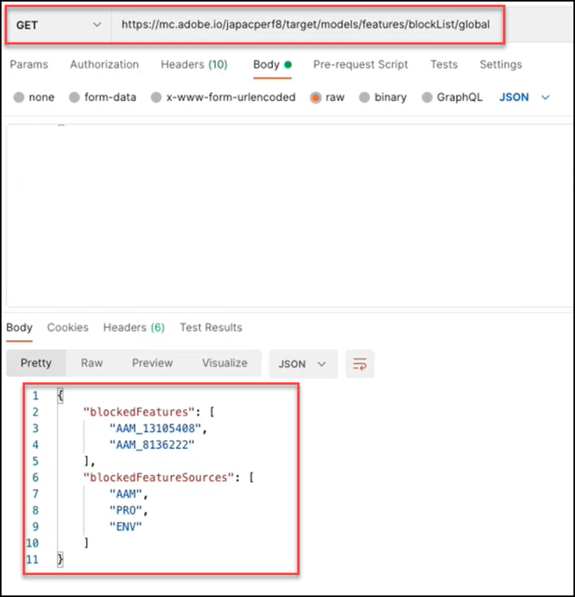

# モデル API の概要

モデル API(API とも呼ばれまブロックリストに加えるす ) を使用すると、の機械学習モデルで使用される機能のリストを表示および管理できます。 [!UICONTROL Automated Personalization] (AP) および [!DNL Auto-Target] (AT) アクティビティ AP または AT アクティビティのモデルでの使用を除外する場合は、モデル API を使用して、その機能を「」に追加できまブロックリストに加えるす。

A **[!UICONTROL ブロックリストに加える]** によって除外される一連の機能を定義します。 [!DNL Adobe Target] を機械学習モデルから取り出します。 機能について詳しくは、 [使用するデータ [!DNL Target] 機械学習アルゴリズム](https://experienceleague.adobe.com/docs/target/using/activities/automated-personalization/ap-data.html).

ブロックリストに加えるは、アクティビティ（アクティビティレベル）ごとに、または [!DNL Target] アカウント（グローバルレベル）。

<!-- To get started with the Models API in order to create and manage your blocklist, download the Postman Collection [here](https://git.corp.adobe.com/target/ml-configuration-management-service/tree/nextRelease/rest_api_library). Note this is an Adobe internal link. Need to publish this publicly if want to share with customers. -->

## モデル API の仕様

モデル API の仕様を表示する [ここ](../administer/models-api/models-api-overview.md).

## 前提条件

モデル API を使用するには、 [Adobe Developer Console](https://developer.adobe.com/console/home)それは、 [Target 管理 API](../administer/admin-api/admin-api-overview-new.md). 詳しくは、 [認証の設定方法](../before-administer/configure-authentication.md).

## モデル API の使用に関するガイドライン

管理の方ブロックリストに加える法

[**手順 1:**](#step1) アクティビティの機能のリストを表示

[**手順 2:**](#step2) アクティビテブロックリストに加えるィのを確認する

[**手順 3:**](#step3) アクティビティのブロックリストに加えるに機能を追加

[**手順 4:**](#step4) （オプション）ブロック解除

[**手順 5:**](#step5) （オプション）グローバルの管ブロックリストに加える理


## 手順 1：アクティビティの機能のリストを表示する {#step1}

フィーチャーをブロックリストに加えるする前に、そのアクティビティのモデルに現在含まれているフィーチャーのリストを表示します。

>[!BEGINTABS]

>[!TAB リクエスト]

```json {line-numbers="true"}
GET https://mc.adobe.io/<tenant>/target/models/features/<campaignId>
```

>[!TAB 応答]

```json {line-numbers="true"}
{
    "features": [
        {
            "externalName": "Visitor Profile - Total Visits to Activity",
            "internalName": "SES_PREVIOUS_VISIT_COUNT",
            "type": "CONTINUOUS"
        },
        {
            "externalName": "Visitor Profile - Total Visits",
            "internalName": "SES_TOTAL_SESSIONS",
            "type": "CONTINUOUS"
        },
        {
            "externalName": "Visitor Profile - Pages Seen Before Activity",
            "internalName": "SES_PREVIOUS_VISIT_COUNT",
            "type": "CONTINUOUS"
        },
        {
            "externalName": "Visitor Profile - Activity Lifetime Time on Site",
            "internalName": "SES_TOTAL_TIME",
            "type": "CONTINUOUS"
        }
    ],
    "reportParameters": {
        "clientCode": <tenant>,
        "campaignId": <campaignId>
    }
}
```

>[!ENDTABS]

<!-- JUDY: Update codeblock above once you have the complete Response. -->

この例では、ユーザーは、アクティビティ ID が260840のアクティビティについて、モデルで使用されている機能のリストを確認しています。


>[!NOTE]
>
>アクティビティのアクティビティ ID を確認するには、 [!DNL Target] UI 目的のアクティビティをクリックします。 アクティビティ ID は、結果のアクティビティの概要ページの本文と、そのページの URL の末尾に表示されます。

The **[!UICONTROL externalName]** は、機能のわかりやすい名前です。 作成者 [!DNL Target]に設定され、この値は時間の経過と共に変化する可能性があります。 ユーザーは、 [パーソナライゼーションインサイトレポート](https://experienceleague.adobe.com/docs/target/using/reports/insights/personalization-insights-reports.html).

The **[!UICONTROL internalName]** は、機能の実際の識別子です。 また、 [!DNL Target]変更できません。 これは、参照するフィーチャを識別するために必要な値でブロックリストに加えるす。

機能リストに値が入力される（null 以外にする）ためには、「 」アクティビティに注意してください。

1. ステータス=ライブであるか、以前にアクティベート済みである必要があります
1. モデルが実行するデータを持つように、キャンペーンアクティビティが存在するのに十分な時間が実行されていた必要があります。

## 手順 2：アクティビティのブロックリストに加えるを確認する {#step2}

次に、「 」タブを表示しブロックリストに加えるます。 つまり、チェックをオンにして、このアクティビティのモデルへの追加をブロックしている機能（存在する場合）を確認します。

>[!ERROR]
>
>注意： `/blockList/` リクエストでは大文字と小文字が区別されます。

>[!BEGINTABS]

>[!TAB リクエスト]

```json {line-numbers="true"}
GET https://mc.adobe.io/<tenant>/target/models/features/blockList/<campaignId>
```

>[!TAB 応答]

```json {line-numbers="true"}

```

>[!ENDTABS]

ここに示す例では、ユーザーは、アクティビティ ID が260840のアクティビティに対して、ブロックされた機能のリストを確認しています。 結果は空になります。つまり、このアクティビティには現在、機能がされていまブロックリストに加えるせん。


>[!NOTE]
>
>機能を追加する前に、初めてフルをチェックしたときブロックリストに加えるに、このような空の結果が表示される場合があります。 ただし、から機能を追加（その後削除）するとブロックリストに加える、少し異なる結果が表示され、空の機能配列が返される場合がありまブロックリストに加えるす。 引き続き、 [手順 4](#step4).

## 手順 3：アクティビティのブロックリストに加えるに機能を追加 {#step3}

機能をGETに追加するにブロックリストに加えるは、リクエストをからPUTに変更し、リクエストの本文を変更して、 `blockedFeatureSources` または `blockedFeatures` 必要に応じて。

* リクエストの本文には、次のいずれかが必要です。 `blockedFeatures` または `blockedFeatureSources`. 両方を含めることができます。
* 入力 `blockedFeatures` から特定された値を持つ `internalName`. 詳しくは、 [手順 1](#step1).
* 入力 `blockedFeatureSources` 以下の表の値を使用します。

注意： `blockedFeatureSources` フィーチャの元を示します。 の目的でブロックリストに加えるは、機能のグループまたはカテゴリとして機能し、ユーザーは一度に機能のセット全体をブロックできます。 の値 `blockedFeatureSources` は、機能の識別子の最初の文字 (`blockedFeatures` または `internalName` 値 ) の場合は、「フィーチャプレフィックス」と見なされる場合もあります。

### のテーブル `blockedFeatureSources` 値 {#table}

| プレフィックス | 説明 |
| --- | --- |
| BOX | mbox パラメーター |
| URL | カスタム — URL パラメーター |
| ENV | 環境 |
| SES | 訪問者プロファイル |
| 地域 | 地域 |
| PRO | カスタム — プロファイル |
| SEG | カスタム — レポートセグメント |
| AAM | カスタム —Experience Cloudセグメント |
| 暴徒 | モバイル |
| CRS | カスタム — 顧客属性 |
| UPA | カスタム — RT-CDP プロファイル属性 |
| IAC | 訪問者の関心領域 |  |

>[!BEGINTABS]

>[!TAB リクエスト]

```json {line-numbers="true"}
PUT https://mc.adobe.io/<tenant>/target/models/features/blockList/<campaignId>

{
    "blockedFeatureSources": ["AAM"],
    "blockedFeatures": ["SES_PREVIOUS_VISIT_COUNT", "SES_TOTAL_SESSIONS"]
}
```

>[!TAB 応答]

```json {line-numbers="true"}
{
    "blockedFeatures": [
            "SES_PREVIOUS_VISIT_COUNT",
            "SES_TOTAL_SESSIONS"
        ],
    "blockedFeatureSources": [
            "AAM"
        ]
}
```

>[!ENDTABS]

ここに示す例では、ユーザーは 2 つの機能をブロックしています。 `SES_PREVIOUS_VISIT_COUNT` および `SES_TOTAL_SESSIONS`：アクティビティ ID が260480のアクティビティの機能の完全なリストを問い合わせることで、以前に識別されたものです。詳しくは、 [手順 1](#step1). また、Experience Cloudセグメントからのすべての機能をブロックします。これは、「AAM」というプレフィックスで機能をブロックすることで実現されます。詳しくは、 [表](#table) 上記の


機能をブロックリストに加えるした後、 [手順 2](#step2) (GET) を再度追加しまブロックリストに加えるす。 結果が期待どおりに表示されることを確認します ( 結果に、最新のPUTリクエストから追加された機能が含まれていることを確認します )。

## 手順 4: （オプション）ブロック解除 {#step4}

すべてのフィーチャのブブロックリストに加えるロックを解除するには、次の値をクリアします。 `blockedFeatureSources` または `blockedFeatures`.

>[!BEGINTABS]

>[!TAB リクエスト]

```json {line-numbers="true"}
PUT https://mc.adobe.io/<tenant>/target/models/features/blockList/<campaignId>

{
    "blockedFeatureSources": [],
    "blockedFeatures": []
}
```

>[!TAB 応答]

```json {line-numbers="true"}
{
    "blockedFeatures": [],
    "blockedFeatureSources": []
}
```

>[!ENDTABS]

この例では、アクティビティ ID が260840のアブロックリストに加えるクティビティのをクリアしています。 応答は、ブロックされた機能とそのソースの両方に対して空の配列を確認します。`blockedFeatureSources` および `blockedFeatures`、それぞれ。


通常と同様に、を変更した後ブロックリストに加えるは、次の操作を実行することをお勧めします。 [手順 2](#step2) 再び (GETを確認するためのリストには、想定どおりの機能が含まれていまブロックリストに加えるす )。 この例では、ユーザーは、自分のが空になっていることを確認していまブロックリストに加えるす。


質問：すべてではなく一部のを削除するにはどうすればよいでブロックリストに加えるすか。

回答：マルチ機能かブロックリストに加えるら機能の個別のサブセットを削除するにブロックリストに加えるは、ブロックインする機能の更新済みリストを送信するだけです [ブロックリストに加える要求](#step3)を追加する必要がありまブロックリストに加えるす。 つまり、更新された機能リスト ( [手順 3](#step3)) の場合は、削除するフィーチャを必ずから除外しまブロックリストに加えるす。

## 手順 5:（オプション）グローバルの管ブロックリストに加える理 {#step5}

上記の例はすべて、1 つのアクティビティのコンテキストです。 また、各アクティビティに個別にオプションを指定する代わりに、指定したクライアント（テナント）全体のすべてのアクティビティの機能をブブロックリストに加えるロックすることもできます。 グローバルを実ブロックリストに加える行するには、 `/blockList/global` 代わりにを呼び出します。 `blockList/<campaignId>`.

>[!BEGINTABS]

>[!TAB リクエスト]

```json {line-numbers="true"}
PUT https://mc.adobe.io/<tenant>/target/models/features/blockList/global

{
    "blockedFeatureSources": ["AAM", "PRO", "ENV"],
    "blockedFeatures": ["AAM_FEATURE_1", "AAM_FEATURE_2"]
}
```

>[!TAB 応答]

```json {line-numbers="true"}
{
    "blockedFeatures": [
        "AAM_FEATURE_1",
        "AAM_FEATURE_2"
    ],
    "blockedFeatureSources": [
        "AAM",
        "PRO",
        "ENV"
    ]
}
```

>[!ENDTABS]

上記のサンプル要求では、ユーザーは、すべてのアクティビティに対して「AAM_FEATURE_1」と「AAM_FEATURE_2」の 2 つの機能をブロックしています [!DNL Target] アカウント。 つまり、アクティビティに関係なく、「AAM_FEATURE_1」と「AAM_FEATURE_2」はこのアカウントの機械学習モデルに含まれません。 さらに、ユーザーは、プレフィックスが「AAM」、「PRO」、「ENV」のすべての機能をグローバルにブロックします。

質問：上記のコードサンプルは、冗長ではありませんか。

答え：はい。 値が「AAM」で始まる機能をブロックするのに対して、ソースが「AAM」であるすべての機能をブロックするのに対して、冗長です。 最終的な結果として、AAM(Experience Cloudセグメント ) から提供されるすべての機能がブロックされます。 したがって、上記の例では、Experience Cloudセグメントからすべての機能をブロックすることを目的としている場合、「AAM」で始まる特定の機能を個別に指定する必要はありません。

最後の手順：アクティビティレベルとグローバルレベルのどちらで、変更後にを検証ブロックリストに加えるし、期待する値が含まれていることを確認することをお勧めします。 これをおこなうには、 `PUT` から `GET`.

以下に示すレスポンスのサンプルは [!DNL Target] は、2 つの個々の機能をブロックし、さらに「AAM」、「PRO」、「ENV」から提供されるすべての機能をブロックします。


