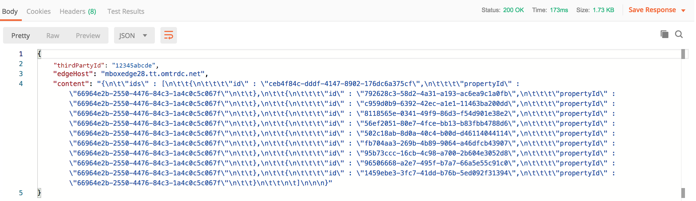

# 配信 API を使用したレコメンデーションの取得

Adobe Target API およびAdobe Target Recommendations API を使用すると、web ページに対する応答を提供できますが、アプリ、画面、コンソール、メール、キオスクおよびその他のディスプレイデバイスなど、HTML以外のエクスペリエンスでも使用できます。 つまり、Target ライブラリとJavaScriptを使用できない場合でも、[Target 配信 API](/help/dev/implement/delivery-api/overview.md) を使用すれば、引き続き Target の全機能にアクセスして、パーソナライズされたエクスペリエンスを提供できます。

>[!NOTE]
>
>実際のレコメンデーションを含んだコンテンツ（推奨製品または推奨項目）をリクエストする場合は、Target 配信 API を使用します。

レコメンデーションを取得するには、適切なコンテキスト情報を含んだAdobe Target Delivery API POST 呼び出しを送信します。この情報には、ユーザー ID （最近閲覧したユーザーの項目などのプロファイル固有のレコメンデーションで使用する）、関連する mbox 名、mbox パラメーター、プロファイルパラメーター、その他の属性などが含まれます。 応答には、推奨される entity.ids （および他のエンティティデータを含む場合があります）が JSON 形式またはHTML形式で含まれ、デバイスに表示できます。

Adobe Target用 [&#x200B; 配信 API](/help/dev/implement/delivery-api/overview.md) は、標準の Target リクエストが提供する既存の機能をすべて公開します。

配信 API:

* を使用すると、場所およびオーディエンスのエクスペリエンスやオファーを RESTful な方法で取得できます。
* 認証は必要ありません。
* POST のみ。
* は、Cookie の処理や呼び出しのリダイレクトを行いません。
* 「ユーザーの役割」を必要としない、または認識しない。 コンテンツを取得したり、イベントを Target エッジサーバーにレポートしたりするだけです。

配信 API を使用して、レコメンデーションを含む Target エクスペリエンスを配信するには、次の手順に従います。

1. Visual Experience Composer ではなくフォームベースのコンポーザーを使用して、Target アクティビティ（A/B、XT、AP、Recommendations）を作成します。
1. 配信 API を使用して、作成した Target アクティビティによって生成されたリクエストに対する応答を取得します。

&lt;!— Q：この方法にはなぜ両方のステップが必要なのでしょうか。 mbox に対してフォームベースのレコメンデーションを定義した場合、の配信 API ステップを使用して結果を取得する利点は何ですか？ フォームベースの Rec を使用して宛先デバイスに結果を配信するだけでは、なぜできないのでしょうか…?? A：以下のユースケースを参照してください。結果を表示する前にさらに作業をおこなうために、保留中の結果を「インターセプト」する場合です。 在庫レベルに対するリアルタイム比較などがあります。 —>

## フォームベースの Experience Composer を使用したレコメンデーションの作成

配信 API で使用できるレコメンデーションを作成するには、[&#x200B; フォームベースのコンポーザー &#x200B;](https://experienceleague.adobe.com/docs/target/using/experiences/form-experience-composer.html) を使用します。

1. まず、レコメンデーションで使用する JSON ベースのデザインを作成して保存します。 JSON のサンプルと、フォームベースのアクティビティを設定する際に JSON 応答を返す方法に関する背景情報については、[&#x200B; レコメンデーションデザインの作成 &#x200B;](https://experienceleague.adobe.com/docs/target/using/recommendations/recommendations-design/create-design.html) に関するドキュメントを参照してください。 この例では、デザイン名は *Simple JSON.* です
   

1. Target で、**[!UICONTROL Activities]**/**[!UICONTROL Create Activity]**/**[!UICONTROL Recommendations]** に移動し、「**[!UICONTROL Form]**」を選択します。

   

1. プロパティを選択し、[**[!UICONTROL Next]**] をクリックします。
1. レコメンデーションの応答をユーザーに受信させる場所を定義します。 次の例では、*api_charter* という名前の場所を使用しています。 以前に作成した「*Simple JSON.*」という名前の JSON ベースのデザインを選択します。
   
1. レコメンデーションを保存して有効化します。 結果が生成されます。 [&#x200B; 結果の準備が整ったら &#x200B;](https://experienceleague.adobe.com/docs/target/using/recommendations/recommendations-activity/previewing-and-launching-your-recommendations-activity.html)、配信 API を使用して結果を取得できます。

## 配信 API の使用

[&#x200B; 配信 API](/help/dev/implement/delivery-api/overview.md) の構文を以下に示します。

`POST https://{{CLIENT_CODE}}.tt.omtrdc.net/rest/v1/delivery`

1. クライアントコードは必須であることに注意してください。 お使いのクライアントコードは、**[!UICONTROL Recommendations]**/**[!UICONTROL Settings]** に移動してAdobe Targetにある場合があります。 **Recommendation API トークン** セクションの **クライアントコード** 値に注意してください。
   
1. クライアントコードを取得したら、配信 API 呼び出しを作成します。 次の例は、**[!UICONTROL Web Batched Mboxes Delivery API Call]** Delivery API Postman コレクション [&#x200B; で提供された &#x200B;](../../implement/delivery-api/overview.md#section/Getting-Started/Postman-Collection) から始まり、適切な変更を行います。 次に例を示します。
   * **browser** および **address** オブジェクトは、HTML以外のユースケースでは必要ないので、**Body** から削除されました
   * この例では、*api_charter* を場所名としてリストしています
   * このレコメンデーションは、現在のアイテムキーを Target に渡す必要があるコンテンツの類似性に基づいているので、entity.id が指定されています。
     
クエリパラメーターを正しく設定することを忘れないでください。 例えば、必要に応じて `{{CLIENT_CODE}}` を指定します。<!-- Q: In the updated call syntax, entity.id is listed as a profileParameter instead of an mboxParameter as in older versions. Q: Old image  Old accompanying text: "Note this recommendation is based on Content Similar products based on the entity.id sent via mboxParameters." -->
     
1. リクエストを送信します。 これは、アクティブなレコメンデーションが実行されている *api_charter* の場所に対して実行されます。この場所は、推奨されるエンティティのリストを出力する JSON デザインで定義されています。
1. JSON デザインに基づいて応答を受け取ります。
   
この応答には、キー ID と推奨エンティティのエンティティ ID が含まれます。

この方法で配信 API と Recommendations を使用すると、HTML以外のデバイスで訪問者にレコメンデーションを表示する前に、追加の手順を実行できます。 例えば、配信 API からの応答を受けて、最終結果を表示する前に別のシステム（CMS、PIM、e コマースプラットフォームなど）のエンティティ属性の詳細（在庫、価格、評価など）をリアルタイムで参照できます。

このガイドで概要を説明しているアプローチを使用すると、任意のアプリケーションを取得して、Target からの応答を活用し、パーソナライズされたレコメンデーションを提供できます。

## 実装例

次のリソースでは、HTML以外に焦点を当てた様々な実装例を示しています。 関係するシステムとデバイスにより、すべての実装は一意であることに注意してください。

| リソース | 詳細 |
| --- | --- |
| [Experience Platform Launch での Target 拡張機能の設定と Target API の実装 &#x200B;](https://developer.adobe.com/client-sdks/documentation/adobe-target/) | Experience Platform Launch で Target 拡張機能を設定し、Target 拡張機能をアプリに追加し、Target API を実装してアクティビティをリクエストし、オファーをプリフェッチし、視覚的なプレビューモードに入る手順。 |
| [Adobe Target ノードクライアント &#x200B;](https://www.npmjs.com/package/@adobe/target-nodejs-sdk) | オープンソース Target Node.js SDK v1.0 |
| [&#x200B; サーバーサイドの概要 &#x200B;](../../implement/server-side/server-side-overview.md) | Adobe Target サーバーサイド配信 API、サーバーサイドバッチ配信 API、Node.js SDKおよびAdobe Target Recommendations API に関する情報です。 |
| [&#x200B; メールでのAdobe Campaign コンテンツレコメンデーション &#x200B;](https://medium.com/adobetech/adobe-campaign-content-recommendations-in-email-b51ced771d7f) | Adobe CampaignのAdobe TargetとAdobe I/O Runtimeを使用して、メールでコンテンツレコメンデーションを活用する方法を説明するブログです。 |

## API を使用した Recommendations 設定の管理

ほとんどの場合、レコメンデーションはAdobe Target UI で設定され、前述のような理由で、Target API を介して使用またはアクセスされます。 この UI と API の調整は共通です。 ただし、ユーザーは、設定と結果の使用の両方で、API を使用してすべてのアクションを実行したい場合があります。 それほど一般的ではありませんが、ユーザーは API を使用して、レコメンデーションの結果を完全に設定、実行 *および* 活用できます。

[&#x200B; 前の節 &#x200B;](manage-catalog.md)Adobe Target Recommendations エンティティを管理し、サーバーサイドで配信する方法を学びました。 同様に、[Adobe Developer Console](https://developer.adobe.com/console/home) を使用すると、Adobe Targetにログインしなくても、条件、プロモーション、コレクション、デザインテンプレートを管理できます。 すべての Recommendations API の完全なリストは [&#x200B; こちら &#x200B;](https://developer.adobe.com/target/administer/recommendations-api/) 見つかりますが、参照用の概要はこちらを参照してください。

| リソース | 詳細 |
| --- | --- |
| [コレクション](https://developer.adobe.com/target/administer/recommendations-api/#tag/Collections) | コレクションをリスト、作成、取得、編集、削除します。 |
| [条件](https://developer.adobe.com/target/administer/recommendations-api/#tag/Criteria) | 条件のリスト化と取得。 |
| [&#x200B; デザイン &#x200B;](https://developer.adobe.com/target/administer/recommendations-api/#tag/Designs) | デザインをリスト、作成、取得、編集、削除、検証します。 |
| [&#x200B; エンティティ &#x200B;](https://developer.adobe.com/target/administer/recommendations-api/#tag/Entities) | エンティティを保存、削除、取得します。 |
| [&#x200B; 昇任 &#x200B;](https://developer.adobe.com/target/administer/recommendations-api/#tag/Promotions) | プロモーションのリスト、作成、取得、編集、削除。 |
| [&#x200B; 区分基準 &#x200B;](https://developer.adobe.com/target/administer/recommendations-api/#tag/Category-Criteria) | カテゴリ条件をリスト、作成、取得、編集、削除します。 |
| [&#x200B; カスタム条件 &#x200B;](https://developer.adobe.com/target/administer/recommendations-api/#tag/Custom-Criteria) | カスタム条件のリスト、作成、取得、編集、および削除を行います。 |
| [&#x200B; 項目基準 &#x200B;](https://developer.adobe.com/target/administer/recommendations-api/#tag/Item-Criteria) | 項目条件をリスト、作成、取得、編集、および削除します。 |
| [&#x200B; 人気度基準 &#x200B;](https://developer.adobe.com/target/administer/recommendations-api/#tag/Popularity-Criteria) | 人気度条件をリスト、作成、取得、編集、削除します。 |
| [&#x200B; プロファイル属性条件 &#x200B;](https://developer.adobe.com/target/administer/recommendations-api/#tag/Profile-Attribute-Criteria) | プロファイル属性条件をリスト、作成、取得、編集、削除します。 |
| [&#x200B; 最近の条件 &#x200B;](https://developer.adobe.com/target/administer/recommendations-api/#tag/Recent-Criteria) | 最近の条件をリスト、作成、取得、編集および削除します。 |
| [&#x200B; 順序基準 &#x200B;](https://developer.adobe.com/target/administer/recommendations-api/#tag/Sequence-Criteria) | シーケンス条件をリスト、作成、取得、編集および削除します。 |

## リファレンスドキュメント

* [Adobe Target配信 API ドキュメント](/help/dev/implement/delivery-api/overview.md)
* [レコメンデーションとメールの統合](https://experienceleague.adobe.com/docs/target/using/recommendations/recommendations-faq/integrating-recs-email.html)

## 概要とレビュー

おめでとうございます。 このガイドでは、次の方法について説明します。
* [Recommendations API を使用したカタログの管理](manage-catalog.md)
* [Recommendations API を使用したカスタム条件の管理](manage-custom-criteria.md)
* [Recommendations での配信 API の使用](fetch-recs-server-side-delivery-api.md)
