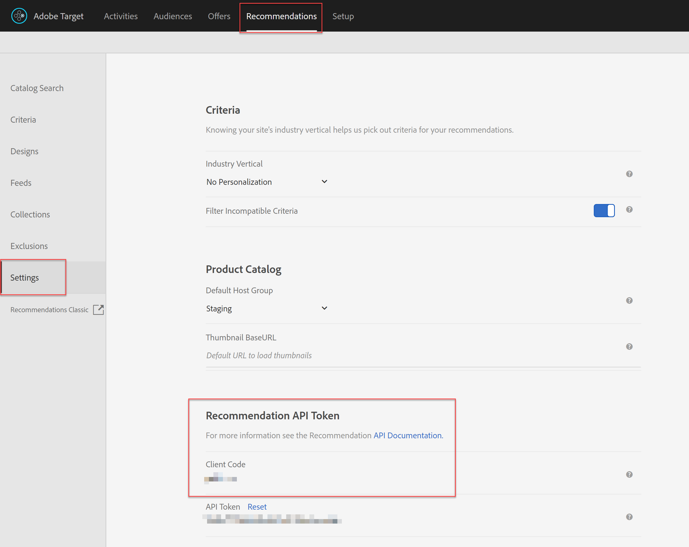
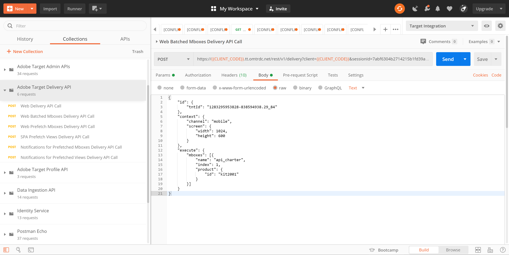

# Delivery API を使用したRecommendationsの取得

Adobe TargetおよびAdobe Target Recommendations API を使用して Web ページに応答を配信できますが、アプリ、画面、コンソール、E メール、キオスク、その他のディスプレイデバイスを含む、HTMLベース以外のエクスペリエンスでも使用できます。 つまり、Target ライブラリや JavaScript を使用できない場合、 [Target 配信 API](/help/dev/implement/delivery-api/overview.md) では、引き続き様々な Target 機能にアクセスして、パーソナライズされたエクスペリエンスを提供できます。

>[!NOTE]
>
>実際のレコメンデーション（推奨商品または品目）を含むコンテンツを要求する場合は、Target Delivery API を使用します。

レコメンデーションを取得するには、適切なコンテキスト情報を使用してAdobe Target Delivery API のPOST呼び出しを送信します。これには、ユーザー ID（ユーザーの最近表示された項目などのプロファイル固有のレコメンデーションで使用）、関連する mbox 名、mbox パラメーター、プロファイルパラメーター、その他の属性が含まれます。 応答には、推奨される entity.ids（および他のエンティティデータを含む場合もあります）が JSON 形式またはHTML形式で含まれ、デバイスに表示できます。

The [配信 API](/help/dev/implement/delivery-api/overview.md) Adobe Targetの場合は、標準の Target リクエストで提供される既存の機能をすべて公開します。

Delivery API は次の操作を実行します。

* 場所とオーディエンスのエクスペリエンスまたはオファーを RESTful な方法で取得できます。
* 認証が不要です。
* POST のみ。
* Cookie やリダイレクト呼び出しを処理しません。
* 「ユーザーの役割」を必要とせず、認識もしません。 単に Target のエッジサーバーに対してコンテンツやレポートイベントを取得します。

Delivery API を使用して Target エクスペリエンス（レコメンデーションを含む）を配信するには、次の手順に従います。

1. （Visual Experience Composer ではなく）フォームベースのコンポーザーを使用して、Target アクティビティ (A/B、XT、AP またはRecommendations) を作成します。
1. Delivery API を使用して、先ほど作成した Target アクティビティによって生成されたリクエストに対する応答を取得します。

&lt;!— Q：これに BOTH の手順が必要なのはなぜですか。 mbox に対してフォームベースのレコメンデーションが定義されている場合、結果を取得するための Delivery API のステップを備えているという点やメリットは何ですか。 フォームベースの Rec から宛先デバイスに結果を配信できないのはなぜですか…?? A：以下の使用例を参照してください。結果を表示する前に保留中の結果を「切り取る」必要がある場合です。 例えば、在庫レベルとのリアルタイムの比較などです。 --->

## フォームベースの Experience Composer を使用したレコメンデーションの作成

Delivery API で使用できるレコメンデーションを作成するには、 [フォームベースのコンポーザー](https://experienceleague.adobe.com/docs/target/using/experiences/form-experience-composer.html).

1. 最初に、レコメンデーションで使用する JSON ベースのデザインを作成して保存します。 サンプルの JSON と、フォームベースのアクティビティを設定する際に JSON 応答を返す方法に関する背景情報については、 [レコメンデーションデザインの作成](https://experienceleague.adobe.com/docs/target/using/recommendations/recommendations-design/create-design.html). この例では、デザインの名前はです。 *単純な JSON です。*
   

1. Target で、に移動します。 **[!UICONTROL アクティビティ]** > **[!UICONTROL アクティビティを作成]** > **[!UICONTROL Recommendations]**&#x200B;を選択し、「 **[!UICONTROL フォーム]**.

   

1. プロパティを選択し、 **[!UICONTROL 次へ]**.
1. ユーザーがレコメンデーションの応答を受け取る場所を定義します。 次の例では、という名前の場所を使用しています。 *api_charter*. 以前に作成した、という名前の JSON ベースのデザインを選択します。 *単純な JSON です。*
   
1. レコメンデーションを保存し、アクティブ化します。 結果が生成されます。 [結果の準備が整ったら](https://experienceleague.adobe.com/docs/target/using/recommendations/recommendations-activity/previewing-and-launching-your-recommendations-activity.html)に値を入力しない場合は、Delivery API を使用してそれらを取得できます。

## Delivery API の使用

の構文 [配信 API](/help/dev/implement/delivery-api/overview.md) 次に該当：

`POST https://{{CLIENT_CODE}}.tt.omtrdc.net/rest/v1/delivery`

1. クライアントコードは必須です。 クライアントコードは、 Adobe Targetで **[!UICONTROL Recommendations]** > **[!UICONTROL 設定]**. 次の点に注意してください。 **クライアントコード** 値を **レコメンデーション API トークン** 」セクションに入力します。
   
1. クライアントコードを入手したら、Delivery API 呼び出しを作成します。 次の例は、 **[!UICONTROL Web のバッチ処理された mbox Delivery API 呼び出し]** 指定された [配信 API Postmanコレクション](../../implement/delivery-api/overview.md/#section/Getting-Started/Postman-Collection)を設定し、関連する変更をおこないます。 次に例を示します。
   * の **ブラウザー** および **住所** オブジェクトが **本文**( 非HTMLの使用例には必要ないため )
   * *api_charter* は、この例ではロケーション名として表示されます。
   * entity.id が指定されているので、このレコメンデーションはコンテンツの類似性に基づいています。この場合は、現在の項目キーを Target に渡す必要があります。
     
必ずクエリパラメーターを正しく設定してください。 例えば、必ず `{{CLIENT_CODE}}` 必要に応じて。 &lt;!— Q：更新された呼び出し構文では、entity.id は、以前のバージョンと同様に、mboxParameter ではなく profileParameter として表示されます。 ---> &lt;!— Q：古い画像  付属の古いテキスト「このレコメンデーションは、mboxParameters 経由で送信された entity.id に基づく、コンテンツ類似製品に基づいています。」 —>
     
1. リクエストを送信します。 これは、 *api_charter* 場所：アクティブなレコメンデーションが実行され、JSON デザインで定義されており、レコメンデーションされたエンティティのリストを出力します。
1. JSON デザインに基づいて応答を受け取ります。
   
応答には、キー ID と、レコメンデーションエンティティのエンティティ ID が含まれます。

この方法で Delivery API をRecommendationsと共に使用すると、HTML以外のデバイスで訪問者にレコメンデーションを表示する前に、追加の手順を実行できます。 例えば、Delivery API からの応答を使用して、最終結果を表示する前に、別のシステム（CMS、PIM、e コマースプラットフォームなど）からエンティティ属性の詳細（在庫、価格、評価など）をリアルタイムで追加検索できます。

このガイドで概要を説明しているアプローチを使用すると、Target からの応答を活用してパーソナライズされたレコメンデーションを提供するための任意のアプリケーションを取得できます。

## 実装例

以下のリソースは、HTMLに重点を置いていない様々な実装の例を示しています。 関連するシステムとデバイスにより、すべての実装が一意になることに注意してください。

| リソース | 詳細 |
| --- | --- |
| [Adobe Target Everywhere - Server 側または IoT での実装](https://expleague.azureedge.net/labs/L733/index.html) | Adobe Targetのサーバー側 API を利用した React アプリケーションの実践的な操作を提供するAdobe Summit2019 Lab。 |
| [AdobeSDK を使用しないモバイルアプリでのAdobe Target](https://community.tealiumiq.com/t5/Universal-Data-Hub/Adobe-Target-in-a-Mobile-App-Without-the-Adobe-SDK/ta-p/26753) | このガイドでは、AdobeSDK をインストールせずにモバイルアプリでAdobe Targetをセットアップする方法を説明します。 このソリューションでは、Tealium SDK Web ビューと Remote Commands モジュールを使用して、Adobe訪問者 API(Experience Cloud) およびAdobe Target API にリクエストを送受信します。 |
| [Target API のExperience Platform Launchと実装での Target 拡張機能の設定](https://developer.adobe.com/client-sdks/documentation/adobe-target/) | Experience Platform Launchで Target 拡張機能を設定し、アプリに Target 拡張機能を追加し、アクティビティのリクエスト、オファーのプリフェッチ、ビジュアルプレビューモードの開始をおこなうための Target API を実装する手順です。 |
| [Adobe Target Node Client](https://www.npmjs.com/package/@adobe/target-nodejs-sdk) | オープンソースの Target Node.js SDK v1.0 |
| [サーバー側の概要](../../implement/server-side/server-side-overview.md) | Adobe Target Server Side Delivery API、Server Side Batch Delivery API、Node.js SDK、Adobe Target Recommendations API に関する情報です。 |
| [Adobe Campaign Content Recommendations in Email](https://medium.com/adobetech/adobe-campaign-content-recommendations-in-email-b51ced771d7f) | Adobe CampaignのAdobe TargetとAdobe I/O Runtimeを介して電子メールでコンテンツレコメンデーションを活用する方法を説明するブログ。 |

## API を使用したRecommendationsの設定の管理

ほとんどの場合、レコメンデーションはAdobe Target UI で設定され、上記の節で説明したような理由で、Target API を介して使用またはアクセスされます。 この UI と API の調整は一般的です。 ただし、API を介してすべてのアクション（セットアップと結果の使用）を実行したい場合があります。 一般的ではありませんが、ユーザーは、 *および* は、レコメンデーションの結果を API を完全に使用して活用します。

我々は、 [前の節](manage-catalog.md) Adobe Target Recommendationsエンティティを管理し、サーバー側で配信する方法 同様に、 [Adobe Developer Console](https://developer.adobe.com/console/home) では、Adobe Targetにログインしなくても条件、プロモーション、コレクション、デザインテンプレートを管理できます。 すべてのRecommendations API の完全なリストは、次のとおりです。 [ここ](http://developers.adobetarget.com/api/recommendations/)ですが、参照用の要約を次に示します。

| リソース | 詳細 |
| --- | --- |
| [コレクション](http://developers.adobetarget.com/api/recommendations/#tag/Collections) | コレクションのリスト、作成、取得、編集、削除を行います。 |
| [条件](http://developers.adobetarget.com/api/recommendations/#tag/Criteria) | 条件のリストと取得。 |
| [デザイン](http://developers.adobetarget.com/api/recommendations/#tag/Designs) | デザインのリスト、作成、取得、編集、削除、検証を行います。 |
| [エンティティ](http://developers.adobetarget.com/api/recommendations/#tag/Entities) | エンティティを保存、削除、取得します。 |
| [プロモーション](http://developers.adobetarget.com/api/recommendations/#tag/Promotions) | プロモーションのリスト、作成、取得、編集、削除を行います。 |
| [カテゴリ条件](http://developers.adobetarget.com/api/recommendations/#tag/Category-Criteria) | カテゴリ条件のリスト、作成、取得、編集、削除を行います。 |
| [カスタム条件](http://developers.adobetarget.com/api/recommendations/#tag/Custom-Criteria) | カスタム条件のリスト、作成、取得、編集および削除を行います。 |
| [項目条件](http://developers.adobetarget.com/api/recommendations/#tag/Item-Criteria) | 項目基準のリスト、作成、取得、編集、削除を行います。 |
| [人気度の条件](http://developers.adobetarget.com/api/recommendations/#tag/Popularity-Criteria) | 人気度条件のリスト、作成、取得、編集および削除を行います。 |
| [プロファイル属性条件](http://developers.adobetarget.com/api/recommendations/#tag/Profile-Attribute-Criteria) | プロファイル属性条件のリスト、作成、取得、編集、削除を行います。 |
| [最近の条件](http://developers.adobetarget.com/api/recommendations/#tag/Recent-Criteria) | 最近の条件のリスト、作成、取得、編集、削除を行います。 |
| [シーケンス条件](http://developers.adobetarget.com/api/recommendations/#tag/Sequence-Criteria) | シーケンス条件のリスト、作成、取得、編集および削除を行います。 |

## リファレンスドキュメント

* [Adobe Target Delivery API ドキュメント](/help/dev/implement/delivery-api/overview.md)
* [Recommendations とメールの統合](https://experienceleague.adobe.com/docs/target/using/recommendations/recommendations-faq/integrating-recs-email.html)

## 概要とレビュー

おめでとうございます。このガイドでは、以下の方法を学習しました。
* [Recommendations API を使用したカタログの管理](manage-catalog.md)
* [Recommendations API を使用したカスタム条件の管理](manage-custom-criteria.md)
* [Recommendationsでの Delivery API の使用](fetch-recs-server-side-delivery-api.md)
