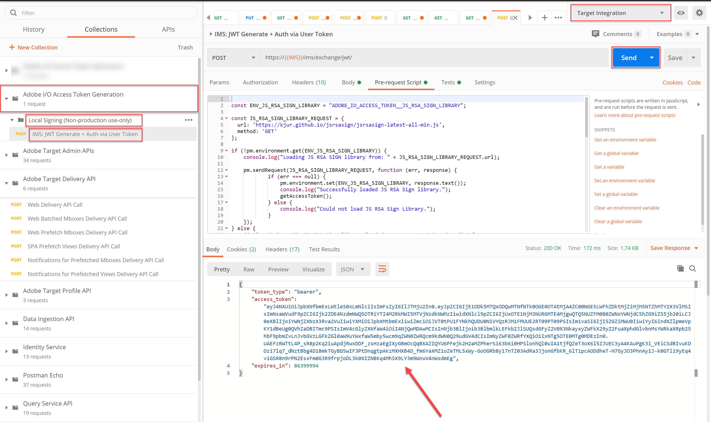
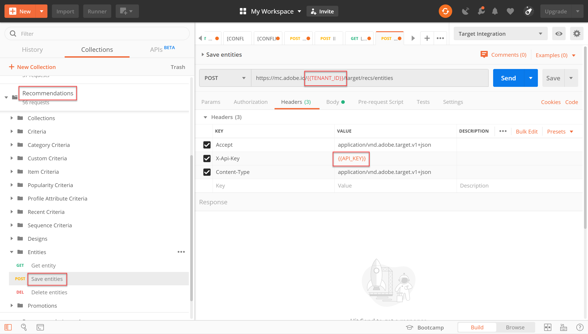
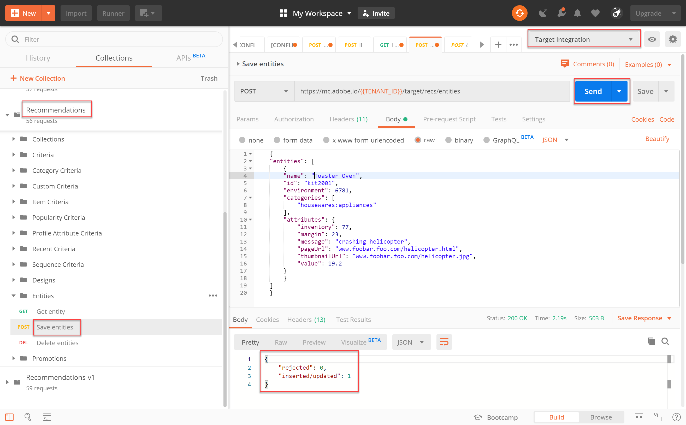
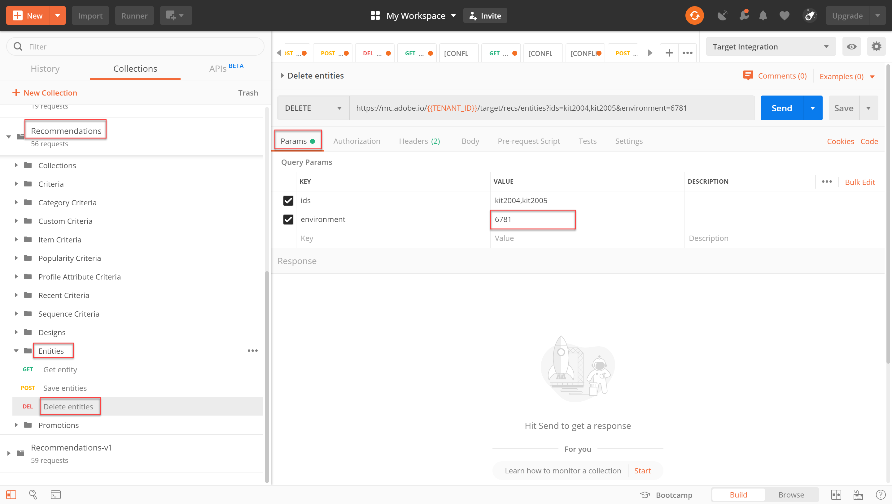
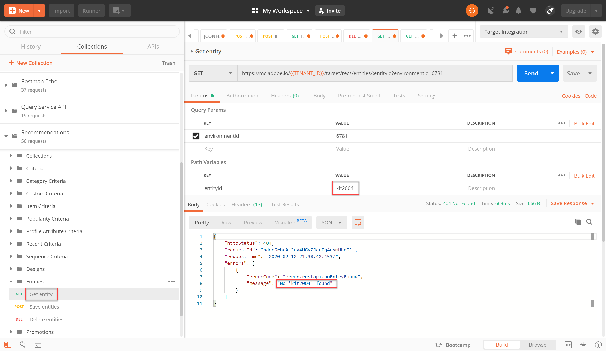

# APIを使用したレコメンデーションカタログの管理

Recommendations API](/help/dev/before-administer/recs-api/overview.md#prerequisites)を使用するための[要件を満たしていることを確認しながら、JWT認証フローを使用して[ アクセストークン ](/help/dev/before-administer/configure-authentication.md)を生成し、[Adobe Developer Console](https://developer.adobe.com/console/home)で[!DNL Adobe Target]管理APIを使用する方法を学習しました。

[Recommendations API](https://developer.adobe.com/target/administer/recommendations-api/)を使用して、レコメンデーションカタログ内の項目を追加、更新、または削除できるようになりました。 その他のAdobe Target管理APIと同様に、Recommendations APIには認証が必要です。

>[!NOTE]
>
>認証のためにアクセストークンを更新する必要がある場合は、24時間後に有効期限が切れるため、**[!UICONTROL IMS: JWT Generate + Auth via User Token]** リクエストを送信します。 手順については、[Adobe API認証の設定](../configure-authentication.md)を参照してください。



続行する前に、[Recommendations Postman コレクション ](https://developer.adobe.com/target/administer/recommendations-api/#section/Postman)を入手してください。

## エンティティを保存APIを使用したアイテムの作成と更新

CSV製品フィードまたは製品ページで実行されるTarget リクエストではなく、APIを使用してRecommendations製品データベースにデータを入力するには、[ エンティティを保存API](https://developer.adobe.com/target/administer/recommendations-api/#operation/saveEntities)を使用します。 このリクエストは、単一のTarget環境の項目を追加または更新します。 構文は次のとおりです。

```
POST https://mc.adobe.io/{{TENANT_ID}}/target/recs/entities
```

例えば、特定のしきい値（在庫や価格のしきい値など）を満たした場合に、これらの項目にフラグを立てて推奨されないようにするために、エンティティを保存を使用して項目を更新できます。

1. **[!UICONTROL Target]** > **[!UICONTROL Setup]** > **[!UICONTROL Hosts]** > **[!UICONTROL CONTROL Environments]**&#x200B;に移動して、項目を追加または更新するTarget環境IDを取得します。

   

1. `TENANT_ID`と`API_KEY`が、以前に確立されたPostman環境変数を参照していることを確認します。 以下の画像を使用して比較してください。 必要に応じて、API リクエストのヘッダーとパスを、以下の画像のヘッダーとパスと一致するように変更します。

   

1. JSONを&#x200B;**raw** コードとして&#x200B;**Body**&#x200B;に入力します。 `environment`変数を使用して、環境IDを指定することを忘れないでください。 （以下の例では、環境IDは6781です）。

   

   以下は、entity.id kit2001をToaster Oven製品の関連するエンティティ値と共に環境6781に追加するサンプル JSONです。

   ```
       {
       "entities": [{
               "name": "Toaster Oven",
               "id": "kit2001",
               "environment": 6781,
               "categories": [
                   "housewares:appliances"
               ],
               "attributes": {
                   "inventory": 77,
                   "margin": 23,
                   "message": "crashing helicopter",
                   "pageUrl": "www.foobar.foo.com/helicopter.html",
                   "thumbnailUrl": "www.foobar.foo.com/helicopter.jpg",
                  "value": 19.2
               }
           }]
       }
   ```

1. 「**[!UICONTROL 送信]**」をクリックします。 次の応答が返されます。

   

   JSON オブジェクトは、複数の製品を送信するように拡張できます。 例えば、このJSONは2つのエンティティを指定します。

   ```
       {
           "entities": [{
                   "name": "Toaster Oven",
                   "id": "kit2001",
                   "environment": 6781,
                   "categories": [
                       "housewares:appliances"
                   ],
                   "attributes": {
                       "inventory": 89,
                       "margin": 11,
                       "message": "Toaster Oven",
                       "pageUrl": "www.foobar.foo.com/helicopter.html",
                       "thumbnailUrl": "www.foobar.foo.com/helicopter.jpg",
                       "value": 102.5
                   }
               },
               {
                   "name": "Blender",
                   "id": "kit2002",
                   "environment": 6781,
                   "categories": [
                       "housewares:appliances"
                   ],
                   "attributes": {
                       "inventory": 36,
                       "margin": 5,
                       "message": "Blender",
                       "pageUrl": "www.foobar.foo.com/helicopter.html",
                       "thumbnailUrl": "www.foobar.foo.com/helicopter.jpg",
                       "value": 54.5
                   }
               }
           ]
       }
   ```

1. 今度はお前の番だ！ **[!UICONTROL エンティティを保存]** APIを使用して、次の項目をカタログに追加します。 上記のサンプル JSONを出発点として使用します。 （追加のエンティティを含めるようにJSONを拡張する必要があります）。

   

最後の2つは属していないようです。 **[!UICONTROL Get Entity]** APIを使用して確認し、必要に応じて&#x200B;**[!UICONTROL Delete Entities]** APIを使用して削除します。

## Get Entity APIを使用した項目の詳細の取得

既存の項目の詳細を取得するには、[Get Entity API](https://developer.adobe.com/target/administer/recommendations-api/#operation/getEntity)を使用します。 構文は次のとおりです。

```
GET https://mc.adobe.io/{{TENANT_ID}}/target/recs/entities/[entity.id]
```

エンティティの詳細は、一度に1つのエンティティに対してのみ取得できます。 「エンティティを取得」を使用して、カタログ内で予定どおりに更新が行われたことを確認したり、カタログの内容を監査したりできます。

1. API リクエストで、変数`entityId`を使用してエンティティ IDを指定します。 次の例では、entityId=kit2004のエンティティの詳細を返します。

   

1. `TENANT_ID`と`API_KEY`が、以前に確立されたPostman環境変数を参照していることを確認します。 以下の画像を使用して比較してください。 必要に応じて、API リクエストのヘッダーとパスを、以下の画像のヘッダーとパスと一致するように変更します。

   

1. リクエストを送信します。

   
上記の例に示すように、エンティティが見つからなかったというエラーが表示された場合は、リクエストを正しいTarget環境に送信していることを確認してください。


   >[!NOTE]
   >
   >環境が明示的に指定されていない場合、「エンティティを取得」では、[ デフォルト環境](https://experienceleague.adobe.com/docs/target/using/administer/environments.html)のみからエンティティを取得しようとします。 デフォルト環境以外の環境から取得する場合は、環境IDを指定する必要があります。

1. 必要に応じて、`environmentId` パラメーターを追加し、リクエストを再送信します。

   

1. 別の&#x200B;**[!UICONTROL Get Entity]** リクエストを送信します。今回は、entityId=kit2005のエンティティを検査します。

   

これらのエンティティをカタログから削除する必要があるとします。 **[!UICONTROL エンティティの削除]** APIを使用します。

## エンティティを削除APIを使用した項目の削除

カタログから項目を削除するには、[ エンティティを削除API](https://developer.adobe.com/target/administer/recommendations-api/#operation/deleteEntities)を使用します。 構文は次のとおりです。

```
DELETE https://mc.adobe.io/{{TENANT_ID}}/target/recs/entities?ids=[comma-delimited-entity-ids]&environment=[environmentId]
```

>[!WARNING]
>
>エンティティを削除APIは、指定したIDで参照されているエンティティを削除します。 エンティティ IDが指定されていない場合、指定された環境内のすべてのエンティティが削除されます。 環境IDが指定されていない場合、エンティティはすべての環境から削除されます。 慎重に使用してください。

1. **[!UICONTROL Target]** > **[!UICONTROL Setup]** > **[!UICONTROL Hosts]** > **[!UICONTROL Environments]**&#x200B;に移動して、項目を削除するTarget環境IDを取得します。

   

1. API リクエストで、構文`&ids=[comma-delimited-entity-ids]` （クエリパラメーター）を使用して、削除するエンティティのエンティティ IDを指定します。 複数のエンティティを削除する場合は、コンマを使用してIDを分離します。

   

1. 構文`&environment=[environmentId]`を使用して環境IDを指定します。指定しないと、すべての環境のエンティティが削除されます。

   

1. `TENANT_ID`と`API_KEY`が、以前に確立されたPostman環境変数を参照していることを確認します。 以下の画像を使用して比較してください。 必要に応じて、API リクエストのヘッダーとパスを、以下の画像のヘッダーとパスと一致するように変更します。

   

1. リクエストを送信します。

   

1. **[!UICONTROL Get Entity]**&#x200B;を使用して結果を確認します。削除されたエンティティが見つかりません。

   

   

おめでとうございます。 Recommendations APIを使用して、カタログ内のエンティティの詳細を作成、更新、削除、取得できるようになりました。 次の節では、カスタム条件の管理方法について説明します。

<!-- [Next "Manage Custom Criteria" >](manage-custom-criteria.md) -->
