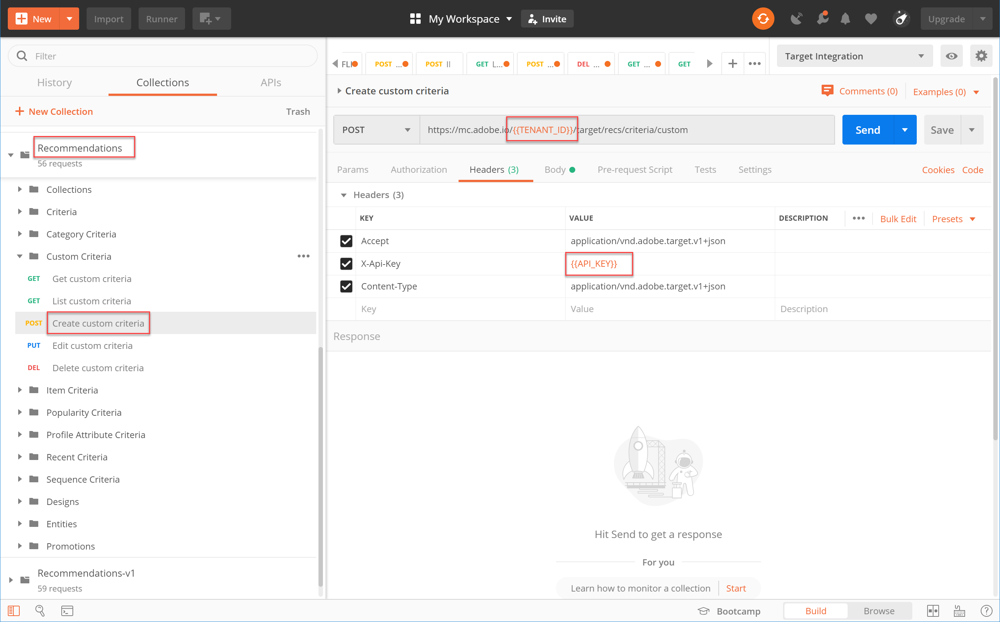
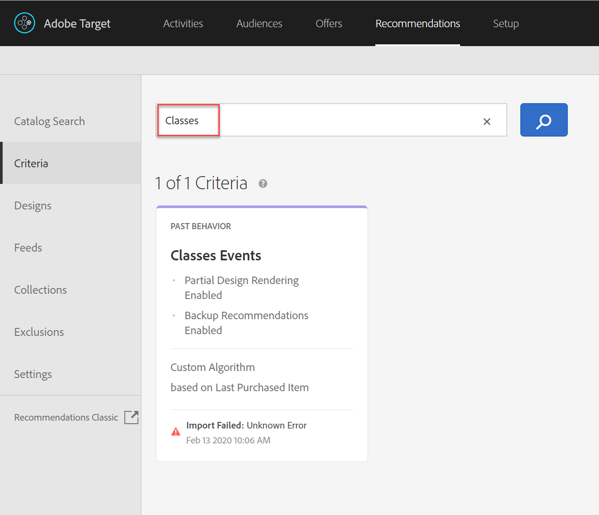
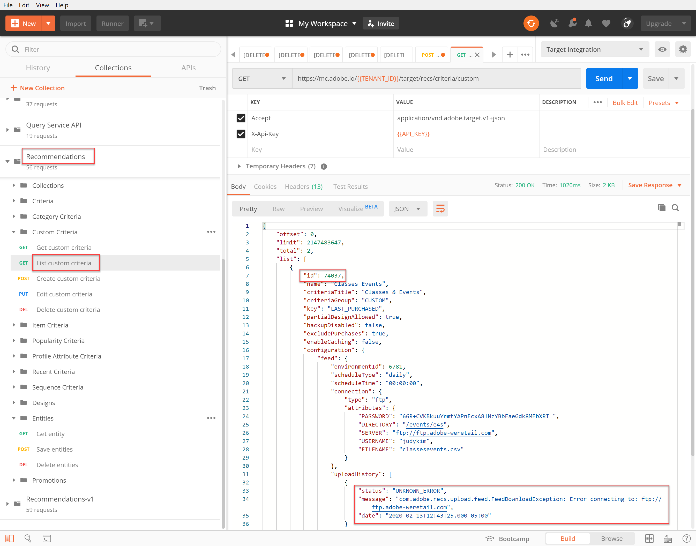
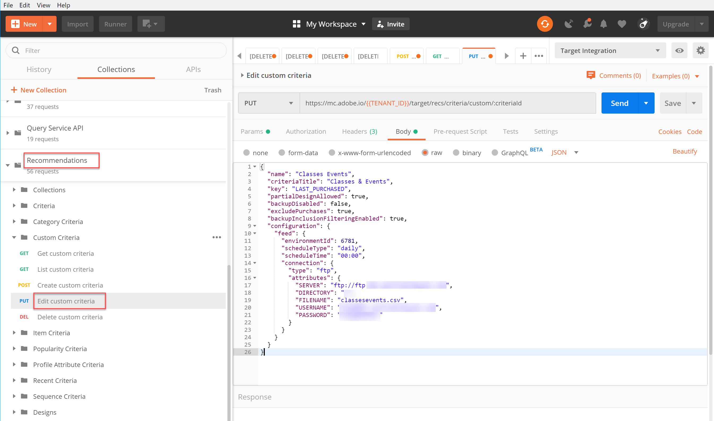
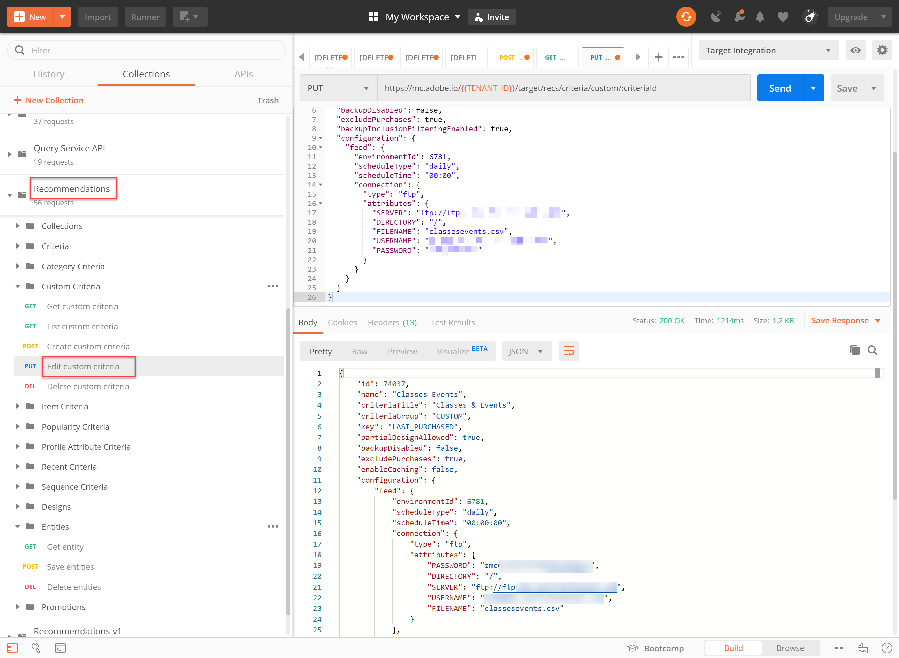
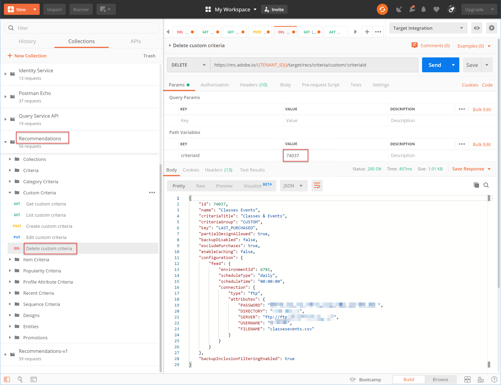
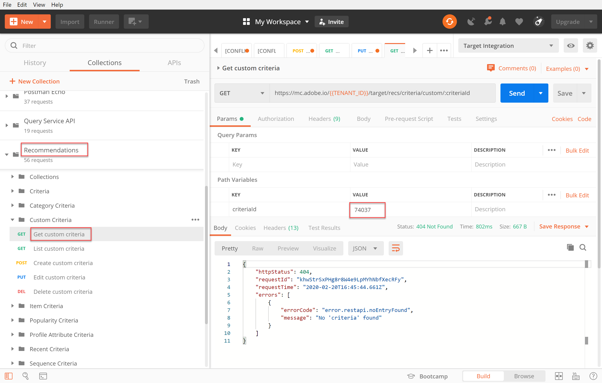

# カスタム条件を管理

Recommendationsが提供するアルゴリズムが、プロモーションする特定の項目を表示できない場合があります。 このような場合、カスタム基準を使用すると、特定の主要項目またはカテゴリに対して特定の推奨項目のセットを配信できます。

カスタム基準を作成するには、キー項目またはカテゴリと推奨項目の間に目的のマッピングを定義して読み込みます。 このプロセスについては、[ カスタム条件ドキュメント ](https://experienceleague.adobe.com/docs/target/using/recommendations/criteria/recommendations-csv.html)を参照してください。 このドキュメントで説明しているように、Target ユーザーインターフェイス（UI）を使用して、カスタム条件を作成、編集、削除できます。 ただし、Targetには、カスタム条件をより詳細に管理できる一連のカスタム条件APIも用意されています。

>[!WARNING]
>
>カスタム条件の場合は、APIを使用して特定のカスタム条件に対するすべてのアクション（作成、編集、削除）を実行するか、UIを使用してすべてのアクション（作成、編集、削除）を実行します。 UIとAPIを組み合わせてカスタム条件を管理すると、情報の競合や予期しない結果につながる可能性があります。 例えば、UIでカスタム条件を作成し、API経由で編集しても、バックエンドで更新されますが、API経由で表示されるように、UIで更新が反映されません。

## カスタム条件を作成

[ カスタム条件を作成API](https://developer.adobe.com/target/administer/recommendations-api/#operation/createCriteriaCustom)を使用してカスタム条件を作成するには、構文は次のとおりです。

`POST https://mc.adobe.io/{{TENANT_ID}}/target/recs/criteria/custom`

>[!WARNING]
>
>この演習で説明しているように、カスタム条件を作成APIを使用して作成されたカスタム条件は、UIに表示され、永続化されます。 UIから編集または削除することはできません。 API **を介して**&#x200B;編集または削除できますが、いずれにしても、Target UIに引き続き表示されます。 UIの編集または削除のオプションを維持するには、「カスタム条件を作成」 APIを使用するのではなく、[ ドキュメント ](https://experienceleague.adobe.com/docs/target/using/recommendations/criteria/recommendations-csv.html)ごとにUIを使用してカスタム条件を作成します。

上記の警告を読み、後でUIから削除できない新しいカスタム条件の作成に慣れた後にのみ、次の手順に進みます。

1. **[!UICONTROL Create custom criteria]**&#x200B;で`TENANT_ID`と`API_KEY`が以前に確立されたPostman環境変数を参照していることを確認します。 以下の画像を使用して比較してください。

   

1. カスタム条件CSV ファイルの場所を定義する&#x200B;**Body**&#x200B;を&#x200B;**raw** JSONとして追加します。 [ カスタム条件を作成API](https://developer.adobe.com/target/administer/recommendations-api/#operation/getAllCriteriaCustom)のドキュメントで提供されている例をテンプレートとして使用し、必要に応じて`environmentId`およびその他の値を指定します。 この例では、キーとしてLAST_PURCHASEDを使用します。

   

1. リクエストを送信し、作成したカスタム条件の詳細を含む応答を確認します。

   

1. カスタム条件が作成されたことを確認するには、Adobe Target内で&#x200B;**[!UICONTROL Recommendations > Criteria]**&#x200B;に移動し、名前で条件を検索するか、次の手順で&#x200B;**[!UICONTROL List Custom Criteria API]**&#x200B;を使用します。

   

この場合、エラーがあります。 **[!UICONTROL リストのカスタム条件API]**&#x200B;を使用して、カスタム条件をより詳しく調べて、エラーを調査してみましょう。

## カスタム条件のリスト

すべてのカスタム条件のリストとそれぞれの詳細を取得するには、[ カスタム条件のリスト API](https://developer.adobe.com/target/administer/recommendations-api/#operation/getAllCriteriaCustom)を使用します。 構文は次のとおりです。

`GET https://mc.adobe.io/{{TENANT_ID}}/target/recs/criteria/custom`

1. 以前と同様に`TENANT_ID`と`API_KEY`を確認し、リクエストを送信します。応答では、カスタム条件IDと、前述のエラーメッセージに関する詳細を確認します。
   

この場合、サーバー情報が正しくないため、エラーが発生しました。つまり、Targetはカスタム条件定義を含むCSV ファイルにアクセスできません。 カスタム基準を編集して、これを修正します。

## カスタム条件を編集

カスタム条件定義の詳細を変更するには、[ カスタム条件を編集API](https://developer.adobe.com/target/administer/recommendations-api/#operation/updateCriteriaCustom)を使用します。 構文は次のとおりです。

`POST https://mc.adobe.io/{{TENANT_ID}}/target/recs/criteria/custom/:criteriaId`

1. 以前と同様に、`TENANT_ID`と`API_KEY`を確認します。
   

1. 編集する（単一）カスタム基準の基準IDを指定します。
   

1. Bodyで、更新されたJSONに正しいサーバー情報を入力します。（この手順では、アクセスできるサーバーへのFTP アクセスを指定します）。
   

1. リクエストを送信し、応答をメモします。
   

**[!UICONTROL カスタム条件を取得API]**&#x200B;を使用して、更新されたカスタム条件の成功を確認します。

## カスタム条件を取得

特定のカスタム条件のカスタム条件の詳細を表示するには、[ カスタム条件を取得API](https://developer.adobe.com/target/administer/recommendations-api/#operation/getCriteriaCustom)を使用します。 構文は次のとおりです。

`GET https://mc.adobe.io/{{TENANT_ID}}/target/recs/criteria/custom/:criteriaId`

1. 詳細を取得するカスタム条件の条件IDを指定します。リクエストを送信し、応答を確認します。
   
1. 成功の検証：（このケースでは、これ以上FTP エラーがないことを確認します）。
   
1. （オプション）更新がUIに正確に反映されていることを確認します。
   

## カスタム条件の削除

前述の条件IDを使用して、[ カスタム条件を削除API](https://developer.adobe.com/target/administer/recommendations-api/#operation/deleteCriteriaCustom)を使用して、カスタム条件を削除します。 構文は次のとおりです。

`DELETE https://mc.adobe.io/{{TENANT_ID}}/target/recs/criteria/custom/:criteriaId`

1. 削除する（単一）カスタム条件の条件IDを指定します。**[!UICONTROL 送信]**をクリックします。
   

1. カスタム条件を取得を使用して、条件が削除されたことを確認します。
   
この場合、404 エラーは、削除された条件が見つからないことを示します。

>[!NOTE]
>
>この条件は、カスタム条件を作成APIを使用して作成されたため、削除されたとしても、Target UIから削除されることはありません。

おめでとうございます。 Recommendations APIを使用して、カスタム条件の詳細を作成、リスト化、編集、削除、取得できるようになりました。 次のセクションでは、Target Delivery APIを使用してレコメンデーションを取得します。

<!-- [Next "Fetch Recommendations with the Server-side Delivery API" >](fetch-recs-server-side-delivery-api.md) -->
