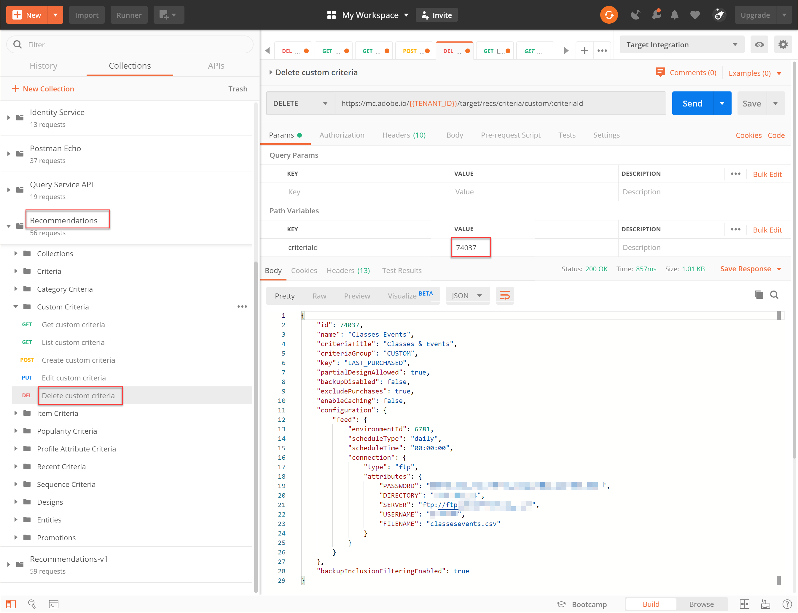

# カスタム条件の管理

Recommendationsが提供するアルゴリズムは、プロモーションしたい特定の項目を表示できない場合があります。 このような場合、カスタム条件を使用すると、特定のキー品目またはカテゴリに対して、レコメンデーション品目の特定のセットを配信できます。

カスタム条件を作成するには、主要品目またはカテゴリとレコメンデーション品目の間の必要なマッピングを定義してインポートします。 このプロセスについては、 [カスタム条件ドキュメント](https://experienceleague.adobe.com/docs/target/using/recommendations/criteria/recommendations-csv.html). このドキュメントで述べたように、Target ユーザーインターフェイス (UI) を使用して、カスタム条件を作成、編集および削除できます。 ただし、Target には、カスタム条件をより詳細に管理するための一連のカスタム条件 API も用意されています。

>[!WARNING]
>
>カスタム条件の場合は、API を使用して特定のカスタム条件に対してすべてのアクション（作成、編集、削除）を実行するか、UI を使用してすべてのアクション（作成、編集、削除）を実行します。 UI と API を組み合わせてカスタム条件を管理すると、情報が競合したり、予期しない結果が生じる場合があります。 例えば、UI でカスタム条件を作成し、API で編集した場合、API で表示されるように、バックエンドで更新される場合でも、UI での更新は反映されません。

## カスタム条件の作成

を使用してカスタム条件を作成するには [カスタム条件 API の作成](https://developer.adobe.com/target/administer/recommendations-api/#operation/createCriteriaCustom)の場合の構文は次のとおりです。

`POST https://mc.adobe.io/{{TENANT_ID}}/target/recs/criteria/custom`

>[!WARNING]
>
>カスタム条件の作成 API を使用して作成したカスタム条件は、この演習で説明するように、UI に表示され、そこで保持されます。 UI で編集や削除を行うことはできません。 編集または削除できます **API を使用**&#x200B;どちらの場合も、引き続き Target UI に表示されます。 UI からの編集または削除のオプションを維持するには、次の手順に従って UI を使用してカスタム条件を作成します。 [ドキュメント](https://experienceleague.adobe.com/docs/target/using/recommendations/criteria/recommendations-csv.html)（カスタム条件の作成 API を使用するのとは異なります）。

上記の警告を読んだ後に次の手順を実行し、UI から削除できない新しいカスタム条件を作成することが適切です。

1. 検証 `TENANT_ID` および `API_KEY` 対象： **[!UICONTROL カスタム条件の作成]** 前に確立したPostman環境変数を参照します。 比較には、以下の画像を使用します。

   

1. を追加します。 **本文** as **raw** カスタム条件の CSV ファイルの場所を定義する JSON。 次に示す例を使用します： [カスタム条件 API の作成](https://developer.adobe.com/target/administer/recommendations-api/#operation/getAllCriteriaCustom) テンプレートとしてのドキュメント ( `environmentId` および必要に応じてその他の値。 この例では、キーとして LAST_PURCHASED を使用します。

   

1. リクエストを送信し、作成したカスタム条件の詳細を含む応答を観察します。

   

1. カスタム条件が作成されたことを確認するには、Adobe Target内で、 **[!UICONTROL Recommendations /条件]** 名前で条件を検索するか、 **[!UICONTROL カスタム条件 API のリスト]** 次の手順で使用します。

   

この場合、エラーが発生します。 カスタム条件をより詳細に調べ、 **[!UICONTROL カスタム条件 API のリスト]**.

## カスタム条件のリスト

すべてのカスタム条件のリストと各条件の詳細を取得するには、 [カスタム条件 API のリスト](https://developer.adobe.com/target/administer/recommendations-api/#operation/getAllCriteriaCustom). 構文は次のとおりです。

`GET https://mc.adobe.io/{{TENANT_ID}}/target/recs/criteria/custom`

1. 検証 `TENANT_ID` および `API_KEY` 前と同様に、リクエストを送信します。 応答では、カスタム条件 ID と、前述のエラーメッセージに関する詳細をメモします。
   

この場合、サーバー情報が正しくない、つまり Target がカスタム条件の定義を含む CSV ファイルにアクセスできないことが原因で、エラーが発生していました。 カスタム条件を編集して修正しましょう。

## カスタム条件の編集

カスタム条件定義の詳細を変更するには、 [カスタム条件 API の編集](https://developer.adobe.com/target/administer/recommendations-api/#operation/updateCriteriaCustom). 構文は次のとおりです。

`POST https://mc.adobe.io/{{TENANT_ID}}/target/recs/criteria/custom/:criteriaId`

1. 検証 `TENANT_ID` および `API_KEY`前と同様に。
   

1. 編集する（単一の）カスタム条件の条件 ID を指定します。
   

1. 本文で、更新された JSON に正しいサーバー情報を入力します。 （この手順では、アクセス可能なサーバーへの FTP アクセスを指定します）。
   

1. リクエストを送信し、応答をメモします。
   

次の例では、 **[!UICONTROL カスタム条件 API の取得]**.

## カスタム条件の取得

特定のカスタム条件のカスタム条件の詳細を表示するには、 [カスタム条件 API の取得](https://developer.adobe.com/target/administer/recommendations-api/#operation/getCriteriaCustom). 構文は次のとおりです。

`GET https://mc.adobe.io/{{TENANT_ID}}/target/recs/criteria/custom/:criteriaId`

1. 詳細を取得するカスタム条件の条件 ID を指定します。 リクエストを送信し、応答を確認します。
   
1. 検証が成功しました。 （この場合は、それ以上 FTP エラーがないことを確認します）。
   
1. （オプション）UI に更新が正確に反映されていることを確認します。
   

## カスタム条件の削除

前述の条件 ID を使用して、 [カスタム条件 API の削除](https://developer.adobe.com/target/administer/recommendations-api/#operation/deleteCriteriaCustom). 構文は次のとおりです。

`DELETE https://mc.adobe.io/{{TENANT_ID}}/target/recs/criteria/custom/:criteriaId`

1. 削除する（単一の）カスタム条件の条件 ID を指定します。 「**[!UICONTROL 送信]**」をクリックします。
   

1. カスタム条件の取得を使用して、条件が削除されたことを確認します。
   
この場合、404 エラーが発生すると、削除された条件が見つからないことが示されます。

>[!NOTE]
>
>この条件は Create Custom Criteria API を使用して作成されたので、削除された場合でも、Target UI から削除されません。

おめでとうございます。Recommendations API を使用して、カスタム条件の作成、リスト、編集、削除、詳細の取得をおこなうことができるようになりました。 次の節では、Target Delivery API を使用してレコメンデーションを取得します。

&lt;!— [次：「サーバー側配信 API を使用したRecommendationsの取得」>](fetch-recs-server-side-delivery-api.md) —>
