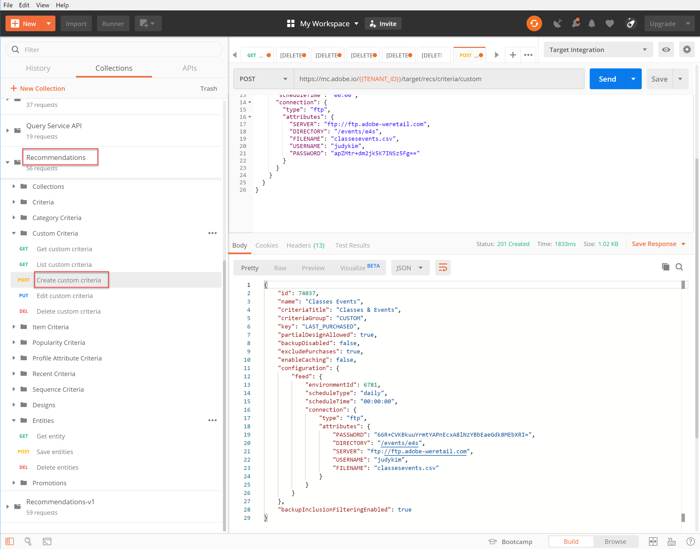
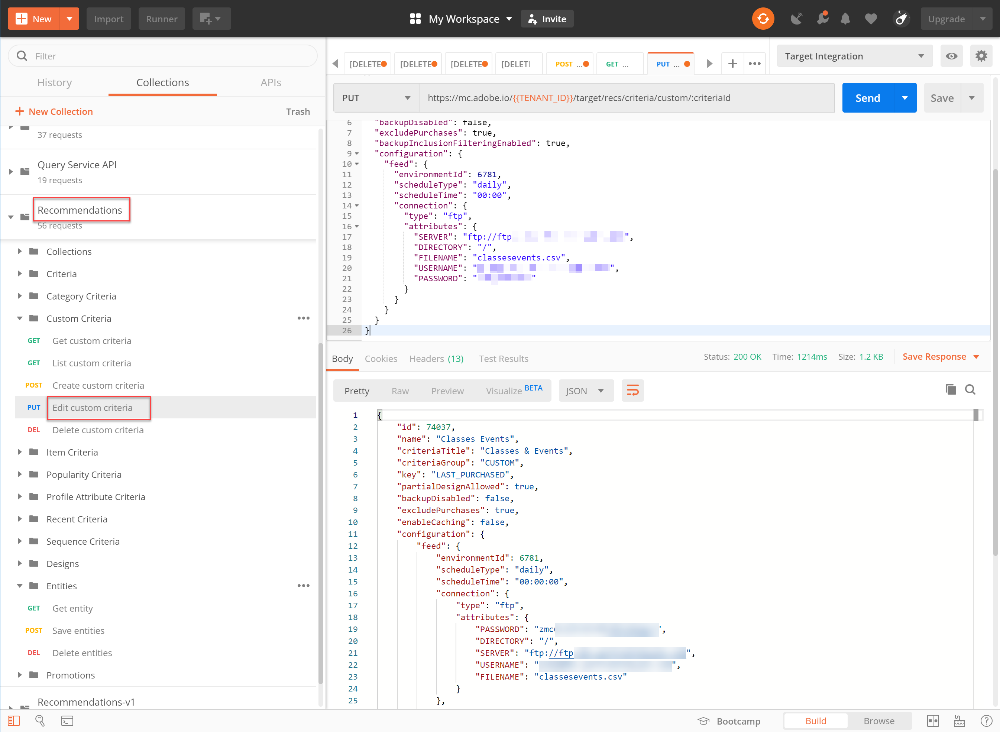

# カスタム条件の管理

Recommendationsが提供するアルゴリズムで、宣伝したい特定の商品を提示できない場合があります。 その場合、カスタム条件は、特定の主要な項目またはカテゴリに対して、推奨される特定の項目セットを配信する方法を提供します。

カスタム条件を作成するには、キー項目またはカテゴリと推奨項目の間の目的のマッピングを定義して読み込みます。 このプロセスについては、[ カスタム条件のドキュメント ](https://experienceleague.adobe.com/docs/target/using/recommendations/criteria/recommendations-csv.html) を参照してください。 このドキュメントで説明しているように、Target ユーザーインターフェイス（UI）を使用してカスタム条件を作成、編集および削除できます。 ただし、Target には、カスタム条件をより詳細に管理できるカスタム条件 API のセットも用意されています。

>[!WARNING]
>
>カスタム条件の場合は、API を使用して、特定のカスタム条件のすべてのアクション（作成、編集、削除）を実行するか、UI を使用してすべてのアクション（作成、編集、削除）を実行します。 UI と API を組み合わせてカスタム条件を管理すると、情報の競合や予期しない結果が発生する可能性があります。 例えば、UI でカスタム条件を作成したあと、API 経由で編集すると、バックエンドで更新され、API 経由で表示される場合でも、UI の更新が反映されません。

## カスタム条件の作成

[ カスタム条件の作成 API](https://developer.adobe.com/target/administer/recommendations-api/#operation/createCriteriaCustom) を使用してカスタム条件を作成するには、次の構文を使用します。

`POST https://mc.adobe.io/{{TENANT_ID}}/target/recs/criteria/custom`

>[!WARNING]
>
>この演習で説明しているように、カスタム条件の作成 API を使用して作成したカスタム条件は UI に表示され、保持されます。 UI から編集または削除することはできません。 **API を使用** して編集または削除できますが、いずれにしても Target UI に引き続き表示されます。 UI からの編集や削除のオプションを維持するには、カスタム条件の作成 API を使用するのではなく、[ ドキュメント ](https://experienceleague.adobe.com/docs/target/using/recommendations/criteria/recommendations-csv.html) に従って、UI を使用してカスタム条件を作成します。

上記の警告を読み、その後 UI から削除できない新しいカスタム条件の作成に慣れてから、次の手順を進めてください。

1. `TENANT_ID` と `API_KEY` を確認し、前 **[!UICONTROL Create custom criteria]** 確立したPostman環境変数を参照します。 比較のために以下の画像を使用してください。

   

1. カスタム条件の CSV ファイルの場所を定義する **raw** JSON として **本文** を追加します。 [ カスタム条件の作成 API](https://developer.adobe.com/target/administer/recommendations-api/#operation/getAllCriteriaCustom) ドキュメントで提供されている例をテンプレートとして使用し、必要に応じて `environmentId` やその他の値を指定します。 この例では、LAST_PURCHASED をキーとして使用します。

   

1. リクエストを送信し、応答を確認します。この応答には、作成したカスタム条件の詳細が含まれます。

   

1. カスタム条件が作成されたことを確認するには、Adobe Target内で **[!UICONTROL Recommendations > Criteria]** に移動して名前で条件を検索するか、次の手順で **[!UICONTROL List Custom Criteria API]** を使用します。

   

この場合、エラーが発生しています。 **[!UICONTROL List Custom Criteria API]** を使用してカスタム条件をさらに詳しく調べ、エラーを調査しましょう。

## カスタム条件のリスト

すべてのカスタム条件のリストと、それぞれの詳細を取得するには、[List Custom Criteria API](https://developer.adobe.com/target/administer/recommendations-api/#operation/getAllCriteriaCustom) を使用します。 構文は次のとおりです。

`GET https://mc.adobe.io/{{TENANT_ID}}/target/recs/criteria/custom`

1. 前と同様に `TENANT_ID` と `API_KEY` を確認し、リクエストを送信します。 応答に、カスタム条件 ID と、前に説明したエラーメッセージに関する詳細をメモします。
   

この場合、サーバー情報が正しくないため、エラーが発生しました。つまり、Target はカスタム条件定義を含む CSV ファイルにアクセスできません。 これを修正するには、カスタム条件を編集します。

## カスタム条件の編集

カスタム条件定義の詳細を変更するには、[Edit Custom Criteria API](https://developer.adobe.com/target/administer/recommendations-api/#operation/updateCriteriaCustom) を使用します。 構文は次のとおりです。

`POST https://mc.adobe.io/{{TENANT_ID}}/target/recs/criteria/custom/:criteriaId`

1. 前と同様に、`TENANT_ID` と `API_KEY` を確認します。
   

1. 編集する（単一の）カスタム条件の条件 ID を指定します。
   

1. 本文で、正しいサーバー情報を含む更新された JSON を指定します。 （この手順では、アクセス可能なサーバーへの FTP アクセスを指定します。）
   

1. リクエストを送信し、応答をメモします。
   

**[!UICONTROL Get Custom Criteria API]** を使用して、更新したカスタム条件が成功したことを確認します。

## カスタム条件の取得

特定のカスタム条件のカスタム条件の詳細を表示するには、[ カスタム条件 API の取得 ](https://developer.adobe.com/target/administer/recommendations-api/#operation/getCriteriaCustom) を使用します。 構文は次のとおりです。

`GET https://mc.adobe.io/{{TENANT_ID}}/target/recs/criteria/custom/:criteriaId`

1. 詳細を取得するカスタム条件の条件 ID を指定します。 リクエストを送信し、応答を確認します。
   
1. 成功を検証します。 （この例では、それ以上 FTP エラーがないことを確認します）。
   
1. （オプション）更新が UI に正確に反映されることを確認します。
   

## カスタム条件の削除

前述の条件 ID を使用して、[ カスタム条件の削除 API](https://developer.adobe.com/target/administer/recommendations-api/#operation/deleteCriteriaCustom) を使用してカスタム条件を削除します。 構文は次のとおりです。

`DELETE https://mc.adobe.io/{{TENANT_ID}}/target/recs/criteria/custom/:criteriaId`

1. 削除する（単一の）カスタム条件の条件 ID を指定します。 **[!UICONTROL Send]** をクリックします。
   

1. 「カスタム条件の取得」を使用して、条件が削除されたことを確認します。
   
この場合、期待される 404 エラーは、削除された条件が見つからないことを示します。

>[!NOTE]
>
>なお、条件は削除されましたが、Target UI からは削除されません。これは、カスタム条件の作成 API を使用して作成されたからです。

おめでとうございます。 Recommendations API を使用して、カスタム条件の作成、リスト化、編集、削除、および詳細の取得を行うことができるようになりました。 次の節では、Target 配信 API を使用してレコメンデーションを取得します。

&lt;!— [ 次に「サーバーサイド配信 API を使用したRecommendationsの取得」 >](fetch-recs-server-side-delivery-api.md) —>
