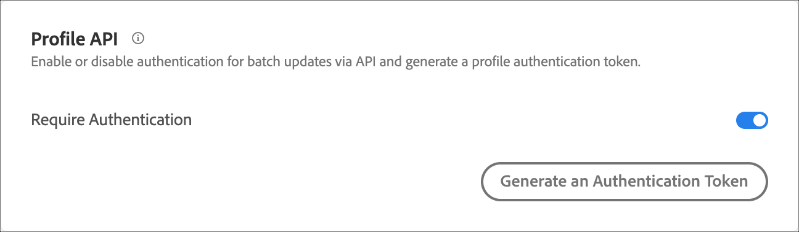

# プロファイル API 設定

次を介した一括更新の認証を有効または無効にします： [!DNL Adobe Target] API を作成し、プロファイル認証トークンを生成します。

[!DNL Adobe Target] では、個々のユーザーごとにプロファイルが作成され、管理されます。このプロファイルは、 [!DNL Target] エッジクラスターに格納され、訪問のたびにリアルタイムで更新されます。 また、API を使用して、プロファイルを個別に、または一括で更新することもできます。

セキュリティ強化のために、バルク更新 API を呼び出す際にリクエストのヘッダーで有効なアクセストークンを渡すことを要求するよう設定できます。

**[!DNL Target] UI で認証を必須に設定し、アクセストークンを生成する手順は次のとおりです。**

1. **[!UICONTROL 管理]**／**[!UICONTROL 実装]**&#x200B;をクリックします。
1. の下 **[!UICONTROL プロファイル API]** 滑らかにする **[!UICONTROL 認証が必要]** 「有効」または「無効」の位置に切り替えます。

   

1. （条件付き）認証要件を有効にした場合、 **[!UICONTROL 新しいプロファイル認証トークンを生成]**.

   

   トークンの有効期限は、残り有効期間ボックスに記載されている日時です。

   認証トークンを生成するには、次のいずれかのユーザー権限が必要です。

   * 管理者の役割、または承認者権限以上がある

     Target Standard のお客様について詳しくは、 [役割と権限の指定](https://experienceleague.adobe.com/docs/target/using/administer/manage-users/users/user-management.html#roles-permissions) in *ユーザー*. [!DNL Target Premium]ユーザーの詳細については、[エンタープライズ権限の設定](https://experienceleague.adobe.com/docs/target/using/administer/manage-users/enterprise/properties-overview.html)を参照してください。

   * ワークスペース／製品プロファイルレベルでの管理者の役割

     Workspaces は[!DNL Target Premium]のお客様のみが利用できます。詳しくは、 [エンタープライズの権限の設定](https://experienceleague.adobe.com/docs/target/using/administer/manage-users/enterprise/properties-overview.html)を参照してください。

   * [!DNL Adobe Target]製品レベルの管理者権限（Sysadmin 権限）

API を使用してプロファイル認証トークンを生成もできます。詳しくは、 [Adobe Target Admin およびプロファイル API ガイド](../../administer/admin-api/admin-api-overview-new.md).

1. トークンをコピーし、リクエストのヘッダーの形式 (「Authorization」:「Bearer」) に含めます。

1. クリック **[!UICONTROL 新しいプロファイル認証トークンを生成]** 必要に応じてトークンを再生成します。

>[!WARNING]
>
>このトークンをリセットすると、現在のトークンを使用した API 呼び出しに失敗します。その場合は、このトークンを使用するすべてのスクリプトとアプリを更新する必要があります。
