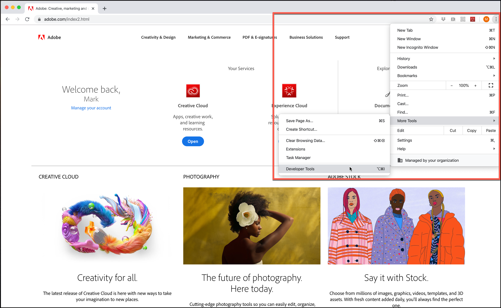

# TLS（Transport Layer Security）暗号化の変更

[!DNL Adobe]と[!DNL Adobe Target]がTLS （Transport Layer Security）を使用して最高のセキュリティ標準を維持し、顧客データの安全性を向上させる方法の変更に関する情報。

Transport Layer Security（TLS）は、ネットワークを介してデータを安全に交換する必要のある Web ブラウザや他のアプリケーションで現在使用されている、最も広く展開されているセキュリティプロトコルです。 アドビは古いプロトコルの廃止を義務付けるセキュリティコンプライアンス標準規格を持っており、最新でセキュアなバージョンを利用するため TLS 1.2 の使用を必須としています。

>[!WARNING]
>
>2020年3月1日をもって、[!DNL Target]では、Visual Experience Composer （VEC）、Enhanced Experience Composer （EEC）、アクティビティ配信、APIなどのTLS 1.1暗号化がサポートされなくなりました。問題を回避するには、TLS 1.2にアップグレードしてください。

この変更が、お客様の顧客のデータやレポートに大きな影響を及ぼすことはないと認識しています。

## 拡張 Experience Composer (EEC) を有効化した Visual Experience Composer (VEC)

TLS 1.2は2020年3月1日時点のデフォルトであり、TLS 1.1はサポートされなくなります。

Adobeでは、お客様をTLS 1.2に段階的に移行します。 ドメインがすでに1.2に準拠している場合は、お客様からの変更を必要とせずにTLS 1.2に移行します。 ほとんどの顧客ドメインは既にTLS 1.2をサポートしていますが、お客様のドメインがTLS 1.2をサポートしていない場合、現在と同様に（2020年3月まで） TLS 1.1にドメインを維持します。

この移行期間中は問題は発生しないはずです。 VECが以前に動作していたサイトの読み込みを停止した場合は、この移行が原因である可能性があることを示すクライアントケアチケットを[開きます](https://experienceleague.adobe.com/docs/target/using/cmp-resources-and-contact-information.html?lang=ja&#reference_ACA3391A00EF467B87930A450050077C)。

ただし、TLS 1.2をサポートしていないTSL 1.1を使用している顧客の1人である場合は、ドメイン/インフラストラクチャをTLS 1.2に移行する計画を立てる必要があります。 引き続き2020年3月1日までTLS 1.1 プロトコルをサポートします。 2020年3月1日以降、[!DNL Target]では、Enhanced Experience Composer機能を使用してVECに使用するTLS 1.1 プロトコルはサポートされません。

今後はすべてのお客様が TLS 1.2 へと移行することを強くお勧めしますが、新規のお客様で TLS 1.2 を&#x200B;*サポートしていない*&#x200B;場合は、拡張 Experience Composer にて TLS 1.1 を利用する必要があることをカスタマーケアまで連絡してください。 ただし、2020年3月1日以降はサポートされないため、TLS 1.2への移行を計画してください。

## アクティビティ配信

2020年3月1日以降、[!DNL Target] サーバーはTLS 1.1をサポートしなくなります。 この変更により、[!DNL Target]台のサーバーは、TLS 1.2以降をサポートしていない古いデバイスまたはweb ブラウザーを持つ訪問者からのリクエストを受け付けなくなります。 この結果、TLS 1.1 のみサポートする（あるいはデフォルトで TLS 1.1 をサポートする）旧型のデバイスやブラウザーは、Adobe Target からアクティビティコンテンツを受け取らないこととなります。 サイトのデフォルトコンテンツがレンダリングされます。

影響を受ける旧型のデバイスおよびブラウザには以下が含まれます。

* Google Chrome（Chrome for Android）バージョン 29以前
* Opera Browser （Opera Mobile） バージョン 12.17以前
* Mozilla Firefox （モバイル版Firefox） バージョン 26以前
* Android 4.3 およびそれ以前のバージョン
* Windows 7 の Internet Explorer 8-10 およびそれ以前のバージョン
* Windows Phone 8.0 の Internet Explorer 10
* Safari 6.0.4/OS X10.8.4 およびそれ以前のバージョン

この変更を計画する場合は、次の点を考慮してください（2020年3月1日の期限は、これらのすべての項目に影響することに注意してください）。

* 準拠しているデバイスやブラウザーが、デフォルトのサイトに対応するように準備されていることを確認してください。
* [!DNL Target] レポートの訪問者数が、訪問者数が大幅に減少する可能性があることに注意してください。
* TLS 1.2をサポートしていない古いデバイスやブラウザーをターゲットにするために、特別に作成したオーディエンスを変更する必要がある場合があります。 デバイスやブラウザーへの配信は機能しなくなります。

サポートされているブラウザーとそのバージョンについて詳しくは、[&#x200B; サポートされているブラウザー](supported-browsers.md)を参照してください。

## [!DNL Adobe Target] API

2020年3月1日以降、[!DNL Target] APIはTLS 1.1暗号化をサポートしなくなります。 API にアクセスするお客様は、この変更による影響の有無を確認してください。

* デフォルト設定でJava 7を使用しているAPI クライアントは、TLS 1.2をサポートするために変更が必要です。 詳しくは、Java Web サイトの「[&#x200B; クライアントエンドポイントのデフォルト TLS プロトコルバージョンの変更：TLS 1.0からTLS 1.2](https://www.java.com/en/configure_crypto.html)」を参照してください。
* Java 8 を使用している API クライアントは、デフォルト設定が TLS 1.2 なので、影響を受けません。
* その他のフレームワークを使用している API クライアントは、TLS 1.2 のサポートについてベンダーにお問い合わせください。

## Experience Cloudソリューションインターフェイスへのアクセス

[!DNL Target] Standard/Premium インターフェイスには既に[最新のweb ブラウザー](supported-browsers.md)が必要なため、問題は予想されません。 Target に接続できない場合は、ブラウザーを最新バージョンにアップグレードしてください。

## ブラウザーが使用するTLS バージョンを確認する方法

Google Chromeを使用してweb サイトのTLS バージョンを確認するには：

1. 影響を受けるweb サイトをChromeで開きます。
1. Chrome メニュー（縦の3つの省略記号）から、その他のツール/開発ツールをクリックします。

   

1. 「セキュリティ」タブを開き、「接続」でTLS バージョン情報を確認します。

   

>[!NOTE]
>
>これらの指示は公開時点で最新であり、変更される可能性があります。 これらの指示が変更された場合は、迅速なインターネット検索が役立ちます。 他のブラウザーにも同様の手順があります。

## TLS バージョン 1.2未満をサポートしているブラウザーでの動作が想定されます

この節では、at.js実装を使用する場合にのみ1.2より前のバージョンのTLSをサポートするブラウザーで期待できることについて説明します。 比較のために、この節では、TLS 1.2をサポートするブラウザーで期待できることについても説明します。

### 中央エンドポイント

| [!DNL Target] JavaScriptの実装 | 詳細 |
|--- |--- |
| at.js | TLS 1.0またはTLS 1.1が有効になっている場合：<ul><li>ブラウザーの開発者ツールの「ネットワーク」タブには「200 OK」と表示されます。 これは、リクエストが成功したことを意味します。</li><li>ユーザーには、「このページに安全に接続できません」という内容のメッセージが表示されます。 このメッセージは、サイトで廃止済みの TLS セキュリティ設定または安全でない TLS セキュリティ設定が使用されているためにこの問題が発生した可能性があることを示しています。</li><li>コンソールエラーは表示されません。</li></ul>TLS 1.2 が有効な場合：<ul><li>at.js ファイルがダウンロードされます。</li></ul> |

### Edge エンドポイント

| [!DNL Target] JavaScriptの実装 | 詳細 |
|--- |--- |
| Adobe Experience Platform Web SDK | TLS 1.0またはTLS 1.1が有効になっている場合：<ul><li>ブラウザーの開発者ツールの「ネットワーク」タブには「200 OK」と表示されます。 これは、リクエストが成功したことを意味します。</li><li>ユーザーには、「このページに安全に接続できません」という内容のメッセージが表示されます。 このメッセージは、サイトで廃止済みの TLS セキュリティ設定または安全でない TLS セキュリティ設定が使用されているためにこの問題が発生した可能性があることを示しています。</li><li>コンソールエラーは表示されません。</li><li>デフォルトコンテンツが配信されます。</li></ul>TLS 1.2 が有効な場合：<ul><li>オファーコンテンツが配信されます。</li></ul> |
| at.js | TLS 1.0またはTLS 1.1が有効になっている場合：<ul><li>ブラウザーの開発者ツールの「ネットワーク」タブには「200 OK」と表示されます。 これは、リクエストが成功したことを意味します。</li><li>ユーザーには、「このページに安全に接続できません」という内容のメッセージが表示されます。 このメッセージは、サイトで廃止済みの TLS セキュリティ設定または安全でない TLS セキュリティ設定が使用されているためにこの問題が発生した可能性があることを示しています。</li><li>コンソールエラーは表示されません。</li><li>デフォルトコンテンツが配信されます。</li></ul>TLS 1.2 が有効な場合：<ul><li>オファーコンテンツが配信されます。</li></ul> |

### ブラウザー版のオーディエンスをターゲットにしたアクティビティ（Internet Explorer、バージョン 6、7、または8）

オーディエンスが機能しなくなります。

| [!DNL Target] JavaScriptの実装 | 詳細 |
|--- |--- |
| Adobe Experience Platform Web SDK | Platform SDKは、バージョン 10以前のInternet Explorerではサポートされていません。 |
| at.js | at.js は、バージョン 10 よりも古い Internet Explorer ではサポートされていません。 |
