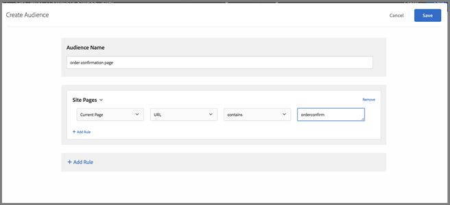

# グローバル mbox に関するよくある質問

グローバル mbox に関するよくある質問（FAQ）のリストです。

## [!DNL Target] アカウントが複数のドメインに設定されている場合、複数のグローバル mbox を使用できますか？

アカウント全体で使用できるグローバル mbox は 1 つだけです。

アクティビティに URL ルールを追加することで、アクティビティの実行場所を制限できます。詳しくは、[ 類似のページに同じエクスペリエンスを含める ](https://experienceleague.adobe.com/docs/target/using/experiences/vec/temtest.html?lang=ja) を参照してください。

[targetPageParams](/help/dev/implement/client-side/atjs/atjs-functions/targetpageparams.md) を使用してページでパラメーターを渡し、そのパラメーターを [!UICONTROL Visual Experience Composer] （VEC）の「URL を設定」セクションで選択するか、[!UICONTROL Form-Based Experience Composer] でパラメーターを「絞り込み」として追加することもできます。

## [!DNL Target] しいグローバル mbox で売上高データを渡すには、どうすればよいですか？

target-global-mbox の売上高および注文情報を収集するには、「mbox パラメーター」を [!DNL Target] に送信する必要があります。 これらのパラメーターは、[!DNL Target] に詳細情報を送信するために使用される名前と値のペアです。 [!DNL Target] は、これらのパラメーター（予約名）を自動的に検索し、売上高データを入力します。

`orderConfirmPage` の場合、`orderTotal`、`orderId`、`productPurchasedId` を渡す必要があります。

これらのパラメーターは、`targetPageParams()` 経由で target-global-mbox に送信される必要があります。 詳しくは、「[グローバル mbox にパラメーターを渡す](/help/dev/implement/client-side/atjs/global-mbox/pass-parameters-to-global-mbox.md)」を参照してください。

また、以下に示すように、注文確認ページが表示された際に target-global-mbox に対するコンバージョンのみがカウントされるよ [!DNL Target] に、コンバージョンピースにターゲティングを追加することもできます。

上図の「サイトのページ」セクションの選択内容は、「現在のページ」、「URL」、「次を含む」、「orderconfirm」となっています。

上図のオプションは、以下の設定で構成されています。

* **このアクティビティでは何を測定しますか？：**&#x200B;売上高
* **レポートのデフォルトの表示：**&#x200B;訪問者あたりの売上高（RPV）
* **目標を達成したことを示すオーディエンスのアクションは何ですか？** mbox が表示された、target-global-mbox
