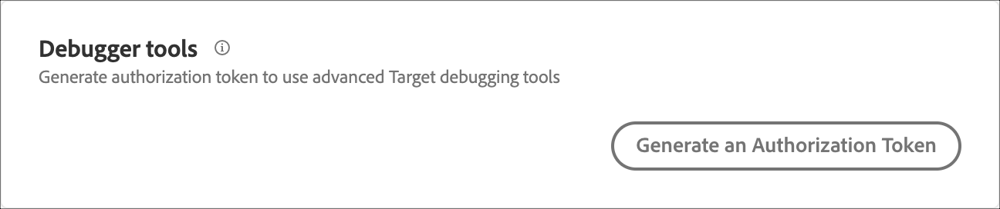

# タグマネージャーなしで[!DNL Target]を実装する

タグマネージャーまたは[!DNL Adobe Experience Platform]のタグを使用せずに[!DNL Adobe Target]を実装する方法について説明します。

>[!NOTE]
>
>[Adobe Experience Platform](/help/dev/implement/client-side/atjs/how-to-deployatjs/implement-target-using-adobe-launch.md)のタグは、[!DNL Target]およびat.js ライブラリを実装する際に推奨される方法です。 [!DNL Adobe Experience Platform]のタグを使用して[!DNL Target]を実装する場合、次の情報は適用されません。

実装ページにアクセスするには、**[!UICONTROL 管理]**/**[!UICONTROL 実装]**&#x200B;をクリックします。

このページでは、次の設定を指定できます。

* アカウントの詳細
* 実装方法
* プロファイル API
* デバッガーツール
* プライバシー

>[!NOTE]
>
>at.js ライブラリの設定を上書きできます。設定は、[!DNL Target] Standard/Premium UIやREST APIを使用して設定するのではなく、 詳しくは、[targetGlobalSettings()](/help/dev/implement/client-side/atjs/atjs-functions/targetglobalsettings.md) を参照してください。

## アカウントの詳細

次のアカウントの詳細を表示できます。 これらの設定は変更できません。

| 設定 | 説明 |
| --- | --- |
| [!UICONTROL &#x200B; クライアントコード &#x200B;] | クライアントコードは、[!DNL Target] APIを使用する際によく必要となる、クライアント固有の文字シーケンスです。 |
| [!UICONTROL IMS組織ID] | このIDは、実装をAdobe Experience Cloud アカウントに関連付けます。 |
| [!UICONTROL &#x200B; オンデバイス決定] | オンデバイス判定を有効にするには、切り替えスイッチを「オン」の位置にスライドさせます。<p>オンデバイス判定により、A/Bおよびエクスペリエンスのターゲット設定（XT）キャンペーンをサーバー上にキャッシュし、ほぼゼロの遅延でメモリ内の判定を実行できます。 詳しくは、[&#x200B; オンデバイス判定の概要](../../../server-side/sdk-guides/on-device-decisioning/overview.md)を参照してください。 |
| [!UICONTROL 既存のすべてのオンデバイス決定適格アクティビティをアーティファクトに含める] | （条件付き）このオプションは、オンデバイス判定を有効にした場合に表示されます。<p>オンデバイス判定に適格なすべてのライブ [!DNL Target] アクティビティをアーティファクトに自動的に含める場合は、切り替えスイッチを「オン」の位置にスライドさせます。<p>このトグルをオフにすると、生成されたルール アーティファクトに含めるために、デバイス上の決定アクティビティを再作成してアクティブ化する必要があります。 |

## 実装方法

実装方法パネルでは、次の設定を行うことができます。

### グローバル設定

>[!NOTE]
>
>これらの設定は、すべての[!DNL Target] .js ライブラリに適用されます。 「実装方法」セクションで変更を実行した後、ライブラリをダウンロードし、実装で更新する必要があります。

| 設定 | 説明 |
| --- | --- |
| [!UICONTROL &#x200B; ページ読み込み有効（グローバル mboxを自動作成） &#x200B;] | 各ページが読み込まれると自動的に実行されるように、グローバル mbox 呼び出しを at.js ファイルに埋め込むかどうかを選択します。 |
| [!UICONTROL グローバル mbox] | global mbox の名前を選択します。 デフォルトでは、この名前は target-global-mbox です。<p>at.jsを使用すると、mbox名にアンパサンド（&amp;）などの特殊文字を使用できます。 |
| [!UICONTROL &#x200B; タイムアウト （秒） &#x200B;] | [!DNL Target] が定義された期間内にコンテンツの応答をしない場合、サーバー呼び出しはタイムアウトし、デフォルトコンテンツが表示されます。 訪問者のセッション中、追加の呼び出しが引き続き試行されます。 デフォルト値は 5 秒です。<p>at.js ライブラリは、`XMLHttpRequest`のタイムアウト設定を使用します。 タイムアウトは、リクエストが実行されたときに開始し、[!DNL Target]がサーバーから応答を受け取ったときに停止します。 詳しくは、Mozilla Developer Networkの[XMLHttpRequest.timeout](https://developer.mozilla.org/en-US/docs/Web/API/XMLHttpRequest/timeout)を参照してください。<p>指定されたタイムアウトが応答を受信する前に発生した場合、デフォルトのコンテンツが表示され、すべてのデータ収集が[!DNL Target] エッジで行われるため、訪問者がアクティビティの参加者としてカウントされる場合があります。 リクエストが[!DNL Target] エッジに達した場合、訪問者はカウントされます。<p>タイムアウト設定を構成する際は、次の点を考慮してください。<ul><li>値が低すぎると、訪問者はアクティビティの参加者としてカウントされるものの、ほとんどの時間デフォルトのコンテンツが表示される可能性があります。</li><li>値が高すぎると、Web ページに空白の領域が表示されるか、長時間の本文の非表示を使用している場合は空白のページが表示される可能性があります。</li></ul>mbox の応答時間をよりよく把握するには、ブラウザーの開発者ツールの「ネットワーク」タブを確認してください。 また、Catchpoint など、サードパーティの web パフォーマンスモニタリングツールを使用することもできます。<p>**メモ**: [visitorApiTimeout](/help/dev/implement/client-side/atjs/atjs-functions/targetglobalsettings.md#visitorapitimeout)設定により、[!DNL Target]がVisitor API応答を長時間待たずに済みます。 この設定と、ここで説明している at.js のタイムアウト設定は相互に影響しません。 |
| [!UICONTROL &#x200B; プロファイルの有効期間] | この設定は、訪問者プロファイルが保存される期間を決定します。 デフォルトでは、プロファイルは 2 週間保存されます。 この設定は、最大90日間まで延長できます。<p>プロファイルの有効期間の設定を変更するには、[&#x200B; クライアントケア &#x200B;](https://experienceleague.adobe.com/docs/target/using/cmp-resources-and-contact-information.html?lang=ja#reference_ACA3391A00EF467B87930A450050077C)にお問い合わせください。 |

### 主な実装方法

>[!NOTE]
>
>[!DNL Adobe Target]は、at.js 1.*x*&#x200B;とat.js 2.*x*&#x200B;の両方をサポートしています。 いずれかのメジャーバージョンのat.jsの最新のアップデートにアップグレードして、サポートされているバージョンを実行していることを確認します。

目的のat.js バージョンをダウンロードするには、適切な&#x200B;**ダウンロード** ボタンをクリックします。

at.js設定を編集するには、目的のat.js バージョンの横にある&#x200B;**[!UICONTROL 編集]**&#x200B;をクリックします。

>[!WARNING]
>
>これらのデフォルト設定を変更する前に、現在の実装に影響を与えないように、[&#x200B; クライアントケア &#x200B;](https://experienceleague.adobe.com/docs/target/using/cmp-resources-and-contact-information.html?lang=ja#reference_ACA3391A00EF467B87930A450050077C)に相談してください。

上記の設定に加えて、次の特定のat.js設定も使用できます。

| 設定 | 説明 |
|--- |--- |
| クロスドメイン | at.js v1.*x*&#x200B;の場合、`enabled` （ブラウザーが1st パーティ Cookieと3rd パーティ Cookieの両方を設定）を選択して、クロスドメイン機能が`disabled` （ブラウザーがドメイン内のCookieを設定）、`x only` （ブラウザーがTargetのドメイン内のCookieを設定）、またはその両方かどうかを指定します。 at.js v2.10以降の場合、クロスドメイン機能が`enabled` （ブラウザーがファーストパーティ Cookieとサードパーティ Cookieの両方を設定）または`disabled` （ブラウザーがサードパーティ Cookieを設定しない）のどちらかを指定します。 |
| カスタムライブラリヘッダー | ライブラリの最上部に含めるカスタム JavaScript を追加します。 |
| カスタムライブラリフッター | ライブラリの最下部に含めるカスタム JavaScript を追加します。 |

### プロファイル API

API による一括更新の認証を有効または無効にし、プロファイル認証トークンを生成します。

詳しくは、[&#x200B; プロファイル API設定](/help/dev/before-implement/methods-to-get-data-into-target/profile-api-settings.md)を参照してください。

### デバッガーツール

高度な[!DNL Target] デバッグツールを使用するための認証トークンを生成します。 「**[!UICONTROL 新しい認証トークンを生成]**」をクリックします。



### プライバシー

これらの設定を使用すると、適用されるデータプライバシー法に準拠して[!DNL Target]を使用できます。

「訪問者IP アドレスを難読化」ドロップダウンリストから目的の設定を選択します。

* 最後のオクテットの難読化
* IP難読化全体
* None

詳しくは、[プライバシー](/help/dev/before-implement/privacy/privacy.md)を参照してください。

>[!NOTE]
>
>従来のブラウザーサポートオプションは、at.js バージョン 0.9.3以前で使用できました。 このオプションは、at.js バージョン 0.9.4 で削除されました。 at.jsでサポートされているブラウザーの一覧については、[&#x200B; サポートされているブラウザー](/help/dev/before-implement/supported-browsers.md)を参照してください。<p>レガシーブラウザーは、CORS（クロスオリジンリソース共有）を完全にはサポートしない古いブラウザーです。 こうしたブラウザーには、バージョン 11 より前の Internet Explorer およびバージョン 6 以下の Safari が含まれます。 従来のブラウザーのサポートが無効になっている場合、[!DNL Target]は、これらのブラウザーのレポートでコンテンツを配信しなかったか、訪問者を数えませんでした。 このオプションが有効になっている場合は、優れた顧客体験を確実に提供するために、古いブラウザーで品質保証を行うことをお勧めします。

## at.js のダウンロード

[!DNL Target] インターフェイスまたはダウンロード APIを使用してライブラリをダウンロードする手順。

>[!NOTE]
>
>[Adobe Experience Platform](/help/dev/implement/client-side/atjs/how-to-deployatjs/implement-target-using-adobe-launch.md)は、[!DNL Target]およびat.js ライブラリを実装する際に推奨される方法です。 [!DNL Adobe Experience Platform]のタグを使用して[!DNL Target]を実装する場合、次の情報は適用されません。
>
>[!DNL Adobe Target]は、at.js 1.*x*&#x200B;とat.js 2.*x*&#x200B;の両方をサポートしています。 サポートされているバージョンを実行していることを確認するために、いずれかのメジャーバージョンのat.jsの最新のアップデートにアップグレードしてください。 各バージョンについて詳しくは、 [at.js のバージョンの詳細](/help/dev/implement/client-side/atjs/target-atjs-versions.md)を参照してください。

### [!DNL Target] インターフェイスを使用したat.jsのダウンロード

[!DNL Target] インターフェイスからat.jsをダウンロードするには：

1. **[!UICONTROL 管理]** / **[!UICONTROL 実装]**&#x200B;をクリックします。
1. 「実装方法」セクションで、目的のat.js バージョンの横にある「**[!UICONTROL ダウンロード]**」ボタンをクリックします。

### [!DNL Target] ダウンロード APIを使用したat.jsのダウンロード

APIを使用してat.jsをダウンロードします。

1. クライアントコードを取得します。

   クライアントコードは、[!DNL Target] インターフェイスの&#x200B;**[!UICONTROL 管理]** > **[!UICONTROL 実装]** ページの上部にあります。

1. 管理番号を取得します。

   次の URL を読み込みます。

   ```
   https://admin.testandtarget.omniture.com/rest/v1/endpoint/<varname>client code</varname>
   ```

   `client code`を手順1のクライアントコードに置き換えます。

   この URL を読み込んだ結果は、次の例のようになります。

   ```
   { 
     "api": "https://admin6.testandtarget.omniture.com/admin/rest/v1" 
   }
   ```

   この例では、「6」が管理番号です。

1. at.jsをダウンロードします。

   次の構造でこのURLを読み込みます。 このURLを読み込むと、カスタマイズしたat.js ファイルのダウンロードが開始されます。

   ```
   https://admin<varname>admin number</varname>.testandtarget.omniture.com/admin/rest/v1/libraries/atjs/download?client=<varname>client code</varname>&version=<version number>
   ```

   * `admin number`を管理者番号に置き換えます。
   * `client code`を手順1のクライアントコードに置き換えます。
   * `version number`を目的のat.js バージョン番号（例：2.2）に置き換えます。

>[!WARNING]
>
>[!DNL Target] チームは、at.jsの現在のバージョンと2番目の最新バージョンの2つのバージョンのみを管理しています。 サポートされているバージョンを実行していることを確認するために、必要に応じてat.jsをアップグレードしてください。 各バージョンについて詳しくは、 [at.js のバージョンの詳細](/help/dev/implement/client-side/atjs/target-atjs-versions.md)を参照してください。

## at.js の実装

at.js は、Web サイトのすべてのページの `<head>` 要素で実装する必要があります。

[Adobe Experience Platform](/help/dev/implement/client-side/atjs/how-to-deployatjs/implement-target-using-adobe-launch.md)のタグなど、タグマネージャーを使用しない[!DNL Target]の一般的な実装は次のようになります。

```
<!doctype html> 
<html> 
<head> 
    <meta charset="utf-8"> 
    <title>Title of the Page</title> 
    <!--Preconnect and DNS-Prefetch to improve page load time--> 
    <link rel="preconnect" href="//<client code>.tt.omtrdc.net"> 
    <link rel="dns-prefetch" href="//<client code>.tt.omtrdc.net"> 
    <!--/Preconnect and DNS-Prefetch--> 
    <!--Data Layer to enable rich data collection and targeting--> 
    <script> 
        var digitalData = { 
            "page": { 
                "pageInfo": { 
                    "pageName": "Home" 
                } 
            } 
        }; 
    </script> 
    <!--/Data Layer--> 
    <!-- targetPageParams(), targetPageParamsAll(), Data Providers or targetGlobalSettings() functions to enrich the visitor profile or modify the library settings--> 
    <script> 
        targetPageParams = function() { 
            return { 
                "a": 1, 
                "b": 2, 
                "pageName": digitalData.page.pageInfo.pageName, 
                "profile": { 
                    "age": 26, 
                    "country": { 
                        "city": "San Francisco" 
                    } 
                } 
            }; 
        }; 
    </script> 
    <!--/targetPageParams()--> 
 
    <!--jQuery or other helper libraries should be implemented before at.js if you would like to use their methods in Target--> 
    <script src="jquery-3.3.1.min.js"></script> 
    <!--/jQuery--> 
    <!--Target's JavaScript SDK, at.js--> 
    <script src="at.js"></script> 
    <!--/at.js--> 
</head>
<body> 
    The default content of the page 
</body> 
</html>
```

次の重要な注意点を考慮してください。

* HTML5 Doctype （例：`<!doctype html>`）を使用してください。 サポートされていない古いdoctypeまたは古いdoctypeの場合、[!DNL Target]はリクエストを実行できません。
* 事前接続とプリフェッチのオプションは、Web ページの読み込みを高速化するのに役立ちます。 これらの設定を使用する場合は、`<client code>`を独自のクライアントコードに置き換えて、**[!UICONTROL 管理]** > **[!UICONTROL 実装]** ページから取得できるようにしてください。
* データレイヤーがある場合、at.js が読み込まれる前にページの `<head>` でデータレイヤーについてできるだけ多く定義することが最適です。 このプレースメントは、パーソナライゼーションに[!DNL Target]でこの情報を使用する最大機能を提供します。
* `targetPageParams()`、`targetPageParamsAll()`、データプロバイダー、`targetGlobalSettings()`などの特殊な[!DNL Target]関数は、データレイヤーの後で、at.jsが読み込まれる前に定義する必要があります。 あるいは、これらの関数は、at.js設定を編集ページの「ライブラリヘッダー」セクションに保存し、at.js ライブラリ自体の一部として保存することもできます。 これらの関数について詳しくは、[at.js関数](/help/dev/implement/client-side/atjs/atjs-functions/atjs-functions.md)を参照してください。
* jQueryなどのJavaScript ヘルパーライブラリを使用する場合は、[!DNL Target]の前にそれらを含めることで、[!DNL Target] エクスペリエンスの構築時に構文とメソッドを使用できます。
* at.js はページの `<head>` に含めます。

## コンバージョンの追跡

注文の確認 mbox では、サイトでの注文に関する詳細が記録され、売上高および注文に基づくレポートが可能になります。 また、注文の確認 mbox は、「商品 x および商品 y を購入した人」などのレコメンデーションアルゴリズムを駆動できます。

>[!NOTE]
>
>ユーザーがweb サイトで購入した場合、レポートにAnalytics for [!DNL Target] （A4T）を使用する場合でも、Adobeでは注文確認mboxを実装することをお勧めします。

1. 注文の詳細ページで、以下のモデルに示す mbox スクリプトを挿入します。
1. 大文字のテキストを、カタログの動的値または静的値に置き換えます。

   >[!TIP]
   >
   >任意のmboxで注文情報を渡すこともできます（`orderConfirmPage`という名前にする必要はありません）。 また、同じキャンペーン内の複数の mbox に注文情報を渡すこともできます。

   ```
   <script type="text/javascript"> 
   adobe.target.trackEvent({ 
       "mbox": "orderConfirmPage", 
       "params":{  
           "orderId": "ORDER ID FROM YOUR ORDER PAGE",  
           "orderTotal": "ORDER TOTAL FROM YOUR ORDER PAGE",  
           "productPurchasedId": "PRODUCT ID FROM YOUR ORDER PAGE, PRODUCT ID2, PRODUCT ID3"  
       } 
   }); 
   </script> 
   ```

>[!NOTE]
>
>「注文確認」ボックスで、複数の製品IDを区切るにはコンマ区切りを使用します。

注文の確認 mbox では、次のパラメーターを使用します。

| パラメーター | 説明 |
|--- |--- |
| orderId | 注文を識別する一意の値（コンバージョンのカウントに使用）。<p>`orderId` は一意である必要があります。 重複する注文はレポートで無視されます。 |
| orderTotal | 購入金額。<p>通貨記号は渡さないでください。 （コンマではなく）小数点を使用して、10 進数値を示します。 |
| productPurchasedId（オプション） | この注文で購入された製品 ID のコンマ区切りのリスト。<p>これらの製品 ID は、追加のレポート分析をサポートするために監査レポートに表示されます。 |

