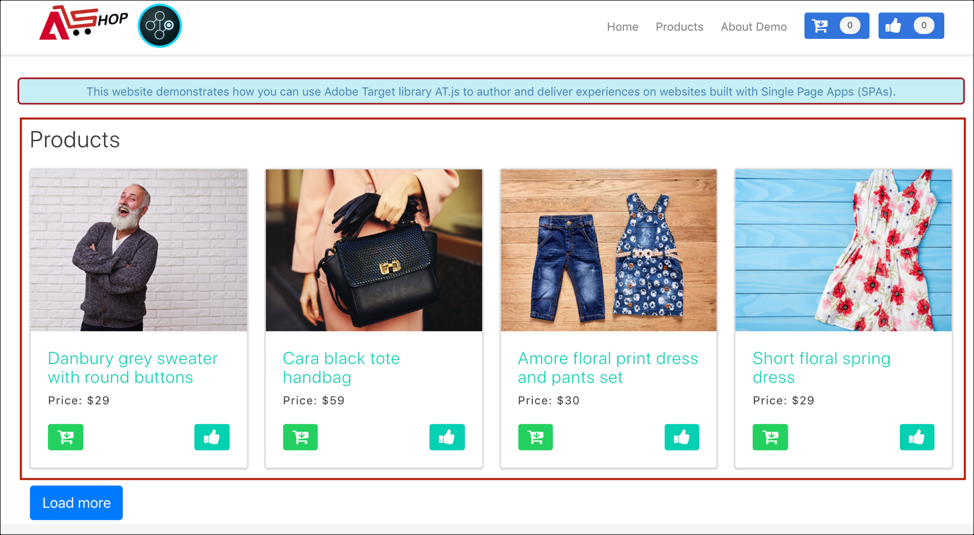
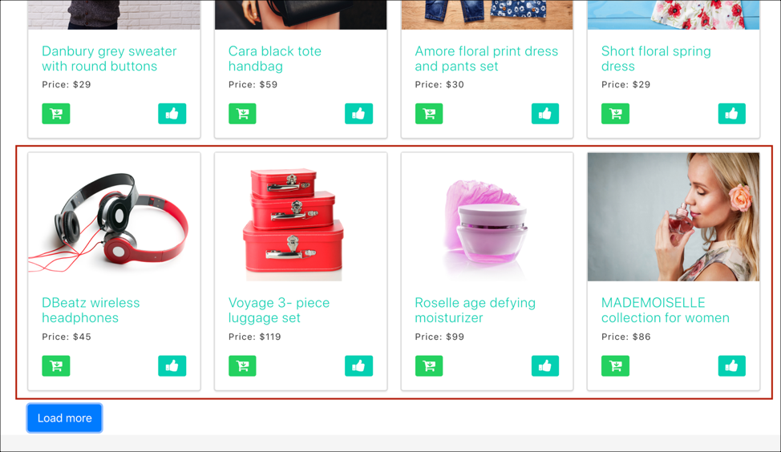
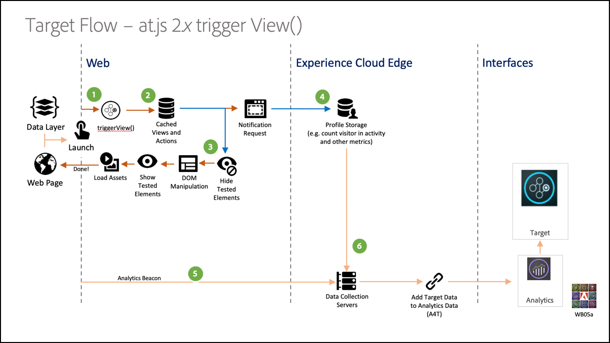

# シングルページアプリケーションの実装

従来の Web サイトは、「ページ間」ナビゲーションモデル（別名マルチページアプリケーション）を使用していました。このモデルでは、Web サイトデザインは URL と密接に結合され、ある Web ページから別のページへのトランジションにはページ読み込みが必要になります。 シングルページアプリケーション（SPA）などの最新型 Web アプリケーションは、代わりにブラウザの UI レンダリングの迅速な使用を推進するモデルを採用しています。多くの場合、ブラウザの UI レンダリングは、ページの再読み込みとは独立しています。 これらのエクスペリエンスは、スクロール、クリック、カーソル移動などの顧客のインタラクションによってトリガーされることがよくあります。 最新の Web の枠組みが進化するにつれて、パーソナライゼーションと実験をデプロイするためのページ読み込みなどの従来の汎用イベントは機能しなくなりました。


at.js 2.x は、次世代のクライアントサイドテクノロジーでパーソナライゼーションを実行するための機能を提供します。 このバージョンは、SPA と調和したインタラクションを実現するための at.js の改善に焦点を当てています。

以前のバージョンでは利用できない at.js 2.x を使用するメリットを紹介します。

* ページ読み込み時にすべてのオファーをキャッシュし、複数のサーバー呼び出しを単一のサーバー呼び出しに減らす機能。
* 従来のサーバー呼び出しで発生する遅延時間なしで、キャッシュ経由でオファーが即座に表示されるため、サイトでのエンドユーザーのエクスペリエンスが著しく向上します。
* 1 行のシンプルなコードと開発者による 1 回限りのセットアップで、マーケターは SPA 上で VEC を使用して A/B およびエクスペリエンスターゲティング（XT）アクティビティを作成し、実行できます。

## [!DNL Adobe Target] ビューと単一ページアプリケーション

SPA用の[!DNL Adobe Target] VECでは、SPA エクスペリエンスを構成するビジュアル要素の論理的なグループである「ビュー」と呼ばれる新しい概念を活用しています。 このため SPA は、URL ではなくユーザーのインタラクションによりビュー間を移行するものと考えられます。 通常、ビューはサイト全体またはサイト内のグループ化されたビジュアル要素を表せます。

ビューについて詳しく説明するには、Reactに実装されたこの仮想的なオンライン e コマースサイトを操作し、ビューの例をいくつか見てみましょう。 下のリンクをクリックして、このサイトを新しいブラウザータブで開きます。

**リンク： [ホームサイト](https://target.enablementadobe.com/react/demo/#/)**


ホームサイトに移動すると、イースターセールを宣伝するヒーロー画像やこのサイトで販売されている最新の製品がすぐに表示されます。 この場合、ビューはホームサイト全体として定義できます。 これは、以下の「[!DNL Adobe Target] ビューの実装」セクションで詳しく説明するため、注意すると便利です。

**リンク： [製品サイト](https://target.enablementadobe.com/react/demo/#/products)**


販売されている製品に興味を引かれたため、「Products」リンクをクリックすることにします。 ホームサイトと同様、製品サイト全体をビューとして定義できます。 このビューには `https://target.enablementadobe.com/react/demo/#/products)` のパス名と同様に「products」という名前を付けられます。



このセクションの冒頭は、ビューをサイト全体またはサイト上の視覚要素のグループとして定義しました。 上記のように、サイトに表示されている 4 つの製品をグループ化して、ビューとしても考えられます。 このビューに名前を付ける場合、「Products」という名前を使用できます。



「Load More」ボタンをクリックして、サイト上のより多くの製品を見てみることにします。 この場合、web サイトの URL は変化しません。 ただし、ここにあるビューは、上に示されている製品の 2 列目のみを表示できます。 このビューは「PRODUCTS-PAGE-2」と呼べます。

**リンク： [チェックアウト](https://target.enablementadobe.com/react/demo/#/checkout)**


サイトに表示されている製品が気に入ったので、いくつかを購入することにしました。 現在、チェックアウトサイトでは、通常配送または速達配送を選択できるようになっています。 ビューはサイト上のビジュアル要素のグループにできるため、これに「View Delivery Preferences」という名前を付けられます。

さらに、ビューの概念を大きく拡張することもできます。 マーケターが選択された配送設定に応じてサイト上のコンテンツをパーソナライズする場合、配送設定ごとにビューを作成できます。 この例では、「Normal Delivery」を選択する場合、ビューに「Normal Delivery」という名前を付けられます。 「Express Delivery」を選択する場合、ビューに「Express Delivery」という名前を付けることができます。

次に、マーケターは、A/B テストを実行して、どちらの配送オプションでもボタンの色を青のままにするのに対して、速達が選択されたときに色を青から赤に変更することでコンバージョンを上昇させることができるかどうかを確認したいと思うかもしれません。

## [!DNL Adobe Target] ビューを実装しています

[!DNL Adobe Target] ビューについて説明したので、[!DNL Target]でこの概念を活用して、マーケターがVECを介してSPAでA/B テストとXT テストを実行できるようにすることができます。 これには開発者による 1 回限りの設定が必要です。 設定する手順を見てみましょう。

1. at.js 2.*x*&#x200B;をインストールします。

   まず、at.js 2.*x*&#x200B;をインストールする必要があります。 このバージョンのat.jsは、SPAを念頭に置いて開発されました。 以前のバージョンのat.jsでは、[!DNL Adobe Target] ビューとSPA用VECはサポートされていません。

   **[!UICONTROL Administration]** > **[!UICONTROL Implementation]**&#x200B;にある[!DNL Adobe Target] UIを使用して、at.js 2.*x*&#x200B;をダウンロードします。 at.js 2.*x*&#x200B;は、[!DNL Adobe Experience Platform]のタグを介してデプロイすることもできます。

1. at.js 2.*x*&#x200B;関数`[triggerView()](/help/dev/implement/client-side/atjs/atjs-functions/adobe-target-triggerview-atjs-2.md)`をサイトに実装します。

   A/BまたはXT テストを実行するSPAのビューを定義したら、パラメーターとして渡されたビューでat.js 2.*x* `triggerView()`関数を実装します。 これにより、マーケターは VEC を使用し、定義されたビューに対して A/B テストと XT テストを設計して実行できます。 これらのビューに対して `triggerView()` 関数が定義されていない場合、VEC はビューを検出しません。そのため、マーケターは VEC を使用して A/B テストや XT テストを設計して実行できません。

   >[!NOTE]
   >
   >at.jsのビューサポートでは、[viewsEnabled](/help/dev/implement/client-side/atjs/atjs-functions/targetglobalsettings.md#viewsenbabled)をtrueに設定する必要があります。そうでない場合、すべてのビュー機能が無効になります。

   **`adobe.target.triggerView(viewName, options)`**

   | パラメーター | タイプ | 必須？ | 検証 | 説明 |
   | --- | --- | --- | --- | --- |
   | viewName | 文字列 | ○ | &#x200B;1. 末尾にスペースがありません。<br />2。 空にすることはできません。<br />3。 ビュー名は、すべてのページに対して一意である必要があります。<br />4。 **警告**： ビュー名の先頭または末尾を「`/`」にしないでください。 これは、顧客は URL パスから表示名を一般的に抽出するためです。 私たちにとって、「ホーム」と「`/home`」は異なります。<br />5。 **警告**： `{page: true}` オプションを使用して同じビューを連続してトリガーしないでください。 | ビューを表す文字列型として任意の名前を渡します。 このビュー名は、VECの&#x200B;**[!UICONTROL Modifications]** パネルに表示され、マーケターがアクションを作成し、A/BおよびXT アクティビティを実行できるようにします。 |
   | options | オブジェクト | × |  |  |
   | options > page | ブール値 | × |  | **TRUE**： ページのデフォルト値は true です。 `page=true`の場合、インプレッション数を増やすための通知がEdge サーバーに送信されます。<br />**FALSE**: `page=false`の場合、インプレッション数を増やすための通知は送信されません。 オファーを含むページ上のコンポーネントを再レンダリングする場合にのみ使用します。 |

   次に、架空のe コマース SPAに対してReactで`triggerView()`関数を呼び出す方法について、いくつかのユースケースを紹介します。

   **リンク： [ホームサイト](https://target.enablementadobe.com/react/demo/#/)**

   

   マーケターの立場からホームサイト全体で A/B テストを実行する場合、ビューに「home」という名前を付けられます。

```
 function targetView() {
   var viewName = window.location.hash; // or use window.location.pathName if router works on path and not hash

   viewName = viewName || 'home'; // view name cannot be empty

   // Sanitize viewName to get rid of any trailing symbols derived from URL
   if (viewName.startsWith('#') || viewName.startsWith('/')) {
     viewName = viewName.substr(1);
   }

   // Validate if the Target Libraries are available on your website
   if (typeof adobe != 'undefined' && adobe.target && typeof adobe.target.triggerView === 'function') {
     adobe.target.triggerView(viewName);
   }
 }

 // react router v4
 const history = syncHistoryWithStore(createBrowserHistory(), store);
 history.listen(targetView);

 // react router v3
 <Router history={hashHistory} onUpdate={targetView} >
```

**リンク： [製品サイト](https://target.enablementadobe.com/react/demo/#/products)**

では、もう少し複雑な例を見てみましょう。 マーケターは、ユーザーが「さらに読み込む」ボタンをクリックした後に「価格」ラベルの色を赤に変更することで、商品の2行目をパーソナライズしたいとします。


```
 function targetView(viewName) {
   // Validate if the Target Libraries are available on your website
   if (typeof adobe != 'undefined' && adobe.target && typeof adobe.target.triggerView === 'function') {
     adobe.target.triggerView(viewName);
   }
 }

 class Products extends Component {
   render() {
     return (
       <button type="button" onClick={this.handleLoadMoreClicked}>Load more</button>
     );
   }

   handleLoadMoreClicked() {
     var page = this.state.page + 1; // assuming page number is derived from component's state
     this.setState({page: page});
     targetView('PRODUCTS-PAGE-' + page);
   }
 }
```

**リンク： [チェックアウト](https://target.enablementadobe.com/react/demo/#/checkout)**


マーケターが選択された配送設定に応じてサイト上のコンテンツをパーソナライズする場合、配送設定ごとにビューを作成できます。 この例では、「Normal Delivery」を選択する場合、ビューに「Normal Delivery」という名前を付けられます。 「Express Delivery」を選択する場合、ビューに「Express Delivery」という名前を付けることができます。

マーケターは、A/B テストを実行して、どちらの配送オプションでもボタンの色を青のままにするのに対して、速達が選択されたときに色を青から赤に変更することでコンバージョンを上昇させることができるかどうかを確認したいと思うようになるかもしれません。

```
 function targetView(viewName) {
   // Validate if the Target Libraries are available on your website
   if (typeof adobe != 'undefined' && adobe.target && typeof adobe.target.triggerView === 'function') {
     adobe.target.triggerView(viewName);
   }
 }

 class Checkout extends Component {
   render() {
     return (
       <div onChange={this.onDeliveryPreferenceChanged}>
         <label>
           <input type="radio" id="normal" name="deliveryPreference" value={"Normal Delivery"} defaultChecked={true}/>
           <span> Normal Delivery (7-10 business days)</span>
         </label>

         <label>
           <input type="radio" id="express" name="deliveryPreference" value={"Express Delivery"}/>
           <span> Express Delivery* (2-3 business days)</span>
         </label>
       </div>
     );
   }
   onDeliveryPreferenceChanged(evt) {
     var selectedPreferenceValue = evt.target.value;
     targetView(selectedPreferenceValue);
   }
 }
```

## at.js 2.x のシステム図

次の図は、ビューを使用した at.js 2 ワークフローと、これが SPA 統合をどのように強化するかについて説明しています。 at.js 2.x で使用されている概念に関するより詳しい概要については、「[シングルページアプリケーションの実装](/help/dev/implement/client-side/atjs/how-to-deployatjs/target-atjs-single-page-application.md)」を参照してください。


| 手順 | 詳細 |
| --- | --- |
| 1 | 別の呼び出しでは、ユーザーが認証された場合にExperience Cloud IDが返されます。別の呼び出しでは、お客様IDが同期されます。 |
| 2 | at.js ライブラリはドキュメント本文を同期して読み込み、非表示にします。<br />at.jsは、ページに実装されたオプション事前非表示スニペットを使用して非同期で読み込むこともできます。 |
| 3 | すべての設定済みパラメーター（MCID、SDID および顧客 ID）を含む、ページ読み込みリクエストがおこなわれます。 |
| 4 | プロファイルスクリプトが実行されてから、プロファイルストアにフィードされます。 ストアは、オーディエンスライブラリから適格なオーディエンスをリクエストします（例えば、Adobe Analytics、Audience Managementなどから共有されたオーディエンス）。<br />お客様の属性は、バッチプロセスでプロファイルストアに送信されます。 |
| 5 | URL リクエストパラメーターとプロファイルデータに基づいて、[!DNL Target] が現在のページおよび将来のビューでどのアクティビティおよびエクスペリエンスを訪問者に返すかを決定します。 |
| 6 | ターゲットコンテンツが（オプションで、追加のパーソナライゼーションに関するプロファイル値を含めて）ページに送り返されます。<br />デフォルトコンテンツがちらつくことなく、可能な限り迅速に現在のページ上のターゲットコンテンツが表示されます。<br />SPA でのユーザーアクションの結果として表示されるビューのターゲットコンテンツは、ブラウザーにキャッシュされます。そのため、`triggerView()` を介してビューがトリガーされたときに追加のサーバー呼び出しをおこなわずに即座にターゲットコンテンツを適用できます。 |
| 7 | Analytics データがデータ収集サーバーに送信されます。 |
| 8 | ターゲットデータは、SDIDを介して[!DNL Analytics] データと照合され、[!DNL Analytics] レポートストレージに処理されます。<br />Analytics データは、[!DNL Target] （A4T）レポート用に[!DNL Analytics]経由で[!DNL Analytics]と[!DNL Target]の両方で表示できます。 |

これで、`triggerView()` が SPA のどこに 実装されているかに関わらず、ビューとアクションはキャッシュから取得され、サーバー呼び出しなしでユーザーに表示されるようになります。 `triggerView()` は、インプレッション数を増分して記録するために、[!DNL Target] バックエンド に通知リクエストもおこないます。



| 手順 | 詳細 |
| --- | --- |
| 1 | `triggerView()` は SPA で呼び出され、ビューをレンダリングし、ビジュアル要素を変更ためのアクションを適用します。 |
| 2 | ビューのターゲットコンテンツがキャッシュから読み取られます。 |
| 3 | デフォルトコンテンツがちらつくことなく、可能な限り迅速にターゲットコンテンツが表示されます。 |
| 4 | 通知リクエストが [!DNL Target] プロファイルストア に送信され、アクティビティで訪問者がカウントされ、指標が増分されます。 |
| 5 | Analytics データがデータ収集サーバーに送信されます。 |
| 6 | ターゲットデータは、SDIDを介して[!DNL Analytics] データと照合され、[!DNL Analytics] レポートストレージに処理されます。 [!DNL Analytics]個のデータは、A4T レポートを使用して[!DNL Analytics]と[!DNL Target]の両方で表示できます。 |

## シングルページアプリケーションの Visual Experience Composer

at.js 2.x のインストールを完了し、サイトに `triggerView()` を追加した後、VEC を使用して A/B および XT アクティビティを実行します。 詳細については、「[シングルページアプリケーション（SPA）の Visual Experience Composer](https://experienceleague.adobe.com/docs/target/using/experiences/spa-visual-experience-composer.html)」を参照してください。

>[!NOTE]
>
>SPA 用 VEC は、通常の Web ページで使用する VEC と同じものですが、`triggerView()` の実装されたシングルページアプリケーションを開く際に利用できる機能がいくつか追加されています。

## TriggerViewを使用して、A4Tがat.js 2.xおよびSPAで正しく動作することを確認します

at.js 2.xで[Analytics for Target](https://experienceleague.adobe.com/docs/target/using/integrate/a4t/a4t.html) （A4T）が正しく動作することを確認するには、[!DNL Target] リクエストと[!DNL Analytics] リクエストで同じSDIDを送信してください。

SPA に関するベストプラクティスは次のとおりです。

* カスタムイベントを使用して、アプリケーションへの注目を喚起する通知をおこなう
* ビューのレンダリングが開始する前にカスタムイベントを発生させる
* ビューのレンダリングが終了したらカスタムイベントを発生させる

at.js 2.x には、新しい API 関数 [triggerView()](/help/dev/implement/client-side/atjs/atjs-functions/adobe-target-triggerview-atjs-2.md) が追加されました。 `triggerView()` を使用して、ビューのレンダリングが開始したことを at.js に通知する必要があります。

カスタムイベント、at.js 2.x、Analytics を組み合わせる方法については、次の例を参照してください。 この例では、HTML ページに訪問者 API、at.js 2.x、AppMeasurement がこの順に含まれていると仮定します。

次のカスタムイベントがあるとしましょう。

* `at-view-start` - ビューのレンダリングが開始したときに発生
* `at-view-end` - ビューのレンダリングが終了したときに発生

A4T と at.js 2.x を確実に連携させるには、

ビュー開始ハンドラーは次のようになります。

```jsx {line-numbers="true"}
document.addEventListener("at-view-start", function(e) {
  var visitor = Visitor.getInstance("<your Adobe Org ID>");
  
  visitor.resetState();
  adobe.target.triggerView("<view name>");
});
```

ビュー終了ハンドラーは次のようになります。

```jsx {line-numbers="true"}
document.addEventListener("at-view-end", function(e) {
  // s - is the AppMeasurement tracker object
  s.t();
});
```

>[!NOTE]
>
>`at-view-start` および `at-view-end` イベントを発生させる必要があります。 これらのイベントは、at.js カスタムイベントには含まれていません。

これらの例ではJavaScript コードを使用していますが、[Adobe Experience Platform](/help/dev/implement/client-side/atjs/how-to-deployatjs/implement-target-using-adobe-launch.md)のタグなど、タグマネージャーを使用している場合は、これらすべてが簡略化できます。

上記の手順に従う場合は、SPA 用の堅牢な A4T ソリューションが必要です。

## 実装のベストプラクティス

at.js 2.x APIを使用すると、様々な方法で[!DNL Target]実装をカスタマイズできますが、このプロセス中は正しい操作の順序に従うことが重要です。

次の情報は、ブラウザーで初めて単一ページアプリケーションを読み込む際に従う必要がある操作の順序と、その後に発生するビューの変更について説明します。

### 最初のページ読み込み処理の順序 {#order}

| 手順 | アクション | 詳細 |
| --- | --- | --- |
| 1 | VisitorAPI JSを読み込む | このライブラリは、訪問者にECIDを割り当てる責任があります。 このIDは、後でweb ページ上の他のAdobe ソリューションで使用されます。 |
| 2 | at.js 2.xを読み込む | at.js 2.xは、[!DNL Target]のリクエストとビューの実装に使用する必要なすべてのAPIを読み込みます。 |
| 3 | [!DNL Target] リクエストを実行 | データレイヤーがある場合は、[!DNL Target] リクエストを実行する前に、[!DNL Target]に送信するために必要な重要なデータを読み込むことをお勧めします。 これにより、`targetPageParams`を使用して、ターゲティングに使用するデータを含めることができます。<P>`pageLoadEnabled`と`viewsEnabled`が[targetGlobalSettings](/help/dev/implement/client-side/atjs/atjs-functions/targetglobalsettings.md)でtrueに設定されている場合、at.jsは、ステップ 2でVEC [!DNL Target]のすべてのオファーを自動的にリクエストします。<P>`getOffers`は、ページの読み込み後にVEC オファーを取得するためにも使用できます。 これを行うには、API呼び出しに`execute>pageLoad`と`prefetch>views`がリクエストに含まれていることを確認してください。 |
| 4 | `triggerView()`に電話 | 手順3で開始した[!DNL Target] リクエストは、ページ読み込み実行とビューの両方のエクスペリエンスを返すことができるため、[!DNL Target] リクエストが返され、オファーのキャッシュへの適用が完了した後に`triggerView()`が呼び出されるようにしてください。 この手順は、ビューごとに1回だけ実行する必要があります。 |
| 5 | [!DNL Analytics] ページビュービーコンを呼び出します | このビーコンは、データのステッチ用にステップ 3と4に関連付けられたSDIDを[!DNL Analytics]に送信します。 |
| 6 | 追加の`triggerView({"page": false})`を呼び出す | これは、SPA フレームワークのオプションのステップで、ビューの変更を行うことなく、ページ上の特定のコンポーネントを再レンダリングする可能性があります。 このような場合、SPA フレームワークがコンポーネントを再レンダリングした後に[!DNL Target] エクスペリエンスが確実に再適用されるようにするために、このAPIを呼び出すことが重要です。 この手順は、SPA ビューに[!DNL Target] エクスペリエンスが保持されるように、必要な回数だけ実行できます。 |

### SPA ビューの変更に対する操作の順序（ページ全体のリロードなし）

| 手順 | アクション | 詳細 |
| --- | --- | --- |
| 1 | `visitor.resetState()`に電話 | このAPIにより、新しいビューが読み込まれる際に、SDIDが再生成されます。 |
| 2 | `getOffers()` APIを呼び出してキャッシュを更新します | これは、このビューの変更が現在の訪問者に対して[!DNL Target]件を超えるアクティビティを選定したり、アクティビティから除外したりする可能性がある場合に実行するオプションの手順です。 この時点で、追加のターゲティング機能を有効にするために、追加のデータを[!DNL Target]に送信することもできます。 |
| 3 | `triggerView()`に電話 | 手順2を実行した場合は、この手順を実行する前に、[!DNL Target] リクエストを待ち、オファーをキャッシュに適用する必要があります。 この手順は、ビューごとに1回だけ実行する必要があります。 |
| 4 | `triggerView()`に電話 | 手順2を実行していない場合は、手順1を完了するとすぐに、この手順を実行できます。 手順2と手順3を実行した場合は、この手順をスキップする必要があります。 この手順は、ビューごとに1回だけ実行する必要があります。 |
| 5 | [!DNL Analytics] ページビュービーコンを呼び出します | このビーコンは、データ結合のために、ステップ 2、3、および4 ～ [!DNL Analytics]に関連付けられたSDIDを送信します。 |
| 6 | 追加の`triggerView({"page": false})`を呼び出す | これは、SPA フレームワークのオプションのステップで、ビューの変更を行うことなく、ページ上の特定のコンポーネントを再レンダリングする可能性があります。 このような場合、SPA フレームワークがコンポーネントを再レンダリングした後に[!DNL Target] エクスペリエンスが確実に再適用されるようにするために、このAPIを呼び出すことが重要です。 この手順は、SPA ビューに[!DNL Target] エクスペリエンスが保持されるように、必要な回数だけ実行できます。 |

## トレーニングビデオ

詳細は次のビデオで説明されています。

### at.js 2.x の仕組みについて

>[!VIDEO](https://video.tv.adobe.com/v/26250/?quality=12)

詳しくは、[at.js 2.x の仕組みについて](https://experienceleague.adobe.com/docs/target-learn/tutorials/implementation/understanding-how-atjs-20-works.html)を参照してください。

### SPA での at.js 2.x の実装

>[!VIDEO](https://video.tv.adobe.com/v/26248/?quality=12)

詳しくは、「[Adobe Targetのat.js 2.xをシングルページアプリケーション（SPA）に実装する](https://experienceleague.adobe.com/docs/target-learn/tutorials/experiences/use-the-visual-experience-composer-for-single-page-applications.html)」を参照してください。

### [!DNL Adobe Target]でのSPAにVECの使用

>[!VIDEO](https://video.tv.adobe.com/v/26249/?quality=12)

詳しくは、[Adobe Target でのシングルページアプリケーション Visual Experience Composer（SPA VEC）の使用](https://experienceleague.adobe.com/docs/target-learn/tutorials/experiences/use-the-visual-experience-composer-for-single-page-applications.html)を参照してください。
