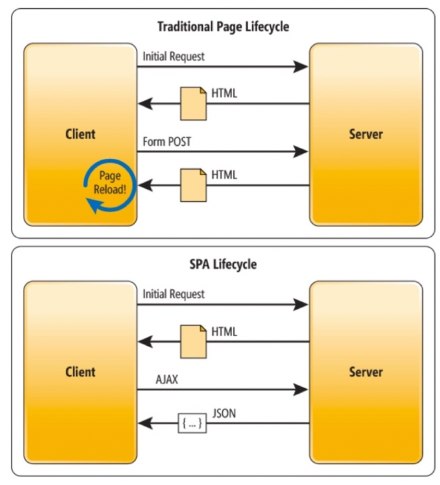
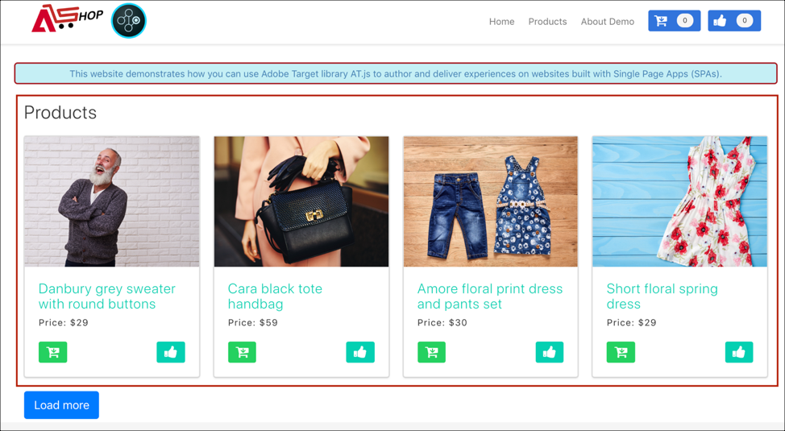

# シングルページアプリケーションの実装

従来の Web サイトは、「ページ間」ナビゲーションモデル（別名マルチページアプリケーション）を使用していました。このモデルでは、Web サイトデザインは URL と密接に結合され、ある Web ページから別のページへのトランジションにはページ読み込みが必要になります。シングルページアプリケーション（SPA）などの最新型 Web アプリケーションは、代わりにブラウザの UI レンダリングの迅速な使用を推進するモデルを採用しています。多くの場合、ブラウザの UI レンダリングは、ページの再読み込みとは独立しています。これらのエクスペリエンスは、スクロール、クリック、カーソル移動などの顧客のインタラクションによってトリガーされることがよくあります。最新の Web の枠組みが進化するにつれて、パーソナライゼーションと実験をデプロイするためのページ読み込みなどの従来の汎用イベントは機能しなくなりました。



at.js 2.x は、次世代のクライアントサイドテクノロジーでパーソナライゼーションを実行するための機能を提供します。このバージョンは、SPA と調和したインタラクションを実現するための at.js の改善に焦点を当てています。

以前のバージョンでは利用できない at.js 2.x を使用するメリットを紹介します。

* ページ読み込み時にすべてのオファーをキャッシュし、複数のサーバー呼び出しを単一のサーバー呼び出しに減らす機能。
* 従来のサーバー呼び出しで発生する遅延時間なしで、キャッシュ経由でオファーが即座に表示されるため、サイトでのエンドユーザーのエクスペリエンスが著しく向上します。
* 1 行のシンプルなコードと開発者による 1 回限りのセットアップで、マーケターは SPA 上で VEC を使用して A/B およびエクスペリエンスターゲティング（XT）アクティビティを作成し、実行できます。

## [!DNL Adobe Target] ビューと単一ページアプリケーション

SPA用の [!DNL Adobe Target] VEC では、ビューと呼ばれる新しい概念を利用します。ビューは、SPA エクスペリエンスを構成するビジュアル要素の論理的なグループです。 このため SPA は、URL ではなくユーザーのインタラクションによりビュー間を移行するものと考えられます。通常、ビューはサイト全体またはサイト内のグループ化されたビジュアル要素を表せます。

ビューとは何かをさらに説明するために、React で実装された架空のオンライン e コマースサイトを操作して、いくつかのビューの例を見てみましょう。 下のリンクをクリックして、このサイトを新しいブラウザータブで開きます。

**リンク： [ホームサイト](https://target.enablementadobe.com/react/demo/#/)**


ホームサイトに移動すると、イースターセールを宣伝するヒーロー画像やこのサイトで販売されている最新の製品がすぐに表示されます。この場合、ビューはホームサイト全体として定義できます。これは、以下の [!DNL Adobe Target] ビューの実装の節で詳しく説明するので、注意が必要です。

**リンク： [製品サイト](https://target.enablementadobe.com/react/demo/#/products)**


販売されている製品に興味を引かれたため、「Products」リンクをクリックすることにします。ホームサイトと同様、製品サイト全体をビューとして定義できます。このビューには `https://target.enablementadobe.com/react/demo/#/products)` のパス名と同様に「products」という名前を付けられます。



このセクションの冒頭は、ビューをサイト全体またはサイト上の視覚要素のグループとして定義しました。上記のように、サイトに表示されている 4 つの製品をグループ化して、ビューとしても考えられます。このビューに名前を付ける場合、「Products」という名前を使用できます。


「Load More」ボタンをクリックして、サイト上のより多くの製品を見てみることにします。この場合、Web サイトの URL は変化しません。ただし、ここにあるビューは、上に示されている製品の 2 列目のみを表示できます。このビューは「PRODUCTS-PAGE-2」と呼べます。

**リンク： [チェックアウト](https://target.enablementadobe.com/react/demo/#/checkout)**


サイトに表示されている製品が気に入ったので、いくつかを購入することにしました。現在、チェックアウトサイトでは、通常配送または速達配送を選択できるようになっています。ビューはサイト上のビジュアル要素のグループにできるため、これに「View Delivery Preferences」という名前を付けられます。

さらに、ビューの概念を大きく拡張することもできます。マーケターが選択された配送設定に応じてサイト上のコンテンツをパーソナライズする場合、配送設定ごとにビューを作成できます。この例では、「Normal Delivery」を選択する場合、ビューに「Normal Delivery」という名前を付けられます。「Express Delivery」を選択する場合、ビューに「Express Delivery」という名前を付けることができます。

次に、マーケターは、A/B テストを実行して、どちらの配送オプションでもボタンの色を青のままにするのに対して、速達が選択されたときに色を青から赤に変更することでコンバージョンを上昇させることができるかどうかを確認したいと思うかもしれません。

## [!DNL Adobe Target] ビューの実装

[!DNL Adobe Target] Views とは何かを説明したので、マーケターが VEC を介してSPAで A/B テストと XT テストを実行で [!DNL Target] るようにするために、このコンセプトを活用できます。 これには開発者による 1 回限りの設定が必要です。これを設定する手順を説明します。

1. at.js 2 のインストール&#x200B;**。

   まず、at.js 2 をインストールする必要があります。*x* を通じてクロスドメイントラッキングを使用している場合です。このバージョンの at.js は、SPAを念頭に置いて開発されました。 at.js の以前のバージョンでは、[!DNL Adobe Target] Views とSPA用の VEC はサポートされていません。

   at.js をダウンロード 2.*x* **[!UICONTROL Administration]**/**[!UICONTROL Implementation]** にある [!DNL Adobe Target] UI を使用します。 at.js 2.*x* は、[!DNL Adobe Experience Platform] のタグを使用してデプロイすることもできます。

1. at.js の実装 2.*x* 関数を使用する `[triggerView()](/help/dev/implement/client-side/atjs/atjs-functions/adobe-target-triggerview-atjs-2.md)`、サイト上で実行できます。

   A/B テストまたは XT テストを実行するSPAのビューを定義したら、at.js 2 を実装します。*x* パラメーターとして渡されたビューを持つ `triggerView()` 関数。 これにより、マーケターは VEC を使用し、定義されたビューに対して A/B テストと XT テストを設計して実行できます。これらのビューに対して `triggerView()` 関数が定義されていない場合、VEC はビューを検出しません。そのため、マーケターは VEC を使用して A/B テストや XT テストを設計して実行できません。

   >[!NOTE]
   >
   >at.js でビューがサポートされるようにするには、[viewsEnabled](/help/dev/implement/client-side/atjs/atjs-functions/targetglobalsettings.md#viewsenbabled) を true に設定する必要があります。そうしないと、すべてのビュー機能が無効になります。

   **`adobe.target.triggerView(viewName, options)`**

   | パラメーター | タイプ | 必須？ | 検証 | 説明 |
   | --- | --- | --- | --- | --- |
   | viewName | 文字列 | ○ | 1. 末尾にスペースは入れられません。<br />2.空にはできません。<br />3.ビュー名はすべてのページに対して一意である必要があります。<br />4.**警告**： ビュー名の先頭または末尾を「`/`」にしないでください。これは、顧客は URL パスから表示名を一般的に抽出するためです。「home」と「`/home`」は区別されます。<br />5.**警告**： `{page: true}` オプションを使用して同じビューを連続してトリガーしないでください。 | ビューを表す文字列型として任意の名前を渡します。このビュー名は、マーケターがアクションを作成して A/B および XT アクティビティを実行できるように、VEC の **[!UICONTROL Modifications]** パネルに表示されます。 |
   | options | オブジェクト | × |  |  |
   | options > page | ブール値 | × |  | **TRUE**： ページのデフォルト値は true です。`page=true` の場合、インプレッション数を増分するために Edge サーバーに通知が送信されます。<br />**FALSE**: `page=false` の場合、インプレッション数を増分するための通知は送信されません。オファーを含むページ上のコンポーネントを再レンダリングする場合にのみ使用します。 |

   次に、模擬 e コマース SPA用に React で `triggerView()` 関数を呼び出す方法について、いくつかの例を見てみましょう。

   **リンク： [ホームサイト](https://target.enablementadobe.com/react/demo/#/)**

   

   マーケターの立場からホームサイト全体で A/B テストを実行する場合、ビューに「home」という名前を付けられます。

```
 function targetView() {
   var viewName = window.location.hash; // or use window.location.pathName if router works on path and not hash

   viewName = viewName || 'home'; // view name cannot be empty

   // Sanitize viewName to get rid of any trailing symbols derived from URL
   if (viewName.startsWith('#') || viewName.startsWith('/')) {
     viewName = viewName.substr(1);
   }

   // Validate if the Target Libraries are available on your website
   if (typeof adobe != 'undefined' && adobe.target && typeof adobe.target.triggerView === 'function') {
     adobe.target.triggerView(viewName);
   }
 }

 // react router v4
 const history = syncHistoryWithStore(createBrowserHistory(), store);
 history.listen(targetView);

 // react router v3
 <Router history={hashHistory} onUpdate={targetView} >
```

**リンク： [製品サイト](https://target.enablementadobe.com/react/demo/#/products)**

それでは、もう少し複雑な例を見てみましょう。 例えば、ユーザーが「さらに読み込む」ボタンをクリックした後に「価格」ラベルカラーを赤に変更して、2 行目にある製品をパーソナライズするマーケターを考えましょう。


```
 function targetView(viewName) {
   // Validate if the Target Libraries are available on your website
   if (typeof adobe != 'undefined' && adobe.target && typeof adobe.target.triggerView === 'function') {
     adobe.target.triggerView(viewName);
   }
 }

 class Products extends Component {
   render() {
     return (
       <button type="button" onClick={this.handleLoadMoreClicked}>Load more</button>
     );
   }

   handleLoadMoreClicked() {
     var page = this.state.page + 1; // assuming page number is derived from component's state
     this.setState({page: page});
     targetView('PRODUCTS-PAGE-' + page);
   }
 }
```

**リンク： [チェックアウト](https://target.enablementadobe.com/react/demo/#/checkout)**


マーケターが選択された配送設定に応じてサイト上のコンテンツをパーソナライズする場合、配送設定ごとにビューを作成できます。この例では、「Normal Delivery」を選択する場合、ビューに「Normal Delivery」という名前を付けられます。「Express Delivery」を選択する場合、ビューに「Express Delivery」という名前を付けることができます。

マーケターは、A/B テストを実行して、どちらの配送オプションでもボタンの色を青のままにするのに対して、速達が選択されたときに色を青から赤に変更することでコンバージョンを上昇させることができるかどうかを確認したいと思うようになるかもしれません。

```
 function targetView(viewName) {
   // Validate if the Target Libraries are available on your website
   if (typeof adobe != 'undefined' && adobe.target && typeof adobe.target.triggerView === 'function') {
     adobe.target.triggerView(viewName);
   }
 }

 class Checkout extends Component {
   render() {
     return (
       <div onChange={this.onDeliveryPreferenceChanged}>
         <label>
           <input type="radio" id="normal" name="deliveryPreference" value={"Normal Delivery"} defaultChecked={true}/>
           <span> Normal Delivery (7-10 business days)</span>
         </label>

         <label>
           <input type="radio" id="express" name="deliveryPreference" value={"Express Delivery"}/>
           <span> Express Delivery* (2-3 business days)</span>
         </label>
       </div>
     );
   }
   onDeliveryPreferenceChanged(evt) {
     var selectedPreferenceValue = evt.target.value;
     targetView(selectedPreferenceValue);
   }
 }
```

## at.js 2.x のシステム図

次の図は、ビューを使用した at.js 2 ワークフローと、これが SPA 統合をどのように強化するかについて説明しています。at.js 2.x で使用されている概念に関するより詳しい概要については、「[シングルページアプリケーションの実装](/help/dev/implement/client-side/atjs/how-to-deployatjs/target-atjs-single-page-application.md)」を参照してください。


| 手順 | 詳細 |
| --- | --- |
| 1 | ユーザーが認証されている場合、の呼び出しではExperience CloudID が返され、別の呼び出しでは顧客 ID が同期されます。 |
| 2 | at.js ライブラリがドキュメント本文を同期的に読み込み、非表示にします。<br />at.js は、ページに実装されているスニペットを非表示にするオプションを使用して非同期で読み込むこともできます。 |
| 3 | すべての設定済みパラメーター（MCID、SDID および顧客 ID）を含む、ページ読み込みリクエストがおこなわれます。 |
| 4 | プロファイルスクリプトが実行されてから、プロファイルストアにフィードされます。ストアは、オーディエンスライブラリから正規のオーディエンスをリクエストします（例えば、Adobe Analytics、Audience Management などから共有されたオーディエンス）。<br />顧客属性がバッチ処理でプロファイルストアに送信されます。 |
| 5 | URL リクエストパラメーターとプロファイルデータに基づいて、[!DNL Target] が現在のページおよび将来のビューでどのアクティビティおよびエクスペリエンスを訪問者に返すかを決定します。 |
| 6 | ターゲットコンテンツが（オプションで、追加のパーソナライゼーションに関するプロファイル値を含めて）ページに送り返されます。<br />デフォルトコンテンツがちらつくことなく、可能な限り迅速に現在のページ上のターゲットコンテンツが表示されます。<br />SPA でのユーザーアクションの結果として表示されるビューのターゲットコンテンツは、ブラウザーにキャッシュされます。そのため、`triggerView()` を介してビューがトリガーされたときに追加のサーバー呼び出しをおこなわずに即座にターゲットコンテンツを適用できます。 |
| 7 | Analytics データがデータ収集サーバーに送信されます。 |
| 8 | ターゲットデータは、SDID を介して [!DNL Analytics] データと照合され、[!DNL Analytics] レポートストレージに処理されます。<br />A4T レポートの [!DNL Analytics] を使用して、Analytics データが [!DNL Analytics] と [!DNL Target] の両方に表示され [!DNL Target] ようになります。 |

これで、`triggerView()` が SPA のどこに 実装されているかに関わらず、ビューとアクションはキャッシュから取得され、サーバー呼び出しなしでユーザーに表示されるようになります。`triggerView()` は、インプレッション数を増分して記録するために、[!DNL Target] バックエンド に通知リクエストもおこないます。


| 手順 | 詳細 |
| --- | --- |
| 1 | `triggerView()` は SPA で呼び出され、ビューをレンダリングし、ビジュアル要素を変更ためのアクションを適用します。 |
| 2 | ビューのターゲットコンテンツがキャッシュから読み取られます。 |
| 3 | デフォルトコンテンツがちらつくことなく、可能な限り迅速にターゲットコンテンツが表示されます。 |
| 4 | 通知リクエストが [!DNL Target] プロファイルストア に送信され、アクティビティで訪問者がカウントされ、指標が増分されます。 |
| 5 | Analytics データがデータ収集サーバーに送信されます。 |
| 6 | ターゲットデータは、SDID を介して [!DNL Analytics] データと照合され、[!DNL Analytics] レポートストレージに処理されます。 A4T レポートを使用して、[!DNL Analytics] データが [!DNL Analytics] と [!DNL Target] の両方に表示できるようになります。 |

## シングルページアプリケーションの Visual Experience Composer

at.js 2.x のインストールを完了し、サイトに `triggerView()` を追加した後、VEC を使用して A/B および XT アクティビティを実行します。詳細については、「[シングルページアプリケーション（SPA）の Visual Experience Composer](https://experienceleague.adobe.com/docs/target/using/experiences/spa-visual-experience-composer.html)」を参照してください。

>[!NOTE]
>
>SPA 用 VEC は、通常の Web ページで使用する VEC と同じものですが、`triggerView()` の実装されたシングルページアプリケーションを開く際に利用できる機能がいくつか追加されています。

## トリガービューを使用して、A4T が at.js 2.x およびSPAで正しく動作することを確認します

[Analytics for Target](https://experienceleague.adobe.com/docs/target/using/integrate/a4t/a4t.html) （A4T）が at.js 2.x で正しく動作することを確認するには、[!DNL Target] リクエストと [!DNL Analytics] リクエストで同じ SDID を送信してください。

SPA に関するベストプラクティスは次のとおりです。

* カスタムイベントを使用して、アプリケーションへの注目を喚起する通知をおこなう
* ビューのレンダリングが開始する前にカスタムイベントを発生させる
* ビューのレンダリングが終了したらカスタムイベントを発生させる

at.js 2.x には、新しい API 関数 [triggerView()](/help/dev/implement/client-side/atjs/atjs-functions/adobe-target-triggerview-atjs-2.md) が追加されました。`triggerView()` を使用して、ビューのレンダリングが開始したことを at.js に通知する必要があります。

カスタムイベント、at.js 2.x、Analytics を組み合わせる方法については、次の例を参照してください。この例では、HTML ページに訪問者 API、at.js 2.x、AppMeasurement がこの順に含まれていると仮定します。

次のカスタムイベントがあるとしましょう。

* `at-view-start` - ビューのレンダリングが開始したときに発生
* `at-view-end` - ビューのレンダリングが終了したときに発生

A4T と at.js 2.x を確実に連携させるには、

ビュー開始ハンドラーは次のようになります。

```jsx {line-numbers="true"}
document.addEventListener("at-view-start", function(e) {
  var visitor = Visitor.getInstance("<your Adobe Org ID>");
  
  visitor.resetState();
  adobe.target.triggerView("<view name>");
});
```

ビュー終了ハンドラーは次のようになります。

```jsx {line-numbers="true"}
document.addEventListener("at-view-end", function(e) {
  // s - is the AppMeasurement tracker object
  s.t();
});
```

>[!NOTE]
>
>`at-view-start` および `at-view-end` イベントを発生させる必要があります。これらのイベントは、at.js カスタムイベントには含まれていません。

これらの例ではJavaScript コードを使用しますが、[Adobe Experience Platform](/help/dev/implement/client-side/atjs/how-to-deployatjs/implement-target-using-adobe-launch.md) のタグなどのタグマネージャーを使用している場合、これらすべてを簡略化できます。

上記の手順に従う場合は、SPA 用の堅牢な A4T ソリューションが必要です。

## 実装のベストプラクティス

at.js 2.x API を使用すると、様々な方法で [!DNL Target] 実装をカスタマイズできますが、このプロセスでは正しい操作の順序に従うことが重要です。

以下の情報は、単一ページアプリケーションをブラウザーで初めて読み込む場合、およびそれ以降に発生するビューの変更の場合に従う必要がある操作の順序を説明します。

### 最初のページ読み込みの操作順序 {#order}

| 手順 | アクション | 詳細 |
| --- | --- | --- |
| 1 | VisitorAPI JS の読み込み | このライブラリは、訪問者に ECID を割り当てる役割を果たします。 この ID は、後で web ページ上の他のAdobeソリューションによって使用されます。 |
| 2 | at.js 2.x の読み込み | at.js 2.x は、[!DNL Target] のリクエストとビューの実装に使用する必要な API をすべて読み込みます。 |
| 3 | リクエスト [!DNL Target] 実行 | データレイヤーがある場合は、[!DNL Target] リクエストを実行する前に、[!DNL Target] に送信する必要がある重要なデータを読み込むことをお勧めします。 これにより、`targetPageParams` を使用して、ターゲティングに使用するデータを含めることができます。<P>[targetGlobalSettings](/help/dev/implement/client-side/atjs/atjs-functions/targetglobalsettings.md) で `pageLoadEnabled` と `viewsEnabled` が true に設定されている場合、at.js は手順 2 ですべての VEC [!DNL Target] オファーを自動的に要求します。<P>ページの読み込み後に VEC オファーを取得する `getOffers` 合にも使用できます。 それには、リクエストの API 呼び出しに `execute>pageLoad` と `prefetch>views` が含まれていることを確認してください。 |
| 4 | `triggerView()` に電話 | 手順 3 で開始した [!DNL Target] リクエストは、ページ読み込み実行とビューの両方のエクスペリエンスを返す可能性があるので、[!DNL Target] リクエストが返され、キャッシュへのオファーの適用が完了した後に、`triggerView()` が呼び出されることを確認します。 この手順は、ビューごとに 1 回だけ実行する必要があります。 |
| 5 | [!DNL Analytics] ページビュービーコンの呼び出し | このビーコンは、手順 3 と 4 に関連付けられた SDID を [!DNL Analytics] に送信して、データをステッチします。 |
| 6 | Call additional `triggerView({"page": false})` | これは、ビューの変更が行われることなく、ページ上の特定のコンポーネントを再レンダリングできる可能性があるSPA フレームワークのオプション手順です。 このような場合、SPA フレームワークがコンポーネントを再レンダリングした後に [!DNL Target] のエクスペリエンスが再適用されるようにするために、この API を呼び出すことが重要です。 この手順は、SPA ビューに保持するエクスペリエンスの数に関わらず何回でも実行 [!DNL Target] きます。 |

### SPA表示変更の操作の順序（ページ全体の再読み込みなし）

| 手順 | アクション | 詳細 |
| --- | --- | --- |
| 1 | `visitor.resetState()` に電話 | この API は、SDID が読み込み時に新しいビュー用に再生成されるようにします。 |
| 2 | `getOffers()` API を呼び出してキャッシュを更新します | これは、このビューの変更によって、現在の訪問者がさらに [!DNL Target] のアクティビティに選定されるか、アクティビティから選定解除される可能性がある場合に実行するオプションの手順です。 この時点で、追加のデータを [!DNL Target] に送信して、さらにターゲット機能を有効にすることもできます。 |
| 3 | `triggerView()` に電話 | 手順 2 を実行した場合は、[!DNL Target] リクエストを待ち、オファーをキャッシュに適用してから、この手順を実行する必要があります。 この手順は、ビューごとに 1 回だけ実行する必要があります。 |
| 4 | `triggerView()` に電話 | 手順 2 を実行していない場合は、手順 1 を完了したらすぐにこの手順を実行できます。 手順 2 と手順 3 を実行した場合は、この手順をスキップする必要があります。 この手順は、ビューごとに 1 回だけ実行する必要があります。 |
| 5 | [!DNL Analytics] ページビュービーコンの呼び出し | このビーコンは、手順 2、3 および 4 に関連付けられた SDID を [!DNL Analytics] に送信して、データをステッチします。 |
| 6 | Call additional `triggerView({"page": false})` | これは、ビューの変更が行われることなく、ページ上の特定のコンポーネントを再レンダリングできる可能性があるSPA フレームワークのオプション手順です。 このような場合、SPA フレームワークがコンポーネントを再レンダリングした後に [!DNL Target] のエクスペリエンスが再適用されるようにするために、この API を呼び出すことが重要です。 この手順は、SPA ビューに保持するエクスペリエンスの数に関わらず何回でも実行 [!DNL Target] きます。 |

## トレーニングビデオ

詳細は次のビデオで説明されています。

### at.js 2.x の仕組みについて

>[!VIDEO](https://video.tv.adobe.com/v/26250/?quality=12)

詳しくは、[at.js 2.x の仕組みについて](https://experienceleague.adobe.com/docs/target-learn/tutorials/implementation/understanding-how-atjs-20-works.html)を参照してください。

### SPA での at.js 2.x の実装

>[!VIDEO](https://video.tv.adobe.com/v/26248/?quality=12)

詳しくは、[ シングルページアプリケーション（SPA）でのAdobe Targetの at.js 2.x の実装 ](https://experienceleague.adobe.com/docs/target-learn/tutorials/experiences/use-the-visual-experience-composer-for-single-page-applications.html) を参照してください。

### [!DNL Adobe Target] でのSPA用 VEC の使用

>[!VIDEO](https://video.tv.adobe.com/v/26249/?quality=12)

詳しくは、[Adobe Target でのシングルページアプリケーション Visual Experience Composer（SPA VEC）の使用](https://experienceleague.adobe.com/docs/target-learn/tutorials/experiences/use-the-visual-experience-composer-for-single-page-applications.html)を参照してください。
