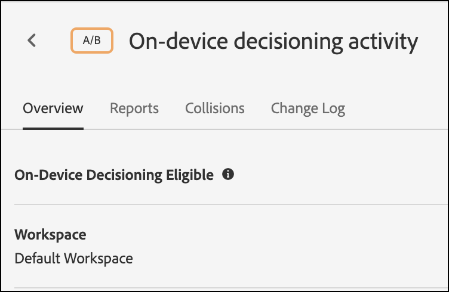

# at.jsの[!UICONTROL &#x200B; オンデバイス決定]

バージョン 2.5.0以降、at.jsでは[!UICONTROL &#x200B; オンデバイス判定]を提供しています。 [!UICONTROL On-device decisioning]を使用すると、ブラウザー上で[A/B テスト &#x200B;](https://experienceleague.adobe.com/docs/target/using/activities/abtest/test-ab.html?lang=ja)および[&#x200B; エクスペリエンスのターゲット設定](https://experienceleague.adobe.com/docs/target/using/activities/experience-targeting/experience-target.html?lang=ja) （XT）アクティビティをキャッシュして、[!DNL Adobe Target] Edge Networkへのブロッキングネットワークリクエストを実行せずにメモリ内での決定を実行できます。

>[!NOTE]
>
>[!UICONTROL &#x200B; オンデバイス決定]は、クライアントサイドとサーバーサイドの両方の実装で使用できます。 この記事では、クライアントサイドの[!UICONTROL &#x200B; オンデバイス決定]について説明します。 サーバーサイドの[!UICONTROL &#x200B; オンデバイス決定]について詳しくは、サーバーサイド実装ドキュメント [こちら](../../../server-side/sdk-guides/on-device-decisioning/overview.md)を参照してください。

また、[!DNL Target]は、ライブサーバーコールを介して、実験や機械学習を活用した（ML主導の）パーソナライゼーションアクティビティから、最も関連性が高く最新のエクスペリエンスを提供できる柔軟性も提供します。 つまり、パフォーマンスが最も重要な場合は、[!UICONTROL &#x200B; オンデバイス判定]を使用できます。 ただし、最も関連性が高く、最新のML主導のエクスペリエンスが必要な場合は、代わりにサーバーコールを実行できます。

## [!UICONTROL &#x200B; オンデバイス判定]の利点は何ですか？

[!UICONTROL &#x200B; オンデバイス判定]の利点は次のとおりです。

* **超高速の意思決定とエクスペリエンスを実現します。** バケット化と決定は、ネットワーク要求のブロックを避けるために、メモリ内およびブラウザー上で実行されます。
* **アプリケーションのパフォーマンスを強化します。** エンドユーザーのエクスペリエンスを損なうことなく、実験を行い、顧客とユーザーにパーソナライズされたエクスペリエンスを提供します。
* **Google サイトの品質スコアを向上させます。** 意思決定をメモリ内で行うことで、オンラインビジネスのGoogle サイト品質スコアを向上させ、消費者が見つけやすくします。
* **リアルタイム分析から学習します。** [Analytics for Target](https://experienceleague.adobe.com/docs/target/using/integrate/a4t/a4t.html?lang=ja) （A4T）レポートを使用して、リアルタイムでアクティビティのパフォーマンスからインサイトを得ることができます。 A4Tでは、重要な局面で戦略を転換することができます。

## サポートされる機能

[!DNL Adobe Target] JS SDKでは、パフォーマンスとデータの鮮度のどちらかを柔軟に選択して意思決定を行うことができます。 言い換えれば、マシンラーニングを通じて最も関連性が高く、魅力的なパーソナライズされたコンテンツを配信することが最も重要な場合は、ライブサーバーコールを送信する必要があります。 しかし、パフォーマンスがより重要な場合は、オンデバイスとメモリ内の決定を行う必要があります。 [!UICONTROL &#x200B; オンデバイス決定]が機能するには、サポートされている機能の一覧を参照してください。

* アクティビティのタイプ
* オーディエンスターゲティング
* 配分方法

詳しくは、[!UICONTROL &#x200B; オンデバイス決定][&#128279;](/help/dev/implement/client-side/atjs/on-device-decisioning/supported-features.md)でサポートされている機能を参照してください。

## [!UICONTROL &#x200B; オンデバイス決定]の仕組みはどのようになっていますか？

[!UICONTROL &#x200B; オンデバイス判定]が有効になっているat.jsをデプロイして初期化すると、A/BおよびXT アクティビティ、オーディエンス、アセットの[!UICONTROL &#x200B; オンデバイス判定]を含む[&#x200B; ルールアーティファクト &#x200B;](/help/dev/implement/client-side/atjs/on-device-decisioning/rule-artifact.md)が、最も近いAkamai CDNから訪問者にダウンロードされ、訪問者のブラウザーにローカルにキャッシュされます。 at.jsからエクスペリエンスを取得するリクエストが行われると、キャッシュされたルールアーティファクトにエンコードされたメタデータに基づいて、どのエクスペリエンスを返すかをメモリ内で決定します。

## 決定方法

[!UICONTROL &#x200B; オンデバイス判定]で、[!DNL Target]は決定方法という新しい設定を導入します。 決定方法の設定により、at.jsでエクスペリエンスを配信する方法が決まります。 決定方法には、次の3つの値があります。

* サーバーサイドのみ
* オンデバイスのみ
* ハイブリッド

### サーバーサイドのみ

at.js 2.5.0以降をweb プロパティに実装してデプロイする場合に、デフォルトの決定方法としてサーバーサイドのみが設定されます。

デフォルト設定としてサーバーサイドのみを使用すると、サーバーコールをブロックする[!DNL Target] エッジネットワークですべての決定が行われます。 このアプローチでは、遅延が増加する可能性がありますが、[Recommendations](https://experienceleague.adobe.com/docs/target/using/recommendations/recommendations.html?lang=ja)、[Automated Personalization](https://experienceleague.adobe.com/docs/target/using/activities/automated-personalization/automated-personalization.html?lang=ja) （AP）、[自動ターゲット &#x200B;](https://experienceleague.adobe.com/docs/target/using/activities/auto-target/auto-target-to-optimize.html?lang=ja) アクティビティを含む[!DNL Target]のマシンラーニング機能を適用できる機能など、大きなメリットも得られます。

さらに、セッションやチャネルをまたいで保持される[!DNL Target]のユーザープロファイルを使用して、パーソナライズされたエクスペリエンスを強化することで、ビジネスに強力な成果をもたらすことができます。

さらに、サーバーサイドでは、Adobe Experience Cloudを使用して、Audience ManagerやAdobe Analyticsのセグメントを通じてターゲティングできるオーディエンスを調整することしかできません。

次の図は、訪問者、ブラウザー、at.js 2.5.0以降、および[!DNL Adobe Target] Edge ネットワーク間のインタラクションを示しています。 このフロー図は、新規訪問者と再訪問者をキャプチャします。

（画像をクリックして全幅に拡大します）。

{zoomable="yes"}

次のリストは、図の数値に対応しています。

| 手順 | 説明 |
| --- | --- |
| 1 | Experience Cloud訪問者IDは、[Adobe Experience Cloud Identity Service](https://experienceleague.adobe.com/docs/id-service/using/home.html?lang=ja&)から取得されます。 |
| 2 | at.js ライブラリが同期して読み込まれ、文書本文が非表示になります。<br />   at.js ライブラリは、オプションの事前非表示スニペットをページに実装して、非同期で読み込むこともできます。 |
| 3 | at.js ライブラリは、ちらつきを防ぐために本文を非表示にします。 |
| 4 | ページ読み込みリクエストは、次のようなすべての設定されたパラメーター（ECID、顧客ID、カスタムパラメーター、ユーザープロファイルなど）を含めて行われます。 |
| 5 | プロファイルスクリプトが実行され、プロファイルストアに入力されます。<br /> プロファイルストアは、オーディエンスライブラリから適格なオーディエンス（例えば、Adobe Analytics、Adobe Audience Managerなどから共有されたオーディエンス）をリクエストします。<br />顧客属性は、バッチプロセスでプロファイルストアに送信されます。 |
| 6 | プロファイルストアは、オーディエンスの選定とグループ化に使用され、アクティビティをフィルタリングします。 |
| 7 | 結果のコンテンツは、ライブ [!DNL Target]のアクティビティからエクスペリエンスを決定した後に選択されます。 |
| 8 | at.js ライブラリは、レンダリングする必要があるエクスペリエンスに関連付けられているページ上の対応する要素を非表示にします。 |
| 9 | at.js ライブラリには本文が表示され、訪問者が表示できるようにページの残りの部分を読み込むことができます。 |
| 10 | at.js ライブラリは、DOMを操作して、[!DNL Target] Edge Networkからエクスペリエンスをレンダリングします。 |
| 11 | エクスペリエンスが訪問者にレンダリングされます。 |
| 12 | web ページ全体が読み込まれます。 |
| 13 | Analytics データがデータ収集サーバーに送信されます。 |
| 14 | ターゲットデータは、SDIDを介してAnalytics データと照合され、Analytics レポートストレージに処理されます。 Analytics データは、[!UICONTROL Analytics for Target] （A4T） レポートを介して、Analyticsと[!DNL Target]の両方で表示できます。 |

### オンデバイスのみ

オンデバイスのみの決定は、[!UICONTROL &#x200B; オンデバイス決定]をweb ページ全体でのみ使用する場合にat.js 2.5.0以降で設定する必要がある決定方法です。

[!UICONTROL &#x200B; オンデバイス判定]は、[!UICONTROL &#x200B; オンデバイス判定]に適格なすべてのアクティビティを含むキャッシュされたルール アーティファクトから決定が行われるため、エクスペリエンスとパーソナライゼーションアクティビティを迅速に配信できます。

[!UICONTROL &#x200B; オンデバイス判定]に適格なアクティビティについて詳しくは、[&#x200B; オンデバイス判定[!UICONTROL でサポートされている機能]](/help/dev/implement/client-side/atjs/on-device-decisioning/supported-features.md)を参照してください。

この決定方法は、Targetからの決定を必要とするすべてのページでパフォーマンスが非常に重要な場合にのみ使用してください。 さらに、この決定方法を選択した場合、[!UICONTROL &#x200B; オンデバイス決定]に該当しない[!DNL Target] アクティビティは配信または実行されないことに注意してください。 at.js ライブラリ 2.5.0以降は、決定を行うためにキャッシュされたルールアーティファクトのみを検索するように設定されています。

次の図は、訪問者、ブラウザー、at.js 2.5.0以降、およびAkamai CDNの間のインタラクションを示しています。 Akamai CDNは、訪問者の初回訪問のルールアーティファクトをキャッシュします。 新規訪問者の最初のページ訪問の場合、訪問者のブラウザーでローカルにキャッシュするには、JSON ルールアーティファクトをAkamai CDNからダウンロードする必要があります。 JSON ルールのアーティファクトがダウンロードされた後、ブロッキングネットワーク呼び出しなしで決定が即座に行われます。 次のフロー図は、新規訪問者をキャプチャします。

（画像をクリックして全幅に拡大します）。

{zoomable="yes"}

次のリストは、図の数値に対応しています。

>[!NOTE]
>
>[!DNL Adobe Target]管理者サーバーは、[!UICONTROL &#x200B; オンデバイス決定]の対象となるすべてのアクティビティを修飾し、JSON ルールアーティファクトを生成して、それをAkamai CDNに反映します。 アクティビティは継続的に監視され、新しいJSON ルールアーティファクトを出力してAkamai CDNに反映されます。

| 手順 | 説明 |
| --- | --- |
| 1 | Experience Cloud訪問者IDは、[Adobe Experience Cloud Identity Service](https://experienceleague.adobe.com/docs/id-service/using/home.html?lang=ja)から取得されます。 |
| 2 | at.js ライブラリがドキュメント本文を同期的に読み込み、非表示にします。<br />at.js ライブラリは、オプションの事前非表示スニペットをページに実装して、非同期で読み込むこともできます。 |
| 3 | at.js ライブラリは、ちらつきを防ぐために本文を非表示にします。 |
| 4 | at.js ライブラリは、最も近いAkamai CDNから訪問者に対して、JSON ルールアーティファクトを取得するリクエストを行います。 |
| 5 | Akamai CDNは、JSON ルールアーティファクトで応答します。 |
| 6 | JSON ルールアーティファクトは、訪問者のブラウザーにローカルにキャッシュされます。 |
| 7 | at.js ライブラリは、JSON ルールアーティファクトを解釈し、エクスペリエンスを取得する決定を実行して、テストされた要素を非表示にします。 |
| 8 | at.js ライブラリには本文が表示され、訪問者が表示できるようにページの残りの部分を読み込むことができます。 |
| 9 | at.js ライブラリは、DOMを操作して、キャッシュされたJSON ルールアーティファクトからエクスペリエンスをレンダリングします。 |
| 10 | エクスペリエンスが訪問者にレンダリングされます。 |
| 11 | web ページ全体が読み込まれます。 |
| 12 | Analytics データがデータ収集サーバーに送信されます。 ターゲットデータは、SDIDを介してAnalytics データと照合され、Analytics レポートストレージに処理されます。 Analytics データは、[!UICONTROL Analytics for Target] （A4T） レポートを介して、Analyticsと[!DNL Target]の両方で表示できます。 |

次の図は、訪問者、ブラウザー、at.js 2.5.0以降、および訪問者のその後のページヒットまたは再訪問に対するキャッシュされたJSON ルールアーティファクトの間のインタラクションを示しています。 JSON ルールのアーティファクトは既にキャッシュされ、ブラウザーで使用可能であるため、ブロッキングネットワーク呼び出しなしで即座に決定が行われます。 このフロー図は、その後のページナビゲーションや再訪問者をキャプチャします。

（画像をクリックして全幅に拡大します）。

{zoomable="yes"}

次のリストは、図の数値に対応しています。

>[!NOTE]
>
>[!DNL Adobe Target]管理者サーバーは、[!UICONTROL &#x200B; オンデバイス決定]の対象となるすべてのアクティビティを修飾し、JSON ルールアーティファクトを生成して、それをAkamai CDNに反映します。 アクティビティは継続的に監視され、新しいJSON ルールアーティファクトを出力してAkamai CDNに反映されます。

| 手順 | 説明 |
| --- | --- |
| 1 | Experience Cloud訪問者IDは、[Adobe Experience Cloud Identity Service](https://experienceleague.adobe.com/docs/id-service/using/home.html?lang=ja)から取得されます。 |
| 2 | at.js ライブラリがドキュメント本文を同期的に読み込み、非表示にします。<br />at.js ライブラリは、オプションの事前非表示スニペットをページに実装して、非同期で読み込むこともできます。 |
| 3 | at.js ライブラリは、ちらつきを防ぐために本文を非表示にします。 |
| 4 | at.js ライブラリは、JSON ルールアーティファクトを解釈し、その決定をメモリ内で実行してエクスペリエンスを取得します。 |
| 5 | テストされた要素は非表示になります。 |
| 6 | at.js ライブラリには本文が表示され、訪問者が表示できるようにページの残りの部分を読み込むことができます。 |
| 7 | at.js ライブラリは、DOMを操作して、キャッシュされたJSON ルールアーティファクトからエクスペリエンスをレンダリングします。 |
| 8 | エクスペリエンスが訪問者にレンダリングされます。 |
| 9 | web ページ全体が読み込まれます。 |
| 10 | Analytics データがデータ収集サーバーに送信されます。 ターゲットデータは、SDIDを介してAnalytics データと照合され、Analytics レポートストレージに処理されます。 Analytics データは、[!UICONTROL Analytics for Target] （A4T） レポートを介して、Analyticsと[!DNL Target]の両方で表示できます。 |

### ハイブリッド

ハイブリッドは、[!UICONTROL &#x200B; オンデバイス判定]と、[!DNL Adobe Target]Edge ネットワークへのネットワーク呼び出しを必要とするアクティビティの両方を実行する必要がある場合に、at.js 2.5.0以降で設定する必要がある決定方式です。

[!UICONTROL &#x200B; オンデバイス決定] アクティビティとサーバーサイドアクティビティの両方を管理する場合、ページに[!DNL Target]をデプロイしてプロビジョニングする方法を考えると、少し複雑で面倒になる可能性があります。 ハイブリッドを決定メソッドとして使用すると、[!DNL Target]は、サーバーサイドの実行を必要とするアクティビティに対して[!DNL Adobe Target] Edge ネットワークへのサーバーコールを実行する必要があるタイミングと、オンデバイスの意思決定のみを実行するタイミングを把握できます。

JSON ルールのアーティファクトには、mboxがサーバーサイドのアクティビティを実行しているか、[!UICONTROL &#x200B; デバイス上の決定] アクティビティを実行しているかをat.jsに通知するためのメタデータが含まれます。 この決定方法は、迅速に配信する予定のアクティビティが[!UICONTROL &#x200B; オンデバイス決定]を通じて実行されることを保証し、より強力なマシンラーニング主導のパーソナライゼーションを必要とするアクティビティの場合は、[!DNL Adobe Target] Edge ネットワークを介して実行されます。

次の図は、新しい訪問者が初めてページにアクセスする際の、訪問者、ブラウザー、at.js 2.5.0以降、Akamai CDN、および[!DNL Adobe Target] Edge Network間のインタラクションを示しています。 この図の重要な点は、JSON ルールのアーティファクトが非同期でダウンロードされ、決定が[!DNL Adobe Target] Edge ネットワークを通じて行われることです。

このアプローチにより、多くのアクティビティを含むアーティファクトのサイズが、決定の遅延に悪影響を与えないようにできます。 JSON ルールをアーティファクトに同期してダウンロードし、その後に決定を行うと、遅延に悪影響を及ぼす可能性があり、一貫性が失われる可能性があります。 したがって、ハイブリッド決定メソッドは、新規訪問者の決定を常にサーバーサイドで呼び出し、JSON ルールのアーティファクトが並行してキャッシュされるベストプラクティスの推奨事項です。 その後のページ訪問と再訪問の場合、JSON ルールのアーティファクトを通じて、キャッシュとメモリ内から決定が行われます。

（画像をクリックして全幅に拡大します）。

初回訪問者の{zoomable="yes"}

次のリストは、図の数値に対応しています。

>[!NOTE]
>
>[!DNL Adobe Target]管理者サーバーは、[!UICONTROL &#x200B; オンデバイス決定]の対象となるすべてのアクティビティを修飾し、JSON ルールアーティファクトを生成して、それをAkamai CDNに反映します。 アクティビティは継続的に監視され、新しいJSON ルールアーティファクトを出力してAkamai CDNに反映されます。

| 手順 | 説明 |
| --- | --- |
| 1 | Experience Cloud訪問者IDは、[Adobe Experience Cloud Identity Service](https://experienceleague.adobe.com/docs/id-service/using/home.html?lang=ja)から取得されます。 |
| 2 | at.js ライブラリがドキュメント本文を同期的に読み込み、非表示にします。<br />at.js ライブラリは、オプションの事前非表示スニペットをページに実装して、非同期で読み込むこともできます。 |
| 3 | at.js ライブラリは、ちらつきを防ぐために本文を非表示にします。 |
| 4 | ページ読み込みリクエストが、[!DNL Adobe Target] Edge Networkに対して行われます。これには、（ECID、顧客ID、カスタムパラメーター、ユーザープロファイルなど）などの設定済みのすべてのパラメーターが含まれます。 |
| 5 | 並行して、at.jsは、最も近いAkamai CDNから訪問者にJSON ルールアーティファクトを取得するリクエストを行います。 |
| 6 | （[!DNL Adobe Target] Edge Network） プロファイル スクリプトが実行され、プロファイル ストアにフィードされます。 プロファイルストアは、オーディエンスライブラリから適格なオーディエンスをリクエストします（例えば、Adobe Analytics、Adobe Audience Managerなどから共有されたオーディエンス）。 |
| 7 | Akamai CDNは、JSON ルールアーティファクトで応答します。 |
| 8 | プロファイルストアは、オーディエンスの選定とグループ化に使用され、アクティビティをフィルタリングします。 |
| 9 | 結果のコンテンツは、ライブ [!DNL Target]のアクティビティからエクスペリエンスを決定した後に選択されます。 |
| 10 | at.js ライブラリは、レンダリングする必要があるエクスペリエンスに関連付けられているページ上の対応する要素を非表示にします。 |
| 11 | at.js ライブラリには本文が表示され、訪問者が表示できるようにページの残りの部分を読み込むことができます。 |
| 12 | at.js ライブラリは、DOMを操作して、[!DNL Target] Edge Networkからエクスペリエンスをレンダリングします。 |
| 13 | エクスペリエンスが訪問者にレンダリングされます。 |
| 14 | web ページ全体が読み込まれます。 |
| 15 | Analytics データがデータ収集サーバーに送信されます。 ターゲットデータは、SDIDを介してAnalytics データと照合され、Analytics レポートストレージに処理されます。 Analytics データは、[!UICONTROL Analytics for Target] （A4T） レポートを介して、Analyticsと[!DNL Target]の両方で表示できます。 |

次の図は、訪問者、ブラウザー、at.js 2.5.0以降、および後続のページナビゲーションまたは再訪問のキャッシュされたJSON ルールアーティファクトの間のインタラクションを示しています。 この図では、その後のページナビゲーションまたは再訪問のためにデバイス上の決定が行われるユースケースにのみ焦点を当てます。 特定のページに対してライブになっているアクティビティに応じて、サーバーサイドの決定を実行するためにサーバーサイドの呼び出しを行うことができます。

（画像をクリックして全幅に拡大します）。

{zoomable="yes"}

次のリストは、図の数値に対応しています。

>[!NOTE]
>
>[!DNL Adobe Target]管理者サーバーは、[!UICONTROL &#x200B; オンデバイス決定]の対象となるすべてのアクティビティを修飾し、JSON ルールアーティファクトを生成して、それをAkamai CDNに反映します。 アクティビティは継続的に監視され、新しいJSON ルールアーティファクトを出力してAkamai CDNに反映されます。

| 手順 | 説明 |
| --- | --- |
| 1 | Experience Cloud訪問者IDは、[Adobe Experience Cloud Identity Service](https://experienceleague.adobe.com/docs/id-service/using/home.html?lang=ja)から取得されます。 |
| 2 | at.js ライブラリがドキュメント本文を同期的に読み込み、非表示にします。<br />at.js ライブラリは、オプションの事前非表示スニペットをページに実装して、非同期で読み込むこともできます。 |
| 3 | at.js ライブラリは、ちらつきを防ぐために本文を非表示にします。 |
| 4 | エクスペリエンスを取得するリクエストが行われます。 |
| 5 | at.js ライブラリは、JSON ルールアーティファクトが既にキャッシュされていることを確認し、メモリ内で決定を実行してエクスペリエンスを取得します。 |
| 6 | テストされた要素は非表示になります。 |
| 7 | at.js ライブラリには本文が表示され、訪問者が表示できるようにページの残りの部分を読み込むことができます。 |
| 8 | at.js ライブラリは、DOMを操作して、キャッシュされたJSON ルールアーティファクトからエクスペリエンスをレンダリングします。 |
| 9 | エクスペリエンスが訪問者にレンダリングされます。 |
| 10 | web ページ全体が読み込まれます。 |
| 11 | Analytics データがデータ収集サーバーに送信されます。 ターゲットデータは、SDIDを介してAnalytics データと照合され、Analytics レポートストレージに処理されます。 Analytics データは、[!UICONTROL Analytics for Target] （A4T） レポートを介して、Analyticsと[!DNL Target]の両方で表示できます。 |

## [!UICONTROL &#x200B; オンデバイス決定]を有効にするにはどうすればよいですか？

[!UICONTROL &#x200B; オンデバイス判定]は、At.js 2.5.0以降を使用しているすべての[!DNL Target]のお客様が利用できます。

[!UICONTROL &#x200B; オンデバイス決定]を有効にするには：

>[!NOTE]
>
>オンデバイス決定トグルを有効または無効にするには、管理者または承認者[&#x200B; ユーザーの役割](https://experienceleague.adobe.com/docs/target/using/administer/manage-users/user-management.html?lang=ja)が必要です。

1. **[!UICONTROL 管理]** > **[!UICONTROL 実装]** > **[!UICONTROL アカウントの詳細]**&#x200B;をクリックします。
1. **[!UICONTROL アカウントの詳細]**&#x200B;で、**[!UICONTROL オンデバイス決定]** トグルを「オン」の位置にスライドさせます。

   ![[!UICONTROL &#x200B; オンデバイス決定]切り替え](assets/on-device-decisioning-toggle.png)

   [!UICONTROL &#x200B; オンデバイス決定]を有効にすると、「既存のすべての[!UICONTROL &#x200B; オンデバイス決定]の適格アクティビティをアーティファクトに含める」オプションが表示されます。
1. （条件付き） [!UICONTROL &#x200B; オンデバイス決定]に適格なすべてのライブ [!DNL Target] アクティビティをアーティファクトに自動的に含める場合は、切り替えスイッチを「オン」の位置にスライドさせます。

   この切り替えをオフにすると、生成されたルール アーティファクトに含めるには、デバイス上の[!UICONTROL 決定] アクティビティを再作成してアクティブにする必要があります。 つまり、On-Device Decisioning トグルをオンにする前のライブ状態のアクティビティは、ルールアーティファクトには含まれません。

オンデバイス決定トグルを有効にすると、[!DNL Target]は、クライアントの[&#x200B; ルールアーティファクト &#x200B;](/help/dev/implement/client-side/atjs/on-device-decisioning/rule-artifact.md)の生成と伝播を開始します。

>[!WARNING]
>
>[!DNL Adobe Target] SDKを初期化して[!UICONTROL &#x200B; オンデバイス判定]を使用する前に、切り替えスイッチを有効にしてください。 ルールアーティファクトを最初に生成し、[!UICONTROL &#x200B; オンデバイス決定]を機能させるためにAkamai CDNに反映する必要があります。 伝播は、最初のルールアーティファクトが生成され、Akamai CDNに伝播するのに5 ～ 10分かかることがあります。

## [!UICONTROL &#x200B; オンデバイス判定]を使用するようにat.js 2.5.0以降を設定するにはどうすればよいですか？

1. **[!UICONTROL 管理]** > **[!UICONTROL 実装]** > **[!UICONTROL アカウントの詳細]**&#x200B;をクリックします。
1. **[!UICONTROL 実装方法]** > **[!UICONTROL メイン実装方法]**&#x200B;の下で、at.js バージョンの横にある&#x200B;**[!UICONTROL 編集]**&#x200B;をクリックします（at.js 2.5.0以降である必要があります）。

   

   >[!WARNING]
   >
   >これらのデフォルト設定を変更する前に、現在の実装に影響を与えないように、クライアントケアに相談してください。

1. 目的の決定方法を選択します。

   * サーバーサイドのみ
   * オンデバイスのみ
   * ハイブリッド

   

### グローバル設定

すべての[!DNL Target]決定に対してデフォルトの決定方法を設定できます。 様々な決定方法は、サーバーサイドのみ、オンデバイスのみ、ハイブリッドです。 [!DNL Target] UIで選択された決定方法は、`decisioningMethod` フィールドの`window.targetGlobalSettings`で設定されます。 `decisioningMethod`の詳細については、[targetGlobalSettings （） &#x200B;](/help/dev/implement/client-side/atjs/atjs-functions/targetglobalsettings.md#decisioningmethod)を参照してください。

```javascript {line-numbers="true"}
<head> 
    <script type="text/javascript">

        window.targetGlobalSettings = { 
            clientCode: "yourClientCodeHere", 
            imsOrgId: "imsOrgId@AdobeOrg", 
            decisioningMethod: "on-device"

        }; 
    </script>

    <script type="text/javascript" src="at.js"></script> 
</head>
```

### カスタマイズされた設定

`window.targetGlobalSettings`で`decisioningMethod`を設定したが、ユースケースに応じて[!DNL Adobe Target]決定ごとに`decisioningMethod`を上書きしたい場合は、At.js2.5.0+の[getOffers （） &#x200B;](/help/dev/implement/client-side/atjs/atjs-functions/adobe-target-getoffers-atjs-2.md)呼び出しで`decisioningMethod`を指定することで、この手順を実行できます。

```javascript {line-numbers="true"}
adobe.target.getOffers({ 

  decisioningMethod:"on-device", 
  request: { 
    execute: { 
      mboxes: [ 
        { 
          index: 0, 
          name: "homepage" 
        } 
      ] 
    } 
 } 
});
```

>[!NOTE]
>
>getOffers （）呼び出しで「オンデバイス」または「ハイブリッド」を決定方法として使用するには、グローバル設定に`decisioningMethod`が「オンデバイス」または「ハイブリッド」であることを確認します。 at.js ライブラリ 2.5.0以降では、ページに読み込んだ直後にJSON ルールアーティファクトをダウンロードしてキャッシュするかどうかを確認する必要があります。 グローバル設定の決定メソッドが「server-side」に設定され、「on-device」または「hybrid」の決定メソッドがgetOffers （）呼び出しに渡された場合、at.js 2.5.0+では、オンデバイスの決定を実行するためにJSON ルールアーティファクトがキャッシュされません。

### アーティファクトキャッシュ TTL

Targetは、[!UICONTROL &#x200B; オンデバイス決定]の対象となるアクティビティを、メタデータ、ルール、条件で構成されるアーティファクトとして表します。 このアーティファクトはAkamai CDNにキャッシュされます。 ユーザーの初回訪問時に、ユーザーのブラウザーが[!UICONTROL &#x200B; オンデバイス決定] アクティビティを表すアーティファクトをダウンロードしてキャッシュします。

その後サイトを訪問すると、ブラウザーは新しいバージョンのアーティファクトをダウンロードする必要があるかどうかを自動的にチェックします。 このチェックにより、待ち時間が追加されます。 アーティファクトキャッシュ TTLは、最後に正常にダウンロードされてから、ブラウザーが更新されたアーティファクトを確認しない分数を定義します。 時間枠が長いほど、パフォーマンスが向上します。 時間枠が短いほど、データの鮮度は向上しますが、遅延が発生する可能性があります。

## アクティビティが[!UICONTROL &#x200B; オンデバイス判定]の対象であることをどうすれば確認できますか？

[!UICONTROL &#x200B; オンデバイス判定]の対象となるアクティビティを作成すると、アクティビティの概要ページに「オンデバイス判定の対象」と表示されるラベルが表示されます。

アクティビティの概要ページの

このラベルは、アクティビティが常に[!UICONTROL &#x200B; オンデバイス決定]を介して配信されることを意味するものではありません。 at.js 2.5.0以降で[!UICONTROL &#x200B; オンデバイス判定]を使用するように設定されている場合にのみ、このアクティビティはオンデバイスで実行されます。 at.js 2.5.0以降がオンデバイスを使用するように設定されていない場合、このアクティビティは引き続きat.jsから行われるサーバーコールを介して配信されます。

アクティビティページの[!UICONTROL &#x200B; オンデバイス決定]の対象となるすべてのアクティビティは、オンデバイス決定対象フィルターを使用してフィルタリングできます。


>[!NOTE]
>
>[!UICONTROL &#x200B; オンデバイス判定]の対象となるアクティビティを作成してアクティブ化した後、生成され、Akamai CDNのプレゼンスに反映されるルールアーティファクトに含まれるまで、5分から10分かかることがあります。

## [!UICONTROL &#x200B; オンデバイス決定] アクティビティがAt.js 2.5.0経由で配信されることを確認するための手順の概要+?

1. [!DNL Adobe Target] UIにアクセスし、**[!UICONTROL 管理]** > **[!UICONTROL 実装]** > **[!UICONTROL アカウントの詳細]**&#x200B;に移動して、**[!UICONTROL オンデバイス決定]**&#x200B;切り替えを有効にします。
1. **[!UICONTROL 「既存のすべての[!UICONTROL &#x200B; オンデバイス決定]の適格アクティビティをアーティファクトに含める」]**&#x200B;切り替えを有効にします。

   最初のJSON ルールのアーティファクト生成には、最大で10分かかる場合があります。

1. [!UICONTROL on-device decisioning][&#128279;](/help/dev/implement/client-side/atjs/on-device-decisioning/supported-features.md)でサポートされている アクティビティタイプを作成してアクティブ化し、それが[!UICONTROL on-device decisioning]の対象であることを確認します。
1. at.js設定UIを使用して、**[!UICONTROL 決定方法]**&#x200B;を&#x200B;**[!UICONTROL 「ハイブリッド」]**&#x200B;または&#x200B;**[!UICONTROL 「オンデバイスのみ」]**&#x200B;のいずれかに設定します。
1. At.js 2.5.0以降をダウンロードして、ページにデプロイします。


