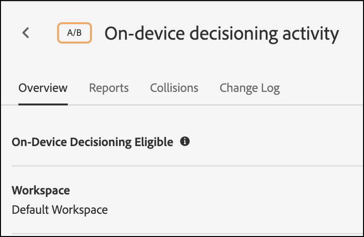

# [!UICONTROL オンデバイス判定] （at.js 用）

バージョン 2.5.0 以降、at.js オファー [!UICONTROL オンデバイス判定]. [!UICONTROL オンデバイス判定] を使用して、 [A/B テスト](https://experienceleague.adobe.com/docs/target/using/activities/abtest/test-ab.html) および [エクスペリエンスのターゲット設定](https://experienceleague.adobe.com/docs/target/using/activities/experience-targeting/experience-target.html) (XT) ブラウザー上でのアクティビティ。 [!DNL Adobe Target] Edge ネットワーク。

>[!NOTE]
>
>[!UICONTROL オンデバイス判定] は、クライアント側実装とサーバー側実装の両方で使用できます。 この記事では、 [!UICONTROL オンデバイス判定] （クライアント側） に関する情報 [!UICONTROL オンデバイス判定] サーバー側の場合は、サーバー側実装のドキュメントを参照してください。 [ここ](../../../server-side/sdk-guides/on-device-decisioning/overview.md).

[!DNL Target] また、は、実験や機械学習に基づく（ML 駆動の）パーソナライゼーションアクティビティから、ライブサーバー呼び出しを介して、最も関連性の高い最新のエクスペリエンスを提供する柔軟性も提供します。 つまり、パフォーマンスが最も重要な場合、 [!UICONTROL オンデバイス判定]. ただし、最も関連性の高い最新の ML 駆動型エクスペリエンスが必要な場合は、代わりにサーバー呼び出しをおこなうことができます。

## のメリット [!UICONTROL オンデバイス判定]?

の利点 [!UICONTROL オンデバイス判定] 次を含む：

* **超高速な意思決定とエクスペリエンスを提供します。** グループ化と判定は、ネットワークリクエストのブロックを防ぐために、メモリ内およびブラウザーで実行されます。
* **アプリケーションのパフォーマンスを向上させます。** エンドユーザーエクスペリエンスを損なうことなく、実験を実行し、パーソナライゼーションを顧客およびユーザーに提供します。
* **Googleサイトの品質スコアを改善します。** メモリ内で判定がおこなわれるので、オンラインビジネスのGoogleサイトの品質スコアを向上させ、消費者が見つけやすくします。
* **リアルタイム分析から学ぶ。** を通じて、アクティビティのパフォーマンスからリアルタイムでインサイトを得る [Analytics for Target](https://experienceleague.adobe.com/docs/target/using/integrate/a4t/a4t.html) (A4T) レポート。 A4T を使用すると、重要な時点で戦略をピボットできます。

## サポートされる機能

The [!DNL Adobe Target] JS SDK は、お客様がパフォーマンスと決定のためのデータの鮮度を柔軟に選択できるようにします。 つまり、機械学習を通じて最も関連性が高く、パーソナライズされたコンテンツを配信することが最も重要な場合は、ライブサーバー呼び出しをおこなう必要があります。 しかし、パフォーマンスがより重要な場合は、デバイス上およびメモリ内での判断が必要です。 の場合 [!UICONTROL オンデバイス判定] 機能するには、サポートされる機能のリストを参照してください。

* アクティビティのタイプ
* オーディエンスのターゲティング
* 配分方法

詳しくは、 [次の機能でサポートされます。 [!UICONTROL オンデバイス判定]](/help/dev/implement/client-side/atjs/on-device-decisioning/supported-features.md).

## 方法 [!UICONTROL オンデバイス判定] 仕事？

を使用して at.js をデプロイおよび初期化する場合 [!UICONTROL オンデバイス判定] 有効、 [ルールアーティファクト](/help/dev/implement/client-side/atjs/on-device-decisioning/rule-artifact.md) を含む [!UICONTROL オンデバイス判定] A/B および XT のアクティビティ、オーディエンスおよびアセットは、訪問者に最も近い Akamai CDN からダウンロードされ、訪問者のブラウザーにローカルにキャッシュされます。 エクスペリエンスを取得するリクエストが at.js からおこなわれると、キャッシュされたルールアーティファクトでエンコードされたメタデータに基づいて、返されるエクスペリエンスに関する決定がメモリ内でおこなわれます。

## 判定方法

を使用 [!UICONTROL オンデバイス判定], [!DNL Target] では、「判定方法」という新しい設定を導入します。 判定方法の設定は、at.js がエクスペリエンスを提供する方法を示します。 判定方法には次の 3 つの値があります。

* サーバー側のみ
* オンデバイスのみ
* ハイブリッド

### サーバー側のみ

at.js 2.5.0 以降が実装され web プロパティにデプロイされる場合に標準で設定されているデフォルトの判定方法はサーバー側のみです。

サーバー側のみ をデフォルト設定として使用すると、すべての決定は [!DNL Target] エッジネットワーク上で行われます。これにはブロッキングサーバーコールが必要になります。このアプローチは、徐々に遅延を引き起こす可能性がありますが、適用する機能を提供するなど、大きなメリットも提供します [!DNL Target]を含むの機械学習機能 [Recommendations](https://experienceleague.adobe.com/docs/target/using/recommendations/recommendations.html), [Automated Personalization](https://experienceleague.adobe.com/docs/target/using/activities/automated-personalization/automated-personalization.html) (AP) および [自動ターゲット](https://experienceleague.adobe.com/docs/target/using/activities/auto-target/auto-target-to-optimize.html) アクティビティ。

さらに、 [!DNL Target]のユーザープロファイルは、セッションやチャネルをまたいで保持され、ビジネスに強力な成果をもたらすことができます。

最後に、サーバー側のみ では、Adobe Experience Cloud を使用して、Audience Manager セグメントや Adobe Analytics セグメントを介してターゲティングできるオーディエンスを微調整できます。

次の図は、訪問者、ブラウザー、at.js 2.5.0 以降および [!DNL Adobe Target] Edge ネットワーク。 このフロー図は、新規訪問者と再訪問者を取り込みます。

（全幅に拡大するには、画像をクリックします）。

{zoomable=&quot;yes&quot;}

次のリストは、ダイアグラムの数値に対応しています。

| 手順 | 説明 |
| --- | --- |
| 1 | Experience Cloud訪問者 ID は、 [Adobe Experience Cloud Identity Service](https://experienceleague.adobe.com/docs/id-service/using/home.html?). |
| 2 | at.js ライブラリがドキュメント本文を同期的に読み込み、非表示にします。<br />   at.js ライブラリは、ページに実装されているオプションの事前非表示スニペットを使用して非同期で読み込むこともできます。 |
| 3 | at.js ライブラリでは、ちらつきを防ぐために本文を非表示にします。 |
| 4 | ページ読み込みリクエストが実行され、（ECID、顧客 ID、カスタムパラメーター、ユーザープロファイルなど）設定済みのすべてのパラメーターが含まれます。 |
| 5 | プロファイルスクリプトが実行されてから、プロファイルストアにフィードされます。<br />プロファイルストアは、オーディエンスライブラリから正規のオーディエンスをリクエストします ( 例えば、Adobe Analytics、Adobe Audience Managerなどから共有されたオーディエンス )。<br />顧客属性がバッチ処理でプロファイルストアに送信されます。 |
| 6 | プロファイルストアは、アクティビティをフィルタリングするために、オーディエンスの選定とグループ化に使用されます。 |
| 7 | 結果のコンテンツは、エクスペリエンスがライブから判断された後に選択されます [!DNL Target] アクティビティ。 |
| 8 | at.js ライブラリでは、レンダリングが必要なエクスペリエンスに関連付けられている、ページ上の対応する要素を非表示にします。 |
| 9 | at.js ライブラリは、本文を表示し、訪問者が表示できるように、残りのページを読み込むことができます。 |
| 10 | at.js ライブラリは DOM を操作して、 [!DNL Target] Edge ネットワーク。 |
| 11 | エクスペリエンスが訪問者用にレンダリングされます。 |
| 12 | Web ページ全体が読み込まれます。 |
| 13 | Analytics データがデータ収集サーバーに送信されます。 |
| 14 | ターゲットデータは、SDID を使用して Analytics データに適合され、Analytics レポートストレージへと処理されます。[!DNL Target]Analytics for [!UICONTROL （A4T）レポートを使用して、Analytics データが Analytics および ]Target に表示できるようになります。 |

### オンデバイスのみ

オンデバイスのみが、at.js 2.5.0 以降で設定する必要がある判定方法です ( [!UICONTROL オンデバイス判定] は、Web ページ全体でのみ使用する必要があります。

[!UICONTROL オンデバイス判定] は、に適合するすべてのアクティビティを含むキャッシュされたルールアーティファクトから決定されるので、超高速でエクスペリエンスとパーソナライゼーションアクティビティを配信できます。 [!UICONTROL オンデバイス判定].

どのアクティビティが適合するかを確認するには [!UICONTROL オンデバイス判定]を参照してください。 [でサポートされる機能 [!UICONTROL オンデバイス判定]](/help/dev/implement/client-side/atjs/on-device-decisioning/supported-features.md).

この判定方法は、Target からの意思決定を必要とするすべてのページでパフォーマンスが非常に重要な場合にのみ使用してください。 さらに、この判定方法を選択した場合、オンデバイス判定の対象とならない [!DNL Target] アクティビティは配信も実行もされないことに注意してください。at.js ライブラリ 2.5.0 以降は、キャッシュされたルールアーティファクトのみを探して決定を下すように設定されています。

次の図は、訪問者、ブラウザー、at.js 2.5.0 以降および Akamai CDN 間のインタラクションを示しています。 Akamai CDN は、訪問者の最初の訪問に関するルールアーティファクトをキャッシュします。 新しい訪問者が最初にページを訪問する際には、JSON ルールアーティファクトを Akamai CDN からダウンロードして、訪問者のブラウザーにローカルにキャッシュする必要があります。 JSON ルールアーティファクトがダウンロードされた後、ネットワーク呼び出しをブロックせずに、即座に判定がおこなわれます。 次のフロー図は、新規訪問者を示しています。

（全幅に拡大するには、画像をクリックします）。

{zoomable=&quot;yes&quot;}

次のリストは、ダイアグラムの数値に対応しています。

>[!NOTE]
>
>[!DNL Adobe Target] 管理サーバーは、に該当するすべてのアクティビティを認定します [!UICONTROL オンデバイス判定]を生成し、JSON ルールアーティファクトを生成して、Akamai CDN に反映します。 アクティビティで、Akamai CDN に反映される新しい JSON ルールアーティファクトを出力するための更新が継続的に監視されます。

| 手順 | 説明 |
| --- | --- |
| 1 | Experience Cloud訪問者 ID は、 [Adobe Experience Cloud Identity Service](https://experienceleague.adobe.com/docs/id-service/using/home.html). |
| 2 | at.js ライブラリがドキュメント本文を同期的に読み込み、非表示にします。<br />at.js ライブラリは、ページに実装されているオプションの事前非表示スニペットを使用して非同期で読み込むこともできます。 |
| 3 | at.js ライブラリでは、ちらつきを防ぐために本文を非表示にします。 |
| 4 | at.js ライブラリは、訪問者に最も近い Akamai CDN から JSON ルールアーティファクトを取得するリクエストを作成します。 |
| 5 | Akamai CDN は、JSON ルールアーティファクトを使用して応答します。 |
| 6 | JSON ルールアーティファクトは、訪問者のブラウザー上でローカルにキャッシュされます。 |
| 7 | at.js ライブラリは、JSON ルールアーティファクトを解釈し、エクスペリエンスを取得する決定を実行し、テストされた要素を非表示にします。 |
| 8 | at.js ライブラリは、本文を表示し、訪問者が表示できるように、残りのページを読み込むことができます。 |
| 9 | at.js ライブラリは DOM を操作して、キャッシュされた JSON ルールアーティファクトからエクスペリエンスをレンダリングします。 |
| 10 | エクスペリエンスが訪問者用にレンダリングされます。 |
| 11 | Web ページ全体が読み込まれます。 |
| 12 | Analytics データがデータ収集サーバーに送信されます。ターゲットデータは、SDID を使用して Analytics データに適合され、Analytics レポートストレージへと処理されます。[!DNL Target]Analytics for [!UICONTROL （A4T）レポートを使用して、Analytics データが Analytics および ]Target に表示できるようになります。 |

次の図は、訪問者の後続のページヒットまたは再訪問に対する、訪問者、ブラウザー、at.js 2.5.0 以降、キャッシュされた JSON ルールアーティファクト間のインタラクションを示しています。 JSON ルールアーティファクトは既にキャッシュされ、ブラウザーで使用できるので、ネットワーク呼び出しをブロックすることなく、即座に決定がおこなわれます。 このフロー図は、後続のページナビゲーションまたは再訪問者をキャプチャします。

（全幅に拡大するには、画像をクリックします）。

{zoomable=&quot;yes&quot;}

次のリストは、ダイアグラムの数値に対応しています。

>[!NOTE]
>
>[!DNL Adobe Target] 管理サーバーは、に該当するすべてのアクティビティを認定します [!UICONTROL オンデバイス判定]を生成し、JSON ルールアーティファクトを生成して、Akamai CDN に反映します。 アクティビティで、Akamai CDN に反映される新しい JSON ルールアーティファクトを出力するための更新が継続的に監視されます。

| 手順 | 説明 |
| --- | --- |
| 1 | Experience Cloud訪問者 ID は、 [Adobe Experience Cloud Identity Service](https://experienceleague.adobe.com/docs/id-service/using/home.html). |
| 2 | at.js ライブラリがドキュメント本文を同期的に読み込み、非表示にします。<br />at.js ライブラリは、ページに実装されているオプションの事前非表示スニペットを使用して非同期で読み込むこともできます。 |
| 3 | at.js ライブラリでは、ちらつきを防ぐために本文を非表示にします。 |
| 4 | at.js ライブラリは、JSON ルールアーティファクトを解釈し、メモリ内の決定を実行してエクスペリエンスを取得します。 |
| 5 | テストされた要素は非表示になります。 |
| 6 | at.js ライブラリは、本文を表示し、訪問者が表示できるように、残りのページを読み込むことができます。 |
| 7 | at.js ライブラリは DOM を操作して、キャッシュされた JSON ルールアーティファクトからエクスペリエンスをレンダリングします。 |
| 8 | エクスペリエンスが訪問者用にレンダリングされます。 |
| 9 | Web ページ全体が読み込まれます。 |
| 10 | Analytics データがデータ収集サーバーに送信されます。ターゲットデータは、SDID を使用して Analytics データに適合され、Analytics レポートストレージへと処理されます。[!DNL Target]Analytics for [!UICONTROL （A4T）レポートを使用して、Analytics データが Analytics および ]Target に表示できるようになります。 |

### ハイブリッド

ハイブリッドは、at.js 2.5.0 以降で、 [!UICONTROL オンデバイス判定] と、 [!DNL Adobe Target] Edge ネットワークを実行する必要があります。

両方を管理している場合 [!UICONTROL オンデバイス判定] アクティビティとサーバー側のアクティビティは、のデプロイとプロビジョニングの方法を考える際に、少し複雑で面倒な場合があります [!DNL Target] 」と入力します。 ハイブリッド判定方法では、サーバー側実行が必要なアクティビティについて エッジネットワークに対してサーバーコールを行う必要がある場合と、オンデバイス判定のみを実行する必要がある場合を [!DNL Target] が把握しています。[!DNL Adobe Target]

JSON ルールのアーティファクトには、mbox がサーバー側のアクティビティを実行しているか、または [!UICONTROL オンデバイス判定] アクティビティ。 この判定方法では、迅速に配信する予定のアクティビティは、 [!UICONTROL オンデバイス判定] また、より強力な ML 駆動型パーソナライゼーションを必要とするアクティビティの場合、これらのアクティビティは、 [!DNL Adobe Target] Edge ネットワーク。

次の図は、訪問者、ブラウザー、at.js 2.5.0 以降、Akamai CDN および [!DNL Adobe Target] Edge ネットワークを使用します。 この図から取り上げるべき点は、JSON ルールアーティファクトは、非同期でダウンロードされる一方で、決定は [!DNL Adobe Target] Edge ネットワーク。

この方法では、多数のアクティビティを含む可能性があるアーティファクトのサイズが、判定の待ち時間に悪影響を与えないようにします。 JSON ルールアーティファクトを同期的にダウンロードし、その後に決定をおこなう場合も、遅延に悪影響を与え、一貫性が失われる可能性があります。 したがって、ハイブリッド判定方法は、新しい訪問者に対して常にサーバー側で判定を呼び出し、JSON ルールアーティファクトが並行してキャッシュされるので、お勧めのベストプラクティスです。 以降のページ訪問と再訪問では、JSON ルールアーティファクトを通じて、キャッシュとメモリ内から決定がおこなわれます。

（全幅に拡大するには、画像をクリックします）。

{zoomable=&quot;yes&quot;}

次のリストは、ダイアグラムの数値に対応しています。

>[!NOTE]
>
>[!DNL Adobe Target] 管理サーバーは、に該当するすべてのアクティビティを認定します [!UICONTROL オンデバイス判定]を生成し、JSON ルールアーティファクトを生成して、Akamai CDN に反映します。 アクティビティで、Akamai CDN に反映される新しい JSON ルールアーティファクトを出力するための更新が継続的に監視されます。

| 手順 | 説明 |
| --- | --- |
| 1 | Experience Cloud訪問者 ID は、 [Adobe Experience Cloud Identity Service](https://experienceleague.adobe.com/docs/id-service/using/home.html). |
| 2 | at.js ライブラリがドキュメント本文を同期的に読み込み、非表示にします。<br />at.js ライブラリは、ページに実装されているオプションの事前非表示スニペットを使用して非同期で読み込むこともできます。 |
| 3 | at.js ライブラリでは、ちらつきを防ぐために本文を非表示にします。 |
| 4 | ページ読み込みリクエストが [!DNL Adobe Target] Edge ネットワーク（ECID、顧客 ID、カスタムパラメーター、ユーザープロファイルなど、設定済みのすべてのパラメーターを含む）。 |
| 5 | 同時に、at.js は、訪問者に最も近い Akamai CDN から JSON ルールアーティファクトを取得するリクエストをおこないます。 |
| 6 | ([!DNL Adobe Target] Edge Network) プロファイルスクリプトが実行されてから、プロファイルストアにフィードされます。 プロファイルストアは、オーディエンスライブラリから正規のオーディエンスをリクエストします ( 例えば、Adobe Analytics、Adobe Audience Managerなどから共有されたオーディエンス )。 |
| 7 | Akamai CDN は、JSON ルールアーティファクトを使用して応答します。 |
| 8 | プロファイルストアは、アクティビティをフィルタリングするために、オーディエンスの選定とグループ化に使用されます。 |
| 9 | 結果のコンテンツは、エクスペリエンスがライブから判断された後に選択されます [!DNL Target] アクティビティ。 |
| 10 | at.js ライブラリでは、レンダリングが必要なエクスペリエンスに関連付けられている、ページ上の対応する要素を非表示にします。 |
| 11 | at.js ライブラリは、本文を表示し、訪問者が表示できるように、残りのページを読み込むことができます。 |
| 12 | at.js ライブラリは DOM を操作して、 [!DNL Target] Edge ネットワーク。 |
| 13 | エクスペリエンスが訪問者用にレンダリングされます。 |
| 14 | Web ページ全体が読み込まれます。 |
| 15 | Analytics データがデータ収集サーバーに送信されます。ターゲットデータは、SDID を使用して Analytics データに適合され、Analytics レポートストレージへと処理されます。[!DNL Target]Analytics for [!UICONTROL （A4T）レポートを使用して、Analytics データが Analytics および ]Target に表示できるようになります。 |

次の図は、後続のページナビゲーションまたは再訪問での、訪問者、ブラウザー、at.js 2.5.0 以降、キャッシュされた JSON ルールアーティファクト間のインタラクションを示しています。 この図では、後続のページナビゲーションまたは再訪問でデバイス上の決定がおこなわれる使用例にのみ焦点を当てます。 特定のページに対してどのアクティビティがライブになっているかに応じて、サーバー側の決定を実行するためにサーバー側の呼び出しがおこなわれる場合があることに注意してください。

（全幅に拡大するには、画像をクリックします）。

{zoomable=&quot;yes&quot;}

次のリストは、ダイアグラムの数値に対応しています。

>[!NOTE]
>
>[!DNL Adobe Target] 管理サーバーは、に該当するすべてのアクティビティを認定します [!UICONTROL オンデバイス判定]を生成し、JSON ルールアーティファクトを生成して、Akamai CDN に反映します。 アクティビティで、Akamai CDN に反映される新しい JSON ルールアーティファクトを出力するための更新が継続的に監視されます。

| 手順 | 説明 |
| --- | --- |
| 1 | Experience Cloud訪問者 ID は、 [Adobe Experience Cloud Identity Service](https://experienceleague.adobe.com/docs/id-service/using/home.html). |
| 2 | at.js ライブラリがドキュメント本文を同期的に読み込み、非表示にします。<br />at.js ライブラリは、ページに実装されているオプションの事前非表示スニペットを使用して非同期で読み込むこともできます。 |
| 3 | at.js ライブラリでは、ちらつきを防ぐために本文を非表示にします。 |
| 4 | エクスペリエンスを取得するリクエストが作成されます。 |
| 5 | at.js ライブラリによって、JSON ルールアーティファクトが既にキャッシュされていることが確認され、メモリ内で決定を実行してエクスペリエンスを取得します。 |
| 6 | テストされた要素は非表示になります。 |
| 7 | at.js ライブラリは、本文を表示し、訪問者が表示できるように、残りのページを読み込むことができます。 |
| 8 | at.js ライブラリは DOM を操作して、キャッシュされた JSON ルールアーティファクトからエクスペリエンスをレンダリングします。 |
| 9 | エクスペリエンスが訪問者用にレンダリングされます。 |
| 10 | Web ページ全体が読み込まれます。 |
| 11 | Analytics データがデータ収集サーバーに送信されます。ターゲットデータは、SDID を使用して Analytics データに適合され、Analytics レポートストレージへと処理されます。[!DNL Target]Analytics for [!UICONTROL （A4T）レポートを使用して、Analytics データが Analytics および ]Target に表示できるようになります。 |

## 有効にする方法 [!UICONTROL オンデバイス判定]?

[!UICONTROL オンデバイス判定] は、すべてに対して使用できます [!DNL Target] at.js 2.5.0 以降を使用するお客様

有効にするには [!UICONTROL オンデバイス判定]:

>[!NOTE]
>
>管理者または承認者が必要です [ユーザーロール](https://experienceleague.adobe.com/docs/target/using/administer/manage-users/user-management.html) :「オンデバイス判定」切り替えを有効または無効にします。

1. クリック **[!UICONTROL 管理]** > **[!UICONTROL 実装]** > **[!UICONTROL アカウントの詳細]**.
1. の下 **[!UICONTROL アカウントの詳細]**、スライド **[!UICONTROL オンデバイス判定]** 「オン」の位置に切り替えます。

   ![[!UICONTROL オンデバイス判定] トグル](assets/on-device-decisioning-toggle.png)

   「既存のすべての [!UICONTROL オンデバイス判定] 「アーティファクト内の認定済みアクティビティ」オプションは、 [!UICONTROL オンデバイス判定].
1. （条件付き）すべてをライブにする場合は、切り替えを「オン」の位置にスライドさせます。 [!DNL Target] 条件を満たすアクティビティ [!UICONTROL オンデバイス判定] を自動的にアーティファクトに含めます。

   この切り替えをオフにした場合は、次の項目を再作成してアクティブ化する必要があります。 [!UICONTROL オンデバイス判定] アクティビティを生成し、ルールアーティファクトに含める必要があります。 つまり、「オンデバイス判定」切り替えをオンにする前のライブ状態のアクティビティは、ルールアーティファクトには含まれません。

「オンデバイス判定」切り替えを有効にした後、 [!DNL Target] 生成と伝播を開始 [ルールアーティファクト](/help/dev/implement/client-side/atjs/on-device-decisioning/rule-artifact.md) を設定します。

>[!WARNING]
>
>初期化の前に、必ず切り替えを有効にしてください [!DNL Adobe Target] 使用する SDK [!UICONTROL オンデバイス判定]. ルールアーティファクトは、まず、生成して Akamai CDN に反映する必要があります ( [!UICONTROL オンデバイス判定] を有効にします。 最初のルールアーティファクトが生成されて Akamai CDN に反映されるまで、伝播には 5～10 分かかる場合があります。

## at.js 2.5.0 以降で [!UICONTROL オンデバイス判定]?

1. クリック **[!UICONTROL 管理]** > **[!UICONTROL 実装]** > **[!UICONTROL アカウントの詳細]**.
1. の下 **[!UICONTROL 実装方法]** > **[!UICONTROL 主な実装方法]**&#x200B;をクリックし、 **[!UICONTROL 編集]** を at.js バージョンの横に置きます（at.js 2.5.0 以降にする必要があります）。

   

   >[!WARNING]
   >
   >これらのデフォルト設定を変更する前に、現在の実装に影響を与えないように、ClientCare にお問い合わせください。

1. 目的の判定方法を選択します。

   * サーバー側のみ
   * オンデバイスのみ
   * ハイブリッド

   

### グローバル設定

すべての [!DNL Target] 決定。 様々な判定方法は、サーバー側のみ、オンデバイスのみ、ハイブリッドです。 選択された判定方法 ( [!DNL Target] UI はで設定されます。 `window.targetGlobalSettings` の下に `decisioningMethod` フィールドに入力します。 詳しくは、 `decisioningMethod` in [targetGlobalSettings()](/help/dev/implement/client-side/atjs/atjs-functions/targetglobalsettings.md#decisioningmethod).

```javascript {line-numbers="true"}
<head> 
    <script type="text/javascript">

        window.targetGlobalSettings = { 
            clientCode: "yourClientCodeHere", 
            imsOrgId: "imsOrgId@AdobeOrg", 
            decisioningMethod: "on-device"

        }; 
    </script>

    <script type="text/javascript" src="at.js"></script> 
</head>
```

### カスタマイズされた設定

次の場合、 `decisioningMethod` in `window.targetGlobalSettings`を返しますが、 `decisioningMethod` 次の期間 [!DNL Adobe Target] ユースケースに従った決定では、以下の項目を指定してこの手順を実行できます。 `decisioningMethod` at.js2.5.0 以降の [getOffers()](/help/dev/implement/client-side/atjs/atjs-functions/adobe-target-getoffers-atjs-2.md) を呼び出します。

```javascript {line-numbers="true"}
adobe.target.getOffers({ 

  decisioningMethod:"on-device", 
  request: { 
    execute: { 
      mboxes: [ 
        { 
          index: 0, 
          name: "homepage" 
        } 
      ] 
    } 
 } 
});
```

>[!NOTE]
>
>getOffers() 呼び出しで「オンデバイス」または「ハイブリッド」を判定メソッドとして使用するには、グローバル設定に `decisioningMethod` を「on-device」または「hybrid」として設定できます。 at.js ライブラリ 2.5.0 以降は、ページに読み込んだ直後に、JSON ルールアーティファクトをダウンロードしてキャッシュするかどうかを把握している必要があります。 グローバル設定の判定メソッドが「サーバー側」に設定され、「オンデバイス」または「ハイブリッド」の判定メソッドが getOffers() 呼び出しに渡された場合、at.js 2.5.0 以降では、JSON ルールアーティファクトがキャッシュされず、オンデバイスの判定が実行されます。

### アーティファクトキャッシュ TTL

Target は、に適合するアクティビティを表します。 [!UICONTROL オンデバイス判定] は、メタデータ、ルール、条件で構成されるアーティファクトとして使用されます。 このアーティファクトは Akamai CDN 上にキャッシュされます。 ユーザーの初回訪問中に、ユーザーのブラウザーは、 [!UICONTROL オンデバイス判定] アクティビティ。

その後のサイト訪問時に、ブラウザーは、新しいバージョンのアーティファクトをダウンロードする必要があるかどうかを自動的に確認します。 このチェックは待ち時間を追加します。 アーティファクトキャッシュの TTL は、最後に正常にダウンロードされてからの更新済みアーティファクトをブラウザーで確認しない分数を定義します。 期間が長いほど、パフォーマンスが向上します。 時間枠が短いほど、データの鮮度が向上しますが、待ち時間が長くなります。

## アクティビティが [!UICONTROL オンデバイス判定] 適格か？

次の条件を満たすアクティビティを作成した後、 [!UICONTROL オンデバイス判定] 有効。デバイス判定有効と読み取られたラベルは、アクティビティの概要ページに表示されます。



このラベルは、アクティビティが常に [!UICONTROL オンデバイス判定]. at.js 2.5.0 以降が [!UICONTROL オンデバイス判定] このアクティビティは、デバイス上で実行されます。 at.js 2.5.0 以降がオンデバイスを使用するように設定されていない場合、このアクティビティは、at.js からおこなわれるサーバー呼び出しを介して引き続き配信されます。

次の条件を満たすすべてのアクティビティに対してフィルターを適用できます [!UICONTROL オンデバイス判定] は、 On-Device Decisioning Eligible フィルターを介してアクティビティページで有効です。


>[!NOTE]
>
>次のアクティビティを作成してアクティブ化した後： [!UICONTROL オンデバイス判定] 有効な場合は、生成され Akamai CDN の POP（臨場感点）に反映されるルールアーティファクトに含められるまでに 5～10 分かかる場合があります。

## 次を確実にする手順の概要 [!UICONTROL オンデバイス判定] アクティビティは、at.js 2.5.0 を使用して配信されます+?

1. 次にアクセス： [!DNL Adobe Target] UI を開き、に移動します。 **[!UICONTROL 管理]** > **[!UICONTROL 実装]** > **[!UICONTROL アカウントの詳細]** 有効にする **[!UICONTROL オンデバイス判定]** 切り替え
1. を有効にします。 **[!UICONTROL &quot;既存のすべてを含める [!UICONTROL オンデバイス判定] アーティファクト内の適格なアクティビティ»]** 切り替え

   最初の JSON ルールアーティファクトの生成には、最大 10 分かかる場合があります。

1. の作成とアクティブ化 [次の条件でサポートされるアクティビティタイプ： [!UICONTROL オンデバイス判定]](/help/dev/implement/client-side/atjs/on-device-decisioning/supported-features.md)を確認し、 [!UICONTROL オンデバイス判定] 適格。
1. を設定します。 **[!UICONTROL 判定方法]** 次のいずれかを実行します。 **[!UICONTROL &quot;ハイブリッド&quot;]** または **[!UICONTROL &quot;On-device only&quot;]** at.js 設定 UI を使用します。
1. ページに at.js 2.5.0 以降をダウンロードしてデプロイします。
