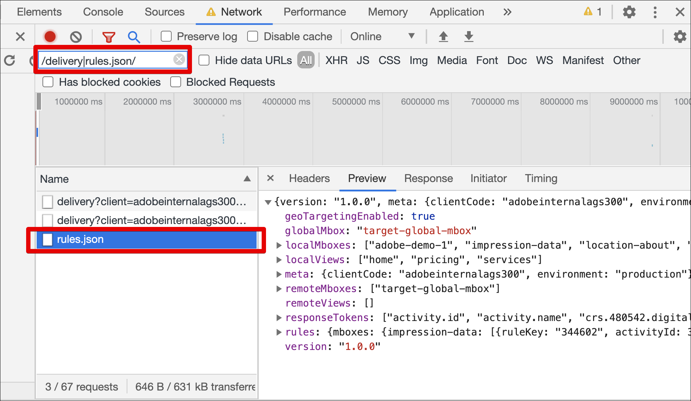

# at.js の [!UICONTROL on-device decisioning] のトラブルシューティング

at.js JavaScript ライブラリを使用して [!UICONTROL on-device decisioning] のトラブルシューティングを行 [!UICONTROL Adobe Target] には、次の手順を実行します。

## 手順 1:at.js のコンソールログを有効にする

URL パラメーター `mboxDebug=1` を追加すると、at.js でブラウザーのコンソールにメッセージを印刷できます。

すべてのメッセージには、概要を見やすくするために「AT:」というプレフィックスが含まれています。 アーティファクトが正常に読み込まれたことを確認するには、コンソールログに次のようなメッセージが含まれています。

```
AT: LD.ArtifactProvider fetching artifact - https://assets.adobetarget.com/your-client-cide/production/v1/rules.json
AT: LD.ArtifactProvider artifact received - status=200
```

次の図は、コンソールログに表示されるこれらのメッセージを示しています。

（全幅に拡大するには、画像をクリックします）。

{zoomable="yes"}

## 手順 2：ブラウザーの「ネットワーク」タブでルールアーティファクトのダウンロードを確認する

ブラウザーの「ネットワーク」タブを開きます。

例えば、Google Chromeで DevTools を開くには：

1. Ctrl + Shift + J キー（Windows）または Command + Option + J キー（Mac）を押します。
1. 「ネットワーク」タブに移動します。
1. キーワード「rules.json」で呼び出しをフィルタリングして、アーティファクトのルールファイルのみが表示されるようにします。

   さらに、「/delivery|rules.json/」でフィルタリングすると、すべての Target 呼び出しとアーティファクトの rules.json を表示できます。

   

## 手順 3:at.js カスタムイベントを使用したルールアーティファクトのダウンロードの検証

at.js ライブラリは、[!UICONTROL on-device decisioning] れをサポートするために 2 つの新しいカスタムイベントをディスパッチします。

* `adobe.target.event.ARTIFACT_DOWNLOAD_SUCCEEDED`
* `adobe.target.event.ARTIFACT_DOWNLOAD_FAILED`

アーティファクトルールファイルのダウンロードの成功または失敗に対して、アプリケーションでこれらのカスタムイベントをリッスンしてアクションを実行するように購読できます。

次の例は、アーティファクトのダウンロードの成功および失敗イベントをリッスンするコードのサンプルを示しています。

```javascript {line-numbers="true"}
document.addEventListener(adobe.target.event.ARTIFACT_DOWNLOAD_SUCCEEDED, function(e) { 
  console.log("Artifact successfully downloaded", e.detail);
}, false);

document.addEventListener(adobe.target.event.ARTIFACT_DOWNLOAD_FAILED, function(e) { 
  console.log("Artifact failed to download", e.detail);
}, false);
```
