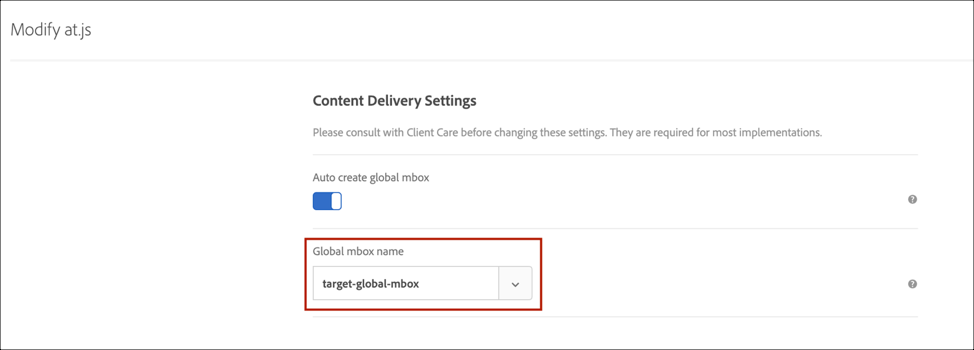

# at.js 1.*x* から at.js 2.*x へのアップグレード*

at.js の最新バージョンは、次世代のクライアント側のテクノロジーで、パーソナライゼーションを実行するための機能セットを提供します。[!DNL Adobe Target]この新しいバージョンは、シングルページアプリケーション（SPA）と調和したインタラクションを実現するための at.js のアップグレードに焦点を当てています。

以前のバージョンでは利用できない、at.js 2.*x* を使用するメリットを紹介します。

* ページ読み込み時にすべてのオファーをキャッシュし、複数のサーバー呼び出しを単一のサーバー呼び出しに減らす機能。
* 従来のサーバー呼び出しで発生する遅延時間なしで、キャッシュ経由でオファーが即座に表示されるため、サイトでのエンドユーザーのエクスペリエンスが著しく向上します。
* 1 行のシンプルなコードと開発者による 1 回限りのセットアップで、マーケターが作成して実行できる [!UICONTROL A/B テスト] および [!UICONTROL エクスペリエンスのターゲット設定] (XT) アクティビティをSPA上の VEC 経由で操作できます。

## at.js 2.*x* のシステム図

次の図は、ビューを使用した at.js 2.*x* のワークフローと、これが SPA 統合をどのように強化するかについて説明しています。at.js 2.*x* で使用されている概念に関するより詳しい概要については、[シングルページアプリケーションの実装](/help/dev/implement/client-side/atjs/how-to-deployatjs/target-atjs-single-page-application.md)を参照してください。

（全幅に拡大するには、画像をクリックします）。

{zoomable=&quot;yes&quot;}

| 呼び出し | 詳細 |
| --- | --- |
| 1 | 呼び出しによって [!UICONTROL Experience CloudID] ユーザーが認証されると、別の呼び出しが顧客 ID を同期します。 |
| 2 | at.js ライブラリがドキュメント本文を同期的に読み込み、非表示にします。<P>at.js は、ページに実装されているスニペットを非表示にするオプションを使用して非同期で読み込むこともできます。 |
| 3 | すべての設定済みパラメーター（MCID、SDID および顧客 ID）を含む、ページ読み込みリクエストがおこなわれます。 |
| 4 | プロファイルスクリプトが実行されてから、プロファイルストアにフィードされます。ストアは、オーディエンスライブラリから正規のオーディエンスをリクエストします（例えば､[!DNL Adobe Analytics]、[!DNL Audience Manager] などから共有されたオーディエンス）。<P>顧客属性がバッチ処理でプロファイルストアに送信されます。 |
| 5 | URL リクエストパラメーターとプロファイルデータに基づいて、[!DNL Target] が現在のページおよび将来のビューでどのアクティビティおよびエクスペリエンスを訪問者に返すかを決定します。 |
| 6 | ターゲットコンテンツが（オプションで、追加のパーソナライゼーションに関するプロファイル値を含めて）ページに送り返されます。<P>デフォルトコンテンツがちらつくことなく、可能な限り迅速に現在のページ上のターゲットコンテンツが表示されます。<P>SPA でのユーザーアクションの結果として表示されるビューのターゲットコンテンツは、ブラウザーにキャッシュされます。そのため、`triggerView()` を介してビューがトリガーされたときに追加のサーバー呼び出しをおこなわずに即座にターゲットコンテンツを適用できます。 |
| 7 | [!UICONTROL Analytics データがデータ収集サーバーに送信されます。] |
| 8 | ターゲットデータは、 [!UICONTROL Analytics] SDID を介してデータを処理し、 [!UICONTROL Analytics] レポートストレージ。<P>[!UICONTROL Analytics for ]（A4T）レポートを使用して、[!UICONTROL Analytics] データが [!DNL Target]Analytics[!UICONTROL  および ]Target に表示できるようになります。 |

これで、`triggerView()` が SPA のどこに 実装されているかに関わらず、ビューとアクションはキャッシュから取得され、サーバー呼び出しなしでユーザーに表示されるようになります。`triggerView()` は、インプレッション数を増分して記録するために、[!DNL Target] バックエンド に通知リクエストもおこないます。

（全幅に拡大するには、画像をクリックします）。

{zoomable=&quot;yes&quot;}

| 呼び出し | 詳細 |
| --- | --- |
| 1 | `triggerView()` は SPA で呼び出され、ビューをレンダリングし、ビジュアル要素を変更ためのアクションを適用します。 |
| 2 | ビューのターゲットコンテンツがキャッシュから読み取られます。 |
| 3 | デフォルトコンテンツがちらつくことなく、可能な限り迅速にターゲットコンテンツが表示されます。 |
| 4 | 通知リクエストが [!DNL Target] プロファイルストア に送信され、アクティビティで訪問者がカウントされ、指標が増分されます。 |
| 5 | [!UICONTROL Analytics データがデータ収集サーバーに送信されます。] |
| 6 | [!DNL Target] データは、SDID を使用して Analytics データに適合され、Analytics レポートストレージへと処理されます。[!UICONTROL A4T レポートを使用して、Analytics データが Analytics for の両方に表示できるようになります。][!DNL Target] |

## at.js 2.*x*

at.js 2.*x* タグを使用 [Adobe Experience Platform](/help/dev/implement/client-side/atjs/how-to-deployatjs/implement-target-using-adobe-launch.md) 拡張子。

>[!NOTE]
>
>タグを使用した at.js のデプロイ [!DNL Adobe Experience Platform] が推奨される方法です。
>
>または
>
>at.js 2.*x* の使用 [!DNL Target] UI と、 [選択する方法](/help/dev/implement/client-side/atjs/how-to-deployatjs/how-to-deployatjs.md).

## 廃止された at.js 関数

at.js 2.*x* では、いくつかの関数が廃止されました。

>[!WARNING]
>
>at.js 2.*x* がデプロイされているときにこれらの廃止された関数がサイトで引き続き使用されている場合、コンソールに警告が表示されます。アップグレードする際に推奨されるアプローチは、ステージング環境で at.js 2.*x* のデプロイメントをテストし、コンソールに記録されているすべての警告を確認し、廃止された関数を at.js 2.*x* で導入された新しい関数に変換することです。

廃止された関数とそれらに対応する関数は、以下のとおりです。関数の完全なリストについては、[at.js 関数](/help/dev/implement/client-side/atjs/atjs-functions/atjs-functions.md)を参照してください。

>[!NOTE]
>
>at.js 2.*x* では、`mboxDefault` としてマークされた要素は自動的に非表示にならなくなりました。したがって、サイト上またはタグマネージャーを介して、あらかじめ非表示にするロジックを手動で用意する必要があります。

### mboxCreate(mbox,params)

**説明**：

リクエストを実行し、`mboxDefault` クラス名を持つ最も近い DIV にオファーを適用します。

**例**：

```html {line-numbers="true"}
<div class="mboxDefault">
  default content to replace by offer
</div>
<script>
  mboxCreate('mboxName','param1=value1','param2=value2');
</script>
```

**at.js 2.*x* 相当**

`mboxCreate(mbox, params)` に代わるものは、`getOffer()` および `applyOffer()` です。

**例**：

```html {line-numbers="true"}
<div class="mboxDefault"> 
  default content to replace by offer 
</div> 
<script> 
  var el = document.currentScript.previousElementSibling;
  adobe.target.getOffer({
    mbox: "mboxName",
    params: {
      param1: "value1",
      param2: "value2"
    },
    success: function(offer) {
      adobe.target.applyOffer({
        mbox: "mboxName",
        selector: el,
        offer: offer
      });
    },
    error: function(error) {
      console.error(error);
      el.style.visibility = "visible";
    }
  });
</script> 
```

### mboxDefine() と mboxUpdate()

**説明**：

要素と mbox 名の間の内部マッピングを作成しますが、リクエストを実行しません。`mboxUpdate()` と併用します。この mboxUpdate がリクエストを実行し、`mboxDefine()` の nodeId で識別された要素にオファーを適用します。また、`mboxCreate` によって開始された mbox を更新するために使用できます。

**例**：

```html {line-numbers="true"}
<div id="someId" class="mboxDefault"></div>
<script>
 mboxDefine('someId','mboxName','param1=value1','param2=value2');
 mboxUpdate('mboxName','param3=value3','param4=value4');
</script>
```

**at.js 2.*x* 相当**：

`mboxDefine()` と `mboxUpdate` に代わるものは、`getOffer()` と `applyOffer()`（`applyOffer()` でセレクターオプションを使用）です。この方法を使用すると、ID を持つ要素だけではなく、CSS セレクターを使用してオファーを要素にマッピングできます。

**例**：

```html {line-numbers="true"}
<div id="someId" class="mboxDefault"> 
  default content to replace by offer 
</div> 
<script> 
  adobe.target.getOffer({
    mbox: "mboxName",
    params: {
      param1: "value1",
      param2: "value2",
      param3: "value3",
      param4: "value4" 
    },
    success: function(offer) {
      adobe.target.applyOffer({
        mbox: "mboxName",
        selector: "#someId",
        offer: offer
      });
    },
    error: function(error) {
      console.error(error);
      var el = document.getElementById("someId");
      el.style.visibility = "visible";
    }
  });
</script>
```

### adobe.target.registerExtension()

**説明**：

特定の拡張を登録するための標準的な方法を提供します。

この関数はサポートされなくなったため、使用しないでください。

## 2 で廃止、新規追加およびサポートされている at.js functio 関数の概要.*x*

| メソッド | 対応? | 新登場? | 廃止? <P>（デフォルトコンテンツが表示されます） |
| --- | --- | --- | --- |
| `getOffer()` | ○ |  |  |
| `getOffers()` |  | ○ |  |
| `applyOffer()` | ○ |  |  |
| `applyOffers()` |  | ○ |  |
| `triggerView()` |  | ○ |  |
| `trackEvent()` | ○ |  |  |
| `mboxCreate()` |  |  | ○ |
| `mboxDefine()`<P>`mboxUpdate()` |  |  | ○ |
| `targetGlobalSettings()` | ○ |  |  |
| `Data Providers` | ○ |  |  |
| `targetPageParams()` | ○ |  |  |
| `targetPageParamsAll()` | ○ |  |  |
| `registerExtension()` |  |  | ○ |
| `At.js Custom Events` | ○ |  |  |

## 制限事項と注意事項

次の制限事項と注意事項を把握しておいてください。

### コンバージョントラッキング

コンバージョントラッキングに `mboxCreate()` を使用している場合、`trackEvent()` または `getOffer()` を使用する必要があります。

### オファーの配信

`mboxCreate()` を `getOffer()` または `applyOffer()` で置き換えない場合、オファーが配信されない場合があります。

### at.js 2.*x* は、at.js 1.*x* を他のページに配置しますか？

できます。訪問者プロファイルは、異なるバージョンやライブラリを使用してページ間で保持されます。Cookie の形式は同じです。

### at.js 2.*x* で使用する新しい API

at.js 2.*x* は、Delivery API と呼ばれる新しい API を使用します。at.js が [!DNL Target] エッジサーバーに正しく接続する場合は、ブラウザーの開発者ツールの「ネットワーク」タブで、「delivery」、「`tt.omtrdc.net`、」、またはクライアントコードが含まれます。 また、[!DNL Target] はキーと値のペアの変わりに JSON ペイロードを送信します。

### [!DNL Target] グローバル mbox の廃止

at.js 2.*x*」と表示されなくなりました。`target-global-mbox`」が表示されます。 代わりに、`target-global-mbox`&quot;構文を&quot;に変更します。`execute > pageLoad`」という名前に変更され、 [!DNL Target] サーバーに割り当てられます。

```json {line-numbers="true"}
{
  "id": {
    // ...
  },
  "context": {
    "channel": "web",
    // ...
  },
  "execute": {
    "pageLoad": {}
  }
}
```

基本的に、グローバル mbox のコンセプトは、ページ読み込み時にオファーとコンテンツを取得するかについて [!DNL Target] へ通知するために導入されました。そのため、最新バージョンではこれをより明確にしています。

### at.js のグローバル mbox 名は重要ではなくなりましたか？

のお客様は、 **[!UICONTROL Target]** > **[!UICONTROL 管理]** > **[!UICONTROL 実装]** > **[!UICONTROL at.js 設定の編集]**. この設定は [!DNL Target] エッジサーバーによって使用され、execute > pageLoad が [!DNL Target] UI に表示されるグローバル mbox 名に変換されます。これにより、ユーザーはサーバーサイド API、フォームベースのコンポーザー、プロファイルスクリプトの使用状況、およびグローバル mbox 名を使用したオーディエンスを引き続き作成できます。同じグローバル mbox 名が **[!UICONTROL 管理]** > **[!UICONTROL Visual Experience Composer]** まだ at.js 1.*x*（以下の図を参照）。



および


### at.js 2.*x* では、自動作成 mbox 設定を有効にする必要がありますか？

ほとんどの場合では、有効にする必要があります。この設定は、ページ読み込み時に [!DNL Target] エッジサーバーにリクエストを送信するように at.js 2.*x* に指示します。グローバル mbox は execute > pageLoad に変換されているので、ページ読み込み時にリクエストを送信する場合、この設定を有効にする必要があります。

### at.js 2.*x* で Target のグローバル mbox 名が指定されていない場合でも、既存の VEC アクティビティは引き続き動作しますか？

動作します。execute > pageLoad は、`target-global-mbox` のような [!DNL Target] バックエンドで処理されるためです。

### フォームベースのアクティビティのターゲット設定先が `target-global-mbox` の場合、これらのアクティビティは引き続き機能しますか？

機能します。execute > pageLoad は、`target-global-mbox` のような [!DNL Target] エッジサーバーで処理されるためです。

### サポート対象およびサポート対象外の at.js 2.*x* 設定

| 設定 | 対応? |
| --- | --- |
| X-Domain | × |
| グローバル mbox 自動作成 | ○ |
| グローバル mbox 名 | ○ |

### at.js 2.x でのクロスドメイントラッキングサポート

クロスドメイントラッキングにより、様々なドメインをまたいで訪問者をスティッチできます。各ドメインに対して新しい Cookie を作成する必要があるので、ドメインからドメインにナビゲートする訪問者を追跡するのは困難です。クロスドメイントラッキングを実現するために、[!DNL Target] は、サードパーティ Cookie を使用してドメインをまたいで訪問者を追跡します。これにより、 [!DNL Target] 次に及ぶ活動 `siteA.com` および `siteB.com` およびの訪問者が一意のドメイン間をナビゲートする際にも、同じエクスペリエンスが維持されます。 この機能は、 [!DNL Target]のサードパーティ Cookie とファーストパーティ Cookie の動作に関連付けられています。

>[!NOTE]
>
>クロスドメイントラッキングは、at.js 2.10 以降でサポートされますが、at.js 2.1 では標準でサポートされていません。*x* 2.10 より前クロスドメイントラッキングは、at.js 2.*x* で Experience Cloud ID（ECID） ライブラリ v4.3.0 以降を使用するとサポートされます。

In [!DNL Target]の場合、サードパーティ Cookie は `<CLIENTCODE>.tt.omtrdc.net`.ファーストパーティ Cookie は、 `clientdomain.com`. 最初のリクエストは、HTTP 応答ヘッダーを返します。このヘッダーによって、`mboxSession` および `mboxPC` という名前のサードパーティ Cookie の設定が試行され、リダイレクトリクエストが追加のパラメーター（`mboxXDomainCheck=true`）と共に返されます。ブラウザーがサードパーティ Cookie を受け入れる場合、リダイレクトリクエストにはそれらの Cookie が含まれており、エクスペリエンスが返されます。このワークフローは、HTTP GET メソッドの使用により可能になっています。

ただし、at.js 2.*x*&#x200B;の場合、HTTPGETは使用されません。 代わりに、HTTPPOSTは at.js 2.*x* JSON ペイロードをに送信するには、以下を実行します。 [!DNL Target] エッジサーバー。 HTTPPOSTの使用は、ブラウザーがサードパーティ Cookie をサポートしているかどうかを確認するリダイレクトリクエストを意味します。 これは、HTTP GET リクエストがべき等性のあるトランザクションであるのに対し、HTTP POST はべき等性がなく、恣意的に繰り返してはならないためです。したがって、標準設定での at.js 2.*x* （2.10 より前）は、標準ではサポートされていません。 at.js 1.*x* のみ、クロスドメイントラッキングを標準設定でサポートします。

at.js v2.10 以降でクロスドメイントラッキングを使用するには、次のいずれかの操作をおこないます。

1. をインストールします。 [ECID ライブラリ v4.3.0 以降](https://experienceleague.adobe.com/docs/id-service/using/release-notes/release-notes.html?lang=ja) と at.js 2.*x* と共にインストールする必要があります。ECID ライブラリは、ドメインをまたいでも訪問者を識別するために使用される永続的な ID を管理するためにあります。ECID ライブラリ v4.3.0 以降および at.js 2.*x* をインストールしたら、一意のドメインにまたがるアクティビティを作成してユーザーを追跡できます。この機能は、セッションの有効期限が切れた後にのみ機能することに注意してください。

1. ECID ライブラリをインストールする代わりに、at.js v2.10 以降がある場合は、 [!DNL Target] の UI **[!UICONTROL 管理]** > **[!UICONTROL 実装]**. ( または、 _crossDomain_ 選択肢 _有効_ （at.js コード内）。

at.js v2 のバージョンでクロスドメイントラッキングを使用するには、以下を実行します。*x* 2.10 より前に、上記のオプション#1を実装できます（ECID ライブラリをインストール）。

### グローバル mbox 自動作成はサポートされています

この設定は、ページ読み込み時に [!DNL Target] エッジサーバーにリクエストを送信するように at.js 2.*x* に指示します。[!DNL Target] エッジサーバーによってグローバル mbox が execute > pageLoad に変換されているので、ページロード時にリクエストを発行する場合、この設定を有効にする必要があります。

### グローバル mbox 名はサポートされています

のお客様は、 **[!UICONTROL Target]** > **[!UICONTROL 管理]** > **[!UICONTROL 実装]** > **[!UICONTROL 編集]**. [!DNL Target] エッジサーバーがこの設定を使用して、execute > pageLoad を入力されたグローバル mbox 名に変換します。これによりユーザーは引き続き、サーバーサイド API、フォームベースのコンポーザー、プロファイルスクリプトの使用状況、およびグローバル mbox をターゲットにしたオーディエンスの作成ができます。

### 以下の at.js カスタムイベントは `triggerView()` に適用できますか？または `applyOffer()` や `applyOffers()` のみですか？

* `adobe.target.event.CONTENT_RENDERING_FAILED`
* `adobe.target.event.CONTENT_RENDERING_SUCCEEDED`
* `adobe.target.event.CONTENT_RENDERING_NO_OFFERS`
* `adobe.target.event.CONTENT_RENDERING_REDIRECT`

適用できます。at.js カスタムイベントは `triggerView()` にも適用できます。

### 電話する時に書いてある `triggerView()` &amp;lbrace;`"page" : "true"`&amp;rbrace;、通知を [!DNL Target] バックエンドに追加し、インプレッションを増やします。 これによりプロファイルスクリプトも実行されますか？

[!DNL Target] バックエンドに対してプリフェッチ呼び出しが実行されると、プロファイルスクリプトが実行されます。その後、影響を受けたプロファイルデータは暗号化され、クライアント側に返されます。`{"page": "true"}` を使用した `triggerView()` が呼び出されると、通知が暗号化されたプロファイルデータとともに送信されます。このとき、[!DNL Target] バックエンドはプロファイルデータを復号してデータベースに保存します。

### ちらつきに対処するために、`triggerView()` を呼び出す前に、事前に非表示になるコードを追加する必要がありますか？

不要です。`triggerView()` を呼び出す前に、事前に非表示になるコードを追加する必要はありません。at.js 2.*x* は、ビューが表示および適用される前に、事前非表示およびちらつきのロジックを管理します。

### at.js 1.*x* オーディエンス作成用のパラメーターは、at.js 2.*x* を使用）

次の at.js 1.x パラメーターは次のとおりです *NOT* 現在、at.js 2.*x*）を示します。

* browserHeight
* browserWidth
* browserTimeOffset
* screenHeight
* screenWidth
* screenOrientation
* colorDepth
* devicePixelRatio
* vst.*パラメーター（以下を参照）

### at.js 2.*x* では、vst を使用したオーディエンスの作成はサポートされていません。*パラメーター

at.js 1.*x* vst を使用できました。* mbox パラメーターを使用してオーディエンスを作成する必要があります。 これは、at.js 1.*x* mbox パラメーターを [!DNL Target] バックエンド。 at.js 2.*x*&#x200B;の場合、at.js 2.*x* では、mbox パラメーターの送信方法が異なります。

## at.js の互換性

次の表は、at.js について説明します。 2.*x* 様々なアクティビティタイプ、統合、機能および at.js 関数との互換性。

### アクティビティのタイプ

| タイプ | 対応? |
| --- | --- |
| [!UICONTROL A/B テスト] | ○ |
| [!UICONTROL 自動配分] | ○ |
| [!UICONTROL 自動ターゲット] | ○ |
| [!UICONTROL エクスペリエンスのターゲット設定] | ○ |
| [!UICONTROL 多変量分析テスト] | ○ |
| [!UICONTROL Automated Personalization] | ○ |
| [!DNL Recommendations] | ○ |

>[!NOTE]
>
>[!UICONTROL 自動ターゲット] アクティビティは at.js 2.*x* VEC( すべての変更が `Page Load Event`. 特定のビューに変更が追加された場合、 [!UICONTROL A/B テスト], [!UICONTROL 自動配分]、および [!UICONTROL エクスペリエンスのターゲット設定] (XT) アクティビティのみがサポートされます。

### 統合

| タイプ | 対応? |
| --- | --- |
| [!UICONTROL Analytics for Target]（A4T） | ○ |
| オーディエンス | ○ |
| 顧客属性 | ○ |
| AEM エクスペリエンスフラグメント | ○ |
| [Adobe Experience Platform拡張機能](/help/dev/implement/client-side/atjs/how-to-deployatjs/implement-target-using-adobe-launch.md) | ○ |
| デバッガー | ○ |
| Auditor | ルールはまだ at.js 2.*x* 向けに更新されていません。 |
| のオプトインサポート [GDPR](/help/dev/before-implement/privacy/cmp-privacy-and-general-data-protection-regulation.md) | これは、 [at.js バージョン 2.1.0](/help/dev/implement/client-side/atjs/target-atjs-versions.md#atjs-version-210-june-3-2019) または後で。 |
| AEM Enhanced Personalization powered by [!DNL Adobe Target] | × |

### 機能

| 機能 | 対応? |
| --- | --- |
| X-Domain | × |
| プロパティ、ワークスペース | ○ |
| QA リンク | ○ |
| フォームベースの Experience Composer | ○ |
| Visual Experience Composer（VEC） | ○ |
| カスタムコード | ○ |
| [レスポンストークン](#response-tokens) | ○ |
| クリックの追跡 | ○ |
| 複数アクティビティ配信 | ○ |
| targetGlobalSettings | はい（ただし X-Domain は不可） |
| at.js のメソッド | 次を除くすべてがサポートされています：<P>`mboxCreate()`<P>`mboxUpdate()`<P>`mboxDefine()`<P>デフォルトコンテンツを表示します。 |

### クエリ文字列パラメーター

| パラメーター | 対応? |
| --- | --- |
| `?mboxDisable` | ○ |
| `?mboxDisable` | ○ |
| `?mboxTrace` | ○ |
| `?mboxSession` | × |
| `?mboxOverride.browserIp` | ○ |

## レスポンストークン

at.js 2.*x* は、at.js 1.*x* と同様に、カスタムイベント `at-request-succeeded` を応答トークンに使用します。`at-request-succeeded` カスタムイベントを使用するコード例については「[応答トークン](https://experienceleague.adobe.com/docs/target/using/administer/response-tokens.html)」を参照してください。

## at.js 1.*x* のパラメーターから at.js 2.*x* へのペイロードマッピング

ここでは、at.js 1.*x* と at.js 2.*x* 間のマッピングについて説明します。

パラメーターマッピングを詳しく調べる前に、これらのライブラリバージョンが使用しているエンドポイントが変更されています。

* at.js 1.*x* - `http://<client code>.tt.omtrdc.net/m2/<client code>/mbox/json`
* at.js 2.*x* - `http://<client code>.tt.omtrdc.net/rest/v1/delivery`

もう 1 つの大きな違いは次のとおりです。

* at.js 1.*x* - クライアントコードはパスの一部です
* at.js 2.*x* - クライアントコードは、次のようなクエリ文字列パラメーターとして送信されます
  `http://<client code>.tt.omtrdc.net/rest/v1/delivery?client=democlient`

以下のセクションでは、各 at.js 1.*x* パラメータ、その説明、および対応する 2.*x* JSON ペイロード（該当する場合）:

### at_property

（at.js 1.*x* パラメーター）

[Enterprise ユーザー権限](https://experienceleague.adobe.com/docs/target/using/administer/manage-users/enterprise/property-channel.html?lang=ja)に使用されます。

```json {line-numbers="true"}
{
  ....
  "property": {
    "token": "1213213123122313121"
  }
  ....
}
```

### mboxHost

（at.js 1.*x* パラメーター）

ページのドメイン ( [!DNL Target] ライブラリが実行されます。

at.js 2.*x* JSON ペイロード：

```json {line-numbers="true"}
{
  "context": {
    "browser": {
       "host": "test.com"
    }
  }
}
```

### webGLRenderer

（at.js 1.*x* パラメーター）

ブラウザーの WEB GL レンダラー機能です。これは、訪問者のデバイスがデスクトップ、iPhone、Android デバイスなどであるかどうかを判断するためにデバイス検出メカニズムで使用されます。

at.js 2.*x* JSON ペイロード：

```json {line-numbers="true"}
{
  "context": {
    "browser": {
       "webGLRenderer": "AMD Radeon Pro 560X OpenGL Engine"
    }
  }
}
```

### mboxURL

（at.js 1.*x* パラメーター）

ページ URL です。

at.js 2.*x* JSON ペイロード：

```json {line-numbers="true"}
{
  "context": {
    "address": {
       "url": "http://test.com"
    }
  }
}
```

### mboxReferrer

（at.js 1.*x* パラメーター）

ページリファラーです。

at.js 2.*x* JSON ペイロード：

```json {line-numbers="true"}
{
  "context": {
    "address": {
       "referringUrl": "http://google.com"
    }
  }
}
```

### Mbox（名前）がグローバル mbox と等しい

（at.js 1.*x* パラメーター）

配信 API にグローバル mbox の概念がなくなりました。JSON ペイロードでは、`execute > pageLoad` を使用する必要があります。

at.js 2.*x* JSON ペイロード：

```json {line-numbers="true"}
{
  "execute": {
    "pageLoad": {
       "parameters": ....
       "profileParameters": ...
       .....
    }
  }
}
```

### Mbox（名前）が *グローバル mbox* と等しくない

（at.js 1.*x* パラメーター）

mbox 名を使用するには、`execute > mboxes` に渡します。mbox にはインデックスと名前が必要です。

at.js 2.*x* JSON ペイロード：

```json {line-numbers="true"}
{
  "execute": {
    "mboxes": [{
       "index": 0,
       "name": "some-mbox",
       "parameters": ....
       "profileParameters": ...
       .....
    }]
  }
}
```

### mboxId

（at.js 1.*x* パラメーター）

廃止。

### mboxCount

（at.js 1.*x* パラメーター）

廃止。

### mboxRid

（at.js 1.*x* パラメーター）

デバッグに役立つように、ダウンストリームシステムで使用されるリクエスト ID です。

at.js 2.*x* JSON ペイロード：

```json {line-numbers="true"}
{
  "requestId": "2412234442342"
  ....
}
```

### mboxTime

（at.js 1.*x* パラメーター）

廃止。

### mboxSession

（at.js 1.*x* パラメーター）

セッション ID は、クエリ文字列パラメーター（`sessionId`）として配信 API エンドポイントに送信されます。

### mboxPC

（at.js 1.*x* パラメーター）

`id > tntId` に TNT ID が渡されます。

at.js 2.*x* JSON ペイロード：

```json {line-numbers="true"}
{
  "id": {
    "tntId": "ca5ddd7e33504c58b70d45d0368bcc70.21_3"
  }
  ....
}
```

### mboxMCGVID

（at.js 1.*x* パラメーター）

`id > marketingCloudVisitorId` に Experience Cloud Visitor ID が渡されます。

at.js 2.*x* JSON ペイロード：

```json {line-numbers="true"}
{
  "id": {
    "marketingCloudVisitorId": "797110122341429343505"
  }
  ....
}
```

### `vst.aaaa.id` および `vst.aaaa.authState`

（at.js 1.*x* パラメーター）

`id > customerIds` に顧客 ID を渡す必要があります。

at.js 2.*x* JSON ペイロード：

```json {line-numbers="true"}
{
  "id": {
    "customerIds": [{
       "id": "1232131",
       "integrationCode": "aaaa",
       "authenticatedState": "....."
     }]
  }
  ....
}
```

### mbox3rdPartyId

（at.js 1.*x* パラメーター）

異なるリンクに使用する顧客サードパーティ ID [!DNL Target] ID。

at.js 2.*x* JSON ペイロード：

```json {line-numbers="true"}
{
  "id": {
    "thirdPartyId": "1232312323123"
  }
  ....
}
```

### mboxMCSDID

（at.js 1.*x* パラメーター）

SDID です（追加データ ID とも呼ばれます）。`experienceCloud > analytics > supplementalDataId` に渡される必要があります。

at.js 2.*x* JSON ペイロード：

```json {line-numbers="true"}
{
  "experienceCloud": {
    "analytics": {
      "supplementalDataId": "1212321132123131"
    }
  }
  ....
}
```

### vst. trk

（at.js 1.*x* パラメーター）

[!UICONTROL Analytics トラッキングサーバーです。]`experienceCloud > analytics > trackingServer` に渡される必要があります。

at.js 2.*x* JSON ペイロード：

```json {line-numbers="true"}
{
  "experienceCloud": {
    "analytics": {
      "trackingServer": "analytics.test.com"
    }
  }
  ....
}
```

### vst. trks

（at.js 1.*x* パラメーター）

Analytics トラッキングサーバーのセキュリティ保護`experienceCloud > analytics > trackingServerSecure` に渡される必要があります。

at.js 2.*x* JSON ペイロード：

```json {line-numbers="true"}
{
  "experienceCloud": {
    "analytics": {
      "trackingServerSecure": "secure-analytics.test.com"
    }
  }
  ....
}
```

### mboxMCGLH

（at.js 1.*x* パラメーター）

Audience Manager のロケーションヒント`experienceCloud > audienceManager > locationHint` に渡される必要があります。

at.js 2.*x* JSON ペイロード：

```json {line-numbers="true"}
{
  "experienceCloud": {
    "audienceManager": {
      "locationHint": 9
    }
  }
  ....
}
```

### mboxAAMB

（at.js 1.*x* パラメーター）

Audience Manager BLOB です。`experienceCloud > audienceManager > blob` に渡される必要があります。

at.js 2.*x* JSON ペイロード：

```json {line-numbers="true"}
{
  "experienceCloud": {
    "audienceManager": {
      "blob": "2142342343242342"
    }
  }
  ....
}
```

### mboxVersion

（at.js 1.*x* パラメーター）

バージョンは、version パラメーターを使用して、クエリ文字列パラメーターとして送信されます。

## トレーニングビデオ： at.js 2.*x* 建築図 

at.js 2.*x* Adobeを高める [!DNL Target]はSPAをサポートし、他のExperience Cloudソリューションと統合しています。 このビデオでは、すべてがどのように結び付いているかを説明します。

>[!VIDEO](https://video.tv.adobe.com/v/26250/?quality=12)

詳しくは、 [at.js 2.*x* 動作](https://experienceleague.adobe.com/docs/target-learn/tutorials/implementation/understanding-how-atjs-20-works.html) を参照してください。
