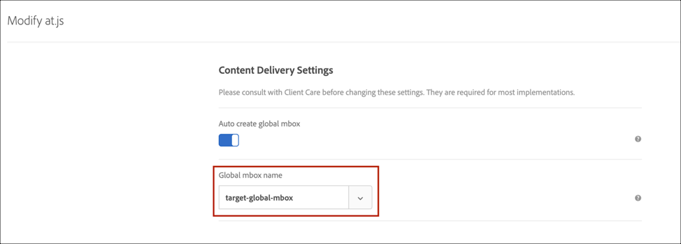
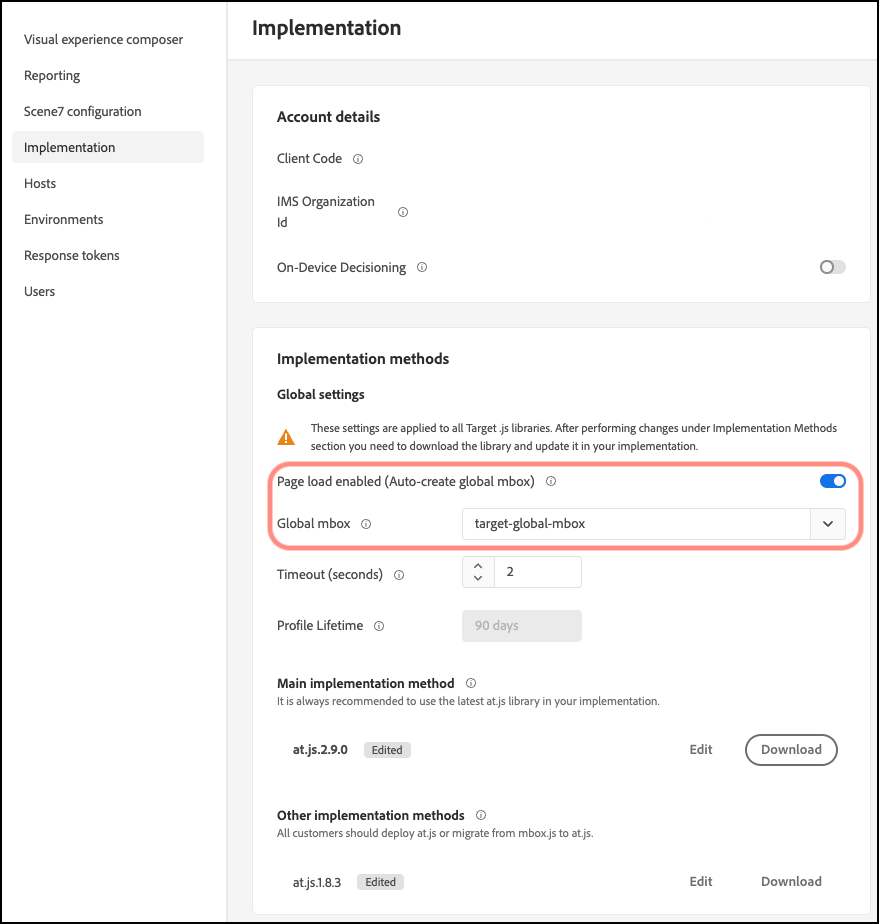

# at.js 1.*x*&#x200B;からat.js 2.*x*&#x200B;へのアップグレード

at.js の最新バージョンは、次世代のクライアント側のテクノロジーで、パーソナライゼーションを実行するための機能セットを提供します。[!DNL Adobe Target] この新しいバージョンは、シングルページアプリケーション（SPA）と調和したインタラクションを実現するための at.js のアップグレードに焦点を当てています。

以前のバージョンでは利用できないat.js 2.*x*&#x200B;を使用するメリットを次に示します。

* ページ読み込み時にすべてのオファーをキャッシュし、複数のサーバー呼び出しを単一のサーバー呼び出しに減らす機能。
* 従来のサーバー呼び出しで発生する遅延時間なしで、キャッシュ経由でオファーが即座に表示されるため、サイトでのエンドユーザーのエクスペリエンスが著しく向上します。
* シンプルな1行のコードと1回限りの開発者セットアップにより、マーケターはSPA上のVECを介して[!UICONTROL A/B テスト ]および[!UICONTROL  エクスペリエンス ターゲティング ] （XT）アクティビティを作成して実行できます。

## at.js 2.*x* システム図

次の図は、ビューを含むat.js 2.*x*&#x200B;のワークフローと、これがSPA統合をどのように強化するかを理解するのに役立ちます。 at.js 2.*x*&#x200B;で使用される概念をより詳しく説明するには、[単一ページアプリケーションの実装](/help/dev/implement/client-side/atjs/how-to-deployatjs/target-atjs-single-page-application.md)を参照してください。

（画像をクリックして全幅に拡大します）。

{zoomable="yes"}のTarget フロー

| 呼び出し | 詳細 |
| --- | --- |
| 1 | ユーザーが認証された場合、呼び出しは[!UICONTROL Experience Cloud ID]を返します。別の呼び出しは顧客IDを同期します。 |
| 2 | at.js ライブラリがドキュメント本文を同期的に読み込み、非表示にします。<P>at.jsは、ページに実装されたスニペットを事前に非表示にするオプションを使用して、非同期で読み込むこともできます。 |
| 3 | すべての設定済みパラメーター（MCID、SDID および顧客 ID）を含む、ページ読み込みリクエストがおこなわれます。 |
| 4 | プロファイルスクリプトが実行されてから、プロファイルストアにフィードされます。 ストアは、オーディエンスライブラリから適格なオーディエンスをリクエストします（例えば、[!DNL Adobe Analytics]、[!DNL Audience Manager]などから共有されたオーディエンス）。<P>顧客属性がバッチ処理でプロファイルストアに送信されます。 |
| 5 | URL リクエストパラメーターとプロファイルデータに基づいて、[!DNL Target] が現在のページおよび将来のビューでどのアクティビティおよびエクスペリエンスを訪問者に返すかを決定します。 |
| 6 | ターゲットコンテンツが（オプションで、追加のパーソナライゼーションに関するプロファイル値を含めて）ページに送り返されます。<P>現在のページ上のターゲットコンテンツは、デフォルトコンテンツのちらつきを避けて、できるだけ早く表示されます。<P>ブラウザーにキャッシュされたSPAのユーザーアクションに結果として表示されるビューのターゲットコンテンツ。ビューが`triggerView()`を通じてトリガーされたときに、追加のサーバーコールなしで即座に適用できます。 |
| 7 | [!UICONTROL Analytics] データがデータ収集サーバーに送信されます。 |
| 8 | ターゲットデータは、SDIDを介して[!UICONTROL Analytics] データと照合され、[!UICONTROL Analytics] レポートストレージに処理されます。<P>[!UICONTROL Analytics] データは、[!UICONTROL Analytics for Target] （A4T） レポートを介して[!UICONTROL Analytics]と[!DNL Target]の両方で表示できます。 |

これで、`triggerView()` が SPA のどこに 実装されているかに関わらず、ビューとアクションはキャッシュから取得され、サーバー呼び出しなしでユーザーに表示されるようになります。 `triggerView()` は、インプレッション数を増分して記録するために、[!DNL Target] バックエンド に通知リクエストもおこないます。

（画像をクリックして全幅に拡大します）。

{zoomable="yes"}

| 呼び出し | 詳細 |
| --- | --- |
| 1 | `triggerView()` は SPA で呼び出され、ビューをレンダリングし、ビジュアル要素を変更ためのアクションを適用します。 |
| 2 | ビューのターゲットコンテンツがキャッシュから読み取られます。 |
| 3 | デフォルトコンテンツがちらつくことなく、可能な限り迅速にターゲットコンテンツが表示されます。 |
| 4 | 通知リクエストが [!DNL Target] プロファイルストア に送信され、アクティビティで訪問者がカウントされ、指標が増分されます。 |
| 5 | データ収集サーバーに送信された[!UICONTROL Analytics] データ。 |
| 6 | [!DNL Target] データはSDIDを介して[!UICONTROL Analytics] データと一致し、[!UICONTROL Analytics] レポートストレージに処理されます。 [!UICONTROL Analytics] データは、A4T レポートを介して[!UICONTROL Analytics]と[!DNL Target]の両方で表示できます。 |

## at.js 2.*x*&#x200B;をデプロイ

[Adobe Experience Platform](/help/dev/implement/client-side/atjs/how-to-deployatjs/implement-target-using-adobe-launch.md)拡張機能のタグを介してat.js 2.*x*&#x200B;をデプロイします。

>[!NOTE]
>
>タグを使用して[!DNL Adobe Experience Platform]にat.jsをデプロイする方法が推奨されます。
>
>または
>
>[!DNL Target] UIを使用してat.js 2.*x*&#x200B;を手動でダウンロードし、選択した[ メソッドを使用してデプロイします](/help/dev/implement/client-side/atjs/how-to-deployatjs/how-to-deployatjs.md)。

## 廃止された at.js 関数

at.js 2.*x*&#x200B;で非推奨（廃止予定）になっている関数がいくつかあります。

>[!WARNING]
>
>at.js 2.*x*&#x200B;のデプロイ時に、これらの非推奨の関数がまだサイトで使用されている場合は、コンソール警告が表示されます。 アップグレード時に推奨されるアプローチは、ステージング環境でat.js 2.*x*&#x200B;のデプロイメントをテストし、コンソールに記録されているすべての警告を確認し、非推奨の関数をat.js 2.*x*&#x200B;で導入された新しい関数に変換することです。

廃止された関数とそれらに対応する関数は、以下のとおりです。 関数の完全なリストについては、[at.js 関数](/help/dev/implement/client-side/atjs/atjs-functions/atjs-functions.md)を参照してください。

>[!NOTE]
>
>at.js 2.*x*&#x200B;は、マークされた要素`mboxDefault`を自動的に事前非表示にしなくなりました。 したがって、サイト上またはタグマネージャーを介して、あらかじめ非表示にするロジックを手動で用意する必要があります。

### mboxCreate(mbox,params)

**説明**：

リクエストを実行し、`mboxDefault` クラス名を持つ最も近い DIV にオファーを適用します。

**例**：

```html {line-numbers="true"}
<div class="mboxDefault">
  default content to replace by offer
</div>
<script>
  mboxCreate('mboxName','param1=value1','param2=value2');
</script>
```

**at.js 2.*x*相当**

`mboxCreate(mbox, params)` に代わるものは、`getOffer()` および `applyOffer()` です。

**例**：

```html {line-numbers="true"}
<div class="mboxDefault"> 
  default content to replace by offer 
</div> 
<script> 
  var el = document.currentScript.previousElementSibling;
  adobe.target.getOffer({
    mbox: "mboxName",
    params: {
      param1: "value1",
      param2: "value2"
    },
    success: function(offer) {
      adobe.target.applyOffer({
        mbox: "mboxName",
        selector: el,
        offer: offer
      });
    },
    error: function(error) {
      console.error(error);
      el.style.visibility = "visible";
    }
  });
</script> 
```

### mboxDefine() と mboxUpdate()

**説明**：

要素と mbox 名の間の内部マッピングを作成しますが、リクエストを実行しません。 `mboxUpdate()` と併用します。この mboxUpdate がリクエストを実行し、`mboxDefine()` の nodeId で識別された要素にオファーを適用します。 また、`mboxCreate` によって開始された mbox を更新するために使用できます。

**例**：

```html {line-numbers="true"}
<div id="someId" class="mboxDefault"></div>
<script>
 mboxDefine('someId','mboxName','param1=value1','param2=value2');
 mboxUpdate('mboxName','param3=value3','param4=value4');
</script>
```

**at.js 2.*x*相当**:

`mboxDefine()` と `mboxUpdate` に代わるものは、`getOffer()` と `applyOffer()`（`applyOffer()` でセレクターオプションを使用）です。 この方法を使用すると、ID を持つ要素だけではなく、CSS セレクターを使用してオファーを要素にマッピングできます。

**例**：

```html {line-numbers="true"}
<div id="someId" class="mboxDefault"> 
  default content to replace by offer 
</div> 
<script> 
  adobe.target.getOffer({
    mbox: "mboxName",
    params: {
      param1: "value1",
      param2: "value2",
      param3: "value3",
      param4: "value4" 
    },
    success: function(offer) {
      adobe.target.applyOffer({
        mbox: "mboxName",
        selector: "#someId",
        offer: offer
      });
    },
    error: function(error) {
      console.error(error);
      var el = document.getElementById("someId");
      el.style.visibility = "visible";
    }
  });
</script>
```

### adobe.target.registerExtension()

**説明**：

特定の拡張を登録するための標準的な方法を提供します。

この関数はサポートされなくなったため、使用しないでください。

## 2.*x*&#x200B;の非推奨、新規、およびサポートされているat.js関数の概要

| メソッド | 対応? | 新登場? | 廃止?<P>（デフォルトコンテンツが表示されます） |
| --- | --- | --- | --- |
| `getOffer()` | ○ |  |  |
| `getOffers()` |  | ○ |  |
| `applyOffer()` | ○ |  |  |
| `applyOffers()` |  | ○ |  |
| `triggerView()` |  | ○ |  |
| `trackEvent()` | ○ |  |  |
| `mboxCreate()` |  |  | ○ |
| `mboxDefine()`<P>`mboxUpdate()` |  |  | ○ |
| `targetGlobalSettings()` | ○ |  |  |
| `Data Providers` | ○ |  |  |
| `targetPageParams()` | ○ |  |  |
| `targetPageParamsAll()` | ○ |  |  |
| `registerExtension()` |  |  | ○ |
| `At.js Custom Events` | ○ |  |  |

## 制限事項と注意事項

次の制限事項と注意事項を把握しておいてください。

### コンバージョントラッキング

コンバージョントラッキングに `mboxCreate()` を使用している場合、`trackEvent()` または `getOffer()` を使用する必要があります。

### オファーの配信

`mboxCreate()` を `getOffer()` または `applyOffer()` で置き換えない場合、オファーが配信されない場合があります。

### at.js 2.*x*&#x200B;は一部のページで使用できますが、at.js 1.*x*&#x200B;は他のページで使用できますか？

できます。訪問者プロファイルは、異なるバージョンやライブラリを使用してページ間で保持されます。 Cookie の形式は同じです。

### at.js 2.*x*&#x200B;での新しいAPIの使用

at.js 2.*x*&#x200B;は、Delivery APIと呼ばれる新しいAPIを使用します。 at.jsが[!DNL Target] エッジサーバーを正しく呼び出しているかどうかをデバッグするには、ブラウザーの開発者ツールの「ネットワーク」タブを「配信」、「`tt.omtrdc.net`」またはクライアントコードにフィルターできます。 また、[!DNL Target] はキーと値のペアの変わりに JSON ペイロードを送信します。

### [!DNL Target] グローバル Mboxは使用されていません

at.js 2.*x*&#x200B;では、ネットワーク呼び出しに「`target-global-mbox`」が表示されなくなりました。 代わりに、以下に示すように、[!DNL Target] サーバーに送信されたJSON ペイロードの&quot;`target-global-mbox`&quot;構文を&quot;`execute > pageLoad`&quot;に置き換えました。

```json {line-numbers="true"}
{
  "id": {
    // ...
  },
  "context": {
    "channel": "web",
    // ...
  },
  "execute": {
    "pageLoad": {}
  }
}
```

基本的に、グローバル mbox のコンセプトは、ページ読み込み時にオファーとコンテンツを取得するかについて [!DNL Target] へ通知するために導入されました。 そのため、最新バージョンではこれをより明確にしています。

### at.js のグローバル mbox 名は重要ではなくなりましたか？

お客様は、**[!UICONTROL Target]** > **[!UICONTROL 管理]** > **[!UICONTROL 実装]** > **[!UICONTROL at.js設定の編集]**&#x200B;を使用して、グローバル mbox名を指定できます。 この設定は [!DNL Target] エッジサーバーによって使用され、execute > pageLoad が [!DNL Target] UI に表示されるグローバル mbox 名に変換されます。 これにより、ユーザーはサーバーサイド API、フォームベースのコンポーザー、プロファイルスクリプトの使用状況、およびグローバル mbox 名を使用したオーディエンスを引き続き作成できます。 また、次の図に示すように、at.js 1.*x*&#x200B;を使用するページがまだ存在する場合は、**[!UICONTROL 管理]** > **[!UICONTROL Visual Experience Composer]** ページでも同じグローバル mbox名が設定されていることを確認することを強くお勧めします。



および



### at.js 2.*x*&#x200B;の自動作成グローバル mbox設定を有効にする必要がありますか？

ほとんどの場合では、有効にする必要があります。 この設定では、ページ読み込み時に[!DNL Target] エッジサーバーにリクエストを送信するようにat.js 2.*x*&#x200B;に指示します。 グローバル mbox は execute > pageLoad に変換されているので、ページ読み込み時にリクエストを送信する場合、この設定を有効にする必要があります。

### ターゲット グローバル mbox名がat.js 2.*x*&#x200B;から指定されていなくても、既存のVEC アクティビティは引き続き機能しますか？

動作します。execute > pageLoad は、`target-global-mbox` のような [!DNL Target] バックエンドで処理されるためです。

### フォームベースのアクティビティのターゲット設定先が `target-global-mbox` の場合、これらのアクティビティは引き続き機能しますか？

機能します。execute > pageLoad は、`target-global-mbox` のような [!DNL Target] エッジサーバーで処理されるためです。

### サポートされているat.js 2.*x*&#x200B;設定とサポートされていないat.js

| 設定 | 対応? |
| --- | --- |
| X-Domain | × |
| グローバル mbox 自動作成 | ○ |
| グローバル mbox 名 | ○ |

### at.js 2.xでのクロスドメイントラッキングのサポート

クロスドメイントラッキングにより、様々なドメインをまたいで訪問者をスティッチできます。 各ドメインに対して新しい Cookie を作成する必要があるので、ドメインからドメインにナビゲートする訪問者を追跡するのは困難です。 クロスドメイントラッキングを実現するために、[!DNL Target] は、サードパーティ Cookie を使用してドメインをまたいで訪問者を追跡します。 これにより、`siteA.com`と`siteB.com`にまたがる[!DNL Target] アクティビティを作成でき、訪問者が一意のドメインを移動しても同じエクスペリエンスのままになります。 この機能は、[!DNL Target]のサードパーティ Cookieとファーストパーティ Cookieの動作に関連しています。

>[!NOTE]
>
>クロスドメイントラッキングはat.js 2.10でサポートされていますが、2.10より前のat.js 2.*x*&#x200B;では標準でサポートされていません。 クロスドメイントラッキングは、Experience Cloud ID （ECID）ライブラリ v4.3.0以降を介してat.js 2.*x*&#x200B;でサポートされています。

[!DNL Target]では、サードパーティ Cookieは`<CLIENTCODE>.tt.omtrdc.net`に保存されます。 ファーストパーティ Cookie は、`clientdomain.com` に格納されます。 最初のリクエストは、HTTP 応答ヘッダーを返します。このヘッダーによって、`mboxSession` および `mboxPC` という名前のサードパーティ Cookie の設定が試行され、リダイレクトリクエストが追加のパラメーター（`mboxXDomainCheck=true`）と共に返されます。 ブラウザーがサードパーティ Cookie を受け入れる場合、リダイレクトリクエストにはそれらの Cookie が含まれており、エクスペリエンスが返されます。 このワークフローは、HTTP GET メソッドの使用により可能になっています。

ただし、at.js 2.*x*&#x200B;では、HTTP GETは使用されません。 代わりに、HTTP POSTはat.js 2.*x*&#x200B;を介して使用され、[!DNL Target]台のEdge サーバーにJSON ペイロードを送信します。 HTTP POSTを使用すると、ブラウザーがサードパーティ Cookieをサポートしているかどうかを確認するためのリダイレクトリクエストが解除されます。 これは、HTTP GET リクエストがべき等性のあるトランザクションであるのに対し、HTTP POST はべき等性がなく、恣意的に繰り返してはならないためです。 したがって、at.js 2.*x* （2.10より前）のクロスドメイントラッキングは、標準搭載ではサポートされていません。 クロスドメイントラッキングに対応しているのは、at.js 1.*x*&#x200B;のみです。

at.js v2.10以降でクロスドメイントラッキングを使用するには、次のいずれかを実行します。

1. at.js 2.*x*&#x200B;と組み合わせて、[ECID ライブラリ v4.3.0+](https://experienceleague.adobe.com/docs/id-service/using/release-notes/release-notes.html?lang=ja)をインストールします。 ECID ライブラリは、ドメインをまたいでも訪問者を識別するために使用される永続的な ID を管理するためにあります。 ECID ライブラリ v4.3.0以降およびat.js 2.*x*&#x200B;をインストールすると、一意のドメインにまたがるアクティビティを作成したり、ユーザーを追跡したりできるようになります。 この機能は、セッションの有効期限が切れた後にのみ機能することに注意することが重要です。

1. ECID ライブラリをインストールする代わりに、at.js v2.10以降を使用している場合は、**[!UICONTROL 管理]** > **[!UICONTROL 実装]**&#x200B;の[!DNL Target] UIでクロスドメイン設定を有効にできます。 （または、at.js コードで&#x200B;_crossDomain_ オプションを&#x200B;_enabled_&#x200B;に設定することもできます）。

2.10より前のバージョンのat.js v2.*x*&#x200B;に対してクロスドメイントラッキングを使用するには、上記のオプションを実装する#1とができます（ECID ライブラリをインストールします）。

### グローバル mbox 自動作成はサポートされています

この設定では、ページ読み込み時に[!DNL Target] エッジサーバーにリクエストを送信するようにat.js 2.*x*&#x200B;に指示します。 [!DNL Target] エッジサーバーによってグローバル mbox が execute > pageLoad に変換されているので、ページロード時にリクエストを発行する場合、この設定を有効にする必要があります。

### グローバル mbox 名はサポートされています

お客様は、**[!UICONTROL Target]** > **[!UICONTROL 管理]** > **[!UICONTROL 実装]** > **[!UICONTROL 編集]**&#x200B;を使用して、グローバル mbox名を指定できます。 [!DNL Target] エッジサーバーがこの設定を使用して、execute > pageLoad を入力されたグローバル mbox 名に変換します。 これによりユーザーは引き続き、サーバーサイド API、フォームベースのコンポーザー、プロファイルスクリプトの使用状況、およびグローバル mbox をターゲットにしたオーディエンスの作成ができます。

### 以下の at.js カスタムイベントは `triggerView()` に適用できますか？または `applyOffer()` や `applyOffers()` のみですか？

* `adobe.target.event.CONTENT_RENDERING_FAILED`
* `adobe.target.event.CONTENT_RENDERING_SUCCEEDED`
* `adobe.target.event.CONTENT_RENDERING_NO_OFFERS`
* `adobe.target.event.CONTENT_RENDERING_REDIRECT`

適用できます。at.js カスタムイベントは `triggerView()` にも適用できます。

### &amp;brace;`"page" : "true"`&amp;brace；で`triggerView()`を呼び出すと、[!DNL Target] バックエンドに通知が送信され、インプレッションが増加します。 これによりプロファイルスクリプトも実行されますか？

[!DNL Target] バックエンドに対してプリフェッチ呼び出しが実行されると、プロファイルスクリプトが実行されます。 その後、影響を受けたプロファイルデータは暗号化され、クライアント側に返されます。 `{"page": "true"}` を使用した `triggerView()` が呼び出されると、通知が暗号化されたプロファイルデータとともに送信されます。 このとき、[!DNL Target] バックエンドはプロファイルデータを復号してデータベースに保存します。

### ちらつきに対処するために、`triggerView()` を呼び出す前に、事前に非表示になるコードを追加する必要がありますか？

不要です。`triggerView()` を呼び出す前に、事前に非表示になるコードを追加する必要はありません。 at.js 2.*x*&#x200B;は、ビューを表示して適用する前に、事前非表示とフリッカーのロジックを管理します。

### オーディエンスを作成するためのat.js 1.*x* パラメーターのうち、at.js 2.*x*&#x200B;ではサポートされていないものはどれですか？

次のat.js 1.x パラメーターは、at.js 2.*x*&#x200B;を使用する場合のオーディエンス作成で現在&#x200B;*NOT* サポートされています。

* browserHeight
* browserWidth
* browserTimeOffset
* screenHeight
* screenWidth
* screenOrientation
* colorDepth
* devicePixelRatio
* vst.* パラメーター（以下を参照）

### at.js 2.*x*&#x200B;は、vst.* パラメーターを使用したオーディエンスの作成をサポートしていません

at.js 1.*x*&#x200B;の顧客は、vst.* mbox パラメーターを使用してオーディエンスを作成することができました。 これは、at.js 1.*x*&#x200B;が[!DNL Target]のバックエンドにmbox パラメーターを送信した方法の意図しない副作用でした。 at.js 2.*x*&#x200B;に移行した後、at.js 2.*x*&#x200B;ではmbox パラメーターの送信が異なるため、これらのパラメーターを使用してオーディエンスを作成できなくなります。

## at.js の互換性

次の表では、at.jsについて説明します。 2.*x*&#x200B;の様々なアクティビティタイプ、統合、機能、at.js関数との互換性。

### アクティビティのタイプ

| タイプ | 対応? |
| --- | --- |
| [!UICONTROL A/B テスト] | ○ |
| [!UICONTROL 自動配分] | ○ |
| [!UICONTROL 自動ターゲット] | ○ |
| [!UICONTROL エクスペリエンスのターゲット設定] | ○ |
| [!UICONTROL 多変量分析テスト] | はい |
| [!UICONTROL Automated Personalization] | ○ |
| [!DNL Recommendations] | ○ |

>[!NOTE]
>
>[!UICONTROL 自動ターゲット ] アクティビティは、すべての変更が`Page Load Event`に適用される際に、at.js 2.*x*&#x200B;およびVECを通じてサポートされます。 特定のビューに変更が追加された場合、[!UICONTROL A/B テスト ]、[!UICONTROL 自動配分]、[!UICONTROL  エクスペリエンスのターゲット設定] （XT）アクティビティのみがサポートされます。

### 統合

| タイプ | 対応? |
| --- | --- |
| [!UICONTROL Analytics for Target]（A4T） | ○ |
| オーディエンス | ○ |
| 顧客属性 | ○ |
| AEM エクスペリエンスフラグメント | ○ |
| [Adobe Experience Platform拡張機能](/help/dev/implement/client-side/atjs/how-to-deployatjs/implement-target-using-adobe-launch.md) | ○ |
| デバッガー | ○ |
| Auditor | at.js 2.*x*&#x200B;のルールはまだ更新されていません |
| [GDPR](/help/dev/before-implement/privacy/cmp-privacy-and-general-data-protection-regulation.md)のオプトインサポート | これは、[at.js バージョン 2.1.0](/help/dev/implement/client-side/atjs/target-atjs-versions.md#atjs-version-210-june-3-2019)以降でサポートされています。 |
| [!DNL Adobe Target]を活用したAEM Enhanced Personalization | × |

### 機能

| 機能 | 対応? |
| --- | --- |
| X-Domain | × |
| プロパティ、ワークスペース | ○ |
| QA リンク | ○ |
| フォームベースの Experience Composer | ○ |
| Visual Experience Composer（VEC） | ○ |
| カスタムコード | ○ |
| [レスポンストークン](#response-tokens) | ○ |
| クリックの追跡 | ○ |
| 複数アクティビティ配信 | ○ |
| targetGlobalSettings | はい（ただし X-Domain は不可） |
| at.js のメソッド | 以下を除くすべてがサポートされています<P>`mboxCreate()`<P>`mboxUpdate()`<P>`mboxDefine()`<P>デフォルトのコンテンツが表示されます。 |

### クエリ文字列パラメーター

| パラメーター | 対応? |
| --- | --- |
| `?mboxDisable` | ○ |
| `?mboxDisable` | ○ |
| `?mboxTrace` | ○ |
| `?mboxSession` | × |
| `?mboxOverride.browserIp` | ○ |

## レスポンストークン

at.js 2.*x*&#x200B;は、at.js 1.*x*&#x200B;と同様に、応答トークンを表示するためにカスタムイベント `at-request-succeeded`を使用します。 `at-request-succeeded` カスタムイベントを使用するコード例については「[応答トークン](https://experienceleague.adobe.com/docs/target/using/administer/response-tokens.html)」を参照してください。

## at.js 1.*x* パラメーターからat.js 2.*x* ペイロード マッピング

この節では、at.js 1.*x*&#x200B;とat.js 2.*x*&#x200B;のマッピングについて説明します。

パラメーターマッピングを詳しく調べる前に、これらのライブラリバージョンが使用しているエンドポイントが変更されています。

* at.js 1.*x* - `http://<client code>.tt.omtrdc.net/m2/<client code>/mbox/json`
* at.js 2.*x* - `http://<client code>.tt.omtrdc.net/rest/v1/delivery`

もう 1 つの大きな違いは次のとおりです。

* at.js 1.*x* - クライアントコードはパスの一部です
* at.js 2.*x* - クライアントコードは、次のようなクエリ文字列パラメーターとして送信されます。
  `http://<client code>.tt.omtrdc.net/rest/v1/delivery?client=democlient`

次の節では、各at.js 1.*x* パラメーター、その説明、および対応する2.*x* JSON ペイロード（該当する場合）を一覧表示します。

### at_property

（at.js 1.*x* パラメーター）

[Enterprise ユーザー権限](https://experienceleague.adobe.com/docs/target/using/administer/manage-users/enterprise/property-channel.html?lang=ja)に使用されます。

```json {line-numbers="true"}
{
  ....
  "property": {
    "token": "1213213123122313121"
  }
  ....
}
```

### mboxHost

（at.js 1.*x* パラメーター）

[!DNL Target] ライブラリが実行されているページのドメイン。

at.js 2.*x* JSON ペイロード：

```json {line-numbers="true"}
{
  "context": {
    "browser": {
       "host": "test.com"
    }
  }
}
```

### webGLRenderer

（at.js 1.*x* パラメーター）

ブラウザーの WEB GL レンダラー機能です。 これは、訪問者のデバイスがデスクトップ、iPhone、Android デバイスなどであるかどうかを判断するためにデバイス検出メカニズムで使用されます。

at.js 2.*x* JSON ペイロード：

```json {line-numbers="true"}
{
  "context": {
    "browser": {
       "webGLRenderer": "AMD Radeon Pro 560X OpenGL Engine"
    }
  }
}
```

### mboxURL

（at.js 1.*x* パラメーター）

ページ URL です。

at.js 2.*x* JSON ペイロード：

```json {line-numbers="true"}
{
  "context": {
    "address": {
       "url": "http://test.com"
    }
  }
}
```

### mboxReferrer

（at.js 1.*x* パラメーター）

ページリファラーです。

at.js 2.*x* JSON ペイロード：

```json {line-numbers="true"}
{
  "context": {
    "address": {
       "referringUrl": "http://google.com"
    }
  }
}
```

### Mbox（名前）がグローバル mbox と等しい

（at.js 1.*x* パラメーター）

配信 API にグローバル mbox の概念がなくなりました。 JSON ペイロードでは、`execute > pageLoad` を使用する必要があります。

at.js 2.*x* JSON ペイロード：

```json {line-numbers="true"}
{
  "execute": {
    "pageLoad": {
       "parameters": ....
       "profileParameters": ...
       .....
    }
  }
}
```

### Mbox（名前）が *グローバル mbox* と等しくない

（at.js 1.*x* パラメーター）

mbox 名を使用するには、`execute > mboxes` に渡します。 mbox にはインデックスと名前が必要です。

at.js 2.*x* JSON ペイロード：

```json {line-numbers="true"}
{
  "execute": {
    "mboxes": [{
       "index": 0,
       "name": "some-mbox",
       "parameters": ....
       "profileParameters": ...
       .....
    }]
  }
}
```

### mboxId

（at.js 1.*x* パラメーター）

廃止。

### mboxCount

（at.js 1.*x* パラメーター）

廃止。

### mboxRid

（at.js 1.*x* パラメーター）

デバッグに役立つように、ダウンストリームシステムで使用されるリクエスト ID です。

at.js 2.*x* JSON ペイロード：

```json {line-numbers="true"}
{
  "requestId": "2412234442342"
  ....
}
```

### mboxTime

（at.js 1.*x* パラメーター）

廃止。

### mboxSession

（at.js 1.*x* パラメーター）

セッション ID は、クエリ文字列パラメーター（`sessionId`）として配信 API エンドポイントに送信されます。

### mboxPC

（at.js 1.*x* パラメーター）

`id > tntId` に TNT ID が渡されます。

at.js 2.*x* JSON ペイロード：

```json {line-numbers="true"}
{
  "id": {
    "tntId": "ca5ddd7e33504c58b70d45d0368bcc70.21_3"
  }
  ....
}
```

### mboxMCGVID

（at.js 1.*x* パラメーター）

`id > marketingCloudVisitorId` に Experience Cloud Visitor ID が渡されます。

at.js 2.*x* JSON ペイロード：

```json {line-numbers="true"}
{
  "id": {
    "marketingCloudVisitorId": "797110122341429343505"
  }
  ....
}
```

### `vst.aaaa.id` および `vst.aaaa.authState`

（at.js 1.*x* パラメーター）

`id > customerIds` に顧客 ID を渡す必要があります。

at.js 2.*x* JSON ペイロード：

```json {line-numbers="true"}
{
  "id": {
    "customerIds": [{
       "id": "1232131",
       "integrationCode": "aaaa",
       "authenticatedState": "....."
     }]
  }
  ....
}
```

### mbox3rdPartyId

（at.js 1.*x* パラメーター）

異なる[!DNL Target] IDのリンクに使用されるお客様のサードパーティ ID。

at.js 2.*x* JSON ペイロード：

```json {line-numbers="true"}
{
  "id": {
    "thirdPartyId": "1232312323123"
  }
  ....
}
```

### mboxMCSDID

（at.js 1.*x* パラメーター）

SDID です（追加データ ID とも呼ばれます）。 `experienceCloud > analytics > supplementalDataId` に渡される必要があります。

at.js 2.*x* JSON ペイロード：

```json {line-numbers="true"}
{
  "experienceCloud": {
    "analytics": {
      "supplementalDataId": "1212321132123131"
    }
  }
  ....
}
```

### vst. trk

（at.js 1.*x* パラメーター）

[!UICONTROL Analytics] トラッキングサーバー。 `experienceCloud > analytics > trackingServer` に渡される必要があります。

at.js 2.*x* JSON ペイロード：

```json {line-numbers="true"}
{
  "experienceCloud": {
    "analytics": {
      "trackingServer": "analytics.test.com"
    }
  }
  ....
}
```

### vst. trks

（at.js 1.*x* パラメーター）

Analytics トラッキングサーバーのセキュリティ保護 `experienceCloud > analytics > trackingServerSecure` に渡される必要があります。

at.js 2.*x* JSON ペイロード：

```json {line-numbers="true"}
{
  "experienceCloud": {
    "analytics": {
      "trackingServerSecure": "secure-analytics.test.com"
    }
  }
  ....
}
```

### mboxMCGLH

（at.js 1.*x* パラメーター）

Audience Manager のロケーションヒント `experienceCloud > audienceManager > locationHint` に渡される必要があります。

at.js 2.*x* JSON ペイロード：

```json {line-numbers="true"}
{
  "experienceCloud": {
    "audienceManager": {
      "locationHint": 9
    }
  }
  ....
}
```

### mboxAAMB

（at.js 1.*x* パラメーター）

Audience Manager BLOB です。 `experienceCloud > audienceManager > blob` に渡される必要があります。

at.js 2.*x* JSON ペイロード：

```json {line-numbers="true"}
{
  "experienceCloud": {
    "audienceManager": {
      "blob": "2142342343242342"
    }
  }
  ....
}
```

### mboxVersion

（at.js 1.*x* パラメーター）

バージョンは、version パラメーターを使用して、クエリ文字列パラメーターとして送信されます。

## トレーニングビデオ：at.js 2.*x* アーキテクチャ図

at.js 2.*x*&#x200B;は、Adobe [!DNL Target]のSPAのサポートを強化し、他のExperience Cloud ソリューションと統合します。 このビデオでは、すべてがどのように結び付いているかを説明します。

>[!VIDEO](https://video.tv.adobe.com/v/26250/?quality=12)

詳しくは、[at.js 2.*x*&#x200B;の仕組みについて](https://experienceleague.adobe.com/docs/target-learn/tutorials/implementation/understanding-how-atjs-20-works.html)を参照してください。
