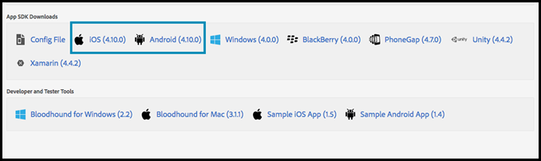

# SDKで[!DNL Target]を有効にする

[!UICONTROL Adobe Mobile Services SDK]をアプリに追加します。

>[!IMPORTANT]
>
>[!DNL Adobe Mobile] バージョン 4.*x* SDKのサポートは2021年8月31日（PT）をもって終了し、[!DNL Adobe Target] モバイルユーザーには推奨されなくなりました。
>
>[Adobe Experience Platform SDK モバイル版アプリ &#x200B;](https://developer.adobe.com/client-sdks/documentation/){target=_blank}は、モバイル アプリで[!DNL Adobe Experience Cloud]のソリューションとサービスを強化するために推奨されるソリューションです。

1. アプリにAdobe Mobile Services SDKをインストールしていない場合は、AnalyticsまたはExperience Cloudの資格情報を使用し、[Adobe Mobile Services](https://mobilemarketing.adobe.com/) web サイトからSDKをダウンロードします。

1. アプリに[!DNL Adobe Mobile Services SDK]を追加します。

   [コア実装とライフサイクル](https://experienceleague.adobe.com/docs/mobile-services/ios/getting-started-ios/dev-qs.html)の説明を参照してください。

1. クライアントコードとタイムアウトを追加し、SSL を有効にします。

   Experience Cloud で、Mobile Services を開き、**[!UICONTROL アプリ設定]**／**[!UICONTROL Target SDK の設定]**&#x200B;に移動します。

   [!DNL Target] クライアントコードとタイムアウトを追加します。 クライアントコードは、それぞれのアカウントまたは会社で一意になります。 タイムアウトは、デフォルトのコンテンツを表示する前に[!DNL Target]が応答を待つまでの秒数です。 Adobe Mobile Services のアプリ設定ページで「**[!UICONTROL HTTPS を使用]**」オプションがチェックされていることを確認します。 HTTPSが有効になっていない場合は、[!DNL Target] サーバーをiOSしない限り、許可リストに加える9以降のすべての呼び出しはブロックされます。

   

1. アプリを作成/配置したら、アプリの設定を見つけて、目的のSDKをダウンロードします。

   

>[!WARNING]
>
> モバイルマーケティングインターフェイスにアクセスできない場合、アプリコードの設定ファイルで直接変更できます。ただし、ユーザーインターフェイスの設定ページと同期されません。
