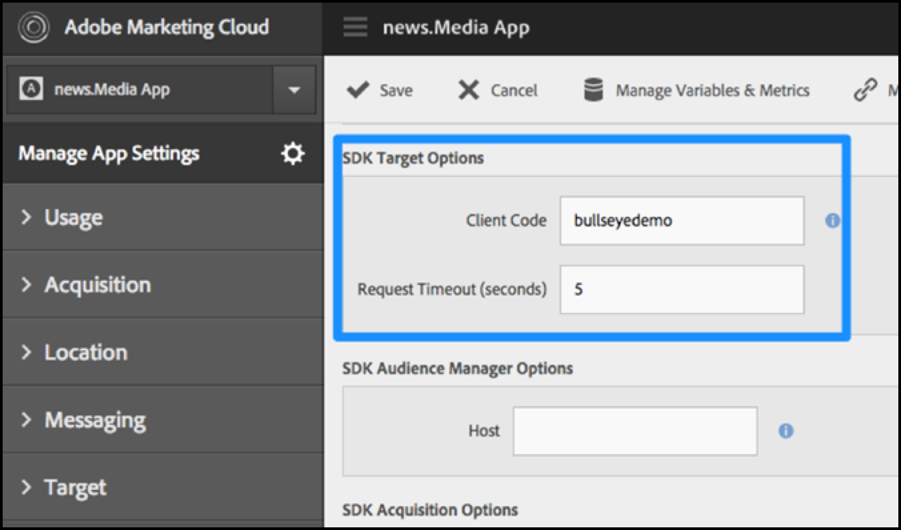

# SDK で [!DNL Target] を有効にする

アプリに [!UICONTROL Adobe Mobile Services SDK] を追加します。

>[!IMPORTANT]
>
>[!DNL Adobe Mobile] バージョン 4 のサポート。*x* SDK は 2021 年 8 月 31 日（PT）をもって終了し、[!DNL Adobe Target] モバイルユーザーには推奨されなくなりました。
>
>[ モバイルアプリ用Adobe Experience Platform SDK](https://developer.adobe.com/client-sdks/documentation/){target=_blank} は、モバイルアプリで [!DNL Adobe Experience Cloud] のソリューションおよびサービスを強化するための推奨ソリューションです。

1. Adobe Mobile Services SDK がアプリにインストールされていない場合は、Analytics またはExperience Cloudの資格情報を使用し、[Adobe Mobile Services](https://mobilemarketing.adobe.com/) Web サイトから SDK をダウンロードします。

1. アプリに [!DNL Adobe Mobile Services SDK] を追加します。

   [コア実装とライフサイクル](https://experienceleague.adobe.com/docs/mobile-services/ios/getting-started-ios/dev-qs.html)の説明を参照してください。

1. クライアントコードとタイムアウトを追加し、SSL を有効にします。

   Experience Cloudーで、Mobile Services を開き、**[!UICONTROL Manage App Settings]**/**[!UICONTROL SDK Target Options]** に移動します。

   [!DNL Target] クライアントコードとタイムアウトを追加します。 クライアントコードは、それぞれのアカウントまたは会社で一意になります。タイムアウトは、デフォルトのコンテンツを表示 [!DNL Target] るまで応答を待機する時間（秒単位）です。 AdobeMobile Services のアプリ設定を管理ページで「**[!UICONTROL Use HTTPS]**」オプションがオンになっていることを確認します。 HTTPS が有効になっていない場合、[!DNL Target] サーバーをiOSしない限り、許可リストに加える9+でのすべての呼び出しはブロックされます。

   

1. アプリを作成または配置したら、アプリ設定を見つけて、目的の SDK をダウンロードします。

   

>[!WARNING]
>
> モバイルマーケティングインターフェイスにアクセスできない場合、アプリコードの設定ファイルで直接変更できます。ただし、ユーザーインターフェイスの設定ページと同期されません。
