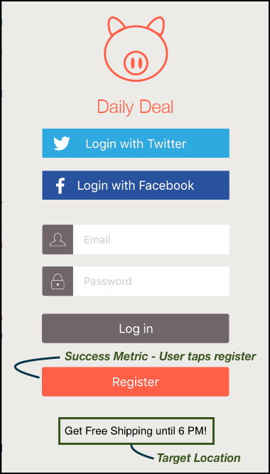

# モバイルアプリでの [!DNL Target] の仕組み

[!DNL Adobe Mobile SDK] は、[!DNL Target] サーバーに連絡して、コンテンツを他のデータポイントと共に取得し、ユーザーに適切なエクスペリエンスを表示します。

>[!IMPORTANT]
>
>[!DNL Adobe Mobile] バージョン 4 のサポート。*x* SDK は 2021 年 8 月 31 日（PT）をもって終了し、[!DNL Adobe Target] モバイルユーザーには推奨されなくなりました。
>
>[ モバイルアプリ用Adobe Experience Platform SDK](https://developer.adobe.com/client-sdks/documentation/){target=_blank} は、モバイルアプリで [!DNL Adobe Experience Cloud] のソリューションおよびサービスを強化するための推奨ソリューションです。

## [!DNL Target] の場所と成功指標

*ターゲットの場所* はmboxとも呼ばれます。アプリで識別した場所は、テストとパーソナライゼーション（例えば、ホーム画面のようこそメッセージ）のために有効になります。これらの場所は、テスト作成プロセスの間に識別されます。

*[成功指標 ](https://experienceleague.adobe.com/docs/target/using/activities/success-metrics/success-metrics.html?lang=ja)* は、特定のアクティビティが成功したかどうか（新規登録、購入、チケットの予約など）を識別するためにユーザーが実行するアクションです。

* **[!DNL Target]location:** 登録ボタンの下に表示されるコンテンツ。

  このユーザーは、18 時まで送料無料の提供を受けています。この場所は、複数の [!DNL Target] アクティビティで再利用して、A/B テストとパーソナライゼーションを実行できます。

* **成功指標：** ユーザーが「登録」ボタンをタップした際に実行されるアクション。

**SDK での [!DNL Target] の仕組みについて**

