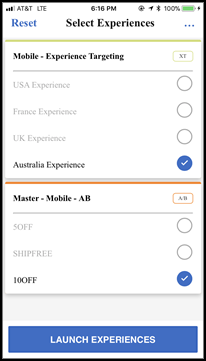

# [!DNL Target] モバイルプレビュー

モバイルのプレビューリンクを使用して、モバイルアプリケーションアクティビティの簡易的なエンドツーエンドの QA を実行できます。特別なテスト用のデバイスがなくても、ご利用のデバイス上で様々なエクスペリエンスを確認できます。

>[!NOTE]
>
>モバイルプレビュー機能を使用するには、4.14 以降の適切なバージョンの Adobe Mobile SDK をダウンロードしてインストールする必要があります。

## 概要

モバイルプレビュー機能を使用して、モバイルアプリアクティビティを実稼動環境に投入する前に完全にテストすることができます。

## 前提条件

1. **サポートされているバージョンの SDK を使用する：**&#x200B;モバイルプレビュー機能を使用するには、4.14 以降の適切なバージョンの Adobe Mobile SDK をダウンロードして対応するアプリにインストールする必要があります。

   適切な SDK をダウンロードする手順については、以下を参照してください。

   * **IOS:** [事前準備](https://experienceleague.adobe.com/docs/mobile-services/ios/getting-started-ios/requirements.html) （内） *Mobile Services iOSヘルプ*.
   * **Android:** [事前準備](https://experienceleague.adobe.com/docs/mobile-services/android/getting-started-android/requirements.html) （内） *Mobile Services Android ヘルプ*.

1. **URL スキームを設定する：**&#x200B;プレビューリンクでは、URL スキームを使用してアプリを開きます。プレビュー用に一意の URL スキームを指定する必要があります。

   iOS の例を次の図に示します。

   

   Android の例を次の図に示します。

   

1. **アドビの DeepLink を追跡する**

   **iOS：**&#x200B;アプリケーションデリゲートで、 デリゲートが前の手順で指定した URL スキームでリソースを開くように要求されたときに `[ADBMobile trackAdobeDeepLink:url` を呼び出します。

   コードスニペットの例を次に示します。

   ```javascript {line-numbers="true"}
   - (BOOL) application:(UIApplication *)app openURL:(NSURL *)url 
                options:(NSDictionary<NSString *,id> *)options { 
   
       if ([[url scheme] isEqualToString:@"com.adobe.targetmobile"]) { 
           [ADBMobile trackAdobeDeepLink:url]; 
           return YES; 
       } 
       return NO; 
   } 
   ```

   **Android：**&#x200B;アプリケーションで、 呼び出し元が前の手順で指定した URL スキームでリソースを開くように要求されたときに `Config.trackAdobeDeepLink(URL);` を呼び出します。

   ```javascript {line-numbers="true"}
    private Boolean shouldOpenDeeplinkUrl() { 
        Intent appLinkIntent = getIntent(); 
        String appLinkAction = appLinkIntent.getAction(); 
        Uri appLinkData = appLinkIntent.getData; 
        if (appLinkData.toString().startsWith("com.adobe.targetmobile")) { 
            Config.trackAdobeDeepLink(appLinkData); 
            return true; 
        } 
        return false; 
     }
   ```

   Android でモバイルプレビューが動作するようにするには、AdobeMobile SDK のバージョン 5 を使用している場合は、AndroidManifest.xml に次のコードスニペットも追加する必要があります。

   ```javascript {line-numbers="true"}
   <activity android:name="com.adobe.marketing.mobile.FullscreenMessageActivity" />
   ```

   バージョン 4 の Mobile SDK を使用している場合は、次のAdobeスニペットを使用します。

   ```javascript {line-numbers="true"}
   <activity android:name="com.adobe.mobile.MessageFullScreenActivity" />
   ```

## プレビューリンクの生成

1. Adobe Analytics の [!DNL Target] UI で、 **[!UICONTROL その他のオプション]** アイコン（縦並びの省略記号）をクリックし、「 **[!UICONTROL モバイルプレビューを作成]**.

   

1. プレビューするアクティビティを選択し、「 **[!UICONTROL モバイルプレビューリンクを生成]**.

   >[!NOTE]
   >
   >フォームベースの AB および XT アクティビティのみを選択できます。

   

1. アプリの URL スキームを指定します。

   これは、iOS または Android アプリに存在する URL スキームと同じである必要があります。必要に応じて、iOS と Android でこのプロセスを別々に繰り返します。

   

1. 「**[!UICONTROL モバイルプレビューリンクを生成」をクリック]** して、リンクをコピーします。

   

## デバイスでのプレビュー

アプリをインストールしたデバイス上のモバイルブラウザーでリンクを開きます。Apple App Store または Google Play ストアからダウンロードした製品アプリを使用できます。特殊なビルドである必要はありません。アクティブなプレビューリンクがある場合は、デバイス上でエクスペリエンスを表示できます。

1. モバイルブラウザーでリンクを開きます。

   前の手順でコピーしたリンクを [!DNL Target] テキスト、電子メール、Slackなどを使用する便利な方法でモバイルデバイスに UI を追加できます。

   |||

   アプリが開き、 [!DNL Target] モバイルプレビューモード。

1. 表示するエクスペリエンスの組み合わせを選択し、「エクスペリエンス **[!UICONTROL を開始」をクリック]** します。

   ||||
||||

## 制限事項

* 「**[!UICONTROL エクスペリエンスを開始]**」ボタンをクリックした後で新しいコンテンツを表示するには、ビューをもう一度読み込む必要があります。最も簡単な方法は、一旦別の画面に切り替えた後、変更を適用する画面に戻ることです。
* モバイルプレビューは、API-19（KitKat）より前の Android バージョンではサポートされません。
