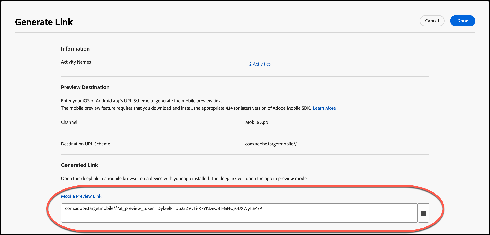

# [!DNL Target] モバイルのプレビュー

モバイルプレビューリンクを使用すると、モバイルアプリのアクティビティに対して簡単なエンドツーエンドの QA を実行し、特別なテストデバイスを使用せずに、デバイスを使用して様々なエクスペリエンスに自分を登録できます。

モバイルプレビュー機能を使用すると、モバイルアプリのアクティビティを完全にテストしてからライブで起動できます。

## 前提条件

1. **サポートされているバージョンの SDK を使用：** モバイルプレビュー機能では、対応するアプリに適切なバージョンの [!DNL Adobe Mobile SDK] をダウンロードしてインストールする必要があります。

   適切な SDK のダウンロード手順については、*[!DNL Adobe Experience Platform Mobile SDK]* ドキュメントの [ 現在の SDK のバージョン ](https://developer.adobe.com/client-sdks/documentation/current-sdk-versions/){target=_blank} を参照してください。

1. **URL スキームを設定する：**&#x200B;プレビューリンクでは、URL スキームを使用してアプリを開きます。プレビュー用に一意の URL スキームを指定します。

   詳しくは、*[!DNL Mobile SDK]* ドキュメントの [ データ接続 UI での Target 拡張機能の設定 *の* ビジュアルプレビュー ](https://developer.adobe.com/client-sdks/documentation/adobe-target/#visual-preview){target=_blank} を参照してください。

   次のリンクに詳細情報が含まれています。

   * **iOs**:Appleの URL スキームの設定について詳しくは、*iOS[web サイトの ](https://developer.apple.com/documentation/xcode/defining-a-custom-url-scheme-for-your-app){target=_blank} アプリのカスタム URL スキームの定義* を参照してください。
   * **Android**: Androidの URL スキームの設定について詳しくは、*Android Developers* Web サイトの [ アプリ コンテンツへのディープリンクの作成 ](https://developer.android.com/training/app-links/deep-linking){target=_blank} を参照してください。

1. **`collectLaunchInfo` API の設定（i0S のみ）**

   詳しくは、*[!DNL Mobile SDK]* ドキュメントの [ データ接続 UI での Target 拡張機能の設定 *の* ビジュアルプレビュー ](https://developer.adobe.com/client-sdks/documentation/adobe-target/#visual-preview){target=_blank} を参照してください。

## プレビューリンクの生成

1. [!DNL Target] の UI で、「**[!UICONTROL More Options]**」アイコン（縦並びの省略記号）をクリックし、「**[!UICONTROL Create Mobile Preview Link]**」を選択します。

   

1. プレビューするアクティビティを選択し、「**[!UICONTROL Generate Mobile Preview Link]**」をクリックします。

   >[!NOTE]
   >
   >選択できるのは、フォームベースの [!UICONTROL A/B Test] および [!UICONTROL Experience Targeting] （XT）アクティビティのみです。

   

1. アプリの URL スキームを指定します。

   URL スキームは、iOSまたはAndroid アプリに存在するものと同じにする必要があります。 必要に応じて、iOSとAndroidについて、このプロセスを個別に繰り返します。

   

1. 「**[!UICONTROL Generate Mobile Preview Link]**」をクリックし、リンクをコピーします。

   

## デバイスでのプレビュー

アプリをインストールしたデバイス上のモバイルブラウザーでリンクを開きます。このアプリは、[!DNL Apple App Store] または [!DNL Google Play Store] からダウンロードした実稼動アプリにすることができます。 アプリは特別なビルドである必要はありません。 アクティブなプレビューリンクがある場合は、デバイスのエクスペリエンスを表示できます。

1. モバイルブラウザーでリンクを開きます。

   前の節でコピーしたリンクを、[!DNL Target] UI からモバイルデバイスに、テキスト、メール、[!DNL Slack] などを使用した便利な方法で共有します。

   |||

   アプリが開き、[!DNL Target] [!UICONTROL Mobile Preview Mode] が開始されます。

1. 表示するエクスペリエンスの組み合わせを選択し、「**[!UICONTROL Launch Experiences]**」をクリックします。

   ||||
||||

## 制限事項

* 「**[!UICONTROL Launch Experiences]**」ボタンをクリックした後に新しいコンテンツを表示するには、ビューを再度読み込む必要があります。 最も簡単な方法は、一旦別の画面に切り替えた後、変更を適用する画面に戻ることです。
* モバイルプレビューは、API-19（KitKat）より前の Android バージョンではサポートされません。
