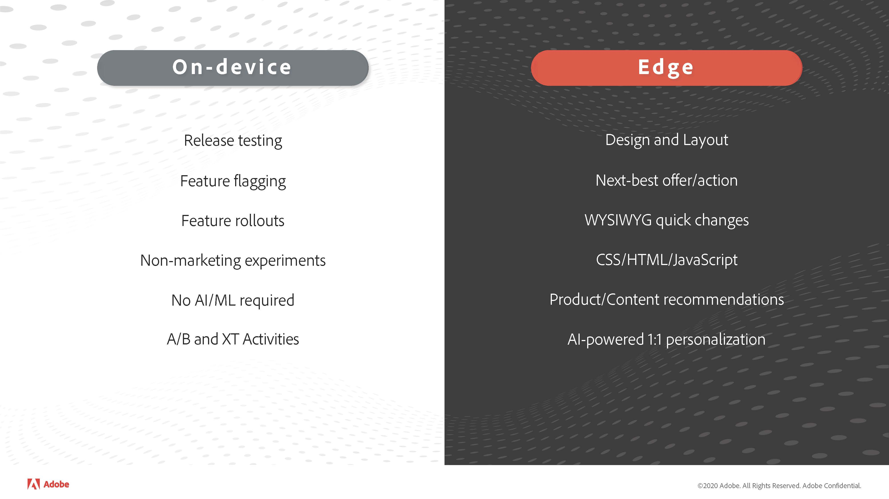

# オンデバイスとエッジ判定を使用するタイミング

## オンデバイス判定を使用するかどうかを決定する際は、使用例を考慮する

主な違いは *オンデバイス* 判定とエッジ判定とは、オンデバイス判定ではサーバー上で決定がローカルに実行され、エッジではAdobe Targetの Edge ネットワーク上で決定がおこなわれます。 デバイス上での判定は、トラフィックの多いページに配信する必要がある A/B または XT アクティビティに使用します。パフォーマンスがコンバージョン、売上高、定着などのビジネス KPI に大きく影響します。 例えば、マーケティングチームが広告キャンペーンを実行して、見込み客をホームページに誘致しているとします。 パブリッシャーネットワーク上で広告キャンペーンを実行する場合、支払いが必要なので、ホームページにランディングする見込み客は、1 ドルの金額に変換されます。 同時に、A/B 実験を実行して、消費者の注意を最も引き付けるヒーロー画像を確認するとします。 A/B 実験を行うのにさらに 2 秒かかる場合は、消費者が待ちきれなくなり、バウンスする可能性が高くなります。 マーケティングのお金と A/B 実験を行ってみましょう！ この難しい見込み客を失うことは、この見込み客を常連客またはリピーター顧客に変換する機会が失われるので、困難です。 したがって、この使用例でオンデバイス判定アクティビティを実行すると、遅延が引き起こす可能性のある悪影響を回避できます。

一方、エッジ判定では、エクスペリエンスを取得するためにネットワークブロック呼び出しが必要ですが、リアルタイムデータと ML を使用してエンドユーザーのエクスペリエンスを非常に魅力的にするので、非常に便利です。 ネットワークブロック呼び出しは、エクスペリエンスを配信する際に待ち時間を追加します。ただし、状況によっては、このトレードオフが意味をなす場合があります。 例えば、顧客が商品カタログを閲覧し、商品の詳細ページに移動するシナリオを考えてみましょう。 そのページに、お客様が現在表示している製品と共に、推奨される製品リストが表示される場合は、エンゲージメント（後でコンバージョンと売上高）が向上する可能性があります。 この方法で製品の推奨リストを表示するには、Adobe Targetの ML アルゴリズムの影響を受けるエッジの判断（つまり、追加の遅延が発生する）が必要です。追加の遅延は、エンドユーザーが直ちに発生するのに十分ではありません。 さらに、製品の推奨リストは、コンバージョン率の向上につながります。 したがって、この場合、エッジの決定によってビジネスに最も大きな価値がもたらされます。

## サポートされる機能

ユースケースとビジネス目標の評価に加えて、デバイス上での判定機能を確認します [サポート](../on-device-decisioning/supported-features.md) を確認してから、on-device decisioning と edge decisioning のどちらを使用するかを決定します。 現在、エッジ判定は、すべてのアクティビティタイプ、オーディエンスのターゲティング、割り当て方法をサポートしています。