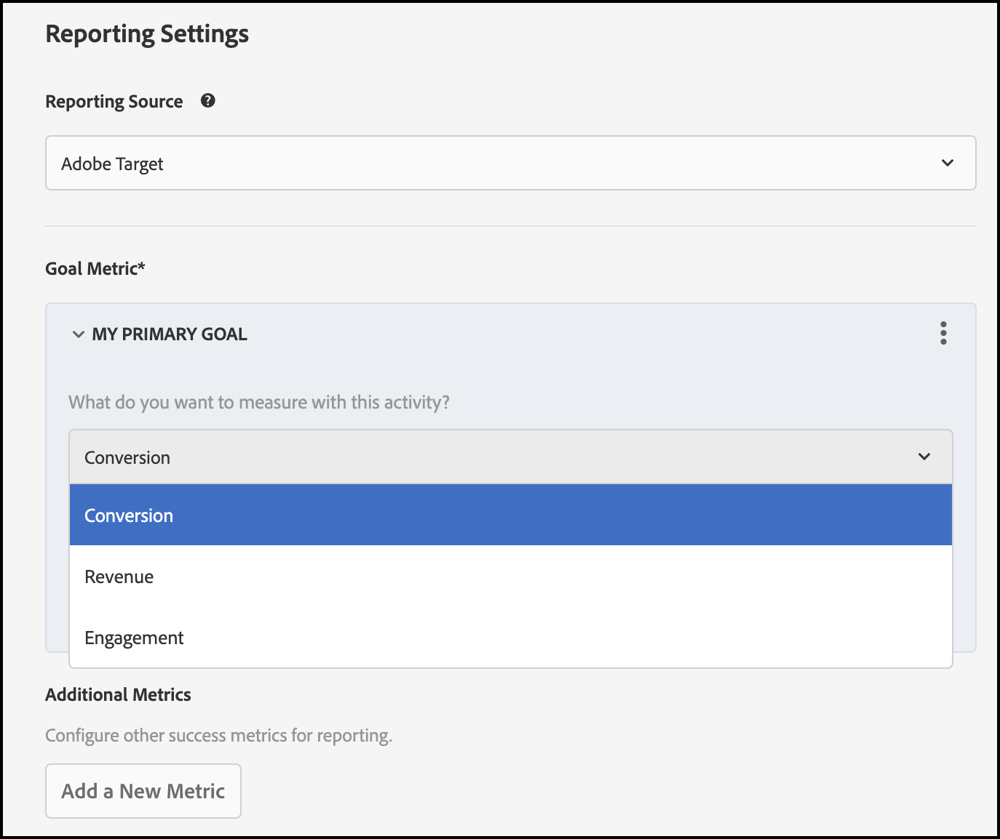

# イベントトラッキング

[!DNL Adobe Target]のイベント追跡機能を使用して、ビジネスとユースケースにとって最も重要な指標を効果的に測定します。 イベントを追跡することは、実験やパーソナライゼーションの成果を測定する上で重要です。なぜなら、どのバリエーションや体験が、成功しているか失敗しているかを教えてくれるからです。 この状況を把握することで、変化し続ける状況において、顧客が製品とどのように関わっているのかを把握できます。

[!DNL Adobe Target]のSDKを通じてイベントを追跡するには、次の2つの手順に従います。

1. SDKをインストールし、イベントを[!DNL Adobe Target]に送信するコードをデプロイします。

1. UIで目標指標を使用して[!DNL Adobe Target] アクティビティを作成し、アクティブ化します。

   

## 目標の指標とイベント

次の表は、[!DNL Target]のレポート機能を使用して[!DNL Target] アクティビティで定義および測定できる目標とイベントの組み合わせを定義しています。

| プライマリ目標 | イベント |
| --- | --- |
| 変換 | ページを表示し、mboxを表示し、mboxをクリックした |
| 売上高 | mboxを表示し、mboxをクリック |
| エンゲージメント | ページビュー、顧客スコアリング、サイト滞在時間 |

## インプレッションのトリガー方法

Target SDKは、基になる[配信API](/help/dev/implement/delivery-api/overview.md)を呼び出します。 必要なパラメーターを持つ実行オブジェクトがリクエスト自体の中にある場合、適格なアクティビティに対してインプレッションが自動的に増分されます。 インプレッションを自動的に増分するSDK メソッドは次のとおりです。

* getOffers（）
* getAttributes （）

>[!NOTE]
>
>プリフェッチオブジェクトがリクエスト内で渡されると、プリフェッチオブジェクト内のmboxを持つアクティビティに対して、インプレッションが自動的に増分されません。

`sendNotifications` メソッドを使用して、イベントを[!DNL Adobe Target]に手動で送信し、インプレッションをトリガーできます。

>[!BEGINTABS]

>[!TAB Node.js]

```js {line-numbers="true"}
TargetClient.sendNotifications(options: Object): Promise
```

>[!TAB Java]

```java {line-numbers="true"}
ResponseStatus TargetClient.sendNotifications(TargetDeliveryRequest request)
```

>[!ENDTABS]

## サンプルコード

次のコードサンプルは、コンバージョン、収益、エンゲージメントなど、すべての目標指標タイプで機能します。

### ページまたはMboxを表示しました

このサンプルでは、まず`getOffers`を使用してターゲット mbox オファーを取得します。 次に、そのmbox オファーに基づく通知を含むリクエストを作成します。

通知`type` プロパティは`display`に設定されています。

ページが表示されたことを示すには、通知ペイロードでアドレスオブジェクトを指定することが重要です。 URLは必ず設定してください。

mboxの場合は、通知オブジェクトにmbox プロパティを設定し、`targetResult`のoptions配列に基づいてトークンの配列を指定する必要があります。

>[!BEGINTABS]

>[!TAB Node.js]

```js {line-numbers="true"}
const TargetClient = require("@adobe/target-nodejs-sdk");
const { v4: uuidv4 } = require("uuid");

const client = TargetClient.create({
  client: "acmeclient",
  organizationId: "1234567890@AdobeOrg",
  events: { clientReady: onTargetReady },
});

async function onTargetReady() {
  const targetResult = await client.getOffers({
    request: {
      targetRequest,
      prefetch: {
        mboxes: [
          {
            name: "homepage",
            index: 1
          }
        ]
      },
      sessionId: uuidv4()
    }
  });

  const { mboxes = [] } = targetResult.response.prefetch;

  const request = {
    context: { channel: "web" },
    notifications: mboxes.map(mbox => {
      const { options = [] } = mbox;

      return {
        id: targetResult.response.id,
        impressionId: uuidv4(),
        address: {
          url: "http://www.target-demo-site.com"
        },
        timestamp: new Date().getTime(),
        type: "display",
        mbox: {
          name: mbox.name
        },
        tokens: options.map(option => option.eventToken)
      };
    })
  };
  // send the notification event
  await client.sendNotifications({ request });
}
```

>[!TAB Java]

```java {line-numbers="true"}
ClientConfig clientConfig = ClientConfig.builder()
                .client("acmeclient")
                .organizationId("1234567890@AdobeOrg")
                .build();

TargetClient targetClient = TargetClient.create(clientConfig);

Context context = new Context()
        .channel(ChannelType.WEB)
        .address(new Address().url("http://www.target-demo-site.com"));

TargetDeliveryResponse targetResult = targetJavaClient.getOffers(TargetDeliveryRequest.builder()
        .context(context
        )
        .prefetch(new PrefetchRequest()
                .mboxes(new ArrayList() {{
                    add(new MboxRequest().name("homepage").index(1));
                }})
        )
        .build());

List<Notification> notifications = new ArrayList<>();
List<PrefetchMboxResponse> mboxes = targetResult.getResponse().getPrefetch().getMboxes();

for (PrefetchMboxResponse mbox : mboxes) {
    List<Option> options = mbox.getOptions();

    notifications.add((Notification) new Notification()
            .id(targetResult.getResponse().getRequestId())
            .impressionId(UUID.randomUUID().toString())
            .timestamp(System.currentTimeMillis())
            .type(MetricType.DISPLAY)
            .mbox(new NotificationMbox().name(mbox.getName()))
            .tokens(options.stream().map(Option::getEventToken).collect(Collectors.toList()))
            .address(new Address().url("http://www.target-demo-site.com"))
    );
}

TargetDeliveryRequest notificationRequest = TargetDeliveryRequest.builder()
        .context(context)
        .notifications(notifications).build();

targetJavaClient.sendNotifications(notificationRequest);
```

>[!ENDTABS]

### Mboxをクリックしました

このサンプルでは、まず`getOffers`を使用してターゲット mbox オファーを取得します。 次に、そのmbox オファーに基づく通知を含むリクエストを作成します。

通知`type` プロパティは`click`に設定されています。

通知オブジェクトに`mbox` プロパティを設定し、`targetResult`のメトリクス配列に基づいてトークンの配列を指定する必要があります。

>[!BEGINTABS]

>[!TAB Node.js]

```js {line-numbers="true"}
const TargetClient = require("@adobe/target-nodejs-sdk");
const { v4: uuidv4 } = require("uuid");

const client = TargetClient.create({
  client: "acmeclient",
  organizationId: "1234567890@AdobeOrg",
  events: { clientReady: onTargetReady },
});

async function onTargetReady() {
  const targetResult = await client.getOffers({
    request: {
      targetRequest,
      prefetch: {
        mboxes: [
          {
            name: "homepage",
            index: 1
          }
        ]
      },
      sessionId: uuidv4()
    }
  });

  const { mboxes = [] } = targetResult.response.prefetch;

  const request = {
    context: { channel: "web" },
    notifications: mboxes.map(mbox => {
      const { options = [], metrics = [] } = mbox;

      return {
        id: targetResult.response.id,
        impressionId: uuidv4(),
        address: {
          url: "http://www.target-demo-site.com"
        },
        timestamp: new Date().getTime(),
        type: "click",
        mbox: {
          name: mbox.name
        },
        tokens: metrics
                  .filter(metric => metric.type === "click")
                  .map(metric => metric.eventToken)
      };
    })
  };
  // send the notification event
  await client.sendNotifications({ request });
}
```

>[!TAB Java]

```java {line-numbers="true"}
ClientConfig clientConfig = ClientConfig.builder()
                .client("acmeclient")
                .organizationId("1234567890@AdobeOrg")
                .build();

TargetClient targetClient = TargetClient.create(clientConfig);

Context context = new Context()
        .channel(ChannelType.WEB)
        .address(new Address().url("http://www.target-demo-site.com"));

TargetDeliveryResponse targetResult = targetJavaClient.getOffers(TargetDeliveryRequest.builder()
        .context(context
        )
        .prefetch(new PrefetchRequest()
                .mboxes(new ArrayList() {{
                    add(new MboxRequest().name("homepage").index(1));
                }})
        )
        .build());

List<Notification> notifications = new ArrayList<>();
List<PrefetchMboxResponse> mboxes = targetResult.getResponse().getPrefetch().getMboxes();

for (PrefetchMboxResponse mbox : mboxes) {
    List<Metric> metrics = mbox.getMetrics();

    notifications.add((Notification) new Notification()
            .id(targetResult.getResponse().getRequestId())
            .impressionId(UUID.randomUUID().toString())
            .timestamp(System.currentTimeMillis())
            .type(MetricType.CLICK)
            .mbox(new NotificationMbox().name(mbox.getName()))
            .tokens(metrics.stream()
                    .filter(metric -> MetricType.CLICK.equals(metric.getType()))
                    .map(Metric::getEventToken)
                    .collect(Collectors.toList()))
            .address(new Address().url("http://www.target-demo-site.com"))
    );
}

TargetDeliveryRequest notificationRequest = TargetDeliveryRequest.builder()
        .context(context)
        .notifications(notifications).build();

targetJavaClient.sendNotifications(notificationRequest);
```

>[!ENDTABS]

### ビューを表示

このサンプルでは、まず`getOffers`を使用してターゲットビューを取得します。 そして、そのビューに基づいて通知を含むリクエストを作成します。

通知`type` プロパティは`display`に設定されています。

ビューの場合は、通知オブジェクトに`view` プロパティを設定し、targetResultのoptions配列に基づいてトークンの配列を指定する必要があります。

>[!BEGINTABS]

>[!TAB Node.js]

```js {line-numbers="true"}
const TargetClient = require("@adobe/target-nodejs-sdk");
const { v4: uuidv4 } = require("uuid");

const client = TargetClient.create({
  client: "acmeclient",
  organizationId: "1234567890@AdobeOrg",
  events: { clientReady: onTargetReady },
});

async function onTargetReady() {
  const targetResult = await client.getOffers({
    request: {
      targetRequest,
      prefetch: {
        views: [{}]
      },
      sessionId: uuidv4()
    }
  });

  const { views = [] } = targetResult.response.prefetch;

  const request = {
    context: { channel: "web" },
    notifications: views.map(view => {
      const { options = [], metrics = [] } = view;

      return {
        id: targetResult.response.id,
        impressionId: uuidv4(),
        address: {
          url: "http://www.target-demo-site.com"
        },
        timestamp: new Date().getTime(),
        type: "display",
        view: {
          name: view.name
        },
        tokens: options.map(option => option.eventToken)
      };
    })
  };
  // send the notification event
  await client.sendNotifications({ request });
}
```

>[!TAB Java]

```java {line-numbers="true"}
ClientConfig clientConfig = ClientConfig.builder()
                .client("acmeclient")
                .organizationId("1234567890@AdobeOrg")
                .build();

TargetClient targetClient = TargetClient.create(clientConfig);

Context context = new Context()
        .channel(ChannelType.WEB)
        .address(new Address().url("http://www.target-demo-site.com"));

TargetDeliveryResponse targetResult = targetJavaClient.getOffers(TargetDeliveryRequest.builder()
        .context(context)
        .prefetch(new PrefetchRequest()
                .views(new ArrayList() {{
                    add(new ViewRequest());
                }})
        )
        .build());

List<Notification> notifications = new ArrayList<>();
List<View> views = targetResult.getResponse().getPrefetch().getViews();

for (View view : views) {
    List<Option> options = view.getOptions();
    List<Metric> metrics = view.getMetrics();

    notifications.add((Notification) new Notification()
            .id(targetResult.getResponse().getRequestId())
            .impressionId(UUID.randomUUID().toString())
            .timestamp(System.currentTimeMillis())
            .type(MetricType.DISPLAY)
            .view(new NotificationView().name(view.getName()))
            .tokens(options.stream().map(Option::getEventToken).collect(Collectors.toList()))
            .address(new Address().url("http://www.target-demo-site.com"))
    );
}

TargetDeliveryRequest notificationRequest = TargetDeliveryRequest.builder()
        .context(context)
        .notifications(notifications).build();

targetJavaClient.sendNotifications(notificationRequest);
```

>[!ENDTABS]

### ビューをクリック

このサンプルでは、まず`getOffers`を使用してターゲットビューを取得します。 そして、そのビューに基づいて通知を含むリクエストを作成します。

通知`type` プロパティは`click`に設定されています。

通知オブジェクトに`view` プロパティを設定し、targetResultのmetrics配列に基づいてトークンの配列を指定する必要があります。

>[!BEGINTABS]

>[!TAB Node.js]

```js {line-numbers="true"}
const TargetClient = require("@adobe/target-nodejs-sdk");
const { v4: uuidv4 } = require("uuid");

const client = TargetClient.create({
  client: "acmeclient",
  organizationId: "1234567890@AdobeOrg",
  events: { clientReady: onTargetReady },
});

async function onTargetReady() {
  const targetResult = await client.getOffers({
    request: {
      targetRequest,
      prefetch: {
        views: [{}]
      },
      sessionId: uuidv4()
    }
  });

  const { views = [] } = targetResult.response.prefetch;

  const request = {
    context: { channel: "web" },
    notifications: views.map(view => {
      const { options = [], metrics = [] } = view;

      return {
        id: targetResult.response.id,
        impressionId: uuidv4(),
        address: {
          url: "http://www.target-demo-site.com"
        },
        timestamp: new Date().getTime(),
        type: "click",
        view: {
          name: view.name
        },
        tokens: metrics
                  .filter(metric => metric.type === "click")
                  .map(metric => metric.eventToken)
      };
    })
  };
  // send the notification event
  await client.sendNotifications({ request });
}
```

>[!TAB Java]

```java {line-numbers="true"}
ClientConfig clientConfig = ClientConfig.builder()
                .client("acmeclient")
                .organizationId("1234567890@AdobeOrg")
                .build();

TargetClient targetClient = TargetClient.create(clientConfig);

Context context = new Context()
        .channel(ChannelType.WEB)
        .address(new Address().url("http://www.target-demo-site.com"));

TargetDeliveryResponse targetResult = targetJavaClient.getOffers(TargetDeliveryRequest.builder()
        .context(context)
        .prefetch(new PrefetchRequest()
                .views(new ArrayList() {{
                    add(new ViewRequest());
                }})
        )
        .build());

List<Notification> notifications = new ArrayList<>();
List<View> views = targetResult.getResponse().getPrefetch().getViews();

for (View view : views) {
    List<Option> options = view.getOptions();
    List<Metric> metrics = view.getMetrics();

    notifications.add((Notification) new Notification()
            .id(targetResult.getResponse().getRequestId())
            .impressionId(UUID.randomUUID().toString())
            .timestamp(System.currentTimeMillis())
            .type(MetricType.CLICK)
            .view(new NotificationView().name(view.getName()))
            .tokens(metrics.stream()
                    .filter(metric -> MetricType.CLICK.equals(metric.getType()))
                    .map(Metric::getEventToken)
                    .collect(Collectors.toList()))
            .address(new Address().url("http://www.target-demo-site.com"))
    );
}

TargetDeliveryRequest notificationRequest = TargetDeliveryRequest.builder()
        .context(context)
        .notifications(notifications).build();

targetJavaClient.sendNotifications(notificationRequest);
```

>[!ENDTABS]
