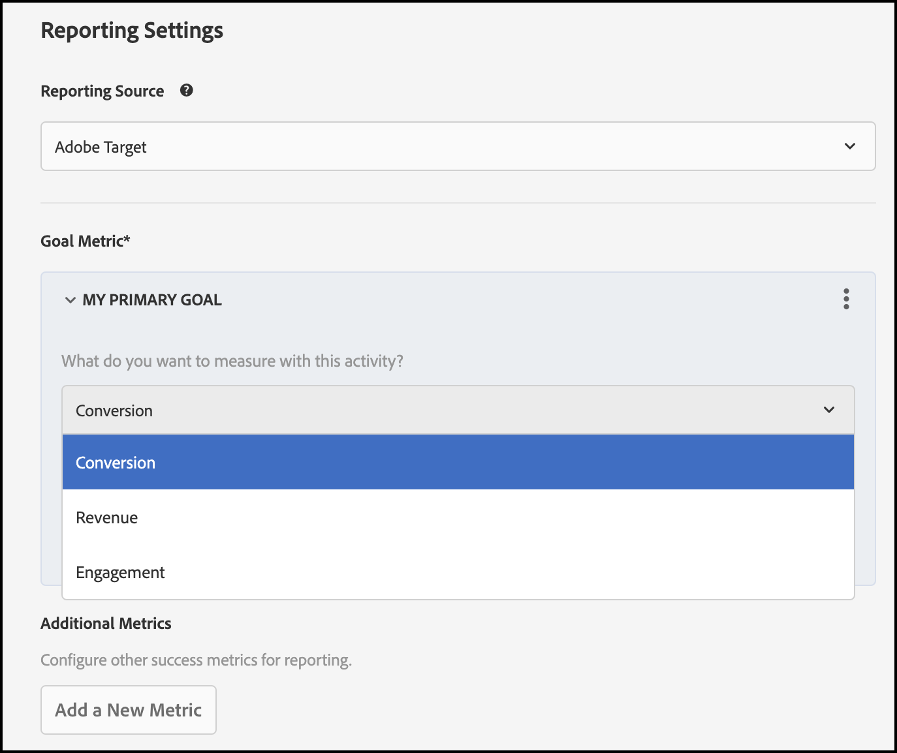

# イベントトラッキング

[!DNL Adobe Target] のイベントトラッキング機能を使用すると、ビジネスやユースケースに最も重要な指標を効果的に測定できます。 トラッキングイベントは、どのバリエーションやエクスペリエンスが勝者か敗者かを示すので、実験やパーソナライゼーションアクティビティの成功を測定するための鍵となります。 これを理解することで、ユーザーが製品にどのように関わり、常に変化する状況でどのように進化しているかを理解するのに役立ちます。

[!DNL Adobe Target] の SDK を使用してイベントを追跡するには、次の 2 つの手順に従います。

1. SDK をインストールし、イベントを [!DNL Adobe Target] に送信するコードをデプロイします。

1. UI で、目標指標を使用して [!DNL Adobe Target] アクティビティを作成してアクティブ化します。

   

## 目標指標とイベント

次の表は、[!DNL Target] のレポート機能を使用して、[!DNL Target] のアクティビティで定義および測定できる目標とイベントの組み合わせを定義したものです。

| プライマリ目標 | イベント |
| --- | --- |
| コンバージョン | ページを表示し、mbox を表示して、mbox をクリックした |
| 売上高 | mbox を表示し、mbox をクリックした。 |
| エンゲージメント | ページビュー数、顧客スコアおよびサイト滞在時間 |

## インプレッションがトリガーされる仕組み

Target SDK は、基になる [ 配信 API](/help/dev/implement/delivery-api/overview.md) を呼び出します。 必須のパラメーターを持つ実行オブジェクトがリクエスト自体の中にある場合、インプレッションは、条件を満たすアクティビティに対して自動的に増分されます。 インプレッションを自動的に増分する SDK メソッドは次のとおりです。

* getOffers（）
* getAttributes （）

>[!NOTE]
>
>リクエスト内でプリフェッチオブジェクトが渡された場合、プリフェッチオブジェクト内の mbox を使用したアクティビティのインプレッションは自動的には増加しません。

`sendNotifications` メソッドを使用すると、[!DNL Adobe Target] ーザーにイベントを手動で送信し、インプレッションをトリガーにすることができます。

>[!BEGINTABS]

>[!TAB Node.js]

```js {line-numbers="true"}
TargetClient.sendNotifications(options: Object): Promise
```

>[!TAB Java]

```java {line-numbers="true"}
ResponseStatus TargetClient.sendNotifications(TargetDeliveryRequest request)
```

>[!ENDTABS]

## サンプルコード

次のコードサンプルは、コンバージョン、売上高、エンゲージメントのいずれであっても、すべての目標指標タイプで機能します。

### ページまたは mbox を表示。

このサンプルでは、まず `getOffers` を使用して target mbox オファーを取得します。 次に、その mbox オファーに基づいた通知を含むリクエストを作成します。

Notification `type` プロパティは `display` に設定されます。

ページが表示されたことを示すには、通知ペイロードにアドレスオブジェクトを指定することが重要です。 必ず、URL を適切に設定してください。

mbox の場合は、通知オブジェクトに mbox プロパティを設定し、`targetResult` のオプション配列に基づいてトークンの配列を指定する必要があります。

>[!BEGINTABS]

>[!TAB Node.js]

```js {line-numbers="true"}
const TargetClient = require("@adobe/target-nodejs-sdk");
const { v4: uuidv4 } = require("uuid");

const client = TargetClient.create({
  client: "acmeclient",
  organizationId: "1234567890@AdobeOrg",
  events: { clientReady: onTargetReady },
});

async function onTargetReady() {
  const targetResult = await client.getOffers({
    request: {
      targetRequest,
      prefetch: {
        mboxes: [
          {
            name: "homepage",
            index: 1
          }
        ]
      },
      sessionId: uuidv4()
    }
  });

  const { mboxes = [] } = targetResult.response.prefetch;

  const request = {
    context: { channel: "web" },
    notifications: mboxes.map(mbox => {
      const { options = [] } = mbox;

      return {
        id: targetResult.response.id,
        impressionId: uuidv4(),
        address: {
          url: "http://www.target-demo-site.com"
        },
        timestamp: new Date().getTime(),
        type: "display",
        mbox: {
          name: mbox.name
        },
        tokens: options.map(option => option.eventToken)
      };
    })
  };
  // send the notification event
  await client.sendNotifications({ request });
}
```

>[!TAB Java]

```java {line-numbers="true"}
ClientConfig clientConfig = ClientConfig.builder()
                .client("acmeclient")
                .organizationId("1234567890@AdobeOrg")
                .build();

TargetClient targetClient = TargetClient.create(clientConfig);

Context context = new Context()
        .channel(ChannelType.WEB)
        .address(new Address().url("http://www.target-demo-site.com"));

TargetDeliveryResponse targetResult = targetJavaClient.getOffers(TargetDeliveryRequest.builder()
        .context(context
        )
        .prefetch(new PrefetchRequest()
                .mboxes(new ArrayList() {{
                    add(new MboxRequest().name("homepage").index(1));
                }})
        )
        .build());

List<Notification> notifications = new ArrayList<>();
List<PrefetchMboxResponse> mboxes = targetResult.getResponse().getPrefetch().getMboxes();

for (PrefetchMboxResponse mbox : mboxes) {
    List<Option> options = mbox.getOptions();

    notifications.add((Notification) new Notification()
            .id(targetResult.getResponse().getRequestId())
            .impressionId(UUID.randomUUID().toString())
            .timestamp(System.currentTimeMillis())
            .type(MetricType.DISPLAY)
            .mbox(new NotificationMbox().name(mbox.getName()))
            .tokens(options.stream().map(Option::getEventToken).collect(Collectors.toList()))
            .address(new Address().url("http://www.target-demo-site.com"))
    );
}

TargetDeliveryRequest notificationRequest = TargetDeliveryRequest.builder()
        .context(context)
        .notifications(notifications).build();

targetJavaClient.sendNotifications(notificationRequest);
```

>[!ENDTABS]

### Mbox をクリック

このサンプルでは、まず `getOffers` を使用して target mbox オファーを取得します。 次に、その mbox オファーに基づいた通知を含むリクエストを作成します。

Notification `type` プロパティは `click` に設定されます。

通知オブジェクトに `mbox` プロパティを設定し、`targetResult` の指標配列に基づいてトークンの配列を指定する必要があります。

>[!BEGINTABS]

>[!TAB Node.js]

```js {line-numbers="true"}
const TargetClient = require("@adobe/target-nodejs-sdk");
const { v4: uuidv4 } = require("uuid");

const client = TargetClient.create({
  client: "acmeclient",
  organizationId: "1234567890@AdobeOrg",
  events: { clientReady: onTargetReady },
});

async function onTargetReady() {
  const targetResult = await client.getOffers({
    request: {
      targetRequest,
      prefetch: {
        mboxes: [
          {
            name: "homepage",
            index: 1
          }
        ]
      },
      sessionId: uuidv4()
    }
  });

  const { mboxes = [] } = targetResult.response.prefetch;

  const request = {
    context: { channel: "web" },
    notifications: mboxes.map(mbox => {
      const { options = [], metrics = [] } = mbox;

      return {
        id: targetResult.response.id,
        impressionId: uuidv4(),
        address: {
          url: "http://www.target-demo-site.com"
        },
        timestamp: new Date().getTime(),
        type: "click",
        mbox: {
          name: mbox.name
        },
        tokens: metrics
                  .filter(metric => metric.type === "click")
                  .map(metric => metric.eventToken)
      };
    })
  };
  // send the notification event
  await client.sendNotifications({ request });
}
```

>[!TAB Java]

```java {line-numbers="true"}
ClientConfig clientConfig = ClientConfig.builder()
                .client("acmeclient")
                .organizationId("1234567890@AdobeOrg")
                .build();

TargetClient targetClient = TargetClient.create(clientConfig);

Context context = new Context()
        .channel(ChannelType.WEB)
        .address(new Address().url("http://www.target-demo-site.com"));

TargetDeliveryResponse targetResult = targetJavaClient.getOffers(TargetDeliveryRequest.builder()
        .context(context
        )
        .prefetch(new PrefetchRequest()
                .mboxes(new ArrayList() {{
                    add(new MboxRequest().name("homepage").index(1));
                }})
        )
        .build());

List<Notification> notifications = new ArrayList<>();
List<PrefetchMboxResponse> mboxes = targetResult.getResponse().getPrefetch().getMboxes();

for (PrefetchMboxResponse mbox : mboxes) {
    List<Metric> metrics = mbox.getMetrics();

    notifications.add((Notification) new Notification()
            .id(targetResult.getResponse().getRequestId())
            .impressionId(UUID.randomUUID().toString())
            .timestamp(System.currentTimeMillis())
            .type(MetricType.CLICK)
            .mbox(new NotificationMbox().name(mbox.getName()))
            .tokens(metrics.stream()
                    .filter(metric -> MetricType.CLICK.equals(metric.getType()))
                    .map(Metric::getEventToken)
                    .collect(Collectors.toList()))
            .address(new Address().url("http://www.target-demo-site.com"))
    );
}

TargetDeliveryRequest notificationRequest = TargetDeliveryRequest.builder()
        .context(context)
        .notifications(notifications).build();

targetJavaClient.sendNotifications(notificationRequest);
```

>[!ENDTABS]

### ビューが表示されました

このサンプルでは、まず `getOffers` を使用してターゲットビューを取得します。 次に、これらのビューに基づいた通知を含むリクエストを作成します。

Notification `type` プロパティは `display` に設定されます。

ビューの場合、通知オブジェクトに `view` プロパティを設定し、targetResult のオプション配列に基づいてトークンの配列を指定する必要があります。

>[!BEGINTABS]

>[!TAB Node.js]

```js {line-numbers="true"}
const TargetClient = require("@adobe/target-nodejs-sdk");
const { v4: uuidv4 } = require("uuid");

const client = TargetClient.create({
  client: "acmeclient",
  organizationId: "1234567890@AdobeOrg",
  events: { clientReady: onTargetReady },
});

async function onTargetReady() {
  const targetResult = await client.getOffers({
    request: {
      targetRequest,
      prefetch: {
        views: [{}]
      },
      sessionId: uuidv4()
    }
  });

  const { views = [] } = targetResult.response.prefetch;

  const request = {
    context: { channel: "web" },
    notifications: views.map(view => {
      const { options = [], metrics = [] } = view;

      return {
        id: targetResult.response.id,
        impressionId: uuidv4(),
        address: {
          url: "http://www.target-demo-site.com"
        },
        timestamp: new Date().getTime(),
        type: "display",
        view: {
          name: view.name
        },
        tokens: options.map(option => option.eventToken)
      };
    })
  };
  // send the notification event
  await client.sendNotifications({ request });
}
```

>[!TAB Java]

```java {line-numbers="true"}
ClientConfig clientConfig = ClientConfig.builder()
                .client("acmeclient")
                .organizationId("1234567890@AdobeOrg")
                .build();

TargetClient targetClient = TargetClient.create(clientConfig);

Context context = new Context()
        .channel(ChannelType.WEB)
        .address(new Address().url("http://www.target-demo-site.com"));

TargetDeliveryResponse targetResult = targetJavaClient.getOffers(TargetDeliveryRequest.builder()
        .context(context)
        .prefetch(new PrefetchRequest()
                .views(new ArrayList() {{
                    add(new ViewRequest());
                }})
        )
        .build());

List<Notification> notifications = new ArrayList<>();
List<View> views = targetResult.getResponse().getPrefetch().getViews();

for (View view : views) {
    List<Option> options = view.getOptions();
    List<Metric> metrics = view.getMetrics();

    notifications.add((Notification) new Notification()
            .id(targetResult.getResponse().getRequestId())
            .impressionId(UUID.randomUUID().toString())
            .timestamp(System.currentTimeMillis())
            .type(MetricType.DISPLAY)
            .view(new NotificationView().name(view.getName()))
            .tokens(options.stream().map(Option::getEventToken).collect(Collectors.toList()))
            .address(new Address().url("http://www.target-demo-site.com"))
    );
}

TargetDeliveryRequest notificationRequest = TargetDeliveryRequest.builder()
        .context(context)
        .notifications(notifications).build();

targetJavaClient.sendNotifications(notificationRequest);
```

>[!ENDTABS]

### ビューをクリックしました

このサンプルでは、まず `getOffers` を使用してターゲットビューを取得します。 次に、これらのビューに基づいた通知を含むリクエストを作成します。

Notification `type` プロパティは `click` に設定されます。

通知オブジェクトに `view` プロパティを設定し、targetResult のメトリクス配列に基づいてトークンの配列を指定する必要があります。

>[!BEGINTABS]

>[!TAB Node.js]

```js {line-numbers="true"}
const TargetClient = require("@adobe/target-nodejs-sdk");
const { v4: uuidv4 } = require("uuid");

const client = TargetClient.create({
  client: "acmeclient",
  organizationId: "1234567890@AdobeOrg",
  events: { clientReady: onTargetReady },
});

async function onTargetReady() {
  const targetResult = await client.getOffers({
    request: {
      targetRequest,
      prefetch: {
        views: [{}]
      },
      sessionId: uuidv4()
    }
  });

  const { views = [] } = targetResult.response.prefetch;

  const request = {
    context: { channel: "web" },
    notifications: views.map(view => {
      const { options = [], metrics = [] } = view;

      return {
        id: targetResult.response.id,
        impressionId: uuidv4(),
        address: {
          url: "http://www.target-demo-site.com"
        },
        timestamp: new Date().getTime(),
        type: "click",
        view: {
          name: view.name
        },
        tokens: metrics
                  .filter(metric => metric.type === "click")
                  .map(metric => metric.eventToken)
      };
    })
  };
  // send the notification event
  await client.sendNotifications({ request });
}
```

>[!TAB Java]

```java {line-numbers="true"}
ClientConfig clientConfig = ClientConfig.builder()
                .client("acmeclient")
                .organizationId("1234567890@AdobeOrg")
                .build();

TargetClient targetClient = TargetClient.create(clientConfig);

Context context = new Context()
        .channel(ChannelType.WEB)
        .address(new Address().url("http://www.target-demo-site.com"));

TargetDeliveryResponse targetResult = targetJavaClient.getOffers(TargetDeliveryRequest.builder()
        .context(context)
        .prefetch(new PrefetchRequest()
                .views(new ArrayList() {{
                    add(new ViewRequest());
                }})
        )
        .build());

List<Notification> notifications = new ArrayList<>();
List<View> views = targetResult.getResponse().getPrefetch().getViews();

for (View view : views) {
    List<Option> options = view.getOptions();
    List<Metric> metrics = view.getMetrics();

    notifications.add((Notification) new Notification()
            .id(targetResult.getResponse().getRequestId())
            .impressionId(UUID.randomUUID().toString())
            .timestamp(System.currentTimeMillis())
            .type(MetricType.CLICK)
            .view(new NotificationView().name(view.getName()))
            .tokens(metrics.stream()
                    .filter(metric -> MetricType.CLICK.equals(metric.getType()))
                    .map(Metric::getEventToken)
                    .collect(Collectors.toList()))
            .address(new Address().url("http://www.target-demo-site.com"))
    );
}

TargetDeliveryRequest notificationRequest = TargetDeliveryRequest.builder()
        .context(context)
        .notifications(notifications).build();

targetJavaClient.sendNotifications(notificationRequest);
```

>[!ENDTABS]
