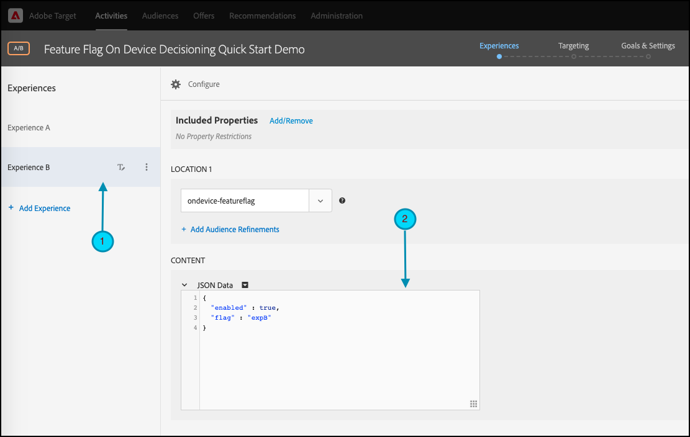
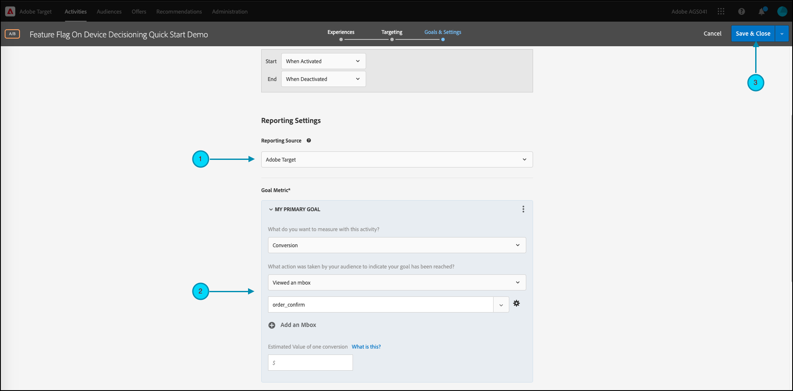

# の概要 [!DNL Target] SDK

を起動して実行するには、最初の [オンデバイス判定](../on-device-decisioning/overview.md) 選択した言語の機能フラグアクティビティ：

* Node.js
* Java
* .NET
* Python

## 手順の概要

1. 組織のオンデバイス判定を有効にする
1. SDK のインストール
1. SDK の初期化
1. 機能フラグを [!DNL Adobe Target] [!UICONTROL A/B テスト] アクティビティ
1. アプリケーションで機能を実装してレンダリングする
1. アプリケーションでのイベントのトラッキングの実装
1. のアクティブ化 [!UICONTROL A/B テスト] アクティビティ

## 1.組織のオンデバイス判定を有効にする

オンデバイス判定を有効にすると、 [!UICONTROL A/B テスト] アクティビティは、ほぼゼロの待ち時間で実行されます。 この機能を有効にするには、次に移動します。 **[!UICONTROL 管理]** > **[!UICONTROL 実装]** > **[!UICONTROL アカウントの詳細]** をクリックし、 **[!UICONTROL オンデバイス判定]** 切り替え


>[!NOTE]
>
>次を持っている必要があります： **[!UICONTROL 管理者]** または **[!UICONTROL 承認者]** [ユーザーロール](https://experienceleague.adobe.com/docs/target/using/administer/manage-users/user-management.html) 有効または無効にするには **[!UICONTROL オンデバイス判定]** 切り替え

を有効にした後 **[!UICONTROL オンデバイス判定]** トグル、 [!DNL Adobe Target] 生成を開始 [ルールアーティファクト](../on-device-decisioning/rule-artifact-overview.md) を設定します。

## 2. SDK をインストールする

Node.js、Java、Python の場合は、ターミナルのプロジェクトディレクトリで次のコマンドを実行します。 .NET の場合は、次の方法で依存関係として追加します。 [NuGet からのインストール](https://www.nuget.org/packages/Adobe.Target.Client).

>[!BEGINTABS]

>[!TAB Node.js (NPM)]

```js {line-numbers="true"}
npm i @adobe/target-nodejs-sdk -P
```

>[!TAB Java (Maven)]

```javascript {line-numbers="true"}
<dependency>
   <groupId>com.adobe.target</groupId>
   <artifactId>java-sdk</artifactId>
   <version>2.0</version>
</dependency>
```

>[!TAB .NET (Bash)]

```bash {line-numbers="true"}
dotnet add package Adobe.Target.Client
```

>[!TAB Python(pip)]

```python {line-numbers="true"}
pip install target-python-sdk
```

>[!ENDTABS]

## 3. SDK を初期化します

ルールアーティファクトは、SDK の初期化手順中にダウンロードされます。 初期化手順をカスタマイズして、アーティファクトのダウンロード方法と使用方法を決定できます。

>[!BEGINTABS]

>[!TAB Node.js]

```js {line-numbers="true"}
const TargetClient = require("@adobe/target-nodejs-sdk");

const CONFIG = {
   client: "<your target client code>",
   organizationId: "your EC org id",
   decisioningMethod: "on-device",
   events: {
      clientReady: targetClientReady
      }
};

const tClient = TargetClient.create(CONFIG);

function targetClientReady() {
   //Adobe Target SDK has now downloaded the JSON artifact locally, which contains the activity details.
   //We will see how to use the artifact here very soon.
}
```

>[!TAB Java (Maven)]

```javascript {line-numbers="true"}
ClientConfig config = ClientConfig.builder()
   .client("testClient")
   .organizationId("ABCDEF012345677890ABCDEF0@AdobeOrg")
   .build();
TargetClient targetClient = TargetClient.create(config);
```

>[!TAB .NET (C#)]

```csharp {line-numbers="true"}
var targetClientConfig = new TargetClientConfig.Builder("testClient", "ABCDEF012345677890ABCDEF0@AdobeOrg")
   .Build();
this.targetClient.Initialize(targetClientConfig);
```

>[!TAB Python]

```python {line-numbers="true"}
from target_python_sdk import TargetClient

def target_client_ready():
   # Adobe Target SDK has now downloaded the JSON artifact locally, which contains the activity details.
   # We will see how to use the artifact here very soon.

CONFIG = {
   "client": "<your target client code>",
   "organization_id": "your EC org id",
   "decisioning_method": "on-device",
   "events": {
      "client_ready": target_client_ready
   }
}

target_client = TargetClient.create(CONFIG)
```

>[!ENDTABS]

## 4.機能フラグを [!DNL Adobe Target] [!UICONTROL A/B テスト] アクティビティ

1. In [!DNL Target]をクリックし、 **[!UICONTROL アクティビティ]** ページ、「 」を選択します。 **[!UICONTROL アクティビティを作成]** > **[!UICONTROL A/B テスト]**.

   

1. Adobe Analytics の **[!UICONTROL A/B テストアクティビティの作成]** モーダルの場合、デフォルトの Web オプションを選択したまま (1)、 **[!UICONTROL フォーム]** experience composer (2) として、「 」を選択します。 **[!UICONTROL デフォルトのワークスペース]** 次を使用 **[!UICONTROL プロパティの制限がありません]**(3) をクリックし、 **[!UICONTROL 次へ]** (4)。

   

1. Adobe Analytics の **[!UICONTROL エクスペリエンス]** アクティビティを作成する手順で、アクティビティの名前を指定し (1)、2 つ目のエクスペリエンス「エクスペリエンス B」を「 **[!UICONTROL エクスペリエンスを追加]** (2)。 選択した場所の名前を入力します (3)。 例： `ondevice-featureflag` または `homepage-addtocart-featureflag` は、機能フラグテストの宛先を示す場所名です。  次の例では、 `ondevice-featureflag` は、エクスペリエンス B 用に定義された場所です。オプションで、オーディエンスの絞り込み (4) を追加して、認定をアクティビティに制限できます。

   

1. Adobe Analytics の **[!UICONTROL コンテンツ]** セクションで、「 **[!UICONTROL JSON オファーを作成]** を (1) に設定します。

   

1. Adobe Analytics の **[!UICONTROL JSON データ]** 表示されるテキストボックスに、有効な JSON オブジェクト (2) を使用して、各エクスペリエンスの機能フラグ変数を入力します (1)。

   エクスペリエンス A の機能フラグ変数を入力します。

   

   **（上記のエクスペリエンス A 用 JSON の例）**

   ```json {line-numbers="true"}
   {
      "enabled" : true,
      "flag" : "expA"
   }
   ```

   エクスペリエンス B の機能フラグ変数を入力します。

   

   **（上記のエクスペリエンス B の JSON の例）**

   ```json {line-numbers="true"}
   {
      "enabled" : true,
      "flag" : "expB"
   }
   ```

1. クリック **[!UICONTROL 次へ]** (1) に進む **[!UICONTROL ターゲット設定]** アクティビティ作成のステップ。

   

1. Adobe Analytics の **[!UICONTROL ターゲット設定]** 以下に示す手順の例では、シンプルにするために、オーディエンスのターゲット設定 (2) はすべての訪問者のデフォルトセットのままです。 これは、アクティビティがターゲティング解除されたことを意味します。 ただし、Adobeでは、実稼動アクティビティでは常にオーディエンスのターゲット設定をおこなうことをお勧めします。 クリック **[!UICONTROL 次へ]** (3) に進む **[!UICONTROL 目標と設定]** アクティビティ作成のステップ。

   

1. Adobe Analytics の **[!UICONTROL 目標と設定]** ステップ、設定 **[!UICONTROL レポートソース]** から **[!UICONTROL Adobe Target]** (1)。 次を定義： **[!UICONTROL 目標指標]** as **[!UICONTROL コンバージョン]**&#x200B;を使用して、サイトのコンバージョン指標に基づいて詳細を指定します (2)。 クリック **[!UICONTROL 保存して閉じる]** (3) をクリックして、アクティビティを保存します。

   

## 5.アプリケーションで機能を実装してレンダリングする

で機能フラグ変数を設定した後 [!DNL Target]を使用する場合は、アプリケーションコードを変更して使用します。 例えば、アプリケーションで機能フラグを取得したら、それを使用して機能を有効にし、訪問者が資格を持つエクスペリエンスをレンダリングできます。

>[!BEGINTABS]

>[!TAB Node.js]

```js {line-numbers="true"}
//... Code removed for brevity
​
let featureFlags = {};
​
function targetClientReady() {
   tClient.getAttributes(["ondevice-featureflag"]).then(function(response) {
      const featureFlags = response.asObject("ondevice-featureflag");
      if(featureFlags.enabled && featureFlags.flag !== "expA") { //Assuming "expA" is control
         console.log("Render alternate experience" + featureFlags.flag);
      }
      else {
         console.log("Render default experience");
      }
   });
}
```

>[!TAB Java (Maven)]

```javascript {line-numbers="true"}
MboxRequest mbox = new MboxRequest().name("ondevice-featureflag").index(0);
TargetDeliveryRequest request = TargetDeliveryRequest.builder()
   .context(new Context().channel(ChannelType.WEB))
   .execute(new ExecuteRequest().mboxes(Arrays.asList(mbox)))
   .build();
Attributes attributes = targetClient.getAttributes(request, "ondevice-featureflag");
String flag = attributes.getString("ondevice-featureflag", "flag");
```

>[!TAB .NET (C#)]

```csharp {line-numbers="true"}
var mbox = new MboxRequest(index: 0, name: "ondevice-featureflag");
var deliveryRequest = new TargetDeliveryRequest.Builder()
   .SetContext(new Context(ChannelType.Web))
   .SetExecute(new ExecuteRequest(mboxes: new List<MboxRequest> { mbox }))
   .Build();
var attributes = targetClient.GetAttributes(request, "ondevice-featureflag");
var flag = attributes.GetString("ondevice-featureflag", "flag");
```

>[!TAB Python]

```python {line-numbers="true"}
# ... Code removed for brevity

feature_flags = {}

def target_client_ready():
   attribute_provider = target_client.get_attributes(["ondevice-featureflag"])
   feature_flags = attribute_provider.as_object(mbox_name="ondevice-featureflag")
   if feature_flags.get("enabled") and feature_flags.get("flag") != "expA": # Assuming "expA" is control
      print("Render alternate experience {}".format(feature_flags.get("flag")))
   else:
      print("Render default experience")
```

>[!ENDTABS]

## 6.アプリケーションでのイベントの追加追跡の実装

オプションで、 sendNotification() 関数を使用して、コンバージョンを追跡するための追加のイベントを送信することができます。

>[!BEGINTABS]

>[!TAB Node.js]

```js {line-numbers="true"}
//... Code removed for brevity
​
//When a conversion happens
TargetClient.sendNotifications({
   targetCookie,
   "request" : {
      "notifications" : [
      {
         type: "display",
         timestamp : Date.now(),
         id: "conversion",
         mbox : {
            name : "orderConfirm"
         },
         order : {
            id: "BR9389",
            total : 98.93,
            purchasedProductIds : ["J9393", "3DJJ3"]
         }
      }
      ]
   }
})
```

>[!TAB Java (Maven)]

```javascript {line-numbers="true"}
Notification notification = new Notification();
notification.setId("conversion");
notification.setImpressionId(UUID.randomUUID().toString());
notification.setType(MetricType.DISPLAY);
notification.setTimestamp(System.currentTimeMillis());
Order order = new Order("BR9389");
order.total(98.93);
order.purchasedProductIds(["J9393", "3DJJ3"]);
notification.setOrder(order);

TargetDeliveryRequest notificationRequest =
   TargetDeliveryRequest.builder()
      .context(new Context().channel(ChannelType.WEB))
      .notifications(Collections.singletonList(notification))
      .build();

NotificationDeliveryService notificationDeliveryService = new NotificationDeliveryService();
notificationDeliveryService.sendNotification(notificationRequest);
```

>[!TAB .NET (C#)]

```csharp {line-numbers="true"}
var order = new Order
{
   Id = "BR9389",
   Total = 98.93M,
   PurchasedProductIds = new List<string> { "J9393", "3DJJ3" },
};
​
var notification = new Notification
{
   Id = "conversion",
   ImpressionId = Guid.NewGuid().ToString(),
   Type = MetricType.Display,
   Timestamp = DateTimeOffset.UtcNow.ToUnixTimeMilliseconds(),
   Order = order,
};
​
var notificationRequest = new TargetDeliveryRequest.Builder()
   .SetContext(new Context(ChannelType.Web))
   .SetNotifications(new List<Notification> {notification})
   .Build();
​
targetClient.SendNotifications(notificationRequest);
```

>[!TAB Python]

```python {line-numbers="true"}
# ... Code removed for brevity

# When a conversion happens
notification_mbox = NotificationMbox(name="orderConfirm")
order = Order(id="BR9389, total=98.93, purchased_product_ids=["J9393", "3DJJ3"])
notification = Notification(
   id="conversion",
   type=MetricType.DISPLAY,
   timestamp=1621530726000,  # Epoch time in milliseconds
   mbox=notification_mbox,
   order=order
)
notification_request = DeliveryRequest(notifications=[notification])


target_client.send_notifications({
   "target_cookie": target_cookie,
   "request" : notification_request
})
```

>[!ENDTABS]

## 7. [!UICONTROL A/B テスト] アクティビティ

1. クリック **[!UICONTROL 有効化]** (1) [!UICONTROL A/B テスト] アクティビティ。

   >[!NOTE]
   >
   >次を持っている必要があります： **[!UICONTROL 承認者]** または **[!UICONTROL 投稿者]** [ユーザーロール](https://experienceleague.adobe.com/docs/target/using/administer/manage-users/user-management.html) をクリックして、この手順を実行します。

   
