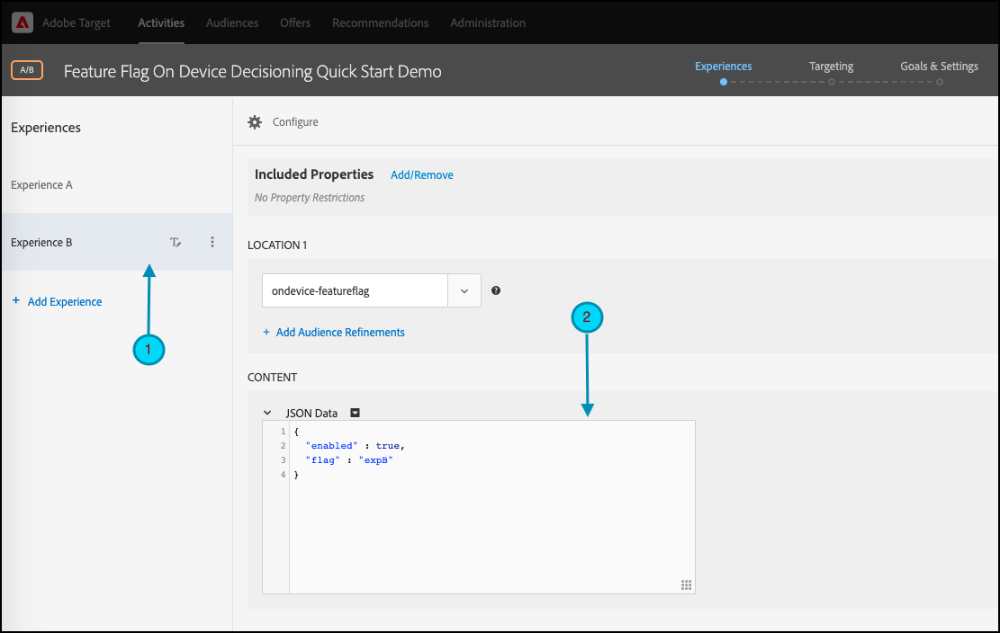
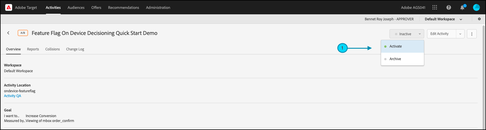

# [!DNL Target] SDKの概要

最初に、お好みの言語で最初の[ オンデバイス決定](../on-device-decisioning/overview.md)機能フラグアクティビティを作成することをお勧めします。

* Node.js
* Java
* .NET
* Python

## 手順の概要

1. 組織のオンデバイス判定を有効にする
1. SDKのインストール
1. SDKの初期化
1. [!DNL Adobe Target] [!UICONTROL A/B テスト ] アクティビティで機能フラグを設定します
1. アプリケーションに機能を実装してレンダリングする
1. アプリケーションにイベントのトラッキングを実装する
1. [!UICONTROL A/B テスト ] アクティビティをアクティブ化

## &#x200B;1. 組織のオンデバイス判定を有効にする

オンデバイス判定を有効にすると、[!UICONTROL A/B テスト ] アクティビティがほぼゼロの遅延で実行されます。 この機能を有効にするには、**[!UICONTROL 管理]** > **[!UICONTROL 実装]** > **[!UICONTROL アカウントの詳細]**&#x200B;に移動し、**[!UICONTROL オンデバイス決定]** トグルを有効にします。


>[!NOTE]
>
>**[!UICONTROL オンデバイス決定]** トグルを有効または無効にするには、**[!UICONTROL 管理者]**&#x200B;または&#x200B;**[!UICONTROL 承認者]** [ ユーザーロール ](https://experienceleague.adobe.com/docs/target/using/administer/manage-users/user-management.html)が必要です。

**[!UICONTROL オンデバイス決定]** トグルを有効にすると、[!DNL Adobe Target]は、クライアントに対して[ ルールアーティファクト ](../on-device-decisioning/rule-artifact-overview.md)の生成を開始します。

## &#x200B;2. SDKのインストール

Node.js、Java、Pythonの場合は、ターミナルのプロジェクトディレクトリで次のコマンドを実行します。 .NETの場合、NuGet](https://www.nuget.org/packages/Adobe.Target.Client)から[ インストールして依存関係として追加します。

>[!BEGINTABS]

>[!TAB Node.js （NPM） ]

```js {line-numbers="true"}
npm i @adobe/target-nodejs-sdk -P
```

>[!TAB Java （Maven） ]

```javascript {line-numbers="true"}
<dependency>
   <groupId>com.adobe.target</groupId>
   <artifactId>java-sdk</artifactId>
   <version>2.0</version>
</dependency>
```

>[!TAB .NET （Bash） ]

```bash {line-numbers="true"}
dotnet add package Adobe.Target.Client
```

>[!TAB Python （pip） ]

```python {line-numbers="true"}
pip install target-python-sdk
```

>[!ENDTABS]

## &#x200B;3. SDKの初期化

ルールアーティファクトは、SDKの初期化手順でダウンロードされます。 初期化手順をカスタマイズして、アーティファクトのダウンロードと使用方法を決定できます。

>[!BEGINTABS]

>[!TAB Node.js]

```js {line-numbers="true"}
const TargetClient = require("@adobe/target-nodejs-sdk");

const CONFIG = {
   client: "<your target client code>",
   organizationId: "your EC org id",
   decisioningMethod: "on-device",
   events: {
      clientReady: targetClientReady
      }
};

const tClient = TargetClient.create(CONFIG);

function targetClientReady() {
   //Adobe Target SDK has now downloaded the JSON artifact locally, which contains the activity details.
   //We will see how to use the artifact here very soon.
}
```

>[!TAB Java （Maven） ]

```javascript {line-numbers="true"}
ClientConfig config = ClientConfig.builder()
   .client("testClient")
   .organizationId("ABCDEF012345677890ABCDEF0@AdobeOrg")
   .build();
TargetClient targetClient = TargetClient.create(config);
```

>[!TAB .NET （C#） ]

```csharp {line-numbers="true"}
var targetClientConfig = new TargetClientConfig.Builder("testClient", "ABCDEF012345677890ABCDEF0@AdobeOrg")
   .Build();
this.targetClient.Initialize(targetClientConfig);
```

>[!TAB Python]

```python {line-numbers="true"}
from target_python_sdk import TargetClient

def target_client_ready():
   # Adobe Target SDK has now downloaded the JSON artifact locally, which contains the activity details.
   # We will see how to use the artifact here very soon.

CONFIG = {
   "client": "<your target client code>",
   "organization_id": "your EC org id",
   "decisioning_method": "on-device",
   "events": {
      "client_ready": target_client_ready
   }
}

target_client = TargetClient.create(CONFIG)
```

>[!ENDTABS]

## &#x200B;4. [!DNL Adobe Target] [!UICONTROL A/B テスト ] アクティビティで機能フラグを設定します

1. [!DNL Target]で、**[!UICONTROL アクティビティ]** ページに移動し、**[!UICONTROL アクティビティの作成]** > **[!UICONTROL A/B テスト]**&#x200B;を選択します。

   

1. **[!UICONTROL A/B テスト アクティビティの作成]** モーダルで、デフォルトのWeb オプションを選択したまま（1）、エクスペリエンスコンポーザーとして&#x200B;**[!UICONTROL Form]**&#x200B;を選択し（2）、**[!UICONTROL プロパティ制限なし]** （3）で&#x200B;**[!UICONTROL デフォルトのWorkspace]**&#x200B;を選択し、**[!UICONTROL 次]** （4）をクリックします。

   

1. アクティビティ作成の&#x200B;**[!UICONTROL エクスペリエンス]**&#x200B;手順で、アクティビティの名前（1）を入力し、「**[!UICONTROL エクスペリエンスを追加]**」（2）をクリックして、2番目のエクスペリエンスであるエクスペリエンス Bを追加します。 選択した場所の名前を入力します（3）。 例えば、`ondevice-featureflag`または`homepage-addtocart-featureflag`は、機能フラグテストの宛先を示す場所名です。  次の例では、`ondevice-featureflag`はエクスペリエンス Bに対して定義された場所です。必要に応じて、オーディエンスの絞り込み（4）を追加して、アクティビティへの選定を制限できます。

   

1. 同じページの「**[!UICONTROL CONTENT]**」セクションで、図に示すように、ドロップダウン（1）で「**[!UICONTROL JSON オファーを作成]**」を選択します。

   

1. 表示される&#x200B;**[!UICONTROL JSON データ]** テキストボックスに、有効なJSON オブジェクト （2）を使用して、各エクスペリエンス （1）の機能フラグ変数を入力します。

   エクスペリエンス Aの機能フラグ変数を入力します。

   

   **（エクスペリエンス Aのサンプル JSON、上記）**

   ```json {line-numbers="true"}
   {
      "enabled" : true,
      "flag" : "expA"
   }
   ```

   エクスペリエンス Bの機能フラグ変数を入力します。

   

   **（Experience Bのサンプル JSON、上記）**

   ```json {line-numbers="true"}
   {
      "enabled" : true,
      "flag" : "expB"
   }
   ```

1. 「**[!UICONTROL 次へ]** （1）」をクリックして、アクティビティ作成の&#x200B;**[!UICONTROL ターゲティング]** ステップに進みます。

   

1. 以下に示す&#x200B;**[!UICONTROL ターゲティング]**&#x200B;手順の例では、簡単化のために、オーディエンスターゲティング（2）はすべての訪問者のデフォルトセットに残っています。 つまり、活動はターゲット化されていません。 ただし、Adobeでは、実稼動アクティビティに対してオーディエンスを常にターゲティングすることをお勧めします。 「**[!UICONTROL 次へ]**」（3）をクリックして、アクティビティの作成の&#x200B;**[!UICONTROL 目標と設定]** ステップに進みます。

   

1. **[!UICONTROL 目標と設定]** ステップで、**[!UICONTROL レポート Source]**&#x200B;を&#x200B;**[!UICONTROL Adobe Target]** （1）に設定します。 **[!UICONTROL 目標指標]**&#x200B;を&#x200B;**[!UICONTROL コンバージョン]**&#x200B;として定義し、サイトのコンバージョン指標（2）に基づいて詳細を指定します。 「**[!UICONTROL 保存して閉じる]**」（3）をクリックして、アクティビティを保存します。

   

## &#x200B;5. アプリケーションに機能を実装してレンダリングする

[!DNL Target]で機能フラグ変数を設定したら、アプリケーションコードを変更して使用します。 例えば、アプリケーションで機能フラグを取得した後、それを使用して機能を有効にし、訪問者が選定したエクスペリエンスをレンダリングできます。

>[!BEGINTABS]

>[!TAB Node.js]

```js {line-numbers="true"}
//... Code removed for brevity
​
let featureFlags = {};
​
function targetClientReady() {
   tClient.getAttributes(["ondevice-featureflag"]).then(function(response) {
      const featureFlags = response.asObject("ondevice-featureflag");
      if(featureFlags.enabled && featureFlags.flag !== "expA") { //Assuming "expA" is control
         console.log("Render alternate experience" + featureFlags.flag);
      }
      else {
         console.log("Render default experience");
      }
   });
}
```

>[!TAB Java （Maven） ]

```javascript {line-numbers="true"}
MboxRequest mbox = new MboxRequest().name("ondevice-featureflag").index(0);
TargetDeliveryRequest request = TargetDeliveryRequest.builder()
   .context(new Context().channel(ChannelType.WEB))
   .execute(new ExecuteRequest().mboxes(Arrays.asList(mbox)))
   .build();
Attributes attributes = targetClient.getAttributes(request, "ondevice-featureflag");
String flag = attributes.getString("ondevice-featureflag", "flag");
```

>[!TAB .NET （C#） ]

```csharp {line-numbers="true"}
var mbox = new MboxRequest(index: 0, name: "ondevice-featureflag");
var deliveryRequest = new TargetDeliveryRequest.Builder()
   .SetContext(new Context(ChannelType.Web))
   .SetExecute(new ExecuteRequest(mboxes: new List<MboxRequest> { mbox }))
   .Build();
var attributes = targetClient.GetAttributes(request, "ondevice-featureflag");
var flag = attributes.GetString("ondevice-featureflag", "flag");
```

>[!TAB Python]

```python {line-numbers="true"}
# ... Code removed for brevity

feature_flags = {}

def target_client_ready():
   attribute_provider = target_client.get_attributes(["ondevice-featureflag"])
   feature_flags = attribute_provider.as_object(mbox_name="ondevice-featureflag")
   if feature_flags.get("enabled") and feature_flags.get("flag") != "expA": # Assuming "expA" is control
      print("Render alternate experience {}".format(feature_flags.get("flag")))
   else:
      print("Render default experience")
```

>[!ENDTABS]

## &#x200B;6. アプリケーション内のイベントに対する追加のトラッキングを実装する

オプションとして、sendNotification （）関数を使用して、コンバージョンを追跡するための追加のイベントを送信できます。

>[!BEGINTABS]

>[!TAB Node.js]

```js {line-numbers="true"}
//... Code removed for brevity
​
//When a conversion happens
TargetClient.sendNotifications({
   targetCookie,
   "request" : {
      "notifications" : [
      {
         type: "display",
         timestamp : Date.now(),
         id: "conversion",
         mbox : {
            name : "orderConfirm"
         },
         order : {
            id: "BR9389",
            total : 98.93,
            purchasedProductIds : ["J9393", "3DJJ3"]
         }
      }
      ]
   }
})
```

>[!TAB Java （Maven） ]

```javascript {line-numbers="true"}
Notification notification = new Notification();
notification.setId("conversion");
notification.setImpressionId(UUID.randomUUID().toString());
notification.setType(MetricType.DISPLAY);
notification.setTimestamp(System.currentTimeMillis());
Order order = new Order("BR9389");
order.total(98.93);
order.purchasedProductIds(["J9393", "3DJJ3"]);
notification.setOrder(order);

TargetDeliveryRequest notificationRequest =
   TargetDeliveryRequest.builder()
      .context(new Context().channel(ChannelType.WEB))
      .notifications(Collections.singletonList(notification))
      .build();

NotificationDeliveryService notificationDeliveryService = new NotificationDeliveryService();
notificationDeliveryService.sendNotification(notificationRequest);
```

>[!TAB .NET （C#） ]

```csharp {line-numbers="true"}
var order = new Order
{
   Id = "BR9389",
   Total = 98.93M,
   PurchasedProductIds = new List<string> { "J9393", "3DJJ3" },
};
​
var notification = new Notification
{
   Id = "conversion",
   ImpressionId = Guid.NewGuid().ToString(),
   Type = MetricType.Display,
   Timestamp = DateTimeOffset.UtcNow.ToUnixTimeMilliseconds(),
   Order = order,
};
​
var notificationRequest = new TargetDeliveryRequest.Builder()
   .SetContext(new Context(ChannelType.Web))
   .SetNotifications(new List<Notification> {notification})
   .Build();
​
targetClient.SendNotifications(notificationRequest);
```

>[!TAB Python]

```python {line-numbers="true"}
# ... Code removed for brevity

# When a conversion happens
notification_mbox = NotificationMbox(name="orderConfirm")
order = Order(id="BR9389, total=98.93, purchased_product_ids=["J9393", "3DJJ3"])
notification = Notification(
   id="conversion",
   type=MetricType.DISPLAY,
   timestamp=1621530726000,  # Epoch time in milliseconds
   mbox=notification_mbox,
   order=order
)
notification_request = DeliveryRequest(notifications=[notification])


target_client.send_notifications({
   "target_cookie": target_cookie,
   "request" : notification_request
})
```

>[!ENDTABS]

## &#x200B;7. [!UICONTROL A/B テスト ] アクティビティをアクティブ化

1. 「**[!UICONTROL アクティブ化]** （1）」をクリックして、[!UICONTROL A/B テスト ] アクティビティをアクティブ化します。

   >[!NOTE]
   >
   >この手順を実行するには、**[!UICONTROL 承認者]**&#x200B;または&#x200B;**[!UICONTROL 発行者]** [ ユーザーの役割](https://experienceleague.adobe.com/docs/target/using/administer/manage-users/user-management.html)が必要です。

   
