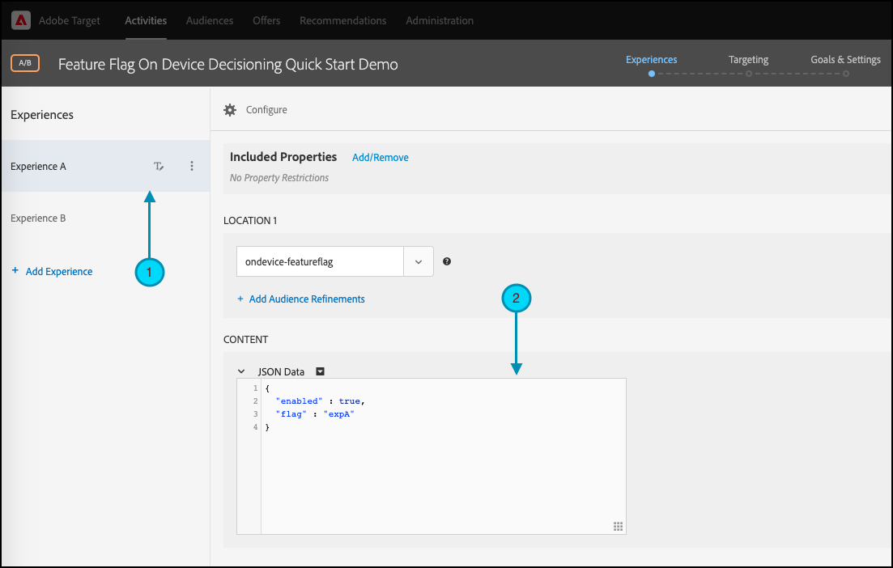

# [!DNL Target] SDK の概要

動作を開始するには、最初の [ オンデバイス判定 ](../on-device-decisioning/overview.md) 機能フラグアクティビティを選択した言語で作成することをお勧めします。

* Node.js
* Java
* .NET
* Python

## 手順の概要

1. 組織のオンデバイス判定を有効にする
1. SDK のインストール
1. SDK の初期化
1. [!DNL Adobe Target] [!UICONTROL A/B Test] アクティビティの機能フラグの設定
1. アプリケーションでの機能の実装とレンダリング
1. アプリケーションにイベントのトラッキングを実装
1. [!UICONTROL A/B Test] アクティビティのアクティベート

## 1.組織のオンデバイス判定を有効にする

オンデバイス判定を有効にすると、[!UICONTROL A/B Test] アクティビティがほぼゼロの待ち時間で実行されるようになります。 この機能を有効にするには、**[!UICONTROL Administration]** / **[!UICONTROL Implementation]** / **[!UICONTROL Account details]** に移動し、「**[!UICONTROL On-Device Decisioning]**」トグルを有効にします。


>[!NOTE]
>
>**[!UICONTROL On-Device Decisioning]** の切り替えを有効または無効にするには、**[!UICONTROL Admin]** または **[!UICONTROL Approver]** [ ユーザーの役割 ](https://experienceleague.adobe.com/docs/target/using/administer/manage-users/user-management.html?lang=ja) を持っている必要があります。

「**[!UICONTROL On-Device Decisioning]**」切替スイッチを有効 [!DNL Adobe Target] すると、クライアントの [ ルールアーティファクト ](../on-device-decisioning/rule-artifact-overview.md) の生成を開始します。

## 2. SDK をインストールする

Node.js、Java および Python の場合は、ターミナルのプロジェクトディレクトリで次のコマンドを実行します。 .NET の場合は、[NuGet からインストール ](https://www.nuget.org/packages/Adobe.Target.Client) して、依存関係として追加します。

>[!BEGINTABS]

>[!TAB Node.js （NPM） ]

```js {line-numbers="true"}
npm i @adobe/target-nodejs-sdk -P
```

>[!TAB Java （Maven） ]

```javascript {line-numbers="true"}
<dependency>
   <groupId>com.adobe.target</groupId>
   <artifactId>java-sdk</artifactId>
   <version>2.0</version>
</dependency>
```

>[!TAB .NET （Bash） ]

```bash {line-numbers="true"}
dotnet add package Adobe.Target.Client
```

>[!TAB Python （pip） ]

```python {line-numbers="true"}
pip install target-python-sdk
```

>[!ENDTABS]

## 3. SDK の初期化

ルールアーティファクトは、SDK の初期化手順の間にダウンロードされます。 初期化手順をカスタマイズして、アーティファクトのダウンロードおよび使用方法を決定できます。

>[!BEGINTABS]

>[!TAB Node.js]

```js {line-numbers="true"}
const TargetClient = require("@adobe/target-nodejs-sdk");

const CONFIG = {
   client: "<your target client code>",
   organizationId: "your EC org id",
   decisioningMethod: "on-device",
   events: {
      clientReady: targetClientReady
      }
};

const tClient = TargetClient.create(CONFIG);

function targetClientReady() {
   //Adobe Target SDK has now downloaded the JSON artifact locally, which contains the activity details.
   //We will see how to use the artifact here very soon.
}
```

>[!TAB Java （Maven） ]

```javascript {line-numbers="true"}
ClientConfig config = ClientConfig.builder()
   .client("testClient")
   .organizationId("ABCDEF012345677890ABCDEF0@AdobeOrg")
   .build();
TargetClient targetClient = TargetClient.create(config);
```

>[!TAB .NET （C#） ]

```csharp {line-numbers="true"}
var targetClientConfig = new TargetClientConfig.Builder("testClient", "ABCDEF012345677890ABCDEF0@AdobeOrg")
   .Build();
this.targetClient.Initialize(targetClientConfig);
```

>[!TAB Python]

```python {line-numbers="true"}
from target_python_sdk import TargetClient

def target_client_ready():
   # Adobe Target SDK has now downloaded the JSON artifact locally, which contains the activity details.
   # We will see how to use the artifact here very soon.

CONFIG = {
   "client": "<your target client code>",
   "organization_id": "your EC org id",
   "decisioning_method": "on-device",
   "events": {
      "client_ready": target_client_ready
   }
}

target_client = TargetClient.create(CONFIG)
```

>[!ENDTABS]

## 4. [!DNL Adobe Target] [!UICONTROL A/B Test] アクティビティの機能フラグの設定

1. [!DNL Target] で、**[!UICONTROL Activities]** ページに移動し、**[!UICONTROL Create Activity]**/**[!UICONTROL A/B test]** を選択します。

   

1. **[!UICONTROL Create A/B Test Activity]** モーダルでは、デフォルトの web オプションを選択したままにし（1）、experience composer として **[!UICONTROL Form]** を選択し（2）、**[!UICONTROL No Property Restrictions]** を使用して **[!UICONTROL Default Workspace]** を選択し（3）、**[!UICONTROL Next]** をクリックします（4）。

   

1. アクティビティ作成の **[!UICONTROL Experiences]** の手順で、アクティビティの名前を指定し（1）、**[!UICONTROL Add Experience]** をクリックして 2 つ目のエクスペリエンス Experience B を追加します（2）。 任意の場所の名前（3）を入力します。 例えば、`ondevice-featureflag` や `homepage-addtocart-featureflag` は、機能フラグテストの宛先を示す場所名です。  次の例では、エクスペリエンス B に対して定義された場所が `ondevice-featureflag` です。オプションで、オーディエンスの絞り込み（4）を追加して、アクティビティの選定を制限できます。

   

1. 同じページの「**[!UICONTROL CONTENT]**」セクションで、次に示すように、ドロップダウンの「**[!UICONTROL Create JSON Offer]** （1）」を選択します。

   

1. 表示される **[!UICONTROL JSON Data]** テキストボックスに、有効な JSON オブジェクト（2）を使用して、各エクスペリエンス（1）の機能フラグ変数を入力します。

   エクスペリエンス A の機能フラグ変数を入力します。

   

   **（上記のエクスペリエンス A のサンプル JSON）**

   ```json {line-numbers="true"}
   {
      "enabled" : true,
      "flag" : "expA"
   }
   ```

   エクスペリエンス B の機能フラグ変数を入力します。

   

   **（前述のエクスペリエンス B のサンプル JSON）**

   ```json {line-numbers="true"}
   {
      "enabled" : true,
      "flag" : "expB"
   }
   ```

1. **[!UICONTROL Next]** （1）をクリックして、アクティビティ作成の **[!UICONTROL Targeting]** のステップに進みます。

   

1. 以下に示す **[!UICONTROL Targeting]** の手順の例では、簡単にするために、オーディエンスのターゲット設定（2）はすべての訪問者のデフォルトセットに残ります。 つまり、アクティビティはターゲット設定されていません。 ただし、Adobeでは、実稼動アクティビティのオーディエンスを常にターゲットにすることをお勧めします。 **[!UICONTROL Next]** （3）をクリックして、アクティビティ作成の **[!UICONTROL Goals & Settings]** のステップに進みます。

   

1. **[!UICONTROL Goals & Settings]** の手順では、**[!UICONTROL Reporting Source]** を **[!UICONTROL Adobe Target]** （1）に設定します。 **[!UICONTROL Conversion]** のように **[!UICONTROL Goal Metric]** を定義し、サイトのコンバージョン指標（2）に基づいて詳細を指定します。 **[!UICONTROL Save & Close]** （3）をクリックして、アクティビティを保存します。

   

## 5. アプリケーションで機能を実装し、レンダリングする

[!DNL Target] で機能フラグ変数を設定したら、それらを使用するようにアプリケーションコードを変更します。 例えば、アプリケーションで機能フラグを取得した後、それを使用して機能を有効にし、訪問者が認定したエクスペリエンスをレンダリングできます。

>[!BEGINTABS]

>[!TAB Node.js]

```js {line-numbers="true"}
//... Code removed for brevity
​
let featureFlags = {};
​
function targetClientReady() {
   tClient.getAttributes(["ondevice-featureflag"]).then(function(response) {
      const featureFlags = response.asObject("ondevice-featureflag");
      if(featureFlags.enabled && featureFlags.flag !== "expA") { //Assuming "expA" is control
         console.log("Render alternate experience" + featureFlags.flag);
      }
      else {
         console.log("Render default experience");
      }
   });
}
```

>[!TAB Java （Maven） ]

```javascript {line-numbers="true"}
MboxRequest mbox = new MboxRequest().name("ondevice-featureflag").index(0);
TargetDeliveryRequest request = TargetDeliveryRequest.builder()
   .context(new Context().channel(ChannelType.WEB))
   .execute(new ExecuteRequest().mboxes(Arrays.asList(mbox)))
   .build();
Attributes attributes = targetClient.getAttributes(request, "ondevice-featureflag");
String flag = attributes.getString("ondevice-featureflag", "flag");
```

>[!TAB .NET （C#） ]

```csharp {line-numbers="true"}
var mbox = new MboxRequest(index: 0, name: "ondevice-featureflag");
var deliveryRequest = new TargetDeliveryRequest.Builder()
   .SetContext(new Context(ChannelType.Web))
   .SetExecute(new ExecuteRequest(mboxes: new List<MboxRequest> { mbox }))
   .Build();
var attributes = targetClient.GetAttributes(request, "ondevice-featureflag");
var flag = attributes.GetString("ondevice-featureflag", "flag");
```

>[!TAB Python]

```python {line-numbers="true"}
# ... Code removed for brevity

feature_flags = {}

def target_client_ready():
   attribute_provider = target_client.get_attributes(["ondevice-featureflag"])
   feature_flags = attribute_provider.as_object(mbox_name="ondevice-featureflag")
   if feature_flags.get("enabled") and feature_flags.get("flag") != "expA": # Assuming "expA" is control
      print("Render alternate experience {}".format(feature_flags.get("flag")))
   else:
      print("Render default experience")
```

>[!ENDTABS]

## 6. アプリケーションにイベントの追加トラッキングを実装する

オプションで、sendNotification （）関数を使用してコンバージョンを追跡するための追加のイベントを送信できます。

>[!BEGINTABS]

>[!TAB Node.js]

```js {line-numbers="true"}
//... Code removed for brevity
​
//When a conversion happens
TargetClient.sendNotifications({
   targetCookie,
   "request" : {
      "notifications" : [
      {
         type: "display",
         timestamp : Date.now(),
         id: "conversion",
         mbox : {
            name : "orderConfirm"
         },
         order : {
            id: "BR9389",
            total : 98.93,
            purchasedProductIds : ["J9393", "3DJJ3"]
         }
      }
      ]
   }
})
```

>[!TAB Java （Maven） ]

```javascript {line-numbers="true"}
Notification notification = new Notification();
notification.setId("conversion");
notification.setImpressionId(UUID.randomUUID().toString());
notification.setType(MetricType.DISPLAY);
notification.setTimestamp(System.currentTimeMillis());
Order order = new Order("BR9389");
order.total(98.93);
order.purchasedProductIds(["J9393", "3DJJ3"]);
notification.setOrder(order);

TargetDeliveryRequest notificationRequest =
   TargetDeliveryRequest.builder()
      .context(new Context().channel(ChannelType.WEB))
      .notifications(Collections.singletonList(notification))
      .build();

NotificationDeliveryService notificationDeliveryService = new NotificationDeliveryService();
notificationDeliveryService.sendNotification(notificationRequest);
```

>[!TAB .NET （C#） ]

```csharp {line-numbers="true"}
var order = new Order
{
   Id = "BR9389",
   Total = 98.93M,
   PurchasedProductIds = new List<string> { "J9393", "3DJJ3" },
};
​
var notification = new Notification
{
   Id = "conversion",
   ImpressionId = Guid.NewGuid().ToString(),
   Type = MetricType.Display,
   Timestamp = DateTimeOffset.UtcNow.ToUnixTimeMilliseconds(),
   Order = order,
};
​
var notificationRequest = new TargetDeliveryRequest.Builder()
   .SetContext(new Context(ChannelType.Web))
   .SetNotifications(new List<Notification> {notification})
   .Build();
​
targetClient.SendNotifications(notificationRequest);
```

>[!TAB Python]

```python {line-numbers="true"}
# ... Code removed for brevity

# When a conversion happens
notification_mbox = NotificationMbox(name="orderConfirm")
order = Order(id="BR9389, total=98.93, purchased_product_ids=["J9393", "3DJJ3"])
notification = Notification(
   id="conversion",
   type=MetricType.DISPLAY,
   timestamp=1621530726000,  # Epoch time in milliseconds
   mbox=notification_mbox,
   order=order
)
notification_request = DeliveryRequest(notifications=[notification])


target_client.send_notifications({
   "target_cookie": target_cookie,
   "request" : notification_request
})
```

>[!ENDTABS]

## 7. [!UICONTROL A/B Test] アクティビティをアクティブ化する

1. **[!UICONTROL Activate]** （1）をクリックして、[!UICONTROL A/B Test] アクティビティをアクティブ化します。

   >[!NOTE]
   >
   >この手順を実行するには、**[!UICONTROL Approver]** または **[!UICONTROL Publisher]** [ ユーザーの役割 ](https://experienceleague.adobe.com/docs/target/using/administer/manage-users/user-management.html?lang=ja) を持っている必要があります。

   
