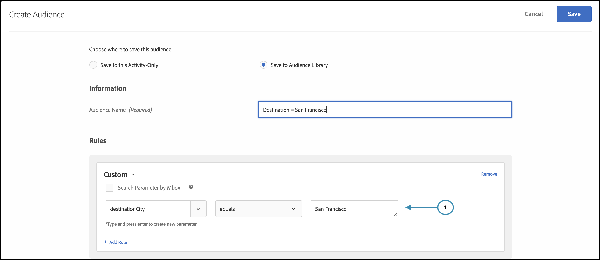

# パーソナライゼーションを配信

## 手順の概要

1. 有効にする [!UICONTROL オンデバイス判定] （組織の）
1. の作成 [!UICONTROL エクスペリエンスのターゲット設定] (XT) アクティビティ
1. オーディエンスごとにパーソナライズされたエクスペリエンスを定義
1. オーディエンスごとにパーソナライズされたエクスペリエンスを検証
1. レポートの設定
1. KPI を追跡するための指標を追加
1. アプリケーションへのパーソナライズされたオファーの実装
1. コンバージョンイベントを追跡するコードの実装
1. のアクティブ化 [!UICONTROL エクスペリエンスのターゲット設定] (XT) パーソナライゼーションアクティビティ

ツーリング会社だとしましょう。 特定の旅行用パッケージを 25%引きでパーソナライズしたオファーを提供したい。 オファーがユーザーの共感を呼ぶために、目的の都市のランドマークを表示することにしました。 また、パーソナライズされたオファーの配信をほぼゼロの待ち時間で実行し、ユーザーエクスペリエンスに悪影響を与えず、結果に歪曲を与えないようにしたい場合もあります。

## 1.有効にする [!UICONTROL オンデバイス判定] （組織の）

1. オンデバイス判定を有効にすると、A/B アクティビティがほぼゼロの待ち時間で実行されます。 この機能を有効にするには、次に移動します。 **[!UICONTROL 管理]** > **[!UICONTROL 実装]** > **[!UICONTROL アカウントの詳細]** in [!DNL Adobe Target]、を有効にします。 **[!UICONTROL オンデバイス判定]** 切り替え

   

   >[!NOTE]
   >
   >管理者または承認者が必要です [ユーザーロール](https://experienceleague.adobe.com/docs/target/using/administer/manage-users/user-management.html) 有効または無効にするには [!UICONTROL オンデバイス判定] 切り替え

   を有効にした後 **[!UICONTROL オンデバイス判定]** トグル、 [!DNL Adobe Target] 生成を開始 *ルールアーティファクト* を設定します。

## 2. [!UICONTROL エクスペリエンスのターゲット設定] (XT) アクティビティ

1. In [!DNL Adobe Target]をクリックし、 **[!UICONTROL アクティビティ]** ページ、「 」を選択します。 **[!UICONTROL アクティビティを作成]** > **[!UICONTROL エクスペリエンスのターゲット設定]**.

   

1. Adobe Analytics の **[!UICONTROL エクスペリエンスのターゲット設定アクティビティを作成]** モーダルのままにします。デフォルトのままにします。 **[!UICONTROL Web]** オプションが選択されている (1)、 **[!UICONTROL フォーム]** experience composer(2) として、ワークスペースとプロパティ (3) を選択し、「 **[!UICONTROL 次へ]** (4)。

   

## 3.オーディエンスごとにパーソナライズされたエクスペリエンスを定義する

1. Adobe Analytics の **[!UICONTROL エクスペリエンス]** アクティビティの作成手順、クリック **[!UICONTROL オーディエンスを変更]** を使用して、カリフォルニアのサンフランシスコに旅行する訪問者のオーディエンスを作成できます。

   

1. Adobe Analytics の **[!UICONTROL オーディエンスを作成]** モーダルを使用する場合は、カスタムルールを定義します。 `destinationCity = San Francisco`. これは、サンフランシスコに旅行するユーザーのグループを定義します。

   

1. Still in the **[!UICONTROL エクスペリエンス]** 手順：ゴールデンゲートブリッジに関する特別オファーをレンダリングするアプリケーション内の場所 (1) の名前を入力します。ただし、サンフランシスコに向かう人に限ります。 ここに示す例では、homepage は、HTMLオファー用に選択された場所 (2) で、 **[!UICONTROL コンテンツ]** 領域。

   

1. 「 」をクリックして別のターゲティング対象オーディエンスを追加 **[!UICONTROL エクスペリエンスのターゲット設定を追加]**. 今回は、次の条件に該当するオーディエンスルールを定義して、ニューヨークに旅行するオーディエンスをターゲットに設定します。 `destinationCity = New York`. エンパイアステートビルディングに関する特別オファーを表示するアプリケーション内の場所を定義します。 ここに示す例では、 `homepage` は、HTMLオファー (2) に対して選択された場所で、 **[!UICONTROL コンテンツ]** 領域。

   

## 4.オーディエンスごとにパーソナライズされたエクスペリエンスを確認する

Adobe Analytics の **[!UICONTROL ターゲット設定]** 手順で、オーディエンスごとに目的のパーソナライズされたエクスペリエンスが設定されていることを確認します。


## 5.レポートを設定する

Adobe Analytics の **[!UICONTROL 目標と設定]** ステップ、選択 **[!UICONTROL Adobe Target]** として **[!UICONTROL レポートソース]** アクティビティの結果を [!DNL Adobe Target] UI、または **[!UICONTROL Adobe Analytics]** をクリックして、Adobe Analytics UI に表示します。


## 6. KPI を追跡するための指標を追加

を選択します。 **[!UICONTROL 目標指標]** ：アクティビティの成功を測定します。 この例では、ユーザーがパーソナライズされた宛先オファーをクリックしたかどうかに基づいて、コンバージョンが成功します。

## 7.パーソナライズされたオファーをアプリケーションに実装する

>[!BEGINTABS]

>[!TAB Node.js]

```js {line-numbers="true"}
const TargetClient = require("@adobe/target-nodejs-sdk");

const CONFIG = {
  client: "acmeclient",
  organizationId: "1234567890@AdobeOrg"
};

const targetClient = TargetClient.create(CONFIG);

targetClient.getOffers({
  request: {      
    execute: {
      pageLoad: {
        parameters: {
          destinationCity: "San Francisco"
        }
      }
    }       
  }
})
.then(console.log)
.catch(console.error);
```

>[!TAB Java]

```java {line-numbers="true"}
ClientConfig config = ClientConfig.builder()
  .client("acmeclient")
  .organizationId("1234567890@AdobeOrg")
  .build();
TargetClient targetClient = TargetClient.create(config);

Context context = new Context().channel(ChannelType.WEB);

ExecuteRequest executeRequest = new ExecuteRequest();

RequestDetails pageLoad = new RequestDetails();
pageLoad.setParameters(
    new HashMap<String, String>() {
      {
        put("destinationCity", "San Francisco");
      }
    });

executeRequest.setPageLoad(pageLoad);

TargetDeliveryRequest request = TargetDeliveryRequest.builder()
  .context(context)
  .execute(executeRequest)
  .build();

TargetDeliveryResponse offers = targetClient.getOffers(request);
```

>[!ENDTABS]

## 8.コンバージョンイベントを追跡するコードを実装する

>[!BEGINTABS]

>[!TAB Node.js]

```js {line-numbers="true"}
//... Code removed for brevity

//When a conversion happens
TargetClient.sendNotifications({
    targetCookie,
    "request" : {
      "notifications" : [
        {
          type: "click",
          timestamp : Date.now(),
          id: "conversion",
          mbox : {
            name : "destinationOffer"
          }
        }
      ]
    }
})
```

>[!TAB Java]

```java {line-numbers="true"
ClientConfig config = ClientConfig.builder()
  .client("acmeclient")
  .organizationId("1234567890@AdobeOrg")
  .build();
TargetClient targetClient = TargetClient.create(config);

Context context = new Context().channel(ChannelType.WEB);

ExecuteRequest executeRequest = new ExecuteRequest();

RequestDetails pageLoad = new RequestDetails();
pageLoad.setParameters(
    new HashMap<String, String>() {
      {
        put("destinationCity", "San Francisco");
      }
    });

executeRequest.setPageLoad(pageLoad);
NotificationDeliveryService notificationDeliveryService = new NotificationDeliveryService();

Notification notification = new Notification();
notification.setId("conversion");
notification.setImpressionId(UUID.randomUUID().toString());
notification.setType(MetricType.CLICK);
notification.setTimestamp(System.currentTimeMillis());
notification.setTokens(
    Collections.singletonList(
        "IbG2Jz2xmHaqX7Ml/YRxRGqipfsIHvVzTQxHolz2IpSCnQ9Y9OaLL2gsdrWQTvE54PwSz67rmXWmSnkXpSSS2Q=="));

TargetDeliveryRequest targetDeliveryRequest =
    TargetDeliveryRequest.builder()
        .context(context)
        .execute(executeRequest)
        .notifications(Collections.singletonList(notification))
        .build();

TargetDeliveryResponse offers = targetClient.getOffers(request);
notificationDeliveryService.sendNotification(request);
```

>[!ENDTABS]

## 9.エクスペリエンスのターゲット設定 (XT) アクティビティをアクティブ化します


