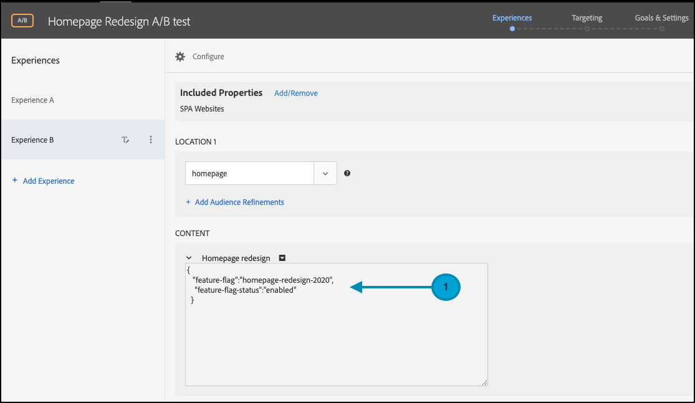
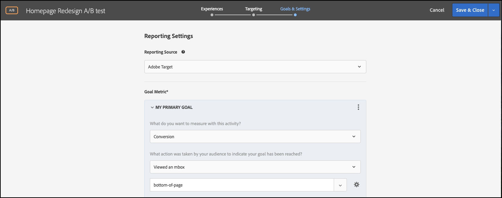

# 機能フラグによるA/B テストの実施

## 手順の概要

1. 組織の[!UICONTROL  オンデバイス決定]を有効にする
1. [!UICONTROL A/B テスト ] アクティビティの作成
1. AとBの定義
1. オーディエンスの追加
1. トラフィック配分の設定
1. バリエーションへのトラフィック配分の設定
1. レポートの設定
1. KPIを追跡するための指標の追加
1. 機能フラグを使用してA/B テストを実行するコードを実装する
1. 機能フラグでA/B テストを有効化

>[!NOTE]
>
>例えば、秋をテーマにしたホームページのリニューアルが、オーディエンスに好評かどうかを判断したいとします。 [!DNL Adobe Target]でA/B実験を実行してテストすることにしました。 また、ネガティブなユーザーエクスペリエンスや遅いユーザーエクスペリエンスが結果をゆがめないように、実験が優れたパフォーマンスで配信されるようにします。

## &#x200B;1. 組織の[!UICONTROL  オンデバイス決定]を有効にする

オンデバイス判定を有効にすると、A/B アクティビティがほぼゼロの遅延で実行されます。 この機能を有効にするには、[!DNL Adobe Target]で&#x200B;**[!UICONTROL 管理]** > **[!UICONTROL 実装]** > **[!UICONTROL アカウントの詳細]**&#x200B;に移動し、**[!UICONTROL オンデバイス決定]** トグルを有効にします。

&lt;!— image-odd4.pngを挿入 – >


>[!NOTE]
>
>オンデバイス決定トグルを有効または無効にするには、管理者または承認者[ ユーザーの役割](https://experienceleague.adobe.com/docs/target/using/administer/manage-users/user-management.html)が必要です。

**[!UICONTROL オンデバイス決定]** トグルを有効にすると、[!DNL Adobe Target]はクライアントのルールアーティファクトの生成を開始します。

## &#x200B;2. [!UICONTROL A/B テスト ] アクティビティの作成

[!DNL Adobe Target]で、**[!UICONTROL アクティビティ]** ページに移動し、**[!UICONTROL アクティビティの作成]** > **[!UICONTROL A/B テスト]**&#x200B;を選択します。


**[!UICONTROL A/B テスト アクティビティの作成]** モーダルで、デフォルトの&#x200B;**[!UICONTROL Web]** オプションを選択したままにし（1）、エクスペリエンス コンポーザーとして&#x200B;**[!UICONTROL Form]**&#x200B;を選択し（2）、**[!UICONTROL Default Workspace]**&#x200B;を&#x200B;**[!UICONTROL Property Restrictions]** （3）なしで選択し、**[!UICONTROL Next]** （4）をクリックします。


## &#x200B;3. AとBの定義

1. アクティビティ作成の&#x200B;**[!UICONTROL エクスペリエンス]**&#x200B;手順で、アクティビティの名前（1）を入力し、「**[!UICONTROL エクスペリエンスを追加]** （2）」ボタンをクリックして、2番目のエクスペリエンスであるエクスペリエンス Bを追加します。 A/B テストを実行するアプリケーション内の場所（3）の名前を入力します。 以下の例では、ホームページはエクスペリエンス A用に定義された場所です。 （これは、エクスペリエンス Bに定義された場所でもあります）。

   エクスペリエンス Aは、現在のホームページのデザインであるコントロールを定義します。

   

   エクスペリエンス Bがチャレンジャーを定義します。チャレンジャーは、再設計されたホームページで表されます。 クリックして、デフォルトコンテンツ（1）を変更します。

   

1. Experience Bで、クリックしてコンテンツを&#x200B;**[!UICONTROL デフォルトコンテンツ]**&#x200B;から再設計されたコンテンツに変更し、次に示すように&#x200B;**[!UICONTROL JSON オファーを作成]**&#x200B;を選択します（1）。

   

1. フラグとして使用される属性を使用してJSONを定義し、ビジネスロジックが実稼動環境の現在のホームページではなく、新しく再設計されたホームページをレンダリングできるようにします。


   >[!NOTE]
   >
   >[!DNL Adobe Target]がユーザーにバケットを割り当ててExperience B （再設計されたホームページ）を表示すると、例で定義された属性を持つJSONが返されます。 コードでは、属性値を確認して、再設計されたホームページをレンダリングするためにビジネスロジックを実行するかどうかを決定する必要があります。 このJSON応答で、名前、値、属性の数を定義できます。

   

## &#x200B;4. オーディエンスの追加

最初に、ロイヤルティの高い顧客に対して再設計をテストする場合は、ログインしているかどうかに基づいて識別できます。

1. **[!UICONTROL ターゲティング]**&#x200B;の手順で、クリックして&#x200B;**[!UICONTROL すべての訪問者]** オーディエンスを置き換えます（図を参照）。

   

1. **[!UICONTROL オーディエンスを作成]** モーダルで、`logged-in = true`というカスタムルールを定義します。 これにより、ログインしているユーザーのグループが定義されます。 このオーディエンスをアクティビティで使用します。

   

## &#x200B;5. トラフィック配分の設定

新しいホームページのデザインをテストするログインユーザーの割合を定義します。 つまり、このテストを実施したいユーザーの割合は？ この例では、このテストをすべてのログイン ユーザーにデプロイするには、トラフィック配分を100%に保ちます。


## &#x200B;6. バリエーションへのトラフィック配分の設定

ホームページの現在のデザインまたは完全に新しい再設計を表示するログインユーザーの割合を定義します。 この例では、エクスペリエンス AとBの間のトラフィック分布を50/50の割合で維持します。


## &#x200B;7. レポートの設定

**[!UICONTROL 目標と設定]** ステップで、**[!UICONTROL レポートSource]**&#x200B;として&#x200B;**[!UICONTROL Adobe Target]**&#x200B;を選択して[!DNL Adobe Target] UIでアクティビティの結果を表示するか、**[!UICONTROL Adobe Analytics]**&#x200B;を選択してAdobe Analytics UIでアクティビティの結果を表示します。



## &#x200B;8. KPIを追跡するための指標の追加

A/B テストを測定するには、**[!UICONTROL 目標指標]**&#x200B;を選択します。 この例では、コンバージョンの成功は、利用者がページの下部に到達し、エンゲージメントを示しているかどうかに基づいています。 したがって、**[!UICONTROL コンバージョン]**&#x200B;は、ユーザーがページ下部の場所を閲覧したかどうかに基づいて決定されます。

## &#x200B;9. 機能フラグを使用してA/B テストを実行するコードをアプリケーションに実装します

>[!BEGINTABS]

>[!TAB Node.js]

```js {line-numbers="true"}
const TargetClient = require("@adobe/target-nodejs-sdk");
const options = {
  client: "testClient",
  organizationId: "ABCDEF012345677890ABCDEF0@AdobeOrg",
  decisioningMethod: "on-device",
  events: {
    clientReady: targetClientReady
  }
};
const targetClient = TargetClient.create(options);

function targetClientReady() {
  return targetClient.getAttributes(["homepage"]).then(function(attributes) {
    const flag = attributes.getValue("homepage", "feature-flag");
    // ...
  });
}
```

>[!TAB Java]

```java {line-numbers="true"}
import com.adobe.target.edge.client.ClientConfig;
import com.adobe.target.edge.client.TargetClient;
import com.adobe.target.delivery.v1.model.ChannelType;
import com.adobe.target.delivery.v1.model.Context;
import com.adobe.target.delivery.v1.model.ExecuteRequest;
import com.adobe.target.delivery.v1.model.MboxRequest;
import com.adobe.target.edge.client.entities.TargetDeliveryRequest;
import com.adobe.target.edge.client.model.TargetDeliveryResponse;

ClientConfig config = ClientConfig.builder()
    .client("testClient")
    .organizationId("ABCDEF012345677890ABCDEF0@AdobeOrg")
    .build();
TargetClient targetClient = TargetClient.create(config);
MboxRequest mbox = new MboxRequest().name("homepage").index(0);
TargetDeliveryRequest request = TargetDeliveryRequest.builder()
    .context(new Context().channel(ChannelType.WEB))
    .execute(new ExecuteRequest().mboxes(Arrays.asList(mbox)))
    .build();
Attributes attributes = targetClient.getAttributes(request, "homepage");
String flag = attributes.getString("homepage", "feature-flag");
```

>[!ENDTABS]

## &#x200B;10. 機能フラグでA/B テストを有効化


