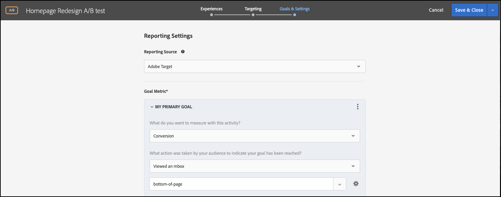

# 機能フラグを使用して A/B テストを実行する

## 手順の概要

1. 有効にする [!UICONTROL オンデバイス判定] （組織の）
1. の作成 [!UICONTROL A/B テスト] アクティビティ
1. A と B を定義する
1. オーディエンスを追加
1. トラフィックの配分を設定
1. トラフィックの配分をバリエーションに設定
1. レポートの設定
1. KPI を追跡するための指標を追加
1. 機能フラグを使用して A/B テストを実行するコードを実装する
1. 機能フラグを使用して A/B テストを有効化

>[!NOTE]
>
>例えば、フォールテーマによるホームページの再設計が、ユーザーにとって適切に受け取られるかどうかを判断する必要があるとします。 で A/B 実験を実行して、テストすることにします。 [!DNL Adobe Target]. また、ユーザーエクスペリエンスが悪くなったり遅くなったりして結果を歪曲しないように、実験が優れたパフォーマンスで配信されるようにする必要があります。

## 1.有効にする [!UICONTROL オンデバイス判定] （組織の）

オンデバイス判定を有効にすると、A/B アクティビティがほぼゼロの待ち時間で実行されます。 この機能を有効にするには、次に移動します。 **[!UICONTROL 管理]** > **[!UICONTROL 実装]** > **[!UICONTROL アカウントの詳細]** in [!DNL Adobe Target]、を有効にします。 **[!UICONTROL オンデバイス判定]** 切り替え

&lt;!— image-odd4.png を挿入 —>


>[!NOTE]
>
>管理者または承認者が必要です [ユーザーロール](https://experienceleague.adobe.com/docs/target/using/administer/manage-users/user-management.html) :「オンデバイス判定」切り替えを有効または無効にします。

を有効にした後 **[!UICONTROL オンデバイス判定]** トグル、 [!DNL Adobe Target] クライアントのルールアーティファクトの生成を開始します。

## 2. [!UICONTROL A/B テスト] アクティビティ

In [!DNL Adobe Target]をクリックし、 **[!UICONTROL アクティビティ]** ページ、「 」を選択します。 **[!UICONTROL アクティビティを作成]** > **[!UICONTROL A/B テスト]**.


Adobe Analytics の **[!UICONTROL A/B テストアクティビティの作成]** モーダルのままにします。デフォルトのままにします。 **[!UICONTROL Web]** オプションが選択されている (1)、 **[!UICONTROL フォーム]** experience composer (2) として、「 」を選択します。 **[!UICONTROL デフォルトのワークスペース]** いいえ **[!UICONTROL プロパティの制限]** (3) をクリックし、 **[!UICONTROL 次へ]** (4)。


## 3. A と B を定義する

1. Adobe Analytics の **[!UICONTROL エクスペリエンス]** アクティビティを作成する手順で、アクティビティの名前を指定し (1)、2 つ目のエクスペリエンス（エクスペリエンス B）を追加します。それには、 **[!UICONTROL エクスペリエンスを追加]** (2) ボタン。 A/B テストを実行するアプリケーション内の場所の名前 (3) を入力します。 次の例では、ホームページはエクスペリエンス A 用に定義された場所です（エクスペリエンス B 用に定義された場所でもあります）。

   エクスペリエンス A は、現在のホームページデザインであるコントロールを定義します。

   

   エクスペリエンス B は挑戦者を定義し、再設計されたホームページを表します。 クリックしてデフォルトのコンテンツを変更します (1)。

   

1. エクスペリエンス B で、「 」をクリックして、次の場所からコンテンツを変更します。 **[!UICONTROL デフォルトコンテンツ]** を選択して再設計したコンテンツに追加する **[!UICONTROL JSON オファーを作成]** (1) に示すように。

   

1. フラグとして使用される属性を使用して JSON を定義し、実稼働環境の現在のホームページではなく、新しく再設計されたホームページをビジネスロジックでレンダリングできるようにします。


   >[!NOTE]
   >
   >条件 [!DNL Adobe Target] バケットを作成してユーザーにエクスペリエンス B（再設計されたホームページ）を表示させると、例で定義されている属性を持つ JSON が返されます。 コードでは、属性値を確認して、ビジネスロジックを実行して再設計されたホームページをレンダリングするかどうかを決定する必要があります。 この JSON 応答では、名前、値、属性の数を定義できます。

   

## 4.オーディエンスを追加する

最初に、常連客の再設計をテストし、ログインしているかどうかに基づいて識別できるとします。

1. Adobe Analytics の **[!UICONTROL ターゲット設定]** ステップ、クリックして置き換え **[!UICONTROL すべての訪問者]** オーディエンスに関連付けられます。

   

1. Adobe Analytics の **[!UICONTROL オーディエンスを作成]** モーダルを使用する場合は、カスタムルールを定義します。 `logged-in = true`. ログインしているユーザーのグループを定義します。 アクティビティでこのオーディエンスを使用します。

   

## 5.トラフィックの配分を設定する

新しいホームページの再設計をテストするログインユーザーの割合を定義します。 つまり、このテストを展開したいユーザーの割合を示します。 この例では、ログインしているすべてのユーザーにこのテストをデプロイする場合、トラフィックの配分は 100%のままにします。


## 6.トラフィックの配分をバリエーションに設定する

ログインしているユーザーの、ホームページの現在のデザインまたは完全に新しい再設計を表示する割合を定義します。 この例では、トラフィックの配分は、エクスペリエンス A とエクスペリエンス B の間で50/50分割したままにします。


## 7.レポートを設定する

Adobe Analytics の **[!UICONTROL 目標と設定]** ステップ、選択 **[!UICONTROL Adobe Target]** として **[!UICONTROL レポートソース]** アクティビティの結果を [!DNL Adobe Target] UI、または **[!UICONTROL Adobe Analytics]** をクリックして、Adobe Analytics UI に表示します。



## 8. KPI を追跡するための指標を追加

を選択します。 **[!UICONTROL 目標指標]** :A/B テストを測定します。 この例では、成功したコンバージョンは、ユーザーがページの下部に到達したかどうかに基づいておこなわれ、エンゲージメントを示します。 したがって **[!UICONTROL コンバージョン]** は、ユーザーがページ下部という名前の場所を表示したかどうかに基づいて判断されます。

## 9.機能フラグを使用して A/B テストを実行するコードをアプリケーションに実装する

>[!BEGINTABS]

>[!TAB Node.js]

```js {line-numbers="true"}
const TargetClient = require("@adobe/target-nodejs-sdk");
const options = {
  client: "testClient",
  organizationId: "ABCDEF012345677890ABCDEF0@AdobeOrg",
  decisioningMethod: "on-device",
  events: {
    clientReady: targetClientReady
  }
};
const targetClient = TargetClient.create(options);

function targetClientReady() {
  return targetClient.getAttributes(["homepage"]).then(function(attributes) {
    const flag = attributes.getValue("homepage", "feature-flag");
    // ...
  });
}
```

>[!TAB Java]

```java {line-numbers="true"}
import com.adobe.target.edge.client.ClientConfig;
import com.adobe.target.edge.client.TargetClient;
import com.adobe.target.delivery.v1.model.ChannelType;
import com.adobe.target.delivery.v1.model.Context;
import com.adobe.target.delivery.v1.model.ExecuteRequest;
import com.adobe.target.delivery.v1.model.MboxRequest;
import com.adobe.target.edge.client.entities.TargetDeliveryRequest;
import com.adobe.target.edge.client.model.TargetDeliveryResponse;

ClientConfig config = ClientConfig.builder()
    .client("testClient")
    .organizationId("ABCDEF012345677890ABCDEF0@AdobeOrg")
    .build();
TargetClient targetClient = TargetClient.create(config);
MboxRequest mbox = new MboxRequest().name("homepage").index(0);
TargetDeliveryRequest request = TargetDeliveryRequest.builder()
    .context(new Context().channel(ChannelType.WEB))
    .execute(new ExecuteRequest().mboxes(Arrays.asList(mbox)))
    .build();
Attributes attributes = targetClient.getAttributes(request, "homepage");
String flag = attributes.getString("homepage", "feature-flag");
```

>[!ENDTABS]

## 10.機能フラグを使用して A/B テストをアクティブ化する


