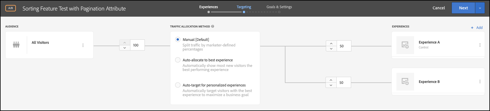
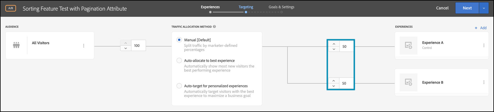
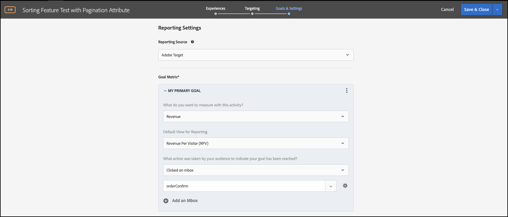

# 属性を使用した機能テストの実行

## 手順の概要

1. 組織の[!UICONTROL on-device decisioning]を有効にする
1. [!UICONTROL A/B Test] アクティビティの作成
1. AとBの定義
1. オーディエンスの追加
1. トラフィック配分の設定
1. バリエーションへのトラフィック配分の設定
1. レポートの設定
1. KPIを追跡するための指標の追加
1. 属性を使用して機能テストを実行するコードを実装します
1. コンバージョンイベントを追跡するコードの実装
1. 属性を使用して機能テストをアクティブ化し

>[!NOTE]
>
>小売e コマース企業の場合。 顧客が商品カタログを閲覧して整理する際のコンバージョン率を高めたいものです。 特定のソートアルゴリズムとページネーション戦略は、他のソートアルゴリズムよりも優れた結果をもたらすという仮説があります。 この理論をテストするには、エンドユーザー向けに異なる並べ替えオプションを使用して、並べ替えウィジェットの再設計を含む機能テストを実行します。 この機能テストは、ユーザーエクスペリエンスに悪影響を与えたり、結果をゆがめたりすることがないように、ほぼゼロの遅延で実行されるようにします。

## &#x200B;1. 組織の[!UICONTROL on-device decisioning]を有効にする

オンデバイス判定を有効にすると、A/B アクティビティがほぼゼロの遅延で実行されます。 この機能を有効にするには、[!DNL Adobe Target]で&#x200B;**[!UICONTROL Administration]** > **[!UICONTROL Implementation]** > **[!UICONTROL Account details]**&#x200B;に移動し、**[!UICONTROL On-Device Decisioning]**&#x200B;切り替えを有効にします。


>[!NOTE]
>
>**[!UICONTROL On-Device Decisioning]** トグルを有効または無効にするには、管理者または承認者[&#x200B; ユーザーの役割](https://experienceleague.adobe.com/docs/target/using/administer/manage-users/user-management.html)が必要です。

**[!UICONTROL On-Device Decisioning]** トグルを有効にすると、[!DNL Adobe Target]は、クライアントの&#x200B;*ルールアーティファクト*&#x200B;の生成を開始します。

## &#x200B;2. [!UICONTROL A/B Test] アクティビティの作成

1. [!DNL Adobe Target]で、**[!UICONTROL Activities]** ページに移動し、**[!UICONTROL Create Activity]** > **[!UICONTROL A/B test]**&#x200B;を選択します。

   

1. **[!UICONTROL Create A/B Test Activity]** モーダルで、デフォルトの&#x200B;**[!UICONTROL Web]** オプションを選択したまま（1）、エクスペリエンスコンポーザー（2）として&#x200B;**[!UICONTROL Form]**&#x200B;を選択し、**[!UICONTROL Default Workspace]**&#x200B;を&#x200B;**[!UICONTROL No Property Restrictions]** （3）で選択して、**[!UICONTROL Next]** （4）をクリックします。

   

## &#x200B;3. AとBの定義

1. アクティビティ作成の&#x200B;**[!UICONTROL Experiences]** ステップで、アクティビティの名前（1）を入力し、**[!UICONTROL Add Experience]** （2） ボタンをクリックして、2番目のエクスペリエンスであるエクスペリエンス Bを追加します。 属性を使用して機能テストを実行するアプリケーション内の場所（3）の名前を入力します。 次の例では、`product-results-page`はエクスペリエンス Aに定義された場所です。 （これは、エクスペリエンス Bに定義された場所でもあります）。

   

   **[!UICONTROL Experience A]**&#x200B;には、次の操作を行うためのビジネスロジックを示すJSONが含まれます。

   * `test_sorting`機能フラグを使用して並べ替えアルゴリズム機能を開始します
   * `sorting_algorithm _**_attribute`で定義されている推奨ソート アルゴリズムを実行します
   * `pagination_limit`で定義されたページネーション戦略で定義されたページごとに50個の製品を返します

1. エクスペリエンス Aで、クリックしてコンテンツを&#x200B;**[!UICONTROL Default Content]**&#x200B;からJSONに変更し、次に示すように&#x200B;**[!UICONTROL Create JSON Offer]**&#x200B;を選択します（1）。

   

1. ページ化制限50個の製品で、推奨される並べ替えアルゴリズムの開始に使用される`test_sorting`、`sorting_algorithm`、および`pagination_limit`のフラグと属性を使用して、JSONを定義します。

   >[!NOTE]
   >
   >[!DNL Adobe Target]がユーザーにExperience Aを表示するようにバケット化すると、例で定義された属性を持つJSONが返されます。 コードでは、並べ替え機能をオンにする必要があるかどうかを確認するために、機能フラグ `test_sorting`の値を確認する必要があります。 その場合は、`sorting_algorithm`属性の推奨値を使用して、製品リストビューに推奨製品を表示します。 アプリケーションに表示する製品の制限は50です。これは、`pagination_limit`属性の値だからです。

   

   **[!UICONTROL Experience B]**&#x200B;は、次の操作を行うためのビジネスロジックを示すJSONを定義します。

   * test_sorting機能フラグを使用してソートアルゴリズム機能を開始します
   * `sorting_algorithm _**_attribute`で定義された`best_sellers`並べ替えアルゴリズムを実行します
   * `pagination_limit`で定義されたページネーション戦略で定義されたページごとに50個の製品を返します

   >[!NOTE]
   >
   >[!DNL Adobe Target]がユーザーにバケットを割り当ててExperience Bを表示すると、例で定義された属性を持つJSONが返されます。 コードでは、並べ替え機能をオンにする必要があるかどうかを確認するために、機能フラグ `test_sorting`の値を確認する必要があります。 その場合は、`sorting_algorithm`属性の`best_sellers`値を使用して、商品リストビューでベストセラー商品を表示します。 アプリケーションに表示する製品の制限は50です。これは、`pagination_limit`属性の値だからです。

   

## &#x200B;4. オーディエンスの追加

**[!UICONTROL Targeting]** ステップで、**[!UICONTROL All Visitors]** オーディエンスを保持します。 これにより、並べ替え機能の影響と、結果に最も影響を与えるアルゴリズムとアイテム数を把握できます。


## &#x200B;5. トラフィック配分の設定

並べ替えアルゴリズムとページネーション戦略をテストする訪問者の割合を定義します。 つまり、このテストを実施したいユーザーの割合は？ この例では、このテストをすべてのログイン ユーザーにデプロイするには、トラフィック配分を100%に保ちます。



## &#x200B;6. バリエーションへのトラフィック配分の設定

推奨される商品とベストセラーの並べ替えアルゴリズムを比較する訪問者の割合を定義します。アルゴリズムは1 ページにつき50件までです。 この例では、エクスペリエンス AとBの間のトラフィック分布を50/50の割合で維持します。



## &#x200B;7. レポートの設定

**[!UICONTROL Goals & Settings]** ステップで、**[!UICONTROL Reporting Source]**&#x200B;として&#x200B;**[!UICONTROL Adobe Target]**&#x200B;を選択して[!DNL Adobe Target] UIでA/B テストの結果を表示するか、**[!UICONTROL Adobe Analytics]**&#x200B;を選択してAdobe Analytics UIで結果を表示します。



## &#x200B;8. KPIを追跡するための指標の追加

属性を使用して機能テストを測定するには、**[!UICONTROL Goal Metric]**&#x200B;を選択します。 この例では、ユーザーが製品を購入するかどうかに基づいて、表示された並べ替えアルゴリズムとページネーション戦略に応じて成功します。

## &#x200B;9. 属性を使用した機能テストをアプリケーションに実装します

>[!BEGINTABS]

>[!TAB Node.js]

```js {line-numbers="true"}
const TargetClient = require("@adobe/target-nodejs-sdk");
const options = {
  client: "testClient",
  organizationId: "ABCDEF012345677890ABCDEF0@AdobeOrg",
  decisioningMethod: "on-device",
  events: {
    clientReady: targetClientReady
  }
};
const targetClient = TargetClient.create(options);

function targetClientReady() {
  return targetClient.getAttributes(["product-results-page"]).then(function(attributes) {
    const test_sorting = attributes.getValue("product-results-page", "test-sorting");
    const sorting_algorithm = attributes.getValue("product-results-page", "sorting_algorithm");
    const pagination_limit = attributes.getValue("product-results-page", "pagination_limit");
  });
}
```

>[!TAB Java]

```java {line-numbers="true"}
import com.adobe.target.edge.client.ClientConfig;
import com.adobe.target.edge.client.TargetClient;
import com.adobe.target.delivery.v1.model.ChannelType;
import com.adobe.target.delivery.v1.model.Context;
import com.adobe.target.delivery.v1.model.ExecuteRequest;
import com.adobe.target.delivery.v1.model.MboxRequest;
import com.adobe.target.edge.client.entities.TargetDeliveryRequest;
import com.adobe.target.edge.client.model.TargetDeliveryResponse;

ClientConfig config = ClientConfig.builder()
    .client("testClient")
    .organizationId("ABCDEF012345677890ABCDEF0@AdobeOrg")
    .build();
TargetClient targetClient = TargetClient.create(config);
MboxRequest mbox = new MboxRequest().name("product-results-page").index(0);
TargetDeliveryRequest request = TargetDeliveryRequest.builder()
    .context(new Context().channel(ChannelType.WEB))
    .execute(new ExecuteRequest().mboxes(Arrays.asList(mbox)))
    .build();
Attributes attributes = targetClient.getAttributes(request, "product-results-page");
String testSorting = attributes.getString("product-results-page", "test-sorting");
String sortingAlgorithm = attributes.getString("product-results-page", "sorting_algorithm");
String paginationLimit = attributes.getString("product-results-page", "pagination_limit");
```

>[!ENDTABS]

## &#x200B;10. コンバージョンイベントを追跡するコードの実装

>[!BEGINTABS]

>[!TAB Node.js]

```js {line-numbers="true"}
//... Code removed for brevity

//When a conversion happens
TargetClient.sendNotifications({
    targetCookie,
    "request" : {
      "notifications" : [
        {
          type: "click",
          timestamp : Date.now(),
          id: "conversion",
          mbox : {
            name : "product-results-page"
          }
        }
      ]
    }
})
```

>[!TAB Java]

```java {line-numbers="true"}
ClientConfig config = ClientConfig.builder()
  .client("acmeclient")
  .organizationId("1234567890@AdobeOrg")
  .build();
TargetClient targetClient = TargetClient.create(config);

Context context = new Context().channel(ChannelType.WEB);

ExecuteRequest executeRequest = new ExecuteRequest();

NotificationDeliveryService notificationDeliveryService = new NotificationDeliveryService();

Notification notification = new Notification();
notification.setId("conversion");
notification.setImpressionId(UUID.randomUUID().toString());
notification.setType(MetricType.CLICK);
notification.setTimestamp(System.currentTimeMillis());
notification.setTokens(
    Collections.singletonList(
        "IbG2Jz2xmHaqX7Ml/YRxRGqipfsIHvVzTQxHolz2IpSCnQ9Y9OaLL2gsdrWQTvE54PwSz67rmXWmSnkXpSSS2Q=="));

TargetDeliveryRequest targetDeliveryRequest =
    TargetDeliveryRequest.builder()
        .context(context)
        .execute(executeRequest)
        .notifications(Collections.singletonList(notification))
        .build();

TargetDeliveryResponse offers = targetClient.getOffers(request);
notificationDeliveryService.sendNotification(request);

Attributes attributes = targetClient.getAttributes(request, "product-results-page");
String testSorting = attributes.getString("product-results-page", "test-sorting");
String sortingAlgorithm = attributes.getString("product-results-page", "sorting_algorithm");
String paginationLimit = attributes.getString("product-results-page", "pagination_limit");
```

>[!ENDTABS]

## &#x200B;11. 属性を使用して機能テストをアクティブ化し


