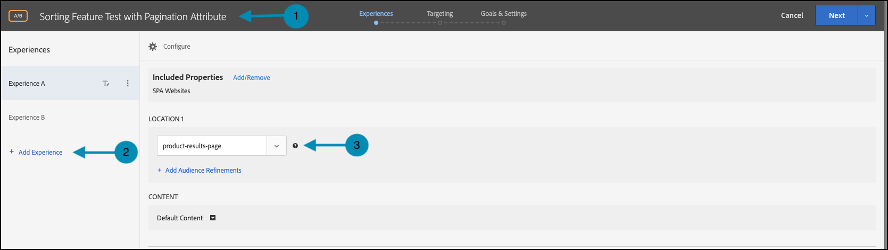
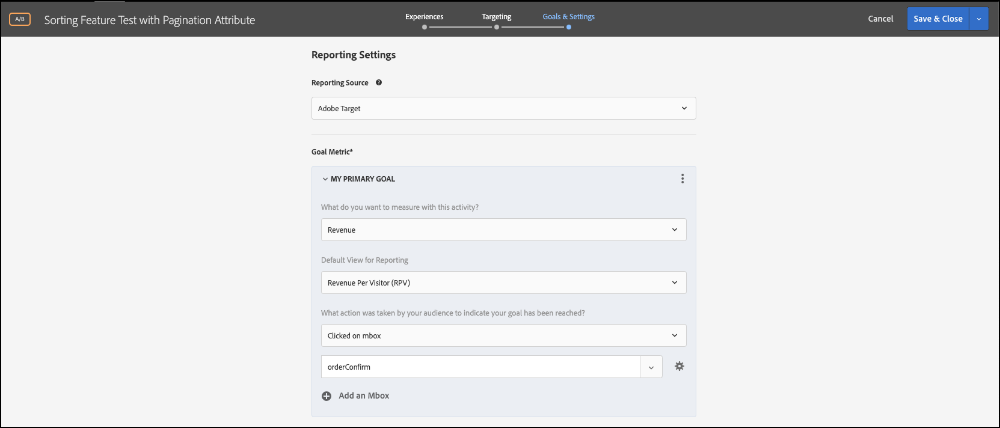

# 属性を使用した機能テストの実行

## 手順の概要

1. 組織の [!UICONTROL on-device decisioning] を有効にする
1. [!UICONTROL A/B Test] アクティビティの作成
1. A と B の定義
1. オーディエンスを追加
1. トラフィック配分の設定
1. トラフィック配分をバリエーションに設定
1. レポートの設定
1. KPI を追跡するための指標の追加
1. 属性を使用した機能テストを実行するコードの実装
1. コンバージョンイベントを追跡するコードの実装
1. 属性を使用した機能テストのアクティブ化

>[!NOTE]
>
>小売 e コマース会社の場合は、 顧客が製品カタログを閲覧および並べ替える際のコンバージョン率を高めたい場合。 特定の並べ替えアルゴリズムとページネーション戦略により、他の方法よりも優れた結果が得られるという仮説があります。 この理論をテストするには、エンドユーザーに合わせて異なる並べ替えオプションを使用して並べ替えウィジェットを再設計する機能テストを実行することにします。 この機能テストがゼロに近い待ち時間で実行されることを確認して、ユーザーエクスペリエンスに悪影響を与えず、結果をゆがめないようにする必要があります。

## 1.組織の [!UICONTROL on-device decisioning] を有効にする

オンデバイス判定を有効にすることで、A/B アクティビティがほぼゼロの待ち時間で実行されるようになります。 この機能を有効にするには、[!DNL Adobe Target] で **[!UICONTROL Administration]**/**[!UICONTROL Implementation]**/**[!UICONTROL Account details]** に移動し、「**[!UICONTROL On-Device Decisioning]**」トグルを有効にします。


>[!NOTE]
>
>**[!UICONTROL On-Device Decisioning]** の切り替えを有効または無効にするには、管理者または承認者 [ ユーザーの役割 ](https://experienceleague.adobe.com/docs/target/using/administer/manage-users/user-management.html) が必要です。

「**[!UICONTROL On-Device Decisioning]**」切替スイッチを有効 [!DNL Adobe Target] すると、クライアントの *ルールアーティファクト* の生成を開始します。

## 2. [!UICONTROL A/B Test] アクティビティの作成

1. [!DNL Adobe Target] で、**[!UICONTROL Activities]** ページに移動し、**[!UICONTROL Create Activity]**/**[!UICONTROL A/B test]** を選択します。

   

1. **[!UICONTROL Create A/B Test Activity]** モーダルでは、デフォルトの **[!UICONTROL Web]** オプションを選択した状態（1）のままにし、experience composer として **[!UICONTROL Form]** を選択し（2）、**[!UICONTROL No Property Restrictions]** を使用して **[!UICONTROL Default Workspace]** を選択し（3）、**[!UICONTROL Next]** をクリックします（4）。

   

## 3. A と B を定義する

1. アクティビティ作成の **[!UICONTROL Experiences]** の手順で、アクティビティの名前を指定し（1）、「エクスペリ **[!UICONTROL Add Experience]** ンス」（2） ボタンをクリックして、2 つ目のエクスペリエンスとして「エクスペリエンス B」を追加します。 属性を使用した機能テストを実行する、アプリケーション内の場所の名前（3）を入力します。 次の例では、エクスペリエンス A に対して定義された場所は `product-results-page` です（エクスペリエンス B に対しても定義された場所です）。

   

   **[!UICONTROL Experience A]** には、以下を行うためのビジネスロジックを示す JSON が含まれます。

   * `test_sorting` 機能フラグを使用して、ソートアルゴリズム機能を開始します
   * `sorting_algorithm _**_attribute` で定義された推奨ソートアルゴリズムを実行します。
   * `pagination_limit` で定義されたページネーション戦略で定義されているページごとに 50 製品を返します

1. エクスペリエンス A で、をクリックし、以下に示すように（1） **[!UICONTROL Create JSON Offer]** 選択して、コンテンツを **[!UICONTROL Default Content]** から JSON に変更します。

   

1. `test_sorting`、`sorting_algorithm`、`pagination_limit` のフラグと属性を使用して、ページネーション制限 50 製品で、推奨される並べ替えアルゴリズムを開始するために使用される JSON を定義します。

   >[!NOTE]
   >
   >エクスペリエンス A を表示する [!DNL Adobe Target] めにユーザーをグループ化すると、例で定義された属性を含む JSON が返されます。 コードでは、機能フラグ `test_sorting` の値をチェックして、並べ替え機能をオンにする必要があるかどうかを確認します。 その場合は、`sorting_algorithm` 属性の推奨値を使用して、製品リスト表示で推奨製品を表示します。 アプリケーションに表示する製品の制限は 50 です。これは、`pagination_limit` 属性の値であるからです。

   

   次の **[!UICONTROL Experience B]** 順を実行するように、ビジネスロジックを示す JSON を定義します。

   * test_sorting 機能フラグを使用して、ソートアルゴリズム機能を開始します
   * `sorting_algorithm _**_attribute` で定義された `best_sellers` ソートアルゴリズムを実行します。
   * `pagination_limit` で定義されたページネーション戦略で定義されているページごとに 50 製品を返します

   >[!NOTE]
   >
   >[!DNL Adobe Target] がユーザーをバケット化してエクスペリエンス B を表示すると、例で定義された属性を含む JSON が返されます。 コードでは、機能フラグ `test_sorting` の値をチェックして、並べ替え機能をオンにする必要があるかどうかを確認します。 その場合は、`sorting_algorithm` 属性の `best_sellers` 値を使用して、製品リスト表示で最も売れた製品を表示します。 アプリケーションに表示する製品の制限は 50 です。これは、`pagination_limit` 属性の値であるからです。

   

## 4. オーディエンスの追加

**[!UICONTROL Targeting]** の手順では、**[!UICONTROL All Visitors]** オーディエンスを保持します。 これにより、並べ替え機能の影響と、結果に最適なアルゴリズムと項目数を把握できます。


## 5. トラフィック配分の設定

並べ替えアルゴリズムとページネーション戦略をテストする、訪問者の割合を定義します。 つまり、このテストをロールアウトするユーザーの割合を指定します。 この例では、すべてのログインユーザーにこのテストをデプロイするには、トラフィックの割り当てを 100% に保ちます。


## 6. トラフィック配分をバリエーションに設定する

推奨される製品とベストセラーの並べ替えアルゴリズムを表示する訪問者の割合を定義します。ページあたり 50 製品という制限があります。 この例では、エクスペリエンス A と B の間でトラフィック配分を 50/50 に分割します。


## 7. レポートの設定

**[!UICONTROL Goals & Settings]** の手順で、[!DNL Adobe Target] UI で A/B テストの結果を表示する **[!UICONTROL Reporting Source]** として **[!UICONTROL Adobe Target]** を選択するか、Adobe Analytics UI で表示する **[!UICONTROL Adobe Analytics]** を選択します。



## 8. KPI を追跡するための指標を追加する

属性を使用して機能テストを測定する **[!UICONTROL Goal Metric]** を選択します。 この例では、成功は、表示された並べ替えアルゴリズムとページネーション戦略に応じて、ユーザーが製品を購入したかどうかに基づいています。

## 9.属性を使用した機能テストのアプリケーションへの実装

>[!BEGINTABS]

>[!TAB Node.js]

```js {line-numbers="true"}
const TargetClient = require("@adobe/target-nodejs-sdk");
const options = {
  client: "testClient",
  organizationId: "ABCDEF012345677890ABCDEF0@AdobeOrg",
  decisioningMethod: "on-device",
  events: {
    clientReady: targetClientReady
  }
};
const targetClient = TargetClient.create(options);

function targetClientReady() {
  return targetClient.getAttributes(["product-results-page"]).then(function(attributes) {
    const test_sorting = attributes.getValue("product-results-page", "test-sorting");
    const sorting_algorithm = attributes.getValue("product-results-page", "sorting_algorithm");
    const pagination_limit = attributes.getValue("product-results-page", "pagination_limit");
  });
}
```

>[!TAB Java]

```java {line-numbers="true"}
import com.adobe.target.edge.client.ClientConfig;
import com.adobe.target.edge.client.TargetClient;
import com.adobe.target.delivery.v1.model.ChannelType;
import com.adobe.target.delivery.v1.model.Context;
import com.adobe.target.delivery.v1.model.ExecuteRequest;
import com.adobe.target.delivery.v1.model.MboxRequest;
import com.adobe.target.edge.client.entities.TargetDeliveryRequest;
import com.adobe.target.edge.client.model.TargetDeliveryResponse;

ClientConfig config = ClientConfig.builder()
    .client("testClient")
    .organizationId("ABCDEF012345677890ABCDEF0@AdobeOrg")
    .build();
TargetClient targetClient = TargetClient.create(config);
MboxRequest mbox = new MboxRequest().name("product-results-page").index(0);
TargetDeliveryRequest request = TargetDeliveryRequest.builder()
    .context(new Context().channel(ChannelType.WEB))
    .execute(new ExecuteRequest().mboxes(Arrays.asList(mbox)))
    .build();
Attributes attributes = targetClient.getAttributes(request, "product-results-page");
String testSorting = attributes.getString("product-results-page", "test-sorting");
String sortingAlgorithm = attributes.getString("product-results-page", "sorting_algorithm");
String paginationLimit = attributes.getString("product-results-page", "pagination_limit");
```

>[!ENDTABS]

## 10. コンバージョンイベントを追跡するコードの実装

>[!BEGINTABS]

>[!TAB Node.js]

```js {line-numbers="true"}
//... Code removed for brevity

//When a conversion happens
TargetClient.sendNotifications({
    targetCookie,
    "request" : {
      "notifications" : [
        {
          type: "click",
          timestamp : Date.now(),
          id: "conversion",
          mbox : {
            name : "product-results-page"
          }
        }
      ]
    }
})
```

>[!TAB Java]

```java {line-numbers="true"}
ClientConfig config = ClientConfig.builder()
  .client("acmeclient")
  .organizationId("1234567890@AdobeOrg")
  .build();
TargetClient targetClient = TargetClient.create(config);

Context context = new Context().channel(ChannelType.WEB);

ExecuteRequest executeRequest = new ExecuteRequest();

NotificationDeliveryService notificationDeliveryService = new NotificationDeliveryService();

Notification notification = new Notification();
notification.setId("conversion");
notification.setImpressionId(UUID.randomUUID().toString());
notification.setType(MetricType.CLICK);
notification.setTimestamp(System.currentTimeMillis());
notification.setTokens(
    Collections.singletonList(
        "IbG2Jz2xmHaqX7Ml/YRxRGqipfsIHvVzTQxHolz2IpSCnQ9Y9OaLL2gsdrWQTvE54PwSz67rmXWmSnkXpSSS2Q=="));

TargetDeliveryRequest targetDeliveryRequest =
    TargetDeliveryRequest.builder()
        .context(context)
        .execute(executeRequest)
        .notifications(Collections.singletonList(notification))
        .build();

TargetDeliveryResponse offers = targetClient.getOffers(request);
notificationDeliveryService.sendNotification(request);

Attributes attributes = targetClient.getAttributes(request, "product-results-page");
String testSorting = attributes.getString("product-results-page", "test-sorting");
String sortingAlgorithm = attributes.getString("product-results-page", "sorting_algorithm");
String paginationLimit = attributes.getString("product-results-page", "pagination_limit");
```

>[!ENDTABS]

## 11.属性を使用した機能テストのアクティブ化


