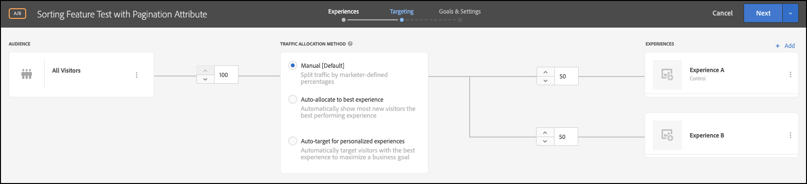

# 属性を使用して機能テストを実行

## 手順の概要

1. 有効にする [!UICONTROL オンデバイス判定] （組織の）
1. の作成 [!UICONTROL A/B テスト] アクティビティ
1. A と B を定義する
1. オーディエンスを追加
1. トラフィックの配分を設定
1. トラフィックの配分をバリエーションに設定
1. レポートの設定
1. KPI を追跡するための指標を追加
1. 属性を使用して機能テストを実行するコードを実装します。
1. コンバージョンイベントを追跡するコードの実装
1. 属性を使用して機能テストを有効化

>[!NOTE]
>
>小売 e コマース会社の場合を考えます。 顧客が商品カタログを閲覧して並べ替える際に、コンバージョン率を上げたい。 特定の並べ替えアルゴリズムやページネーション戦略によって、他のアルゴリズムよりも優れた結果が得られるという仮説があります。 この理論をテストするには、エンドユーザーに対して異なる並べ替えオプションを使用して並べ替えウィジェットの再設計を伴う機能テストを実行します。 この機能テストをほぼゼロの待ち時間で実行し、ユーザーエクスペリエンスに悪影響を与えず、結果に歪曲を与えないようにしたい場合。

## 1.有効にする [!UICONTROL オンデバイス判定] （組織の）

オンデバイス判定を有効にすると、A/B アクティビティがほぼゼロの待ち時間で実行されます。 この機能を有効にするには、次に移動します。 **[!UICONTROL 管理]** > **[!UICONTROL 実装]** > **[!UICONTROL アカウントの詳細]** in [!DNL Adobe Target]、を有効にします。 **[!UICONTROL オンデバイス判定]** 切り替え


>[!NOTE]
>
>管理者または承認者が必要です [ユーザーロール](https://experienceleague.adobe.com/docs/target/using/administer/manage-users/user-management.html) 有効または無効にするには **[!UICONTROL オンデバイス判定]** 切り替え

を有効にした後 **[!UICONTROL オンデバイス判定]** トグル、 [!DNL Adobe Target] 生成を開始 *ルールアーティファクト* を設定します。

## 2. [!UICONTROL A/B テスト] アクティビティ

1. In [!DNL Adobe Target]をクリックし、 **[!UICONTROL アクティビティ]** ページ、「 」を選択します。 **[!UICONTROL アクティビティを作成]** > **[!UICONTROL A/B テスト]**.

   

1. Adobe Analytics の **[!UICONTROL A/B テストアクティビティの作成]** モーダルのままにします。デフォルトのままにします。 **[!UICONTROL Web]** オプションが選択されている (1)、 **[!UICONTROL フォーム]** experience composer (2) として、「 」を選択します。 **[!UICONTROL デフォルトのワークスペース]** 次を使用 **[!UICONTROL プロパティの制限がありません]** (3) をクリックし、 **[!UICONTROL 次へ]** (4)。

   

## 3. A と B を定義する

1. Adobe Analytics の **[!UICONTROL エクスペリエンス]** アクティビティを作成する手順で、アクティビティの名前を指定し (1)、2 つ目のエクスペリエンス（エクスペリエンス B）を追加します。それには、 **[!UICONTROL エクスペリエンスを追加]** (2) ボタン。 属性を使用して機能テストを実行するアプリケーション内の場所の名前 (3) を入力します。 次の例では、 `product-results-page` は、エクスペリエンス A に対して定義された場所です（エクスペリエンス B に対して定義された場所でもあります）。

   

   **[!UICONTROL エクスペリエンス A]** には、次の操作をビジネスロジックにおこなうように通知する JSON が含まれます。

   * で並べ替えアルゴリズム機能を開始します。 `test_sorting` 機能フラグ
   * で定義された推奨並べ替えアルゴリズムを実行します。 `sorting_algorithm _**_attribute`
   * ページごとに 50 個の製品を返します。 `pagination_limit`

1. エクスペリエンス A で、「 」をクリックして、次の場所からコンテンツを変更します。 **[!UICONTROL デフォルトコンテンツ]** を JSON に追加するには、次を選択します。 **[!UICONTROL JSON オファーを作成]** (1) に示すように。

   

1. を使用して JSON を定義する `test_sorting`, `sorting_algorithm`、および `pagination_limit` 推奨並べ替えアルゴリズムの開始に使用するフラグと属性（ページ番号の上限は 50 個）。

   >[!NOTE]
   >
   >条件 [!DNL Adobe Target] は、ユーザーにエクスペリエンス A を表示するようにバケット化し、例で定義された属性を持つ JSON が返されます。 コードでは、機能フラグの値を確認する必要があります `test_sorting` をクリックして、並べ替え機能をオンにする必要があるかどうかを確認します。 その場合は、 `sorting_algorithm` 属性を使用して、推奨商品を商品リスト表示で表示します。 アプリケーションに表示する製品の上限は 50 です。これは、 `pagination_limit` 属性。

   

   **[!UICONTROL エクスペリエンス B]** は、次の操作をビジネスロジックに指示する JSON を定義します。

   * test_sorting 機能フラグを使用して、並べ替えアルゴリズム機能を開始します。
   * を実行します。 `best_sellers` で定義された並べ替えアルゴリズム `sorting_algorithm _**_attribute`
   * ページごとに 50 個の製品を返します。 `pagination_limit`

   >[!NOTE]
   >
   >条件 [!DNL Adobe Target] をグループ化してユーザーにエクスペリエンス B を表示し、例で定義された属性を持つ JSON が返されます。 コードでは、機能フラグの値を確認する必要があります `test_sorting` をクリックして、並べ替え機能をオンにする必要があるかどうかを確認します。 その場合は、 `best_sellers` の値 `sorting_algorithm` 製品リスト表示でベストセラー商品を表示する属性。 アプリケーションに表示する製品の上限は 50 です。これは、 `pagination_limit` 属性。

   

## 4.オーディエンスを追加する

Adobe Analytics の **[!UICONTROL ターゲット設定]** ステップ、 **[!UICONTROL すべての訪問者]** オーディエンス。 これにより、並べ替え機能の影響と、結果に最も影響を与えるアルゴリズムと項目数を把握できます。



## 5.トラフィックの配分を設定する

並べ替えアルゴリズムとページネーション戦略をテストする訪問者の割合を定義します。 つまり、このテストを展開したいユーザーの割合を示します。 この例では、ログインしているすべてのユーザーにこのテストをデプロイする場合、トラフィックの配分は 100%のままにします。


## 6.トラフィックの配分をバリエーションに設定する

レコメンデーションされた商品を表示する訪問者の割合と、ベストセラーの並べ替えアルゴリズムを定義します。1 ページにつき 50 個の商品の制限があります。 この例では、トラフィックの配分は、エクスペリエンス A とエクスペリエンス B の間で50/50分割したままにします。


## 7.レポートを設定する

Adobe Analytics の **[!UICONTROL 目標と設定]** ステップ、選択 **[!UICONTROL Adobe Target]** として **[!UICONTROL レポートソース]** A/B テスト結果を [!DNL Adobe Target] UI、または **[!UICONTROL Adobe Analytics]** をクリックして、Adobe Analytics UI に表示します。


## 8. KPI を追跡するための指標を追加

を選択します。 **[!UICONTROL 目標指標]** 属性を使用してフィーチャーテストを測定する場合。 この例では、成功は、表示された並べ替えアルゴリズムとページネーション戦略に応じて、ユーザーが商品を購入したかどうかに基づきます。

## 9.属性を持つ機能テストをアプリケーションに実装する

>[!BEGINTABS]

>[!TAB Node.js]

```js {line-numbers="true"}
const TargetClient = require("@adobe/target-nodejs-sdk");
const options = {
  client: "testClient",
  organizationId: "ABCDEF012345677890ABCDEF0@AdobeOrg",
  decisioningMethod: "on-device",
  events: {
    clientReady: targetClientReady
  }
};
const targetClient = TargetClient.create(options);

function targetClientReady() {
  return targetClient.getAttributes(["product-results-page"]).then(function(attributes) {
    const test_sorting = attributes.getValue("product-results-page", "test-sorting");
    const sorting_algorithm = attributes.getValue("product-results-page", "sorting_algorithm");
    const pagination_limit = attributes.getValue("product-results-page", "pagination_limit");
  });
}
```

>[!TAB Java]

```java {line-numbers="true"}
import com.adobe.target.edge.client.ClientConfig;
import com.adobe.target.edge.client.TargetClient;
import com.adobe.target.delivery.v1.model.ChannelType;
import com.adobe.target.delivery.v1.model.Context;
import com.adobe.target.delivery.v1.model.ExecuteRequest;
import com.adobe.target.delivery.v1.model.MboxRequest;
import com.adobe.target.edge.client.entities.TargetDeliveryRequest;
import com.adobe.target.edge.client.model.TargetDeliveryResponse;

ClientConfig config = ClientConfig.builder()
    .client("testClient")
    .organizationId("ABCDEF012345677890ABCDEF0@AdobeOrg")
    .build();
TargetClient targetClient = TargetClient.create(config);
MboxRequest mbox = new MboxRequest().name("product-results-page").index(0);
TargetDeliveryRequest request = TargetDeliveryRequest.builder()
    .context(new Context().channel(ChannelType.WEB))
    .execute(new ExecuteRequest().mboxes(Arrays.asList(mbox)))
    .build();
Attributes attributes = targetClient.getAttributes(request, "product-results-page");
String testSorting = attributes.getString("product-results-page", "test-sorting");
String sortingAlgorithm = attributes.getString("product-results-page", "sorting_algorithm");
String paginationLimit = attributes.getString("product-results-page", "pagination_limit");
```

>[!ENDTABS]

## 10.コンバージョンイベントを追跡するコードを実装する

>[!BEGINTABS]

>[!TAB Node.js]

```js {line-numbers="true"}
//... Code removed for brevity

//When a conversion happens
TargetClient.sendNotifications({
    targetCookie,
    "request" : {
      "notifications" : [
        {
          type: "click",
          timestamp : Date.now(),
          id: "conversion",
          mbox : {
            name : "product-results-page"
          }
        }
      ]
    }
})
```

>[!TAB Java]

```java {line-numbers="true"}
ClientConfig config = ClientConfig.builder()
  .client("acmeclient")
  .organizationId("1234567890@AdobeOrg")
  .build();
TargetClient targetClient = TargetClient.create(config);

Context context = new Context().channel(ChannelType.WEB);

ExecuteRequest executeRequest = new ExecuteRequest();

NotificationDeliveryService notificationDeliveryService = new NotificationDeliveryService();

Notification notification = new Notification();
notification.setId("conversion");
notification.setImpressionId(UUID.randomUUID().toString());
notification.setType(MetricType.CLICK);
notification.setTimestamp(System.currentTimeMillis());
notification.setTokens(
    Collections.singletonList(
        "IbG2Jz2xmHaqX7Ml/YRxRGqipfsIHvVzTQxHolz2IpSCnQ9Y9OaLL2gsdrWQTvE54PwSz67rmXWmSnkXpSSS2Q=="));

TargetDeliveryRequest targetDeliveryRequest =
    TargetDeliveryRequest.builder()
        .context(context)
        .execute(executeRequest)
        .notifications(Collections.singletonList(notification))
        .build();

TargetDeliveryResponse offers = targetClient.getOffers(request);
notificationDeliveryService.sendNotification(request);

Attributes attributes = targetClient.getAttributes(request, "product-results-page");
String testSorting = attributes.getString("product-results-page", "test-sorting");
String sortingAlgorithm = attributes.getString("product-results-page", "sorting_algorithm");
String paginationLimit = attributes.getString("product-results-page", "pagination_limit");
```

>[!ENDTABS]

## 11.属性を使用して機能テストを有効化する


