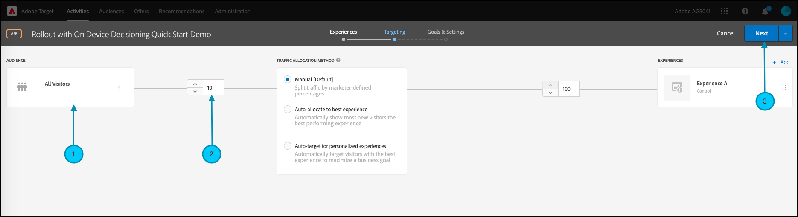

# 機能テストのロールアウトの管理

## 手順の概要

1. 組織の[!UICONTROL  オンデバイス決定]を有効にする
1. [!UICONTROL A/B テスト ] アクティビティの作成
1. 機能とロールアウト設定の定義
1. アプリケーションに機能を実装してレンダリングする
1. アプリケーションにイベントのトラッキングを実装する
1. A/B アクティビティのアクティベート
1. 必要に応じて、ロールアウトとトラフィック配分を調整します

## &#x200B;1. 組織の[!UICONTROL  オンデバイス決定]を有効にする

オンデバイス判定を有効にすると、A/B アクティビティがほぼゼロの遅延で実行されます。 この機能を有効にするには、[!DNL Adobe Target]で&#x200B;**[!UICONTROL 管理]** > **[!UICONTROL 実装]** > **[!UICONTROL アカウントの詳細]**&#x200B;に移動し、**[!UICONTROL オンデバイス決定]** トグルを有効にします。


>[!NOTE]
>
>[!UICONTROL  オンデバイス決定] トグルを有効または無効にするには、管理者または承認者[ ユーザーの役割](https://experienceleague.adobe.com/docs/target/using/administer/manage-users/user-management.html)が必要です。

[!UICONTROL  オンデバイス決定] トグルを有効にすると、[!DNL Adobe Target]は、クライアントに対して&#x200B;*ルールアーティファクト*&#x200B;の生成を開始します。

## &#x200B;2. [!UICONTROL A/B テスト ] アクティビティの作成

1. [!DNL Adobe Target]で、**[!UICONTROL アクティビティ]** ページに移動し、**[!UICONTROL アクティビティの作成]** > **[!UICONTROL A/B テスト]**&#x200B;を選択します。

   

1. **[!UICONTROL A/B テスト アクティビティの作成]** モーダルで、デフォルトの&#x200B;**[!UICONTROL Web]** オプションを選択したままにし（1）、エクスペリエンス コンポーザーとして&#x200B;**[!UICONTROL Form]**&#x200B;を選択し（2）、**[!UICONTROL Default Workspace]**&#x200B;を&#x200B;**[!UICONTROL プロパティ制限なし]** （3）で選択し、**[!UICONTROL 次へ]** （4）をクリックします。

   

## &#x200B;3. 機能とロールアウト設定の定義

アクティビティ作成の&#x200B;**[!UICONTROL エクスペリエンス]**&#x200B;手順で、アクティビティの名前を指定します（1）。 機能のロールアウトを管理するアプリケーション内の場所（2）の名前を入力します。 例えば、`ondevice-rollout`または`homepage-addtocart-rollout`は、機能ロールアウトの管理先を示す場所名です。 次の例では、`ondevice-rollout`はエクスペリエンス Aに定義された場所です。オプションで、オーディエンスの絞り込み（4）を追加して、アクティビティへの選定を制限できます。


1. 同じページの「**[!UICONTROL コンテンツ]**」セクションで、図に示すように、ドロップダウン（1）で「**[!UICONTROL JSON オファーを作成]**」を選択します。

   

1. 表示される「**[!UICONTROL JSON データ]**」テキストボックスに、有効なJSON オブジェクト（2）を使用して、Experience A （1）でこのアクティビティでロールアウトする機能の機能フラグ変数を入力します。

   

1. 「**[!UICONTROL 次へ]** （1）」をクリックして、アクティビティ作成の&#x200B;**[!UICONTROL ターゲティング]** ステップに進みます。

   

1. **[!UICONTROL ターゲティング]**&#x200B;の手順では、簡単にするために&#x200B;**[!UICONTROL すべての訪問者]** オーディエンス（1）を維持します。 しかし、トラフィック配分（2）を10%に調整します。 これにより、機能はサイト訪問者の10%に制限されます。 「次へ（3）」をクリックして、**[!UICONTROL 目標と設定]** ステップに進みます。

   

1. **[!UICONTROL 目標と設定]** ステップで、**[!UICONTROL レポート用Source]**&#x200B;として&#x200B;**[!UICONTROL Adobe Target]** （1）を選択し、[!DNL Adobe Target] UIでアクティビティの結果を表示します。

1. アクティビティを測定するには、**[!UICONTROL 目標指標]**&#x200B;を選択します。 この例では、コンバージョンの成功は、ユーザーがorderConfirm （2）の場所に到達したかどうかに示されるように、ユーザーが商品を購入したかどうかに基づいています。

1. 「**[!UICONTROL 保存して閉じる]**」（3）をクリックして、アクティビティを保存します。

   

## &#x200B;4. アプリケーションに機能を実装してレンダリングする

>[!BEGINTABS]

>[!TAB Node.js]

```js {line-numbers="true"}
targetClient.getAttributes(["ondevice-rollout"]).then(function(attributes) {
      const featureFlags = attributes.asObject("ondevice-rollout");

      // Your flag variables are now available in the featureFlags object variable.
      //If you failed to qualify for the Activity, you will have an empty object.
      console.log(featureFlags);
    });
```

>[!TAB Java]

```java {line-numbers="true"}
    Attributes attrs = targetJavaClient.getAttributes(targetDeliveryRequest, "ondevice-rollout");
    Map<String, Object> featureFlags = attrs.toMboxMap("ondevice-rollout");
​
    // Your flag variables are now available in the featureFlags object variable.
    //If you failed to qualify for the Activity, you will have an empty object.
    System.out.println(featureFlags);
```

>[!ENDTABS]

## &#x200B;5. アプリケーションにイベントのトラッキングを実装する

機能フラグ変数をアプリケーションで使用できるようにした後、この変数を使用して、既にアプリケーションの一部となっている機能を有効にすることができます。 訪問者がアクティビティに適格でない場合は、オーディエンスとして定義された10% バケットの一部として訪問者が含まれていないことを意味します。

>[!BEGINTABS]

>[!TAB Node.js]

```js {line-numbers="true"}
//... Code removed for brevity

if(featureFlags.enable == "yes") { //Fell within 10% traffic
    console.log("Render Feature");
}
else {
    console.log("Disable Feature");
}

// alternatively, the getValue method could be used on the Attributes object.

if(attributes.getValue("ondevice-rollout", "enable") === "yes") { //Fell within 10% traffic
    console.log("Render Feature");
}
else {
    console.log("Disable Feature");
}
```

>[!TAB Java]

```java {line-numbers="true"}
//... Code removed for brevity
​
if("yes".equals(String.valueOf(featureFlags.get("enable")))) { //Fell within 10% traffic
    System.out.println("Render Feature");
}
else {
    System.out.println("Disable Feature");
}
​
// alternatively, the getString method could be used on the Attributes object.
​
if("yes".equals(attrs.getString("ondevice-rollout", "enable"))) { //Fell within 10% traffic
    System.out.println("Render Feature");
}
else {
    System.out.println("Disable Feature");
}
```

>[!ENDTABS]

## &#x200B;6. ロールアウトアクティビティのアクティブ化


## &#x200B;7. 必要に応じて、ロールアウトとトラフィック配分を調整します

アクティビティをアクティベートしたら、いつでも編集して、必要に応じてトラフィック配分を増減できます。

最初のロールアウトの成功により、トラフィック割り当てが10%から50%に増加しました。


