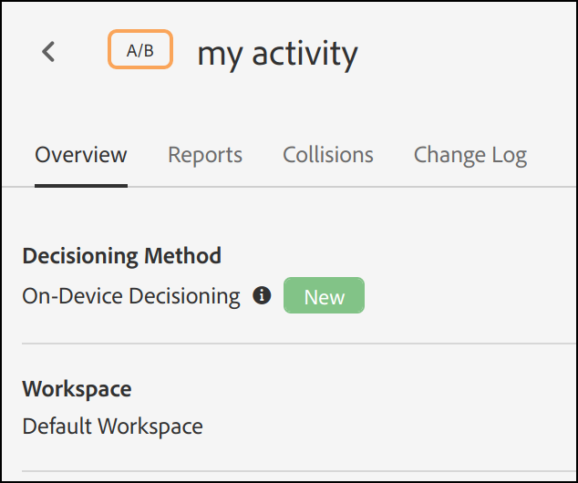

# オンデバイス判定の概要

次世代の [!DNL Adobe Target] SDK で [!UICONTROL on-device decisioning] が提供されるようになりました。これにより、サーバー上の A/B およびエクスペリエンスターゲット （XT） キャンペーンをキャッシュし、[!DNL Adobe Target] のEdge Networkへのネットワークリクエストをブロックすることなく、ほぼゼロの待ち時間でインメモリ判定を実行できます。

また、[!DNL Adobe Target] は、ライブサーバー呼び出しを介して、実験や機械学習によるパーソナライゼーションキャンペーンから最も関連性が高い最新のエクスペリエンスを提供する柔軟性も備えています。 つまり、パフォーマンスが最も重要な場合は、[!UICONTROL on-device decisioning] の機能を利用できますが、最も関連性が高く最新のエクスペリエンスが必要な場合は、代わりにサーバー呼び出しを行うことができます。 1 つを重ねて使用する必要があるユースケースについては、[ オンデバイス判定とエッジ判定を使用するタイミング ](../../sdk-guides/on-device-decisioning/supported-features.md) を参照してください。

>[!NOTE]
>
>オンデバイス判定は、クライアントサイド実装とサーバーサイド実装の両方で使用できます。 この記事では、サーバーサイドの [!UICONTROL on-device decisioning] について説明します。 クライアントサイドの [!UICONTROL on-device decisioning] について詳しくは、クライアントサイドの実装に関するドキュメント [ こちら ](../../../client-side/atjs/on-device-decisioning/on-device-decisioning.md) を参照してください。

## 仕組み

[!UICONTROL on-device decisioning] を有効にして [!DNL Adobe Target] SDK をインストールして初期化すると、サーバーに最も近い Akamai CDN から *ルールアーティファクト* がダウンロードされ、サーバー上でローカルにキャッシュされます。 サーバーサイドアプリケーション内で [!DNL Adobe Target] エクスペリエンスを取得するリクエストが行われる場合、キャッシュされたルールアーティファクトでエンコードされたメタデータに基づいて、返されるコンテンツに関する決定がメモリ内で行われます。これにより、[!UICONTROL on-device decisioning] A/B および XT アクティビティがすべて定義されます。

次の図は、[!UICONTROL on-device decisioning] のアーキテクチャを示しています。 クリックして画像を展開します。

（全幅に拡大するには、画像をクリックします）。

{zoomable="yes"}

## メリットは何ですか？

* **ほぼゼロの待ち時間を決定します。** バケット化と決定は、ネットワークリクエストのブロックを回避するために、メモリ内およびオンデバイスで実行されます。
* **アプリケーションのパフォーマンスの向上。** 実験を実行し、エンドユーザーのエクスペリエンスを損なうことなく、顧客とユーザーにパーソナライゼーションを提供します。
* **Google サイトの品質スコアが向上します。** メモリ内およびサーバーサイドで意思決定が行われるので、オンラインビジネスのGoogle サイト品質スコアを向上させて、コンシューマーがより多くの情報を見つけられるようにします。
* **リアルタイム分析から説明します。** [!DNL Adobe Target] または A4T レポートを通じてアクティビティのパフォーマンスからリアルタイムでインサイトを得て、重要な瞬間に戦略をピボットできます。

## サポートされる機能

### アクティビティ

オンデバイス判定では、[ フォームベースの Experience Composer](https://experienceleague.adobe.com/docs/target/using/experiences/form-experience-composer.html?lang=ja) で作成された次のアクティビティタイプをサポートしています。

* [!UICONTROL A/B Test]
* [!UICONTROL Experience Targeting] （XT）

### 配分方法

オンデバイス判定では、次の割り当て方法をサポートしています。

* 手動

### オーディエンスのターゲティング

オンデバイス判定では、次のオーディエンスルールをサポートしています。

| オーディエンスルール | オンデバイス判定 |
| --- | --- |
| [地域](https://experienceleague.adobe.com/docs/target/using/audiences/create-audiences/categories-audiences/geo.html?lang=ja) | ○
オンデバイス判定を使用する場合、次の地域属性がサポートされます。<ul><li>国 / 地域</li><li>市区町村</li><li>緯度</li><li>経度</li></ul> |
| [ネットワーク](https://experienceleague.adobe.com/docs/target/using/audiences/create-audiences/categories-audiences/network.html?lang=ja) | × |
| [モバイル](https://experienceleague.adobe.com/docs/target/using/audiences/create-audiences/categories-audiences/mobile.html?lang=ja) | × |
| [ カスタムパラメーター ](https://experienceleague.adobe.com/docs/target/using/audiences/create-audiences/categories-audiences/custom-parameters.html?lang=ja) | ○ |
| [オペレーティングシステム](https://experienceleague.adobe.com/docs/target/using/audiences/create-audiences/categories-audiences/operating-system.html?lang=ja) | ○ |
| [サイトのページ](https://experienceleague.adobe.com/docs/target/using/audiences/create-audiences/categories-audiences/site-pages.html?lang=ja) | ○ |
| [ブラウザー](https://experienceleague.adobe.com/docs/target/using/audiences/create-audiences/categories-audiences/browser.html?lang=ja) | ○ |
| [訪問者プロファイル](https://experienceleague.adobe.com/docs/target/using/audiences/create-audiences/categories-audiences/visitor-profile.html?lang=ja) | × |
| [トラフィックソース](https://experienceleague.adobe.com/docs/target/using/audiences/create-audiences/categories-audiences/traffic-sources.html?lang=ja) | × |
| [時間枠](https://experienceleague.adobe.com/docs/target/using/audiences/create-audiences/categories-audiences/time-frame.html?lang=ja) | ○ |
| [Experience Cloudオーディエンス ](https://experienceleague.adobe.com/docs/target/using/integrate/mmp.html?lang=ja) （Adobe Audience Manager、Adobe AnalyticsおよびAdobe Experience Managerのオーディエンス） | × |

## [!UICONTROL on-device decisioning] を使用するようにクライアントをプロビジョニングするにはどうすればよいですか？

オンデバイス判定は、サーバーサイド SDK を使用するすべて [!DNL Adobe Target] お客様 [!DNL Adobe Target] 利用できます。 この機能を有効にするには、[!DNL Adobe Target] UI で **[!UICONTROL Administration]**/**[!UICONTROL Implementation]**/**[!UICONTROL Account details]** に移動し、「**[!UICONTROL On-Device Decisioning]**」トグルを有効にします。

>[!NOTE]
>
>[!UICONTROL On-Device Decisioning] の切り替えを有効または無効にするには、管理者または承認者 *ユーザーの役割* が必要です。

オンデバイス判定トグルを有効に [!DNL Adobe Target] ると、クライアントの *ルールアーティファクト* の生成と伝播が開始されます。

>[!NOTE]
>
>[!UICONTROL on-device decisioning] を使用するように [!DNL Adobe Target] SDK を初期化する前に、必ず切り替えスイッチを有効にします。 ルールアーティファクトを機能させるには、まずルールアーティファクトを生成して Akamai CDN に伝 [!UICONTROL on-device decisioning] する必要があります。

### 既存の [!UICONTROL on-device decisioning] 認定されたアクティビティをすべてアーティファクトに含めるかどうかの切り替え

[!UICONTROL on-device decisioning] に適合するすべてのライブ [!DNL Target] アクティビティをアーティファクトに自動的に含める場合は、これを **オン** に切り替えます。

この切り替えスイッチ **オフ** を残すと、生成されたルールアーティファクトに含めるために、[!UICONTROL on-device decisioning] のアクティビティを再作成してアクティブ化する必要があります。

## アクティビティが [!UICONTROL on-device decisioning] 能であることを知るにはどうすればよいですか？

アクティビティを作成すると、アクティビティの詳細ページに表示される **[!UICONTROL Decisioning Method]** というラベルが、そのアクティビティが [!UICONTROL on-device decisioning] 能かどうかを示します。

また、アクティビティのリストに列 **[!UICONTROL Decisioning Method]** を追加すると、**[!UICONTROL Activities]** ページで [!UICONTROL on-device decisioning] 能なすべてのアクティビティを表示することもできます。

>[!NOTE]
>
>[!UICONTROL on-device decisioning] 能なアクティビティを作成してアクティブ化した後、生成されて Akamai CDN PoP に伝播されるルールアーティファクトに含まれるまでに最大 20 分かかる場合があります。

## [!DNL Adobe Target] のサーバーサイド SDK を使用して [!UICONTROL on-device decisioning] アクティビティを正常に配信するために必要な手順の概要を教えてください。

1. [!DNL Adobe Target] UI にアクセスし、**[!UICONTROL Administration]** / **[!UICONTROL Implementation]** / **[!UICONTROL Account details]** に移動して「**[!UICONTROL On-Device Decisioning]**」切り替えスイッチを有効にします。
1. 「**[!UICONTROL Include all existing [!UICONTROL on-device decisioning] qualified activities in the artifact]**」切替スイッチを有効にします。
1. [!UICONTROL on-device decisioning] でサポートされているアクティビティタイプを作成してアクティブ化し、そのアクティビティに **[!UICONTROL Decisioning Method]** が **[!UICONTROL On-Device Decisioning]** 用されていることを確認します。
1. `decisioningMethod = on-device` を使用して、[Node.js](../../node-js/overview.md) または [Java](../../java/overview.md) SDK をインストールして初期化します。
1. コードに `getOffers()` または `getAttributes()` を実装して、オンデバイスでエクスペリエンスを取得します。
1. コードのデプロイ。

上記の手順 1～3 を開始する方法を示す例については、[ はじめに ](../getting-started/getting-started.md) の節を参照してください。

## その他のリソース

### ウェビナー：[!DNL Adobe Target] のオンデバイス決定を使用して、待ち時間ゼロでパーソナライズとテストを行う

これまで以上に、マーケターや、製品所有者、開発者は、サイトやアプリなど、顧客とつながるあらゆる場所での顧客エクスペリエンス全体を最適化しようと取り組んでいます。データが分断された複数のサイロと、複雑な実装では不十分です。

この録画ウェビナーでは、[!DNL Adobe Target] 製品のエキスパートが、遅延がほぼゼロの状態でローカルに実行される重要なエクスペリエンス最適化に関するオンデバイス上の決定の動きが、新しいユースケースにどのように影響し、お客様のサイトパフォーマンスを向上させるかを説明します。

>[!VIDEO](https://video.tv.adobe.com/v/328148/?quality=12)

### チュートリアル：オンデバイス判定

[!DNL Adobe Target] [!UICONTROL on-device decisioning] により、ほぼゼロの待ち時間コンテンツ配信が可能になります。

この 7 分間のビデオでは、

* 実装の他の方法と比較した方法を含め、[!UICONTROL on-device decisioning] を説明 [!DNL Target] ます
* Target で [!UICONTROL on-device decisioning] を有効にする方法を示します
* JSON コンテンツで設定されたフォームベースのコンポーザーアクティビティのサンプルを調べます
* [!UICONTROL on-device decisioning] に必要なキー設定を含む Node.JS SDK コードのサンプルを示します
* ブラウザーで結果を表示します。

>[!VIDEO](https://video.tv.adobe.com/v/329032/?quality=12)

その他のビデオとチュートリアルについては、[[!DNL Adobe Target] Tutorials](https://experienceleague.adobe.com/docs/target-learn/tutorials/overview.html?lang=ja) を参照してください。

### Adobeテクニカルブログ – パート 1:Edge Platform[!DNL Adobe Target] 実験とパーソナライゼーションをおこなうために NodeJS SDK を実行する（Akamai Edge Workers）

[ ブログ投稿にアクセスするにはここをクリック ](https://medium.com/adobetech/part-1-run-adobe-target-nodejs-sdk-for-experimentation-and-personalization-on-edge-platforms-4d8660964ed9)。

### Adobe Tech Blog - パート 2：Edge Platform で実験とパーソナライゼーションを行うために [!DNL Adobe Target] NodeJS SDK を実行する（AWS Lambda@Edge）

[ ブログ投稿にアクセスするにはここをクリック ](https://medium.com/adobetech/part-2-run-adobe-target-nodejs-sdk-for-experimentation-and-personalization-on-edge-platforms-aws-4d6bdac24563)。
