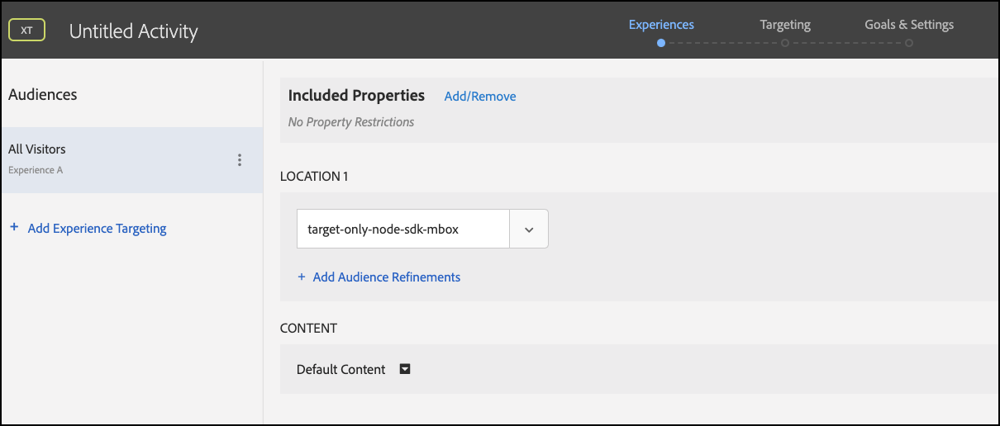
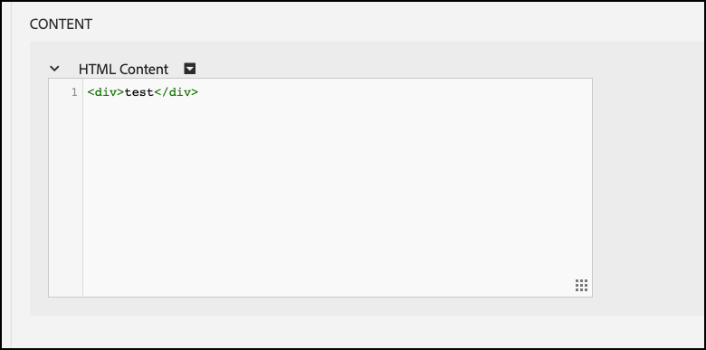

# [!UICONTROL  オンデバイス決定]のトラブルシューティング

## 設定を検証しています

### 手順の概要

1. `logger`が設定されていることを確認します
1. [!DNL Target] トレースが有効になっていることを確認します
1. 定義されたポーリング間隔に従って、デバイス上の[!UICONTROL 決定] *ルールアーティファクト*&#x200B;が取得され、キャッシュされたことを確認します。
1. フォームベースのエクスペリエンスコンポーザーを使用して、テスト [!UICONTROL  オンデバイス決定] アクティビティを作成することで、キャッシュされたルールアーティファクトを使用してコンテンツ配信を検証します。
1. 送信通知エラーの確認

## &#x200B;1. ロガーが設定されていることを確認します

SDKを初期化する際は、必ずログを有効にします。

**Node.js**

Node.js SDKの場合、`logger` オブジェクトを指定する必要があります。

```js {line-numbers="true"}
const CONFIG = {
  client: "<your client code>",
  organizationId: "<your organization ID>",
  logger: console
};
```

**Java SDK**

`ClientConfig`上のJava SDK `logRequests`の場合は、有効にする必要があります。

```js {line-numbers="true"}
ClientConfig config = ClientConfig.builder()
  .client("<your client code>")
  .organizationId("<your organization ID>")
  .logRequests(true)
  .build();
```

また、JVMは次のコマンドラインパラメーターで起動する必要があります。

```bash {line-numbers="true"}
java -Dorg.slf4j.simpleLogger.defaultLogLevel=DEBUG ...
```

## &#x200B;2. [!DNL Target]Tracesが有効になっていることを確認します

トレースを有効にすると、ルール アーティファクトに関する[!DNL Adobe Target]から追加情報が出力されます。

1. [!DNL Experience Cloud]の[!DNL Target]UIに移動します。

   

1. **[!UICONTROL 管理]** > **[!UICONTROL 実装]**&#x200B;に移動し、**[!UICONTROL 新しい認証トークンの生成]**&#x200B;をクリックします。

   

1. 新しく生成された認証トークンをクリップボードにコピーし、[!DNL Target] リクエストに追加します。

   **Node.js**

   ```js {line-numbers="true"}
   const request = {
     trace: {
       authorizationToken: "88f1a924-6bc5-4836-8560-2f9c86aeb36b"
     },
     execute: {
       mboxes: [{
         name: "sdk-mbox"
       }]
   }};
   ```

   **Java**

   ```js {line-numbers="true"}
   Trace trace = new Trace()
     .authorizationToken("88f1a924-6bc5-4836-8560-2f9c86aeb36b");
   Context context = new Context()
     .channel(ChannelType.WEB);
   MboxRequest mbox = new MboxRequest()
     .name("sdk-mbox")
     .index(0);
   ExecuteRequest executeRequest = new ExecuteRequest()
     .mboxes(Arrays.asList(mbox));
   
   TargetDeliveryRequest request = TargetDeliveryRequest.builder()
     .trace(trace)
     .context(context)
     .execute(executeRequest)
     .build();
   ```

1. ロガーとトレースを配置して、アプリを起動し、サーバーターミナルを監視します。 ロガーからの次の出力は、ルールアーティファクトが取得されたことを確認します。

   **Node.js SDK**

   ```text {line-numbers="true"}
     AT: LD.ArtifactProvider fetching artifact - https://assets.adobetarget.com/your-client-code/production/v1/rules.json
     AT: LD.ArtifactProvider artifact received - status=200
   ```

## &#x200B;3. 定義されたポーリング間隔に従って、デバイス上の[!UICONTROL 決定] *ルールアーティファクト*&#x200B;が取得され、キャッシュされたことを確認します。

1. ポーリング間隔の時間（デフォルトは20分）を待ち、アーティファクトがSDKによって取得されていることを確認します。 同じターミナルログが出力されます。

   さらに、[!DNL Target]Traceからの情報は、ルールアーティファクトに関する詳細を含めて端末に出力する必要があります。

   ```text {line-numbers="true"}
   "trace": {
     "clientCode": "your-client-code",
     "artifact": {
       "artifactLocation": "https://assets.adobetarget.com/your-client-code/production/v1/rules.json",
       "pollingInterval": 300000,
       "pollingHalted": false,
       "artifactVersion": "1.0.0",
       "artifactRetrievalCount": 10,
       "artifactLastRetrieved": "2020-09-20T00:09:42.707Z",
       "clientCode": "your-client-code",
       "environment": "production",
       "generatedAt": "2020-09-22T17:17:59.783Z"
     },
   ```

## &#x200B;4. フォームベースのエクスペリエンスコンポーザーを使用してテスト [!UICONTROL  オンデバイス決定] アクティビティを作成し、キャッシュされたルールアーティファクトを使用してコンテンツ配信を検証します

1. Experience Cloudの[!DNL Target]UIに移動します

   

1. フォームベースのExperience Composerを使用して、新しいXT アクティビティを作成します。

   

1. [!DNL Target] リクエストで使用するmbox名をXT アクティビティの場所として入力します（これは、開発目的に特化した一意のmbox名である必要があります）。

   

1. コンテンツをHTML オファーまたはJSON オファーに変更します。 これは、アプリケーションへの[!DNL Target] リクエストで返されます。 アクティビティのターゲティングを「すべての訪問者」のままにし、必要な指標を選択します。 アクティビティに名前を付けて保存し、アクティビティをアクティブ化して、使用されているmbox/locationが開発用であることを確認します。

   

1. アプリケーションで、[!DNL Target] リクエストの応答で受信したコンテンツのログステートメントを追加します

   **Node.js SDK**

   ```js {line-numbers="true"}
   try {
     const response = await targetClient.getOffers({ request });
     console.log('Response: ', response.response.execute.mboxes[0].options[0].content);
   } catch (error) {
     console.error('Something went wrong', error);
   }
   ```

   **Java SDK**

   ```js {line-numbers="true"}
   try {
     Context context = new Context()
       .channel(ChannelType.WEB);
     MboxRequest mbox = new MboxRequest()
       .name("sdk-mbox")
       .index(0);
     ExecuteRequest executeRequest = new ExecuteRequest()
       .mboxes(Arrays.asList(mbox));
   
     TargetDeliveryRequest request = TargetDeliveryRequest.builder()
       .context(context)
       .decisioningMethod(DecisioningMethod.ON_DEVICE)
       .execute(executeRequest)
       .build();
   
       TargetDeliveryResponse response = targetClient.getOffers(request);
     logger.debug("Response: ", response.getResponse().getExecute().getMboxes().get(0).getOptions().get(0).getContent());
   } catch (Exception exception) {
     logger.error("Something went wrong", exception);
   }
   ```

1. ターミナルのログを確認して、コンテンツが配信され、サーバーのルールアーティファクトを介して配信されたことを確認します。 `LD.DeciscionProvider` オブジェクトは、アクティビティの選定と決定がルールアーティファクトに基づいてデバイス上で決定されたときに出力されます。 さらに、`content`のログ記録により、`<div>test</div>`が表示されるか、またはテストアクティビティの作成時に応答が決定された場合に表示されます。

   **ロガー出力**

   ```text {line-numbers="true"}
   AT: LD.DecisionProvider {...}
   AT: Response received {...}
   Response:  <div>test</div>
   ```

## 送信通知エラーの確認

オンデバイス決定を使用する場合、通知はgetOffers実行リクエストに対して自動的に送信されます。 これらのリクエストはバックグラウンドでサイレントに送信されます。 `sendNotificationError`というイベントに登録すると、エラーを確認できます。 Node.js SDKを使用して通知エラーを購読する方法を示すコードサンプルを次に示します。

```js {line-numbers="true"}
const TargetClient = require("@adobe/target-nodejs-sdk");
let client;

function onSendNotificationError({ notification, error }) {
  console.log(
    `There was an error when sending a notification: ${error.message}`
  );
  console.log(`Notification Payload: ${JSON.stringify(notification, null, 2)}`);
}

async function targetClientReady() {
  const request = {
    context: { channel: "web" },
    execute: {
      mboxes: [{
        name: "a1-serverside-ab",
        index: 1
      }]
    }
  };
  const targetResponse = await client.getOffers({ request });
}

client = TargetClient.create({
  events: {
    clientReady: targetClientReady,
    sendNotificationError: onSendNotificationError
  }
});
```

## 一般的なトラブルシューティング

問題が発生した場合は、[!UICONTROL  オンデバイス決定]の[ サポートされている機能](supported-features.md)を必ず確認してください。

### サポートされていないオーディエンスまたはアクティビティが原因で、オンデバイス決定アクティビティが実行されない

発生する可能性のある一般的な問題は、使用中のオーディエンスまたはアクティビティタイプがサポートされていないため、[!UICONTROL  デバイス上の決定] アクティビティが実行されないことです。

（1） ロガー出力を使用して、応答オブジェクトのtrace プロパティのエントリを確認します。 キャンペーンプロパティを具体的に特定します。

**出力をトレース**

```text {line-numbers="true"}
  "execute": {
  "mboxes": [
    {
      "name": "your-mbox-name",
      "index": 0,
      "trace": {
        "clientCode": "your-client-code",
        ...
        "campaigns": [],
        ...
      }
    }
```

オーディエンスまたはアクティビティタイプがサポートされていないため、対象とするアクティビティが`campaigns` プロパティにありません。 アクティビティが`campaigns` プロパティの下にリストされている場合、問題はサポートされていないオーディエンスまたはアクティビティタイプによるものではありません。

（2）さらに、ロガー出力の`trace` > `artifact` > `artifactLocation`を確認して、`rules.json` ファイルを見つけ、アクティビティが`rules` > `mboxes` プロパティにないことに気付きます。

**ロガー出力**

```text {line-numbers="true"}
 ...
 rules: {
   mboxes: { },
   views: { }
 }
```

最後に、[!DNL Target]UIに移動し、問題のアクティビティを見つけます：[experience.adobe.com/target](https://experience.adobe.com/target)

オーディエンスで使用されるルールを確認し、サポートされている前述のルールのみを使用するようにします。 さらに、アクティビティタイプがA/BまたはXTであることを確認します。


### 適格でないオーディエンスが原因で、オンデバイス決定アクティビティが実行されない

デバイス上の決定アクティビティが実行されていませんが、rules.json ファイルにアクティビティが含まれていることを確認した場合は、次の手順を実行します。

（1） アプリケーションで実行しているmboxが、アクティビティで使用しているものと同じであることを確認します。

>[!BEGINTABS]

>[!TAB rule.json]

```text {line-numbers="true"}
 ...
 rules: {
   mboxes: {
    target-only-node-sdk-mbox: [{ // this mbox name must match the mbox in your request
      ...
    }]
   }
 ...
```

>[!TAB Node.js SDK]

```js {line-numbers="true"}
 const request = {
   trace: {
     authorizationToken: '2dfc1dce-1e58-4e05-bbd6-a6725893d4d6'
   },
   execute: {
     mboxes: [{
       address: getAddress(req),
       name: "target-only-node-sdk-mbox-two" // this mbox name must match the mbox the activity is using
     }]
   }};
```

>[!TAB Java SDK]

```js {line-numbers="true"}
Context context = new Context()
  .channel(ChannelType.WEB);
MboxRequest mbox = new MboxRequest()
  .name("target-only-node-sdk-mbox-two")
  .index(0);
ExecuteRequest executeRequest = new ExecuteRequest()
  .mboxes(Arrays.asList(mbox));

TargetDeliveryRequest request = TargetDeliveryRequest.builder()
  .context(context)
  .decisioningMethod(DecisioningMethod.ON_DEVICE)
  .execute(executeRequest)
  .build();

TargetDeliveryResponse response = targetClient.getOffers(request);
```

>[!ENDTABS]

（2） トレース出力の`matchedRuleConditions`または`unmatchedRuleConditions` プロパティを確認して、アクティビティのオーディエンスに適格であることを確認します。

**出力をトレース**

```text {line-numbers="true"}
...
},
"campaignId": 368564,
"campaignType": "landing",
"matchedSegmentIds": [],
"unmatchedSegmentIds": [
  6188838
      ],
      "matchedRuleConditions": [],
          "unmatchedRuleConditions": [
            {
              "in": [
                "true",
                {
                  "var": "mbox.auth_lc"
                }
              ]
            }
          ]
    ...
```

一致しないルール条件がある場合は、アクティビティの対象ではないため、アクティビティは実行されません。 オーディエンスのルールを確認して、選定に至っていない理由を確認します。

### オンデバイス決定アクティビティは実行されませんが、理由は明らかではありません

オンデバイス判定アクティビティが実行されない理由は、容易には明らかにならない場合があります。 この場合は、次のトラブルシューティング手順に従って問題を特定します。

（1） コンソールのロガートレース出力を読み取り、アーティファクトプロパティを特定します。これは次のようになります。

**出力をトレース**

```text {line-numbers="true"}
...
      "artifact": {
          "artifactLocation": "https://assets.adobetarget.com/your-client-code/production/v1/rules.json",
          "pollingInterval": 300000,
          "pollingHalted": false,
          "artifactVersion": "1.0.0",
          "artifactRetrievalCount": 3,
          "artifactLastRetrieved": "2020-10-16T00:56:27.596Z",
          "clientCode": "adobeinterikleisch",
          "environment": "production"
        },
...
```

アーティファクトの`artifactLastRetrieved`日付を確認し、最新の`rules.json` ファイルがアプリにダウンロードされていることを確認します。

（2） ロガー出力で`evaluatedCampaignTargets` プロパティを検索します。

**ロガー出力**

```text {line-numbers="true"}
...
  "evaluatedCampaignTargets": [
      {
        "context": {
          "current_timestamp": 1602812599608,
          "current_time": "0143",
          "current_day": 5,
          "user": {
            "browserType": "unknown",
            "platform": "Unknown",
            "locale": "en",
            "browserVersion": -1
          },
          "page": {
            "url": "localhost:3000/",
            "path": "/",
            "query": "",
            "fragment": "",
            "subdomain": "",
            "domain": "3000",
            "topLevelDomain": "",
            "url_lc": "localhost:3000/",
            "path_lc": "/",
            "query_lc": "",
            "fragment_lc": "",
            "subdomain_lc": "",
            "domain_lc": "3000",
            "topLevelDomain_lc": ""
          },
          "referring": {
            "url": "localhost:3000/",
            "path": "/",
            "query": "",
            "fragment": "",
            "subdomain": "",
            "domain": "3000",
            "topLevelDomain": "",
            "url_lc": "localhost:3000/",
            "path_lc": "/",
            "query_lc": "",
            "fragment_lc": "",
            "subdomain_lc": "",
            "domain_lc": "3000",
            "topLevelDomain_lc": ""
          },
          "geo": {},
          "mbox": {},
          "allocation": 23.79
        },
        "campaignId": 368564,
        "campaignType": "landing",
        "matchedSegmentIds": [],
        "unmatchedSegmentIds": [
          6188838
        ],
        "matchedRuleConditions": [],
        "unmatchedRuleConditions": [
          {
            "in": [
              "true",
              {
                "var": "mbox.auth_lc"
              }
            ]
          }
        ]
...
```

（3） `context`、`page`、`referring` データを確認して、これがアクティビティのターゲティングの選定に影響を与える可能性があることを確認します。

（4） `campaignId`を確認して、実行する予定のアクティビティまたはアクティビティが評価されていることを確認します。 `campaignId`は、[!DNL Target]UIの「アクティビティの概要」タブのアクティビティ IDと一致します。


（5） `matchedRuleConditions`と`unmatchedRuleConditions`を確認して、特定のアクティビティのオーディエンスルールの選定に関する問題を特定します。

（6）最新の`rules.json` ファイルを確認して、ローカルで実行するアクティビティまたはアクティビティが含まれていることを確認します。 上記の手順1で場所を参照します。

（7） リクエストとアクティビティで同じmbox名を使用していることを確認します。

（8） サポートされているオーディエンスルールとサポートされているアクティビティタイプを使用していることを確認します。

### [!DNL Target] ユーザーインターフェイスでmboxの下に設定されたアクティビティが「デバイス決定時に有効」と表示されていても、サーバー呼び出しが行われます

デバイスがオンデバイス判定の対象であるにもかかわらず、サーバーコールが行われる理由はいくつかあります。

* 「デバイス決定実施要件」アクティビティに使用されるmboxが、「デバイス決定実施要件」以外のアクティビティにも使用されている場合、mboxは`rules.json` アーティファクトの`remoteMboxes` セクションにリストされます。 mboxが`remoteMboxes`の下にリストされている場合、そのmboxに対する`getOffer(s)`呼び出しはサーバー呼び出しになります。

* ワークスペース/プロパティの下にアクティビティを設定し、SDKの設定時に同じものを含まない場合、デフォルトワークスペースの`rules.josn`がダウンロードされる可能性があります。これにより、`remoteMboxes` セクションの下のmboxを使用できます。
