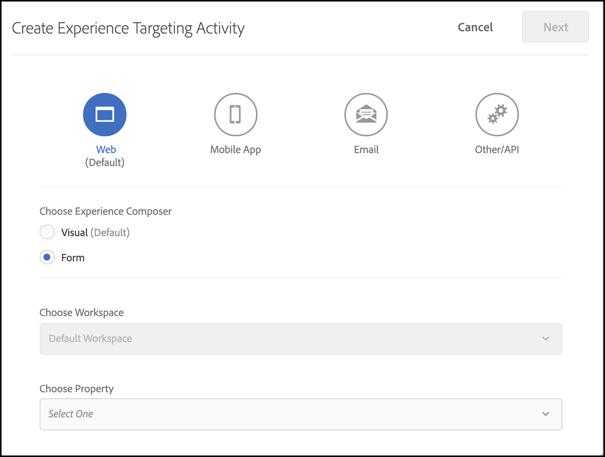

# トラブルシューティング [!UICONTROL on-device decisioning]

## 設定の検証

### 手順の概要

1. `logger` が設定されていることを確認
1. [!DNL Target] トレースが有効になっていることを確認します
1. 定義されたポーリング間隔に従って [!UICONTROL on-device decisioning] *ルール アーティファクト* が取得され、キャッシュされたことを確認します。
1. フォームベースの Experience Composer を通じてテスト [!UICONTROL on-device decisioning] アクティビティを作成することにより、キャッシュされたルールアーティファクトによるコンテンツ配信を検証します。
1. Inspectの送信通知エラー

## 1. ロガーが設定されていることを確認します

SDK を初期化する場合は、ログを有効にします。

**Node.js**

Node.js SDK の場合は、`logger` オブジェクトを指定する必要があります。

```js {line-numbers="true"}
const CONFIG = {
  client: "<your client code>",
  organizationId: "<your organization ID>",
  logger: console
};
```

**Java SDK**

Java SDK の場合、`ClientConfig` の `logRequests` を有効にする必要があります。

```js {line-numbers="true"}
ClientConfig config = ClientConfig.builder()
  .client("<your client code>")
  .organizationId("<your organization ID>")
  .logRequests(true)
  .build();
```

また、次のコマンドラインパラメーターを使用して JVM を起動する必要があります。

```bash {line-numbers="true"}
java -Dorg.slf4j.simpleLogger.defaultLogLevel=DEBUG ...
```

## 2. トレースが有効 [!DNL Target] なっていることを確認します

トレースを有効にすると、ルールアーティファクトに関する追加情報が [!DNL Adobe Target] から出力されます。

1. [!DNL Experience Cloud] の [!DNL Target]UI に移動します。

   

1. **[!UICONTROL Administration]**/**[!UICONTROL Implementation]** に移動し、「**[!UICONTROL Generate New Authorization Token]**」をクリックします。

   

1. 新しく生成された認証トークンをクリップボードにコピーし、[!DNL Target]request に追加します。

   **Node.js**

   ```js {line-numbers="true"}
   const request = {
     trace: {
       authorizationToken: "88f1a924-6bc5-4836-8560-2f9c86aeb36b"
     },
     execute: {
       mboxes: [{
         name: "sdk-mbox"
       }]
   }};
   ```

   **Java**

   ```js {line-numbers="true"}
   Trace trace = new Trace()
     .authorizationToken("88f1a924-6bc5-4836-8560-2f9c86aeb36b");
   Context context = new Context()
     .channel(ChannelType.WEB);
   MboxRequest mbox = new MboxRequest()
     .name("sdk-mbox")
     .index(0);
   ExecuteRequest executeRequest = new ExecuteRequest()
     .mboxes(Arrays.asList(mbox));
   
   TargetDeliveryRequest request = TargetDeliveryRequest.builder()
     .trace(trace)
     .context(context)
     .execute(executeRequest)
     .build();
   ```

1. ロガーとトレースを配置したら、アプリを起動し、サーバーターミナルを監視します。 ロガーの次の出力は、ルールアーティファクトが取得されたことを確認します。

   **Node.js SDK**

   ```text {line-numbers="true"}
     AT: LD.ArtifactProvider fetching artifact - https://assets.adobetarget.com/your-client-code/production/v1/rules.json
     AT: LD.ArtifactProvider artifact received - status=200
   ```

## 3. [!UICONTROL on-device decisioning] *ルール アーティファクト* が取得され、定義されたポーリング間隔に従ってキャッシュされていることを確認します。

1. ポーリング間隔の期間（デフォルトは 20 分）を待ち、アーティファクトが SDK によって取得されていることを確認します。 同じ端末ログが出力されます。

   さらに、[!DNL Target]Trace の情報は、ルールアーティファクトの詳細と共に端末に出力する必要があります。

   ```text {line-numbers="true"}
   "trace": {
     "clientCode": "your-client-code",
     "artifact": {
       "artifactLocation": "https://assets.adobetarget.com/your-client-code/production/v1/rules.json",
       "pollingInterval": 300000,
       "pollingHalted": false,
       "artifactVersion": "1.0.0",
       "artifactRetrievalCount": 10,
       "artifactLastRetrieved": "2020-09-20T00:09:42.707Z",
       "clientCode": "your-client-code",
       "environment": "production",
       "generatedAt": "2020-09-22T17:17:59.783Z"
     },
   ```

## 4. フォームベースの Experience Composer を使用してテスト [!UICONTROL on-device decisioning] アクティビティを作成することにより、キャッシュされたルールアーティファクトによるコンテンツ配信を検証する

1. Experience Cloudの UI[!DNL Target] 移動します。

   

1. フォームベースの Experience Composer を使用して、新しい XT アクティビティを作成します。

   

1. [!DNL Target] リクエストで使用される mbox 名を XT アクティビティの場所として入力します（開発目的で特別に一意の mbox 名にする必要があります）。

   

1. コンテンツをHTMLオファーまたは JSON オファーに変更します。 これは、[!DNL Target] リクエストでアプリケーションに返されます。 アクティビティのターゲティングは「すべての訪問者」のままにし、必要な指標を選択します。 アクティビティに名前を付け、保存してからアクティブ化して、使用中の mbox/場所が開発専用であることを確認します。

   

1. アプリケーションに、リクエストからの応答で受信したコンテンツのログステートメント [!DNL Target] 追加します

   **Node.js SDK**

   ```js {line-numbers="true"}
   try {
     const response = await targetClient.getOffers({ request });
     console.log('Response: ', response.response.execute.mboxes[0].options[0].content);
   } catch (error) {
     console.error('Something went wrong', error);
   }
   ```

   **Java SDK**

   ```js {line-numbers="true"}
   try {
     Context context = new Context()
       .channel(ChannelType.WEB);
     MboxRequest mbox = new MboxRequest()
       .name("sdk-mbox")
       .index(0);
     ExecuteRequest executeRequest = new ExecuteRequest()
       .mboxes(Arrays.asList(mbox));
   
     TargetDeliveryRequest request = TargetDeliveryRequest.builder()
       .context(context)
       .decisioningMethod(DecisioningMethod.ON_DEVICE)
       .execute(executeRequest)
       .build();
   
       TargetDeliveryResponse response = targetClient.getOffers(request);
     logger.debug("Response: ", response.getResponse().getExecute().getMboxes().get(0).getOptions().get(0).getContent());
   } catch (Exception exception) {
     logger.error("Something went wrong", exception);
   }
   ```

1. ターミナルのログを確認して、コンテンツが配信中であり、サーバーのルールアーティファクトを介して配信されたことを確認します。 `LD.DeciscionProvider` オブジェクトは、アクティビティの選定と決定がルールアーティファクトに基づいてオンデバイスで決定された場合に出力されます。 さらに、`content` のログが記録されるので、テストアクティビティを作成する際の応答は、`<div>test</div>` のように、またはとどのように決定しているかがわかります。

   **ロガー出力**

   ```text {line-numbers="true"}
   AT: LD.DecisionProvider {...}
   AT: Response received {...}
   Response:  <div>test</div>
   ```

## Inspectの送信通知エラー

オンデバイス判定を使用する場合、getOffers 実行リクエストの通知が自動的に送信されます。 これらのリクエストは、バックグラウンドでサイレントに送信されます。 エラーは、`sendNotificationError` というイベントを登録することで調査できます。 Node.js SDK を使用して通知エラーをサブスクライブする方法を示すコードサンプルを以下に示します。

```js {line-numbers="true"}
const TargetClient = require("@adobe/target-nodejs-sdk");
let client;

function onSendNotificationError({ notification, error }) {
  console.log(
    `There was an error when sending a notification: ${error.message}`
  );
  console.log(`Notification Payload: ${JSON.stringify(notification, null, 2)}`);
}

async function targetClientReady() {
  const request = {
    context: { channel: "web" },
    execute: {
      mboxes: [{
        name: "a1-serverside-ab",
        index: 1
      }]
    }
  };
  const targetResponse = await client.getOffers({ request });
}

client = TargetClient.create({
  events: {
    clientReady: targetClientReady,
    sendNotificationError: onSendNotificationError
  }
});
```

## 一般的なトラブルシューティングシナリオ

問題が発生した場合は、[!UICONTROL on-device decisioning] に [ サポートされる機能 ](supported-features.md) を確認してください。

### サポートされていないオーディエンスまたはアクティビティが原因で、オンデバイス判定アクティビティが実行されない

一般的に発生する可能性がある問題は、使用中 [!UICONTROL on-device decisioning] オーディエンスまたはアクティビティタイプがサポートされていないことが原因で、アクティビティが実行されないことです。

（1） ロガー出力を使用して、応答オブジェクトの trace プロパティのエントリを確認します。 campaigns プロパティを具体的に特定します。

**トレース出力**

```text {line-numbers="true"}
  "execute": {
  "mboxes": [
    {
      "name": "your-mbox-name",
      "index": 0,
      "trace": {
        "clientCode": "your-client-code",
        ...
        "campaigns": [],
        ...
      }
    }
```

オーディエンスまたはアクティビティタイプがサポートされていないので、対象としようとしているアクティビティが `campaigns` プロパティに含まれていないことがわかります。 `campaigns` プロパティの下にアクティビティがリスト表示されている場合、問題は、サポートされていないオーディエンスやアクティビティタイプに起因するものではありません。

（2）さらに、ロガー出力の `trace` > `artifact` > `artifactLocation` を確認して `rules.json` ファイルを見つけ、`rules` > `mboxes` プロパティにアクティビティがないことを確認します。

**ロガー出力**

```text {line-numbers="true"}
 ...
 rules: {
   mboxes: { },
   views: { }
 }
```

最後に [!DNL Target]UI に移動し、問題のアクティビティを探します：[experience.adobe.com/target](https://experience.adobe.com/target)

オーディエンスで使用されるルールをレビューし、サポートされている前述のルールのみを使用するようにします。 さらに、アクティビティタイプが A/B または XT であることも確認します。


### オーディエンスが選定されていないので、オンデバイス判定アクティビティが実行されない

オンデバイス判定アクティビティが実行されていないが、rules.json ファイルにアクティビティが含まれていることを確認した場合は、次の手順を実行します。

（1） アプリケーションで実行している mbox が、アクティビティで使用しているものと同じであることを確認します。

>[!BEGINTABS]

>[!TAB rule.json]

```text {line-numbers="true"}
 ...
 rules: {
   mboxes: {
    target-only-node-sdk-mbox: [{ // this mbox name must match the mbox in your request
      ...
    }]
   }
 ...
```

>[!TAB Node.js SDK]

```js {line-numbers="true"}
 const request = {
   trace: {
     authorizationToken: '2dfc1dce-1e58-4e05-bbd6-a6725893d4d6'
   },
   execute: {
     mboxes: [{
       address: getAddress(req),
       name: "target-only-node-sdk-mbox-two" // this mbox name must match the mbox the activity is using
     }]
   }};
```

>[!TAB Java SDK]

```js {line-numbers="true"}
Context context = new Context()
  .channel(ChannelType.WEB);
MboxRequest mbox = new MboxRequest()
  .name("target-only-node-sdk-mbox-two")
  .index(0);
ExecuteRequest executeRequest = new ExecuteRequest()
  .mboxes(Arrays.asList(mbox));

TargetDeliveryRequest request = TargetDeliveryRequest.builder()
  .context(context)
  .decisioningMethod(DecisioningMethod.ON_DEVICE)
  .execute(executeRequest)
  .build();

TargetDeliveryResponse response = targetClient.getOffers(request);
```

>[!ENDTABS]

（2） トレース出力の `matchedRuleConditions` または `unmatchedRuleConditions` プロパティを確認して、アクティビティのオーディエンスに適合していることを確認します。

**トレース出力**

```text {line-numbers="true"}
...
},
"campaignId": 368564,
"campaignType": "landing",
"matchedSegmentIds": [],
"unmatchedSegmentIds": [
  6188838
      ],
      "matchedRuleConditions": [],
          "unmatchedRuleConditions": [
            {
              "in": [
                "true",
                {
                  "var": "mbox.auth_lc"
                }
              ]
            }
          ]
    ...
```

ルール条件が一致しない場合は、アクティビティの対象とならないので、アクティビティは実行されません。 オーディエンスのルールをレビューして、選定理由を確認します。

### オンデバイス判定アクティビティが実行されていないが、理由が不明

オンデバイス判定アクティビティが実行されない理由は、簡単にははっきりしない場合があります。 この場合は、次のトラブルシューティング手順に従って問題を特定します。

（1） コンソールのロガートレース出力を読み取り、アーティファクトプロパティを特定します。このプロパティは次のようになります。

**トレース出力**

```text {line-numbers="true"}
...
      "artifact": {
          "artifactLocation": "https://assets.adobetarget.com/your-client-code/production/v1/rules.json",
          "pollingInterval": 300000,
          "pollingHalted": false,
          "artifactVersion": "1.0.0",
          "artifactRetrievalCount": 3,
          "artifactLastRetrieved": "2020-10-16T00:56:27.596Z",
          "clientCode": "adobeinterikleisch",
          "environment": "production"
        },
...
```

アーティファクトの `artifactLastRetrieved` 日を確認し、アプリにダウンロードされた最新の `rules.json` ファイルがあることを確認します。

（2） ロガー出力で `evaluatedCampaignTargets` プロパティを見つけます。

**ロガー出力**

```text {line-numbers="true"}
...
  "evaluatedCampaignTargets": [
      {
        "context": {
          "current_timestamp": 1602812599608,
          "current_time": "0143",
          "current_day": 5,
          "user": {
            "browserType": "unknown",
            "platform": "Unknown",
            "locale": "en",
            "browserVersion": -1
          },
          "page": {
            "url": "localhost:3000/",
            "path": "/",
            "query": "",
            "fragment": "",
            "subdomain": "",
            "domain": "3000",
            "topLevelDomain": "",
            "url_lc": "localhost:3000/",
            "path_lc": "/",
            "query_lc": "",
            "fragment_lc": "",
            "subdomain_lc": "",
            "domain_lc": "3000",
            "topLevelDomain_lc": ""
          },
          "referring": {
            "url": "localhost:3000/",
            "path": "/",
            "query": "",
            "fragment": "",
            "subdomain": "",
            "domain": "3000",
            "topLevelDomain": "",
            "url_lc": "localhost:3000/",
            "path_lc": "/",
            "query_lc": "",
            "fragment_lc": "",
            "subdomain_lc": "",
            "domain_lc": "3000",
            "topLevelDomain_lc": ""
          },
          "geo": {},
          "mbox": {},
          "allocation": 23.79
        },
        "campaignId": 368564,
        "campaignType": "landing",
        "matchedSegmentIds": [],
        "unmatchedSegmentIds": [
          6188838
        ],
        "matchedRuleConditions": [],
        "unmatchedRuleConditions": [
          {
            "in": [
              "true",
              {
                "var": "mbox.auth_lc"
              }
            ]
          }
        ]
...
```

（3） `context`、`page`、`referring` のデータを確認し、アクティビティのターゲティングの選定に影響を与える可能性があるので、期待どおりであることを確認します。

（4） `campaignId` をレビューして、実行を予定しているアクティビティが評価されていることを確認します。 この `campaignId` は、[!DNL Target]UI の「アクティビティの概要」タブのアクティビティ ID と一致します。


（5） `matchedRuleConditions` と `unmatchedRuleConditions` をレビューして、特定のアクティビティのオーディエンスルールの絞り込みに関する問題を特定します。

（6）最新の `rules.json` ファイルを確認して、ローカルで実行するアクティビティが含まれていることを確認します。 場所は、上記の手順 1 で参照されています。

（7） リクエストとアクティビティで同じ mbox 名を使用していることを確認します。

（8） サポートされているオーディエンスルールとアクティビティタイプを使用していることを確認します。

### ユーザーインターフェイスで mbox の下に設定されたアクティビティが「On Device Decisioning Eligible」と表示されている場合でも [!DNL Target] サーバーコールが行われます

デバイスがオンデバイス判定の対象であるにもかかわらず、サーバー呼び出しが行われる理由はいくつかあります。

* 「On Device Decisioning Eligible」アクティビティに使用される mbox が「On Device Decisioning Eligible」以外のアクティビティでも使用される場合、mbox は `rules.json` アーティファクトの `remoteMboxes` セクションにリストされます。 mbox が `remoteMboxes` の下にリストされている場合、その mbox に対して `getOffer(s)` 呼び出しをおこなうと、サーバーが呼び出されます。

* ワークスペース/プロパティの下にアクティビティを設定し、SDK の設定時に同じアクティビティを含めない場合、デフォルトのワークスペースの `rules.josn` がダウンロードされ、「`remoteMboxes`」セクションの mbox が使用される可能性があります。
