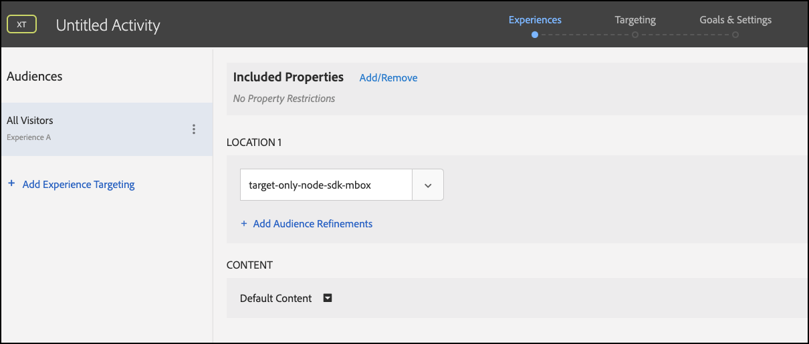

# トラブルシューティング [!UICONTROL オンデバイス判定]

## 設定の検証

### 手順の概要

1. 次を確認します。 `logger` 設定済み
1. 確認 [!DNL Target] トレースが有効になっています
1. を確認します。 [!UICONTROL オンデバイス判定] *ルールアーティファクト* は、定義されたポーリング間隔に従って取得され、キャッシュされています。
1. テストを作成し、キャッシュされたルールアーティファクトを使用してコンテンツ配信を検証する [!UICONTROL オンデバイス判定] アクティビティを作成できます。
1. Inspect send notification errors

## 1.ロガーが設定されていることを確認します。

SDK を初期化する際は、必ずログを有効にしてください。

**Node.js**

Node.js SDK の場合、 `logger` オブジェクトを指定する必要があります。

```js {line-numbers="true"}
const CONFIG = {
  client: "<your client code>",
  organizationId: "<your organization ID>",
  logger: console
};
```

**Java SDK**

Java SDK の場合 `logRequests` の `ClientConfig` を有効にする必要があります。

```js {line-numbers="true"}
ClientConfig config = ClientConfig.builder()
  .client("<your client code>")
  .organizationId("<your organization ID>")
  .logRequests(true)
  .build();
```

また、JVM は、次のコマンドラインパラメーターで起動する必要があります。

```bash {line-numbers="true"}
java -Dorg.slf4j.simpleLogger.defaultLogLevel=DEBUG ...
```

## 2.次を確認します。[!DNL Target]トレースが有効になっています

トレースを有効にすると、次の追加情報が出力されます： [!DNL Adobe Target] ルールアーティファクトに関して。

1. 次に移動：[!DNL Target]の UI [!DNL Experience Cloud].

   

1. に移動します。 **[!UICONTROL 管理]** > **[!UICONTROL 実装]** をクリックします。 **[!UICONTROL 新しい認証トークンを生成]**.

   

1. 新しく生成された認証トークンをクリップボードにコピーし、[!DNL Target]リクエスト：

   **Node.js**

   ```js {line-numbers="true"}
   const request = {
     trace: {
       authorizationToken: "88f1a924-6bc5-4836-8560-2f9c86aeb36b"
     },
     execute: {
       mboxes: [{
         name: "sdk-mbox"
       }]
   }};
   ```

   **Java**

   ```js {line-numbers="true"}
   Trace trace = new Trace()
     .authorizationToken("88f1a924-6bc5-4836-8560-2f9c86aeb36b");
   Context context = new Context()
     .channel(ChannelType.WEB);
   MboxRequest mbox = new MboxRequest()
     .name("sdk-mbox")
     .index(0);
   ExecuteRequest executeRequest = new ExecuteRequest()
     .mboxes(Arrays.asList(mbox));
   
   TargetDeliveryRequest request = TargetDeliveryRequest.builder()
     .trace(trace)
     .context(context)
     .execute(executeRequest)
     .build();
   ```

1. ロガーとトレースが配置された状態で、アプリを起動し、サーバーターミナルを監視します。 ロガーからの次の出力で、ルールアーティファクトが取得されたことを確認します。

   **Node.js SDK**

   ```text {line-numbers="true"}
     AT: LD.ArtifactProvider fetching artifact - https://assets.adobetarget.com/your-client-code/production/v1/rules.json
     AT: LD.ArtifactProvider artifact received - status=200
   ```

## 3. [!UICONTROL オンデバイス判定] *ルールアーティファクト* は、定義されたポーリング間隔に従って取得され、キャッシュされています。

1. ポーリング間隔の時間（デフォルトは 5 分）を待ち、アーティファクトが SDK によって取得されることを確認します。 同じ端末ログが出力されます。

   さらに、[!DNL Target]トレースは、ルールアーティファクトに関する詳細と共にターミナルに出力する必要があります。

   ```text {line-numbers="true"}
   "trace": {
     "clientCode": "your-client-code",
     "artifact": {
       "artifactLocation": "https://assets.adobetarget.com/your-client-code/production/v1/rules.json",
       "pollingInterval": 300000,
       "pollingHalted": false,
       "artifactVersion": "1.0.0",
       "artifactRetrievalCount": 10,
       "artifactLastRetrieved": "2020-09-20T00:09:42.707Z",
       "clientCode": "your-client-code",
       "environment": "production",
       "generatedAt": "2020-09-22T17:17:59.783Z"
     },
   ```

## 4.テストを作成し、キャッシュされたルールアーティファクトを使用してコンテンツ配信を検証します [!UICONTROL オンデバイス判定] フォームベースの experience composer を使用したアクティビティ

1. 次に移動：[!DNL Target]UI のExperience Cloud

   

1. フォームベースの Experience Composer を使用して新しい XT アクティビティを作成します。

   

1. 使用する mbox 名を[!DNL Target]リクエストを XT アクティビティの場所として指定します（開発目的で特に一意の mbox 名を指定する必要があります）。

   

1. コンテンツをHTMLオファーまたは JSON オファーに変更します。 これは、[!DNL Target]リクエストを送信します。 アクティビティのターゲティングを「すべての訪問者」のままにし、必要な指標を選択します。 アクティビティに名前を付け、保存してからアクティブ化し、使用中の mbox や場所が開発専用であることを確認します。

   

1. アプリケーションで、[!DNL Target]リクエスト

   **Node.js SDK**

   ```js {line-numbers="true"}
   try {
     const response = await targetClient.getOffers({ request });
     console.log('Response: ', response.response.execute.mboxes[0].options[0].content);
   } catch (error) {
     console.error('Something went wrong', error);
   }
   ```

   **Java SDK**

   ```js {line-numbers="true"}
   try {
     Context context = new Context()
       .channel(ChannelType.WEB);
     MboxRequest mbox = new MboxRequest()
       .name("sdk-mbox")
       .index(0);
     ExecuteRequest executeRequest = new ExecuteRequest()
       .mboxes(Arrays.asList(mbox));
   
     TargetDeliveryRequest request = TargetDeliveryRequest.builder()
       .context(context)
       .decisioningMethod(DecisioningMethod.ON_DEVICE)
       .execute(executeRequest)
       .build();
   
       TargetDeliveryResponse response = targetClient.getOffers(request);
     logger.debug("Response: ", response.getResponse().getExecute().getMboxes().get(0).getOptions().get(0).getContent());
   } catch (Exception exception) {
     logger.error("Something went wrong", exception);
   }
   ```

1. ターミナルでログをレビューして、コンテンツが配信されていること、およびコンテンツがサーバー上のルールアーティファクトを介して配信されたことを確認します。 The `LD.DeciscionProvider` オブジェクトは、ルールアーティファクトに基づいてアクティビティの選定と判定がデバイス上で決定された場合に出力されます。 さらに、 `content`を使用する場合は、 `<div>test</div>` ただし、テストアクティビティを作成する際の応答をにすることにした場合は、

   **ロガー出力**

   ```text {line-numbers="true"}
   AT: LD.DecisionProvider {...}
   AT: Response received {...}
   Response:  <div>test</div>
   ```

## Inspect send notification errors

オンデバイス判定を使用する場合、getOffers がリクエストを実行するための通知が自動的に送信されます。 これらのリクエストは、バックグラウンドで警告なく送信されます。 エラーは、 `sendNotificationError`. Node.js SDK を使用して通知エラーをサブスクライブする方法を示すコードサンプルを以下に示します。

```js {line-numbers="true"}
const TargetClient = require("@adobe/target-nodejs-sdk");
let client;

function onSendNotificationError({ notification, error }) {
  console.log(
    `There was an error when sending a notification: ${error.message}`
  );
  console.log(`Notification Payload: ${JSON.stringify(notification, null, 2)}`);
}

async function targetClientReady() {
  const request = {
    context: { channel: "web" },
    execute: {
      mboxes: [{
        name: "a1-serverside-ab",
        index: 1
      }]
    }
  };
  const targetResponse = await client.getOffers({ request });
}

client = TargetClient.create({
  events: {
    clientReady: targetClientReady,
    sendNotificationError: onSendNotificationError
  }
});
```

## 一般的なトラブルシューティングシナリオ

必ず確認してください [サポートされる機能](supported-features.md) 対象： [!UICONTROL オンデバイス判定] 問題が発生した場合。

### オーディエンスまたはアクティビティがサポートされていないので、オンデバイス判定アクティビティが実行されません

発生する可能性のある一般的な問題は、次のとおりです。 [!UICONTROL オンデバイス判定] 使用中のオーディエンスまたはアクティビティタイプがサポートされていないので、アクティビティが実行されません。

(1) ロガー出力を使用して、応答オブジェクトの trace プロパティのエントリを確認します。 キャンペーンのプロパティを特定します。

**トレース出力**

```text {line-numbers="true"}
  "execute": {
  "mboxes": [
    {
      "name": "your-mbox-name",
      "index": 0,
      "trace": {
        "clientCode": "your-client-code",
        ...
        "campaigns": [],
        ...
      }
    }
```

条件を満たそうとしているアクティビティが、 `campaigns` プロパティを設定する必要はありません。オーディエンスやアクティビティタイプはサポートされていません。 アクティビティが `campaigns` プロパティに含まれていない場合、この問題は、サポートされていないオーディエンスやアクティビティのタイプによるものではありません。

(2) さらに、 `rules.json` ～を見てファイルを作る `trace` > `artifact` > `artifactLocation` がロガー出力に表示され、アクティビティが `rules` > `mboxes` プロパティ：

**ロガー出力**

```text {line-numbers="true"}
 ...
 rules: {
   mboxes: { },
   views: { }
 }
```

最後に、[!DNL Target]UI と、該当するアクティビティの場所を特定します。 [experience.adobe.com/target](https://experience.adobe.com/target)

オーディエンスで使用されるルールを確認し、サポートされている前述のルールのみを使用するようにしてください。 さらに、アクティビティのタイプが A/B か XT のどちらかであることを確認します。


### オーディエンスが不適格なので、オンデバイス判定アクティビティが実行されない

オンデバイス判定アクティビティが実行されていないが、rules.json ファイルにアクティビティが含まれていることを検証した場合は、次の手順に従います。

(1) アプリケーションで実行している mbox が、アクティビティが使用している mbox と同じであることを確認します。

>[!BEGINTABS]

>[!TAB rule.json]

```text {line-numbers="true"}
 ...
 rules: {
   mboxes: {
    target-only-node-sdk-mbox: [{ // this mbox name must match the mbox in your request
      ...
    }]
   }
 ...
```

>[!TAB Node.js SDK]

```js {line-numbers="true"}
 const request = {
   trace: {
     authorizationToken: '2dfc1dce-1e58-4e05-bbd6-a6725893d4d6'
   },
   execute: {
     mboxes: [{
       address: getAddress(req),
       name: "target-only-node-sdk-mbox-two" // this mbox name must match the mbox the activity is using
     }]
   }};
```

>[!TAB Java SDK]

```js {line-numbers="true"}
Context context = new Context()
  .channel(ChannelType.WEB);
MboxRequest mbox = new MboxRequest()
  .name("target-only-node-sdk-mbox-two")
  .index(0);
ExecuteRequest executeRequest = new ExecuteRequest()
  .mboxes(Arrays.asList(mbox));

TargetDeliveryRequest request = TargetDeliveryRequest.builder()
  .context(context)
  .decisioningMethod(DecisioningMethod.ON_DEVICE)
  .execute(executeRequest)
  .build();

TargetDeliveryResponse response = targetClient.getOffers(request);
```

>[!ENDTABS]

(2) `matchedRuleConditions` または `unmatchedRuleConditions` トレース出力のプロパティ：

**トレース出力**

```text {line-numbers="true"}
...
},
"campaignId": 368564,
"campaignType": "landing",
"matchedSegmentIds": [],
"unmatchedSegmentIds": [
  6188838
      ],
      "matchedRuleConditions": [],
          "unmatchedRuleConditions": [
            {
              "in": [
                "true",
                {
                  "var": "mbox.auth_lc"
                }
              ]
            }
          ]
    ...
```

ルール条件が一致しない場合は、そのアクティビティの対象として認定されず、その結果、アクティビティは実行されません。 オーディエンスのルールを確認して、条件を満たさない理由を確認します。

### オンデバイス判定アクティビティが実行されないが、理由が明らかでない

オンデバイス判定アクティビティが実行されない理由は、簡単には明らかにならない場合があります。 この場合、次のトラブルシューティング手順に従って問題を特定します。

(1) コンソールのロガートレース出力を読み取り、アーティファクトプロパティを識別します。次のようになります。

**トレース出力**

```text {line-numbers="true"}
...
      "artifact": {
          "artifactLocation": "https://assets.adobetarget.com/your-client-code/production/v1/rules.json",
          "pollingInterval": 300000,
          "pollingHalted": false,
          "artifactVersion": "1.0.0",
          "artifactRetrievalCount": 3,
          "artifactLastRetrieved": "2020-10-16T00:56:27.596Z",
          "clientCode": "adobeinterikleisch",
          "environment": "production"
        },
...
```

以下を見る： `artifactLastRetrieved` アーティファクトの日付を表示し、最新の `rules.json` ファイルがダウンロードされました。

(2) `evaluatedCampaignTargets` プロパティを次のロガー出力に追加します。

**ロガー出力**

```text {line-numbers="true"}
...
  "evaluatedCampaignTargets": [
      {
        "context": {
          "current_timestamp": 1602812599608,
          "current_time": "0143",
          "current_day": 5,
          "user": {
            "browserType": "unknown",
            "platform": "Unknown",
            "locale": "en",
            "browserVersion": -1
          },
          "page": {
            "url": "localhost:3000/",
            "path": "/",
            "query": "",
            "fragment": "",
            "subdomain": "",
            "domain": "3000",
            "topLevelDomain": "",
            "url_lc": "localhost:3000/",
            "path_lc": "/",
            "query_lc": "",
            "fragment_lc": "",
            "subdomain_lc": "",
            "domain_lc": "3000",
            "topLevelDomain_lc": ""
          },
          "referring": {
            "url": "localhost:3000/",
            "path": "/",
            "query": "",
            "fragment": "",
            "subdomain": "",
            "domain": "3000",
            "topLevelDomain": "",
            "url_lc": "localhost:3000/",
            "path_lc": "/",
            "query_lc": "",
            "fragment_lc": "",
            "subdomain_lc": "",
            "domain_lc": "3000",
            "topLevelDomain_lc": ""
          },
          "geo": {},
          "mbox": {},
          "allocation": 23.79
        },
        "campaignId": 368564,
        "campaignType": "landing",
        "matchedSegmentIds": [],
        "unmatchedSegmentIds": [
          6188838
        ],
        "matchedRuleConditions": [],
        "unmatchedRuleConditions": [
          {
            "in": [
              "true",
              {
                "var": "mbox.auth_lc"
              }
            ]
          }
        ]
...
```

(3) `context`, `page`、および `referring` データを使用して、期待どおりに動作するようにします。これは、アクティビティのターゲティング認定に影響を与える可能性があります。

(4) `campaignId` 実行する予定のアクティビティを確実に評価するために、次の手順を実行します。 The `campaignId` は、[!DNL Target]UI:


(5) `matchedRuleConditions` および `unmatchedRuleConditions` を使用して、特定のアクティビティに対するオーディエンスルールの認定に関する問題を特定します。

(6) 最新の `rules.json` ファイルを編集して、ローカルに実行するアクティビティが含まれるようにします。 場所は、上記の手順 1 で参照します。

(7) リクエストとアクティビティで同じ mbox 名を使用していることを確認します。

(8) サポートされるオーディエンスルールとサポートされるアクティビティタイプを使用していることを確認します。

### mbox の下のアクティビティが「On Device Decisioning Eligible」と[!DNL Target]ユーザーインターフェイス

デバイスがオンデバイス判定の対象である場合でも、サーバー呼び出しがおこなわれる理由はいくつかあります。

* 「On Device Decisioning Eligible」アクティビティに使用された mbox が、「On Device Decisioning Eligible」以外の他のアクティビティにも使用される場合、mbox は、 `remoteMboxes` セクション内 `rules.json` アーティファクト。 mbox が `remoteMboxes`，任意 `getOffer(s)` その mbox への呼び出しによって、サーバー呼び出しがおこなわれます。

* ワークスペース/プロパティの下でアクティビティを設定し、SDK の設定時に同じものを含めない場合、これは `rules.josn` （ダウンロードするデフォルトのワークスペースの）。 `remoteMboxes` 」セクションに入力します。
